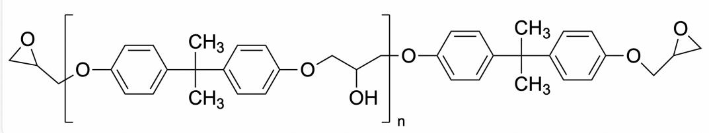
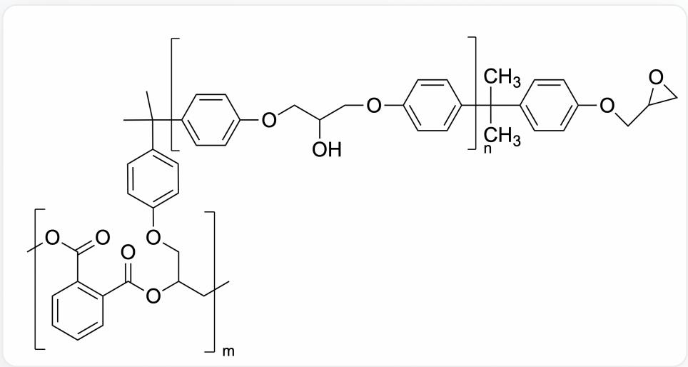

# Question

Epoxy resin is an important class of polymer, widely used in coatings, adhesives, electronic and electrical materials, engineering plastics and composite materials, civil engineering materials, and other fields, which is inseparable from its special curing ability. The most common structural formula of epoxy resin is as follows:

The image shows a polymer, and the SMILES representation of the repeating unit is: CC(C)

(C1=CC=C(OCC(C[R2])O)C=C1)C2=CC=C(O[R1])C=C2. Where R1 and R2 represent terminal groups, which are [X]CC1OC1 and [X]OC(C=C1)=CC=C1C(C)(C)C(C=C2)=CC=C2OCC3CO3, respectively, and X represents where the terminal group is connected to the polymer repeating unit

The spatial structure of this epoxy resin is highly correlated with the intermolecular forces present in it. In addition to van der Waals forces, other possible forces can affect its spatial structure. This linear epoxy resin usually exists as a liquid and needs to be cured into a bulk structure with the assistance of a curing agent. Curing agents are generally divided into reactive curing agents and catalytic curing agents. Sometimes these two types of curing agents can be used in combination for better results. Several compounds that can possibly be used as catalytic curing agents are given: dicyandiamide, p-toluidine, boron trifluoride-ethylamine complex, N-methylimidazole.

Based on the above information, select the correct option.

A. Besides van der Waals forces, the only intermolecular forces affecting the spatial structure of the epoxy resin in the question are hydrogen bonds.  
B. Compounds that can be used as catalytic curing agents: p-toluidine, boron trifluoride-ethylamine complex, N-methylimidazole.

C. Phthalic anhydride, as a reactive curing agent, with a small amount of tertiary amine added, considering only the reaction of one terminal epoxy group, the product is

The image shows a molecule composed of two different types of polymer segments (i.e., a block copolymer), and the two repeating units can be expressed as

$$
O C (C O C 1 = C C = C ([ R 1 ]) C = C 1) C O C 2 = C C = C ([ R 2 ]) C = C 2;
$$

[R3]CC(C[F,Cl,Br,I])CC(C1=C(C[C[F,Cl,Br,I])=C)C=CC=C1)=C; the degree of polymerization of the two repeating units are n and m, respectively. The linking group of the two repeating units is expressed as CC([R2])(C1=CC=C([R3])C=C1)C, and the end-capping group on the right side of the first repeating unit is expressed as CC([R1])(C1=CC=C(OCC2OC2)C=C1)C. Where R1, R2, and R3 represent the corresponding connection sites, R1 is connected to R1, and so on; X represents the connection site of the second repeating unit itself, without end groups.

D. The amount of anhydride used when acid anhydride and tertiary amine are used in combination is the same as when acid anhydride curing agent is used alone.  
E. Acid anhydrides used in combination with tertiary amines require a smaller amount of acid anhydride than when acid anhydride curing agents are used alone.  
F. None of the above options are correct.

# Answer

Correct Answer: C

# Detailed Explanation

Besides van der Waals forces, the aromatic rings and widely existing hydroxyl groups in the polymer make hydrogen bonds and aromatic ring interactions intermolecular forces that affect the spatial structure of the epoxy resin in the question. Option A is incorrect.

# CHECKPOINT

1 PTS

Intermolecular forces that affect the spatial structure of the epoxy resin in the question include hydrogen bonds and aromatic ring interactions.

Catalytic curing agents can initiate anionic or cationic polymerization, while stoichiometric curing agents participate in the formation of the backbone. Therefore, p-toluidine with low reaction reversibility is difficult to be used as a catalytic curing agent. The remaining three compounds have high reaction reversibility, and can still leave after completing nucleophilic ring-opening to catalyze the polymerization reaction of the next molecule. Therefore, the compounds that can be used as catalytic curing agents are: dicyandiamide, boron trifluoride-ethylamine complex, N-methylimidazole. Option B is incorrect.

# CHECKPOINT

1 PTS

p-Toluidine with low reaction reversibility is difficult to be used as a catalytic curing agent

# CHECKPOINT

1 PTS

Dicyandiamide, boron trifluoride-ethylamine complex, N-methylimidazole with high reversibility can be used as catalytic curing agents

After the addition of tertiary amine, the terminal epoxy is ring-opened to generate a nucleophilic alkoxide, which attacks the large amount of anhydride in the system as an electrophile, thereby polymerizing. Therefore, the structure expressed in option C is correct.

# CHECKPOINT

1 PTS

After the addition of tertiary amine, the terminal epoxy is ring-opened to generate an alkoxide

# CHECKPOINT

1 PTS

Hydroxyl group attacks the large amount of anhydride in the system as an electrophile

When used in combination, the amount of anhydride used is greater, because the anhydride system used alone is weakly acidic, and the selectivity of the intermediate alcohol for anhydride and epoxy attack is not significant; after using tertiary amine, the system becomes weakly alkaline, and the intermediate oxygen anion is more likely to attack the acid. Options D and E are incorrect.

# CHECKPOINT

1 PTS

The anhydride system used alone is weakly acidic, and the selectivity of the intermediate alcohol for anhydride and epoxy attack is not significant

# CHECKPOINT

1 PTS

After using tertiary amine, the system becomes weakly alkaline, and the intermediate oxygen anion is more likely to attack the acid