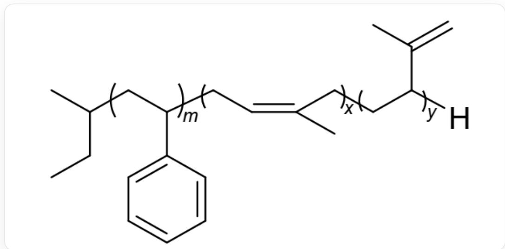

# Question

Under a high-purity nitrogen atmosphere, different monomers were added to a benzene solution of alkyl lithium initiator for reaction. After the reaction, a portion of the solution was transferred to an empty bottle, and cold methanol was added to obtain the high-molecular-weight polymer 1 as shown in the figure below. To the remaining solution, a dichloromethane solution of 2 was added, and the reaction was carried out in a water bath at  $25^{\circ}C$  for  $1h$ , followed by quenching with cold methanol to yield an eight-arm star-shaped block copolymer. The simplest formula of 2 is  $C_4H_6Si_2O_3$ , where all silicon atoms share the same chemical environment.

The structure of 1 is shown below:

The image depicts a block copolymer, where one end of the polymer chain terminates with a sec-butyl group and the other end with a hydrogen atom. The middle section consists of three distinct polymer segments.

From left to right, the first segment has a degree of polymerization (m), and its repeating unit is  $[\ast :x1]CC(c1cccccc1)[\ast :x2]$ . The second segment has a degree of polymerization (x), with a repeating unit of  $[\ast :x2]CC = C(C)C[\ast :x3]$ . The third segment has a degree of polymerization (y), with a repeating unit of  $[\ast :x3]CC(C(C) = C)[\ast :x4]$ . Here,  $[\ast :x1]$  represents the connection point between the left-end sec-butyl group and the right end of the first segment.  $[\ast :x2]$  indicates that the right end of the first segment connects to the left end of the second segment.  $[\ast :x3]$  denotes that the right end of the second segment connects to the left end of the third segment.  $[\ast :x4]$  signifies that the right end of the third segment connects to the terminal hydrogen atom.

The correct options are:

A. The initiator used in the synthesis process is n-butyllithium  
B. There are three types of monomers for synthesizing this block copolymer.  
C. The coordination number of the  $Si$  atom in compound 2 is 5.  
D. In compound 2,  $\frac{1}{3}$  of the  $O$  atoms are connected to the  $C$  atoms.  
E. If only the spatial distribution of the Si atoms in compound 2 is considered, its structure can be approximated as a tetrahedron.  
F. If we only consider the spatial distribution of the Si atoms in compound 2, its structure can be approximately regarded as a cube.  
G. Options A through F are all incorrect  
H. Both options A and B are correct, and all other options are wrong.  
1. Options C and F are both correct, while all other options are incorrect.

# Answer

Correct Answer: F

# Detailed Explanation

The residue in 1 is a sec-butyl group, so its initiator is sec-butyllithium, making option A incorrect.

# CHECKPOINT

0.5 PTS

The residue in 1 is a sec-butyl group, so its initiator is sec-butyllithium

The chain structure of polymer 1 shows that it consists of a polystyrene segment and a polyisoprene segment. The polyisoprene segment contains both 1,4-addition and 1,2-addition repeating units, but both units are derived from the same monomer (isoprene). Therefore, the synthesis of this copolymer used two monomers: styrene and isoprene. Option B is incorrect.

# CHECKPOINT

0.5 PTS

By cleaving the intermediate connecting part, styrene monomer and isoprene monomer can be obtained

In common organosilicon compounds and silicates, silicon atoms are typically tetracoordinated, forming a tetrahedral structure. In the stable structure of 2 in this question, tetracoordination is clearly more reasonable.

Since 2 is the precursor of an eight-arm star-shaped polymer, it can be inferred that the central polyhedron of this polymer has 8 vertices, and thus the arrangement of the central atoms should resemble a cube. The  $SiO$  tetrahedral structure is highly stable and can serve as a stable central framework, providing a stable base point for the attached carbon chains. The  $C$  and  $H$  atoms act as organic side chains crosslinking with the macromolecular chains.

Therefore, the vertices of the central cube can only be occupied by  $Si$  or  $O$ . However, the number of  $O$  atoms in the simplest formula is 3, which is not a factor of 8 (the number of cube vertices). Thus, the vertices can only be  $Si$ .

# CHECKPOINT

1 PTS

The number of  $O$  atoms in the simplest formula is 3, which is not a factor of 8. The vertices can only be  $Si$

Therefore, the molecular formula of compound 2 must be an integer multiple of the simplest formula  $C_4H_6Si_2O_3$ . To form an eight-arm polymer, a central core with 8 reactive sites (8 vertices) is required, composed of 8 Si atoms. To include 8 Si atoms in the molecular formula, the simplest formula must be multiplied by 4, resulting in 8 Si atoms and a chemical formula of  $C_{16}H_{24}Si_{8}O_{12}$ .

# CHECKPOINT

1 PTS

There are 8  $Si$  atoms, and the chemical formula is  $C_{16}H_{24}Si_{8}O_{12}$

With 12  $O$  atoms, comparing the cubic structure, it can be inferred that the oxygen atoms are approximately distributed along the edges. Alternatively, comparing with the structure of quartz, it can also be concluded that the  $O$  atoms are positioned between  $Si$  atoms, forming  $Si - O - Si$  structures.

# CHECKPOINT

2 PTS

The oxygen atoms are approximately distributed along the edges, with  $O$  positioned between  $Si$  atoms, forming  $Si - O - Si$  structures.

$C_{16}H_{24}$  divided into 8 parts gives  $C_2H_3$  per part, which is a vinyl group. Verification shows that each Si atom is tetracoordinated.

# CHECKPOINT

1 PTS

Each  $Si$  atom is tetracoordinated.

Thus, options C, D, E, G, H, and I are incorrect, and option F is correct.