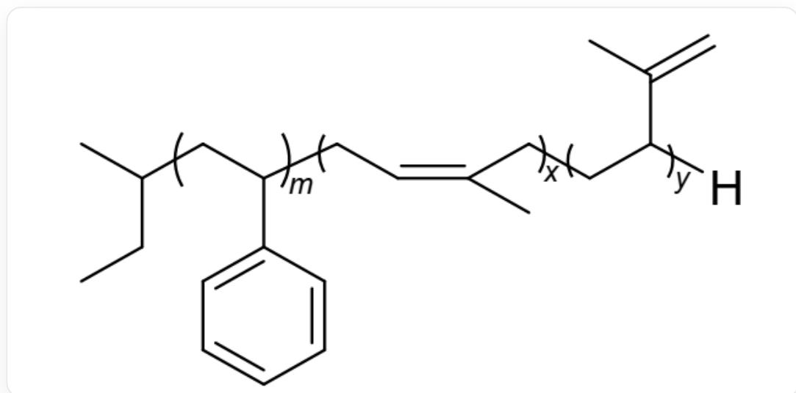

# 题目

在高纯氮气氛围下, 向烷基锂引发剂的苯溶液加入不同的单体反应。反应结束后, 将一部分溶液转移至空瓶中, 加入冷的甲醇, 得到下图所示高分子聚合物1。向剩余溶液中加入2的二氯甲烷溶液, 于  $25^{\circ} C$  水浴中反应  $1 h$ , 然后加入冷的甲醇淬灭, 得到八臂星形嵌段共聚物。2的最简式为  $C_{4} H_{6} S i_{2} O_{3}$ , 其中所有硅原子的化学环境相同。

以下为1的结构图：

如图是一个高分子嵌段共聚物，该高分子的其中一端的末尾是一个仲丁基，另一端的末尾是氢原子。在高分子中间是3个不同的聚合物片段。从左往右的第一个片段的聚合度是m，链节为 $[\star :x1]\mathrm{CC}(\mathrm{c}1\mathrm{cccc}1)$ $[\star :x2]$ 。第二个片段中，聚合度为x，链节为 $[\star :x2]\mathrm{CC} = \mathrm{C}(\mathrm{C})\mathrm{C}[\star :x3]$ 。第三个片段中，聚合度为y，链节为 $[\star :x3]\mathrm{CC}(\mathrm{C}(\mathrm{C}) = \mathrm{C})[\star :x4]$ 。在这里 $[\star :x1]$ 代表连接左端仲丁基与右端的第一个片段的连接处。 $[\star :x2]$ 表明第一段的右端会与第二段的左端相连。 $[\star :x3]$ 表明第二段的右端会与第三段的左端相连。 $[\star :x4]$ 表明第三段的右端会与末端的氢原子相连。

以下选项正确的是：

A. 合成过程所用引发剂是正丁基锂  
B. 合成该嵌段共聚物的单体有3种  
C. 化合物2中  $S i$  原子的配位数是5

D. 化合物2中  $\frac{1}{3}$  的  $O$  原子与  $C$  原子相连  
E. 如果只看化合物2中的  $S i$  原子的空间分布, 则其结构可以近似看作四面体。  
F. 如果只看化合物2中的  $S i$  原子的空间分布, 则其结构可以近似看作立方体。  
G. 选项A到F全部错误  
H. 选项A，B均正确，其余选项全错  
I. 选项C，F均正确，其余选项全错

# 答案

正确答案: F

# 详细解析

1中的残基为仲丁基，则其引发剂为仲丁基锂，A错误。

# CHECKPOINT

0.5 PTS

1中的残基为仲丁基，则其引发剂为仲丁基锂

聚合物1的链结构显示，它由一个聚苯乙烯链段和一个聚异戊二烯链段构成。聚异戊二烯链段中同时包含了1,4-加成和1,2-加成两种重复单元，但这两种单元均来自同一单体（异戊二烯）。因此，合成该共聚物共使用了苯乙烯和异戊二烯两种单体。B选项错误。

# CHECKPOINT

0.5 PTS

中间连接部分切断，可以得到苯乙烯单体和异戊二烯单体

在常见的有机硅化合物和硅酸盐中，硅原子通常是四配位的，形成四面体结构。在本题的2的稳定结构中，四配位显然更合理。

由于2为八臂星形结构聚合物的前体，故可以推得该聚合物中心多面体有8个顶点，进而推出中心原子排布应该与立方体类似。SiO四面体结构十分稳定，其可以用作稳定的中心框架，为上面的碳链提供稳定的基点。C,H原子则作为有机侧链与大分子链交联。由此，中心的立方体顶点只能是Si或者O。而最简式中O的数量为3，不是8(立方体顶点数)的因数。故顶点处只能为Si。

# CHECKPOINT

1 PTS

最简式中  $O$  的数量为 3 , 不是 8 的因数。顶点处只能为  $S i$

因此，化合物2的分子式必然是最简式  $C_4H_6Si_2O_3$  的整数倍。由于形成了八臂聚合物，需要一个具有8个反应位点(8个顶点)的中心核，由8个  $Si$  原子构成。要使分子式中含有8个  $Si$  原子，需要将最简式乘以4，所以有8个  $Si$  原子，化学式为  $C_{16}H_{24}Si_{8}O_{12}$

# CHECKPOINT

1 PTS

有8个  $Si$  原子，化学式为  $C_{16}H_{24}Si_{8}O_{12}$

12个  $O$  ，对比立方体结构，可知氧原子近似分布在棱上。或者对比石英的结构，也可以得出  $O$  处于  $Si$  原子之间，形成  $Si - O - Si$  的结构。

# CHECKPOINT

2 PTS

氧原子近似分布在棱上， $O$  处于  $Si$  原子之间，形成  $Si - O - Si$  的结构。

$C_{16}H_{24}$  分成8份，每一份即是  $C_2H_3$  ，为乙烯基。检查可得每个Si原子均为4配位。

# CHECKPOINT

1 PTS

每个  $S_{i}$  原子均为4配位。

所以C,D,E,G,H,I错误，F正确。