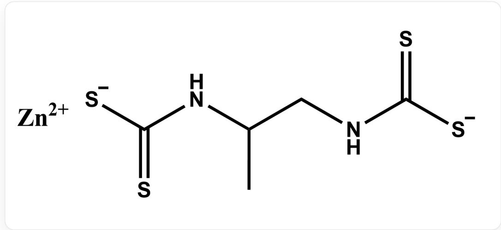

# 题目

测定物质A(如下图所示)的含量的实验步骤如下：

  
物质A的结构，smile为[S-]C(NC(C)CNC([S-])=S)=S.[Zn+2]

在烧杯中称  $12.5 \mathrm{~g} \mathrm{Na}_{2} \mathrm{~S}_{2} \mathrm{O}_{3} \cdot 5 \mathrm{H}_{2} \mathrm{O}$ , 加入新煮沸已冷却的去离子水  $500 \mathrm{~mL}$ , 加少量碳酸钠, 转入棕色瓶中, 摇匀后暗处放置一周。在烧杯中准确称取  $0.7018 \mathrm{~g} \mathrm{K}_{2} \mathrm{Cr}_{2} \mathrm{O}_{7}$ , 加  $30 \mathrm{~mL}$  去离子水溶解, 定容到  $250 \mathrm{~mL}$  。准确移取  $25.00 \mathrm{~mL} \mathrm{K}_{2} \mathrm{Cr}_{2} \mathrm{O}_{7}$  溶液至锥形瓶中, 加入  $20 \mathrm{~mL} 10 \%$  KI 溶液和  $5 \mathrm{~mL} 6.0 \mathrm{~mol} \cdot \mathrm{L}^{-1} \mathrm{HCl}$  溶液, 摇匀后盖上表面皿, 在暗处放置  $5 \mathrm{~min}$  。加入  $50 \mathrm{~mL}$  去离子水稀释, 用  $\mathrm{Na}_{2} \mathrm{~S}_{2} \mathrm{O}_{3}$  溶液滴定至溶液为黄绿色时, 加入  $1 \mathrm{~mL}$  淀粉指示液, 继续滴定到蓝色褪去为终点, 平行滴定三份, 平均消耗体积  $13.04 \mathrm{~mL}$  。在烧杯中称取  $6.5 \mathrm{~g} \mathrm{I}_{2}$  和  $20 \mathrm{~g} \mathrm{KI}$ , 加水搅拌溶解, 稀释至  $500 \mathrm{~mL}$ , 转入棕色瓶中, 摇匀后放置过夜。准确移取  $25.00 \mathrm{~mL} \mathrm{Na}_{2} \mathrm{~S}_{2} \mathrm{O}_{3}$  溶液至锥形瓶中, 加入  $20 \mathrm{~mL}$  去离子  $1 \mathrm{~mL}$  淀粉指示液, 用碘标准溶液滴定到蓝色半分钟不褪去为终点, 平行滴定三份, 平均消耗体积  $27.32 \mathrm{~mL}$  。

将  $0.2354 \mathrm{~g}$  含物质  $\mathbf{A}$  的样品加入  $150 \mathrm{~mL}$  圆底烧瓶, 加入  $50 \mathrm{~mL}$  氢碘酸-冰醋酸溶液, 摇匀后煮沸。过程中产生的气体依次通过水浴加热至  $80^{\circ} \mathrm{C}$  的  $50 \mathrm{~mL}$  醋酸铅溶液 (第一吸收瓶)、 $50 \mathrm{~mL}$  KOH-乙醇溶液 (第二吸收瓶), 分解产生的二硫化碳在第二吸收瓶中被吸收, 得到乙基黄原酸钾。随后将第二吸收瓶中的溶液用去离子水完全洗入至锥形瓶中, 用乙酸溶液中和过量的 KOH 至酚酞褪色 (再过量  $3 \sim 4$  滴), 立即用碘标准溶液滴定, 临近终点时加入  $5 \mathrm{~mL}$  淀粉指示液, 继续滴定至溶液呈浅灰紫色, 平行滴定三份, 平均消耗体积  $11.40 \mathrm{~mL}$  。

根据上述过程，可以计算出样品中物质A的质量分数更接近

A.  $50\%$  
B.  $55\%$  
C.  $60\%$  
D.  $65\%$  
E.  $70\%$  
F.  $75\%$  
G.  $80\%$  
H.  $85\%$  
90%  
J. 95%  
K.  $100\%$

# 答案

正确答案: E

# 详细解析

这是一个分析滴定实验。首先， $\mathrm{K}_2\mathrm{Cr}_2\mathrm{O}_7$  为标准物，可以根据称量重量计算出浓度：

$$
c _ {\mathrm {K} _ {2} \mathrm {C r} _ {2} \mathrm {O} _ {7}} = \frac {n _ {\mathrm {K} _ {2} \mathrm {C r} _ {2} \mathrm {O} _ {7}}}{V} = 9. 5 4 2 \mathrm {m m o l / L}
$$

# CHECKPOINT

1 PTS

$$
c _ {\mathrm {K} _ {2} \mathrm {C r} _ {2} \mathrm {O} _ {7}} = 9. 5 4 2 \mathrm {m m o l} / \mathrm {L}
$$

$\mathrm{K}_2\mathrm{Cr}_2\mathrm{O}_7$  和  $\mathrm{I}^{-}$  的反应，会生成  $\mathrm{I}_2$  ：

$$
\mathrm {C r} _ {2} \mathrm {O} _ {7} ^ {2 -} + 6 \mathrm {I} ^ {-} + 1 4 \mathrm {H} ^ {+} = 3 \mathrm {I} _ {2} + 2 \mathrm {C r} ^ {3 +} + 7 \mathrm {H} _ {2} \mathrm {O}
$$

因此，生成  $\mathrm{I}_{2}$  的量：

$$
n _ {\mathrm {I} _ {2}} = 3 \times c _ {\mathrm {K} _ {2} \mathrm {C r} _ {2} \mathrm {O} _ {7}} \times 2 5. 0 0 \times 1 0 ^ {- 3} = 0. 7 1 5 7 \mathrm {m m o l}
$$

$\mathrm{I}_2$  会和  $\mathrm{Na}_2\mathrm{S}_2\mathrm{O}_3$  反应：

$$
\mathrm {I} _ {2} + 2 \mathrm {S} _ {2} \mathrm {O} _ {3} ^ {2 -} = 2 \mathrm {I} ^ {-} + \mathrm {S} _ {4} \mathrm {O} _ {6} ^ {2 -}
$$

因此，消耗  $\mathrm{Na}_2\mathrm{S}_2\mathrm{O}_3$  的量：

$$
n _ {\mathrm {N a} _ {2} \mathrm {S} _ {2} \mathrm {O} _ {3}} = 2 \times n _ {\mathrm {I} _ {2}} = 1. 4 3 1 \mathrm {m m o l}
$$

据此，可以计算  $\mathrm{Na}_2\mathrm{S}_2\mathrm{O}_3$  浓度：

$$
c _ {\mathrm {N a} _ {2} \mathrm {S} _ {2} \mathrm {O} _ {3}} = \frac {n _ {\mathrm {N a} _ {2} \mathrm {S} _ {2} \mathrm {O} _ {3}}}{V _ {\mathrm {N a} _ {2} \mathrm {S} _ {2} \mathrm {O} _ {3}}} = 0. 1 0 9 8 \mathrm {m o l / L}
$$

# CHECKPOINT

1 PTS

$$
c _ {\mathrm {N a} _ {2} \mathrm {S} _ {2} \mathrm {O} _ {3}} = 0. 1 0 9 8 \mathrm {m o l} / \mathrm {L}
$$

然后使用  $\mathrm{Na}_{2} \mathrm{~S}_{2} \mathrm{O}_{3}$  标定  $\mathrm{I}_{2}$  溶液, 可以计算  $\mathrm{I}_{2}$  浓度:

$$
c _ {\mathrm {I} _ {2}} = \frac {\frac {1}{2} c _ {\mathrm {N a} _ {2} \mathrm {S} _ {2} \mathrm {O} _ {3}} \times 2 5 . 0 0 \times 1 0 ^ {- 3}}{V _ {\mathrm {I} _ {2}}} = 0. 0 5 0 2 4 \mathrm {m o l / L}
$$

# CHECKPOINT

1 PTS

$$
c _ {\mathrm {I} _ {2}} = 0. 0 5 0 2 4 \mathrm {m o l} / \mathrm {L}
$$

物质A会在氢碘酸-冰醋酸形成两个  $\mathrm{CS}_2$  ：

$$
[ S - ] C (N C (C) C N C ([ S - ]) = S) = S + 4 H ^ {+} = 2 C S _ {2} + [ N H 3 + ] C (C) C [ N H 3 + ]
$$

随后， $\mathrm{CS}_2$  形成乙基黄原酸钾：

$$
\mathrm {C S} _ {2} + \mathrm {O H} ^ {-} + \mathrm {C} _ {2} \mathrm {H} _ {5} \mathrm {O H} = \mathrm {C} _ {2} \mathrm {H} _ {5} \mathrm {O C S} _ {2} ^ {-} + \mathrm {H} _ {2} \mathrm {O}
$$

随后，乙基黄原酸钾用  $\mathrm{I}_2$  氧化，对应二硫键的形成：

$$
\mathrm {I} _ {2} + 2 \mathrm {C} _ {2} \mathrm {H} _ {5} \mathrm {O C S} _ {2} ^ {-} = \mathrm {C} _ {2} \mathrm {H} _ {5} \mathrm {O C S} _ {2} \mathrm {S} _ {2} \mathrm {C O C} _ {2} \mathrm {H} _ {5} + 2 \mathrm {I} ^ {-}
$$

因此，1分子A会对应2分子的  $\mathrm{I}_2$  ，有：

$$
n _ {\mathrm {A}} = n _ {\mathrm {I} _ {2}} = c _ {\mathrm {I} _ {2}} \times 1 1. 4 0 \times 1 0 ^ {- 3} = 0. 5 7 2 7 \mathrm {m m o l}
$$

# CHECKPOINT

1 PTS

$$
n _ {\mathbf {A}} = 0. 5 7 2 7 \mathrm {m m o l}
$$

计算出  $\mathbf{A}$  分子量为  $289.78 \mathrm{~g} / \mathrm{mol}$ , 可以算出

$$
m _ {\mathbf {A}} = n _ {\mathbf {A}} M _ {\mathbf {A}} = 0. 1 6 6 0 \mathrm {g}
$$

$$
\omega_ {\mathbf {A}} = 70.50 \%
$$

# CHECKPOINT

1 PTS

$$
\omega_ {\mathbf {A}} = 70.50 \%
$$