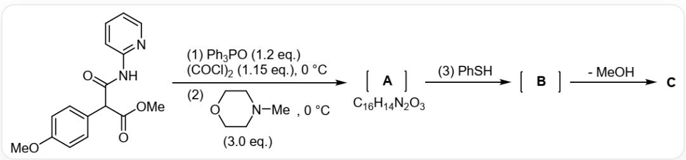
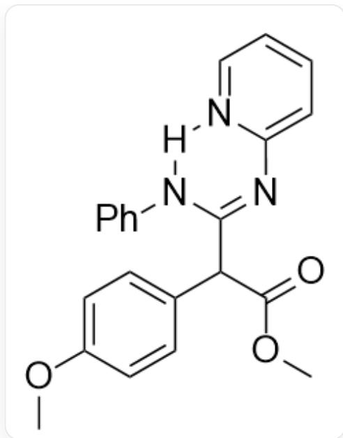
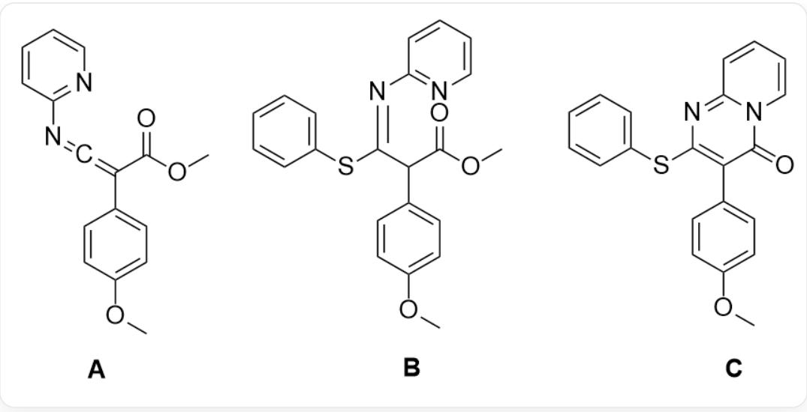

# Question

Pyridopyrimidinone is an important heterocyclic structure, and many drug molecules contain this ring system, so the construction of this ring system is very important in the pharmaceutical industry. In early 2023, researchers developed a one-pot synthesis method for this structure, which has high atom economy.

`COC1=CC=C(C=C1)C(C(=O)NC2=NC=CC=C2)C(=O)OC` first reacts with 1.2eq  $Ph_{3}PO$ , 1.15eq  $(COCl)_2$  at 0 degrees Celsius, and then reacts with 3.0eq `CN1CCOCC1` at 0 degrees Celsius to obtain

A, A reacts with PhSH to obtain B, B loses one molecule of MeOH to obtain C, where the chemical formula of A is  $C_{16}H_{14}N_2O_3$

The following statements are made:

1. In reaction (1), two gases are produced and they can be interconverted.  
2. There are carbon atoms with  $sp$  hybridization in  $\mathbf{A}$ .  
3. C has 2 aromatic systems.  
4. If the nucleophile in reaction (3) is replaced with aniline, the rate of formation of  $\mathbf{C}$  from  $\mathbf{B}$  will increase.

Select the option below that contains all the correct statements.

A. No correct statement.  
B. 1

C. 2  
D. 3  
E. 4  
F. 1,2  
G. 1,3  
H. 1,4  
1. 2,4  
J. 3,4  
K. 1,2,4  
L. 1,2,3  
M. 1,3,4  
N. 2,3,4  
0. 1,2,3,4

# Answer

Correct Answer: F

# Detailed Explanation

First, triphenylphosphine is activated by oxalyl chloride to generate the active species  $\mathrm{Cl}[\mathrm{P} + ](\mathrm{C}1 = \mathrm{CC} = \mathrm{CC} = \mathrm{C}1)$ $(\mathrm{C2 = CC = CC = C2})\mathrm{C3 = CC = CC = C3.}[\mathrm{Cl - }]$  . This process also generates gases  $CO$  and  $CO_{2}$

# CHECKPOINT

1 PTS

Reaction (1) produces  $CO$  and  $CO_2$ , and these two gases can be interconverted. Statement 1 is correct

The phosphonium cation reacts with the amide oxygen to generate  $\mathrm{^{\prime}COC1 = CC = C(C(C(OC) = O) / C(O[P + ]}}$ $(\mathrm{C2 = CC = CC = C2})(\mathrm{C3 = CC = CC = C3})\mathrm{C4 = CC = CC = C4}) = N / C5 = NC = CC = C5)\mathrm{C = C1^{\prime}}$  , followed by elimination of triphenylphosphine under the action of base, to obtain A:  $\mathrm{^{\prime}COC1 = CC = C(C(C(OC) = O) = C = NC2 = NC = CC = C2)C = C1^{\prime}}$

# CHECKPOINT

1 PTS

The structure of A is  $\mathrm{COC1 = CC = C(C(C(OC) = O) = C = NC2 = NC = CC = C2)C = C1}$

# CHECKPOINT

1 PTS

A has a cumulated diene structure with  $sp$  hybridized carbon atoms. Statement 2 is correct

The cumulated diene structure in  $\mathbf{A}$  is susceptible to nucleophilic attack, reacting with thiophenol to give  $\mathbf{B}$ :  ${}^{\backprime}\mathrm{COC1} = \mathrm{CC} = \mathrm{C}(\mathrm{C}(\mathrm{C}(\mathrm{OC}) = \mathrm{O}) / \mathrm{C}(\mathrm{SC2} = \mathrm{CC} = \mathrm{CC} = \mathrm{C2}) = \mathrm{N} / \mathrm{C3} = \mathrm{NC} = \mathrm{CC} = \mathrm{C3})\mathrm{C} = \mathrm{C1}}$ .

# CHECKPOINT

1 PTS

The structure of B is  $\mathrm{COC1 = CC = C(C(C(OC) = O) / C(SC2 = CC = CC = C2) = N / C3 = NC = CC = C3)C = C1}$

The pyridine nitrogen atom in B has nucleophilicity, nucleophilically attacks the methyl ester and leaves a methoxy anion. Subsequently, the  $\alpha$ -hydrogen atom of the ester group is abstracted under the action of base, to obtain C: `COC1=CC=C(C(C2=O)=C(SC3=CC=CC=C3)N=C4N2C=CC=C4)C=C1` . C has two phenyl groups. The tautomer of the pyridopyrimidinone ring system with nitrogen atoms conjugated to carbonyl groups gives the ring system  $10\pi$  electrons and also aromaticity, so it has three aromatic systems.

# CHECKPOINT

1 PTS

The structure of  $\mathbf{C}$  is  $\mathrm{^{\backprime}COC1 = CC = C(C(C2 = O) = C(SC3 = CC = CC = C3)N = C4N2C = CC = C4)C = C1}}$ , which has 3 aromatic systems. Statement 3 is incorrect

If thiophenol is replaced with aniline, the structure of  $\mathbf{B}^{\prime}$  generated is  $\mathrm{COC1 = CC = C(C(C(OC) = O)C2 = NC3 = CC = CC = N3[H]N2C4 = CC = CC = C4)C = C1}$ , where the hydrogen atom of aniline can form a six-membered ring hydrogen bond with the pyridine nitrogen, which reduces its nucleophilicity, thereby reducing the rate of generation of  $\mathbf{C}$ .

Shows the structure of the six-membered ring hydrogen bond in  $\mathbf{B}^{\prime}$ , the structure of  $\mathbf{B}^{\prime}$  is COC1=CC=C(C(C(OC)=O)C2=NC3=CC=CC=N3[H]N2C4=CC=CC=C4)C=C1, the nucleophilic aniline hydrogen forms a six-membered ring hydrogen bond with the pyridine nitrogen

# CHECKPOINT

1 PTS

The nucleophilic aniline hydrogen forms a six-membered ring hydrogen bond with the pyridine nitrogen, reducing its nucleophilicity and slowing down the rate of generation of C. Statement 4 is incorrect

Statements 1 and 2 are correct, choose F.

Finally, the structures of  $\mathbf{A}$ ,  $\mathbf{B}$ , and  $\mathbf{C}$  are shown:

  
A: `COC1=CC=C(C(C(OC)=O)=C=NC2=NC=CC=C2)C=C1`; B: `COC1=CC=C(C(C(OC)=O)/C(SC2=CC=CC=C2)=N/C3=NC=CC=C3)C=C1`; C: `COC1=CC=C(C(C2=O)=C(SC3=CC=CC=C3)N=C4N2C=CC=C4)C=C1`