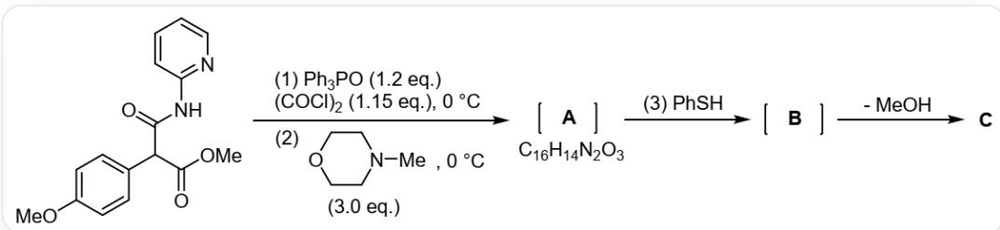
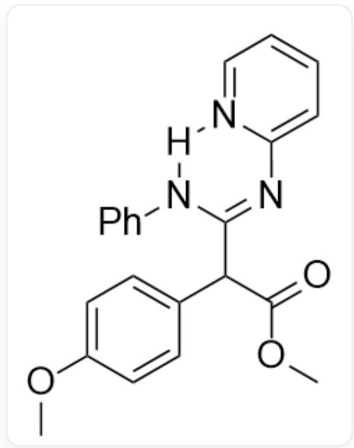
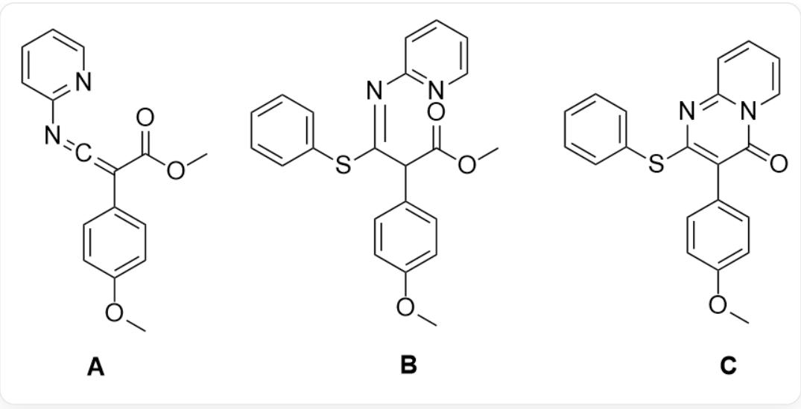

# 题目

吡啶并嘧啶酮是一种重要的杂环结构，许多药物分子均含有这一环系，因此在制药行业该环系的构筑十分重要。2023年初，研究人员开发了一种一锅合成该结构的方法，具有很高的原子经济性。

`COC1=CC=C(C=C1)C(C(=O)NC2=NC=CC=C2)C(=O)OC`首先和1.2eqPh3PO、1.15eq(COCl)₂在0摄氏度下反应，随后同样在0摄氏度下与3.0eq `CN1CCOCC1`反应得到A，A与PhSH反应得到B，B失去一分子MeOH得到C，其中A的化学式为  $C_{16}H_{14}N_{2}O_{3}$

有以下说法：

1. 在反应（1）中，产生了两种气体且它们可相互转化  
2.A 中存在杂化类型为  $sp$  的碳原子  
3.C中具有2个芳香体系  
4. 若将反应 (3) 的亲核试剂替换为苯胺, 将会使  $\mathrm{B}$  生成  $\mathrm{C}$  的速率增加

选择以下选项中所含说法全部正确的一项

A. 无正确说法  
B. 1  
C. 2

D. 3  
E. 4  
F. 1,2  
G. 1,3  
H. 1,4  
1. 2,3  
J. 3,4  
K. 1,2,4  
L. 1,2,3  
M. 1,3,4  
N. 2,3,4  
0. 1,2,3,4

# 答案

正确答案: F

# 详细解析

首先三苯氧磷被草酰氯活化，生成活性物种  $\mathrm{Cl}[\mathrm{P} + ](\mathrm{C}1 = \mathrm{CC} = \mathrm{CC} = \mathrm{C}1)(\mathrm{C}2 = \mathrm{CC} = \mathrm{CC} = \mathrm{C}2)\mathrm{C}3 = \mathrm{CC} = \mathrm{CC} = \mathrm{C}3.$  [Cl-]，这一过程还会产生气体  $CO$  和  $CO_{2}$ 。

# CHECKPOINT

1 PTS

反应（1）会产生  $CO$  和  $CO_{2}$ ，这两种气体可相互转化，说法1正确

磷正离子与酰胺氧反应，生成  $\mathrm{COC1 = CC = C(C(C(OC) = O) / C(O[P + ](C2 = CC = CC = C2)}$ $(\mathrm{C3 = CC = CC = C3})\mathrm{C4 = CC = CC = C4}) = \mathrm{N / C5 = NC = CC = C5})\mathrm{C = C1}$  随后在碱的作用下消去三苯氧磷，得到A： $\mathrm{^{\prime}COC1 = CC = C(C(C(OC) = O) = C = NC2 = NC = CC = C2)C = C1}}$

# CHECKPOINT

1 PTS

A 的结构为  $\mathrm{COC} 1 = \mathrm{CC} = \mathrm{C} (\mathrm{C} (\mathrm{C} (\mathrm{OC}) = \mathrm{O}) = \mathrm{C} = \mathrm{NC} 2 = \mathrm{NC} = \mathrm{CC} = \mathrm{C} 2) \mathrm{C} = \mathrm{C} 1$

# CHECKPOINT

1 PTS

A 存在累积双烯结构, 有  $sp$  杂化的碳原子, 说法2正确

A 中的累积双烯结构易被亲核进攻，与苯硫酚反应得到 B： $\mathrm{COC1 = CC = C(C(OC) = O) / C(SC2 = CC = CC = C2) = N / C3 = NC = CC = C3)C = C1^{\prime}}$ 。

# CHECKPOINT

1 PTS

B 的结构为  $\mathrm{COC1} = \mathrm{CC} = \mathrm{C}(\mathrm{C}(\mathrm{C}(\mathrm{OC}) = \mathrm{O}) / \mathrm{C}(\mathrm{SC2} = \mathrm{CC} = \mathrm{CC} = \mathrm{C2}) = \mathrm{N} / \mathrm{C3} = \mathrm{NC} = \mathrm{CC} = \mathrm{C3})\mathrm{C} = \mathrm{C1}}$

B 中吡啶氮原子具有亲核性, 亲核进攻甲酯后离去甲氧基负离子, 随后在碱的作用下拔除该酯基  $\alpha$  位氢原子, 得到 C : `COC1=CC=C(C(C2=O)=C(SC3=CC=CC=C3)N=C4N2C=CC=C4)C=C1`。C 中具有两个苯基, 吡啶并嘧啶酮环系氮原子与羰基共轭的互变异构体使得环系具有 10 个  $\pi$  电子, 也具有芳香性, 因此具有三个芳香体系。

# CHECKPOINT

1 PTS

C的结构为 $\mathrm{COCl} = \mathrm{CC} = \mathrm{C}(\mathrm{C}(\mathrm{C}2 = \mathrm{O}) = \mathrm{C}(\mathrm{SC}3 = \mathrm{CC} = \mathrm{CC} = \mathrm{C}3)\mathrm{N} = \mathrm{C}4\mathrm{N}2\mathrm{C} = \mathrm{CC} = \mathrm{C}4)\mathrm{C} = \mathrm{C}1^{\prime}$  ，具有3个芳香体系，说法3错误

若将苯硫酚替换为苯胺，则生成  $\mathbf{B}^{\prime}$  的结构为 $\mathrm{COC1 = CC = C(C(C(OC) = O)C2 = NC3 = CC = CC = N3[H]N2C4 = CC = CC = C4)C = C1^{\prime}}$  ，其中苯胺的氢原子可以与吡啶氮形成六元环氢键，使其亲核性降低，进而使产生C的速率降低。

展示出  $\mathbf{B}^{\prime}$  中六元环氢键的结构， $\mathbf{B}^{\prime}$  的结构为

$\mathrm{COC} 1=\mathrm{CC}=\mathrm{C}(\mathrm{C}(\mathrm{OC})=\mathrm{O}) \mathrm{C} 2=\mathrm{NC} 3=\mathrm{CC}=\mathrm{CC}=\mathrm{N} 3[\mathrm{H}] \mathrm{N} 2 \mathrm{C} 4=\mathrm{CC}=\mathrm{CC}=\mathrm{C} 4) \mathrm{C}=\mathrm{C} 1$ , 亲核的苯胺氢与吡啶氮形成六元环氢键

# CHECKPOINT

1 PTS

亲核的苯胺氢与吡啶氮形成六元环氢键，降低其亲核性，使生成C的速率降低，说法4错误

说法1，2正确，选F

最后展示出A、B和C的结构:

A:  $\mathrm{COC1 = CC = C(C(C(OC) = O) = C = NC2 = NC = CC = C2)C = C1}$  ; B:

`COC1=CC=C(C(C(OC)=O)/C(SC2=CC=CC=C2)=N/C3=NC=CC=C3)C=C1`; C:

`COC1=CC=C(C(C2=O)=C(SC3=CC=CC=C3)N=C4N2C=CC=C4)C=C1`