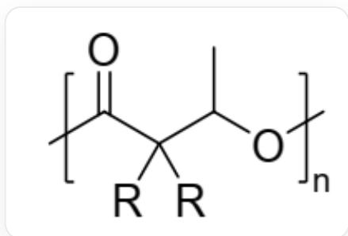
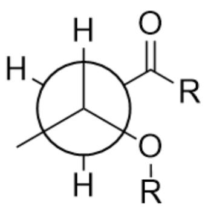
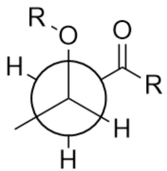

# Question

Polyhydroxyalkanoates (PHAs) are a class of degradable polyester materials that play an important role in achieving a sustainable circular plastics economy. One class of polymer can be obtained by the ring-opening polymerization reaction of monomer  $\mathbf{A}$  with  ${}^{t}\mathrm{Bu} - \mathrm{P}_{4}$  and  $\mathrm{BnOH}$  at  $70^{\circ}\mathrm{C}$ .  ${}^{t}\mathrm{Bu} - \mathrm{P}_{4} = {}^{\mathrm{t}}\mathrm{BuNP}[\mathrm{NP}(\mathrm{NMe}_{2})_{3}]_{3}$

As shown in the figure, a polyester compound with a repeating unit structure of

$$
O = C ([ * ]) C ([ R ]) ([ R ]) C (C) O [ * ]
$$

The following statements are made:

1. A contains a four-membered ring, and if  $\mathrm{R} = \mathrm{Me}$ , then its chemical formula is  $\mathrm{C_6H_{10}O_2}$  
2.  ${}^t\mathrm{Bu} - \mathrm{P}_4$  reacts directly with  $\mathbf{A}$  to initiate polymerization  
3.  ${}^t\mathrm{Bu} - \mathrm{P}_4$  only acts as a base  
4. If  $\mathrm{R} = \mathrm{Me}$  and considering the end-capping of the polymer and a number average molecular weight of 5244, then the average degree of polymerization of the polymer is 45  
5. It is known that when  $\mathrm{R} = \mathrm{H}$ , the polymer will rapidly decompose at  $180^{\circ}\mathrm{C}$ ; then when  $\mathrm{R} = \mathrm{Me}$ , the polymer will also rapidly decompose at  $180^{\circ}\mathrm{C}$  
6. When  $\mathrm{R} = \mathrm{H}$ , the structure of the polymer pyrolysis product is  $\mathrm{OC}(/C = C\backslash C) = 0$

Then the sum of the corresponding numbers of all correct statements is:

A. 1  
B. 2  
C. 3  
D. 4  
E. 5  
F. 6  
G. 7  
H. 8  
1. 9  
J. 10  
K. 11  
L. 12  
M. 13  
N. 14

O. 15

# Answer

Correct Answer: H

# Detailed Explanation

The repeating unit of the polymer is  $O = C([\ast])C([R])([R])C(C)O[\ast]$ , which is an ester structure. Ring-opening polymerization yields a polyester, which means that  $\mathbf{A}$  is a cyclic lactone. It is not difficult to deduce from the repeating unit structure that the structure of  $\mathbf{A}$  is CC1OC(C1([R])[R])=O. When  $\mathrm{R} = \mathrm{Me}$ , the chemical formula of  $\mathbf{A}$  is  $\mathrm{C_6H_{10}O_2}$ .

# CHECKPOINT

1 PTS

The structure of  $\mathbf{A}$  is CC1OC(C1([R])[R])=O, containing a four-membered ring. When  $\mathrm{R} = \mathrm{Me}$ , the chemical formula of  $\mathbf{A}$  is  $\mathrm{C_6H_{10}O_2}$ . Statement 1 is correct.

${}^{t}\mathrm{Bu} - \mathrm{P}_{4}$  is a sterically hindered base with weak nucleophilic ability and cannot directly react with A to initiate polymerization. Instead, it initiates polymerization by abstracting the hydroxyl hydrogen of benzyl alcohol to generate a negative ion.

# CHECKPOINT

1 PTS

${}^{t}\mathrm{Bu} - \mathrm{P}_{4}$  has large steric hindrance and cannot initiate polymerization nucleophilically. Statement 2 is incorrect.

# CHECKPOINT

1 PTS

${}^{t}\mathrm{Bu} - \mathrm{P}_{4}$  initiates polymerization by abstracting the hydroxyl hydrogen of benzyl alcohol, acting as a base. Statement 3 is correct.

The benzyl alcohol anion initiates polymerization via nucleophilic attack, so one end of the polymer is capped with benzyl ester. Subsequent polymerization relies on the generated alcohol anion to continue nucleophilic attack until the polymerization stops after protonation. When  $\mathrm{R} = \mathrm{Me}$ , the repeating unit of the polymer is  $\mathrm{C_6H_{10}O_2}$  and the molecular weight is 114.14. The capping at both ends can be considered to add additional benzyl alcohol, with a molecular weight of 108.14. Then the average degree of polymerization  $n$  is:  $(5244 - 108.14)\div 114.14 = 45$

# CHECKPOINT

1 PTS

The polymer is capped with benzyl ester and hydrogen. Calculation shows that the average degree of polymerization is  $(5244 - 108.14) \div 114.14 = 45$ . Statement 4 is correct.

When  $\mathrm{R} = \mathrm{H}$ , the polymer will undergo thermal cracking of the ester under heating conditions, producing olefins and carboxylic acids. When there is no hydrogen at the  $\alpha$  position of the ester group, thermal cracking cannot occur. Therefore, when  $\mathrm{R} = \mathrm{Me}$ , the polymer can remain stable.

# CHECKPOINT

1 PTS

When there is no hydrogen at the  $\alpha$  position of the ester group, the polymer cannot undergo thermal cracking. Therefore, when  $\mathrm{R} = \mathrm{Me}$ , the polymer can remain stable at  $180^{\circ}\mathrm{C}$ . Statement 5 is incorrect.

During thermal cracking, the hydrogen and the ester oxygen are in the para position. At this time, the conformation with the methyl group in the para position to the carbonyl group is the most stable. The methyl group and the

carboxyl group are in the trans position in the resulting double bond, and the structure is  $\mathrm{OC} / / \mathrm{C} = \mathrm{C} / \mathrm{C}) = 0$

Shows the two possible Newman projections of the thermal cracking conformation (considering the chirality of the carbon atom attached to the ester oxygen), both adopting staggered conformations, where the ester oxygen is in the para position to the carbonyl  $\alpha$ -hydrogen, the methyl group remains in the para position to the carbonyl group, sandwiched between two hydrogen atoms to minimize the potential energy, and then cracking produces a trans double bond. R in the figure represents other parts of the polymer and has no special meaning

# CHECKPOINT

1 PTS

In the most stable conformation during thermal cracking, the methyl group is located in the para position to the carbonyl group, and the trans double bond is obtained after pyrolysis, with the structure  $\mathrm{OC}(/C = C / C) = 0$ . Statement 6 is incorrect.

The correct statements are 1, 3, and 4, the sum is 8, choose H