# Question

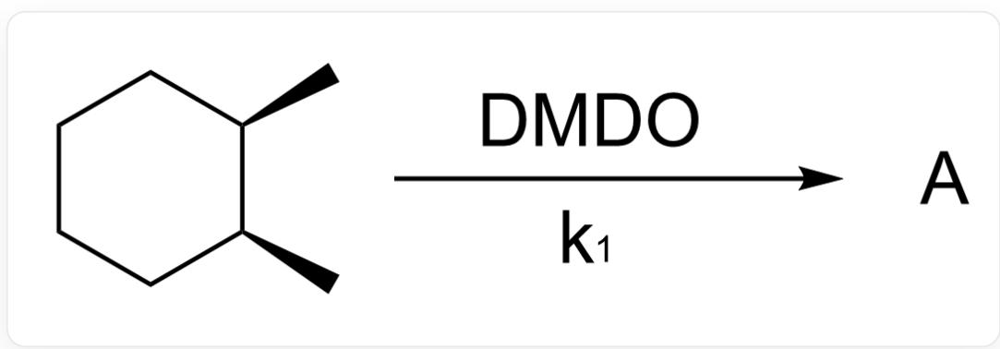

C[C@H]1[C@@H](C)CCCC1>[DMDO]>[A], where A is the reaction product with a rate constant of  $k_{1}$

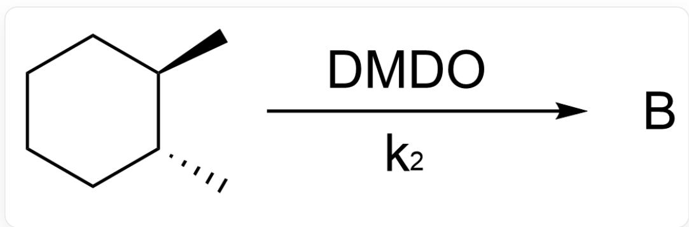

C[C@H]1[C@H](C)CCCC1> [DMDO]> [B], where B is the reaction product with a rate constant of  $k_{2}$

Ignoring enantiomers, provide the structural formulas of products A and B, respectively, and predict the relative magnitudes of  $k_{1}$  and  $k_{2}$ .

A.

  
C[C@@]1(O)[C@H](C)CCCC1

Product A

  
C[C@]1(O)[C@H](C)CCCC1

Product B

$$
k _ {1} > k _ {2}
$$

B.

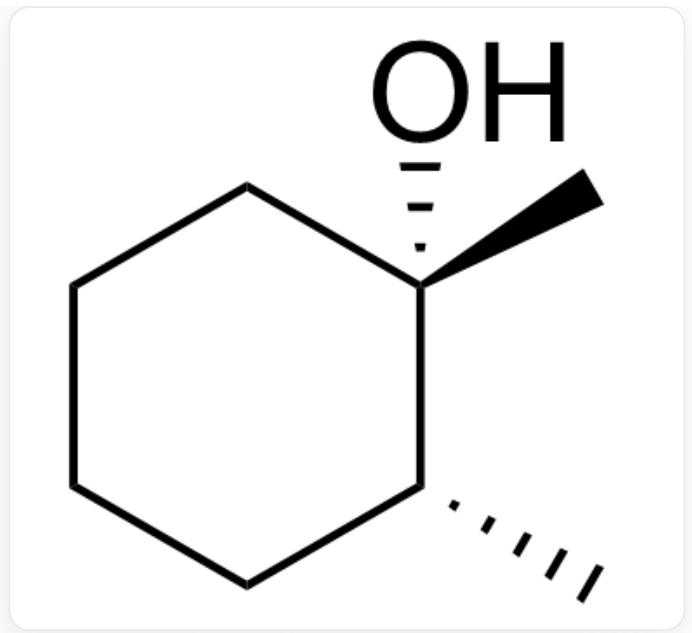  
C[C@@]1(O)[C@H](C)CCCC1

Product A

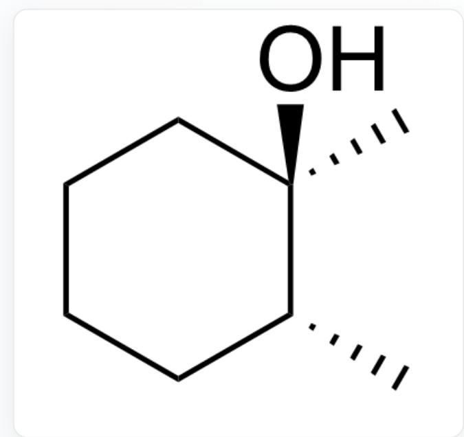  
C[C@]1(O)[C@H](C)CCCC1

Product B

$$
k _ {1} <   k _ {2}
$$

C.

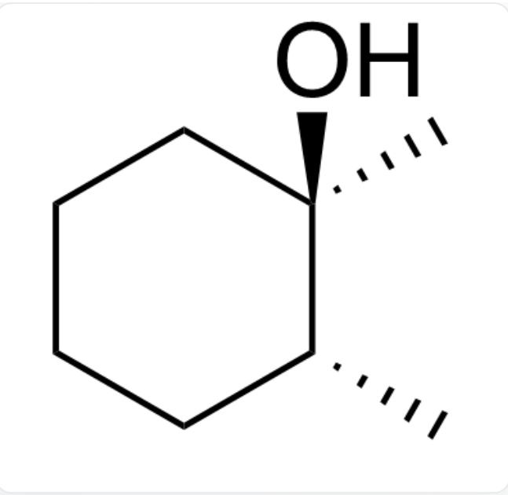  
C[C@]1(O)[C@H](C)CCCC1

Product A

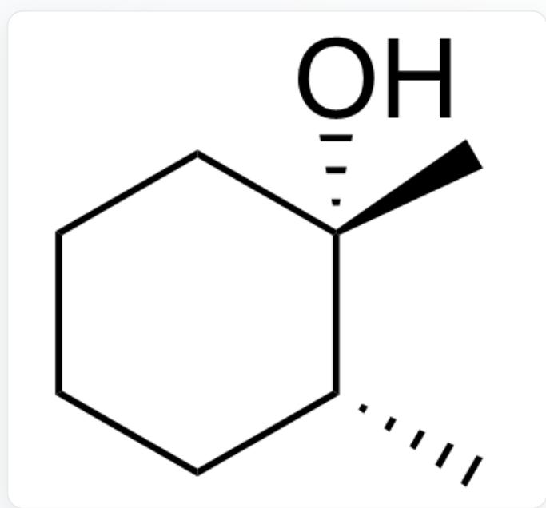  
C[C@@]1(O)[C@H](C)CCCC1

Product B

$$
k _ {1} > k _ {2}
$$

D.

  
C[C@]1(O)[C@H](C)CCCC1

Product A

  
C[C@@]1(O)[C@H](C)CCCC1

Product B

$$
k _ {1} <   k _ {2}
$$

E.

  
C[C@]1(O)[C@H](C)CCCC1

Product A

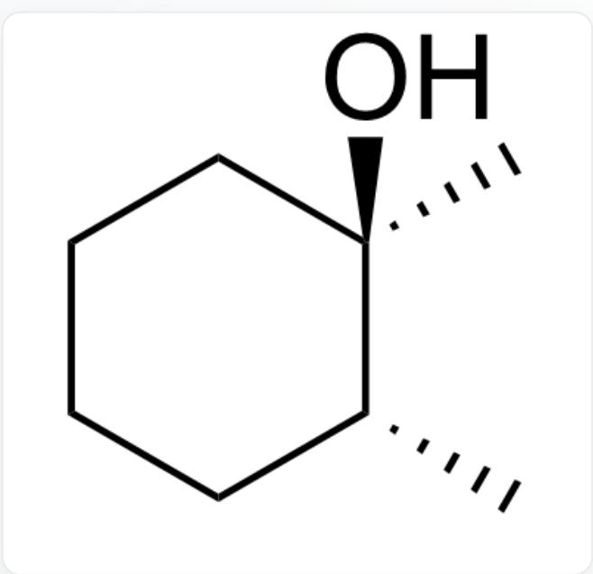  
C[C@]1(O)[C@H](C)CCCC1

Product B

$$
k _ {1} > k _ {2}
$$

F.

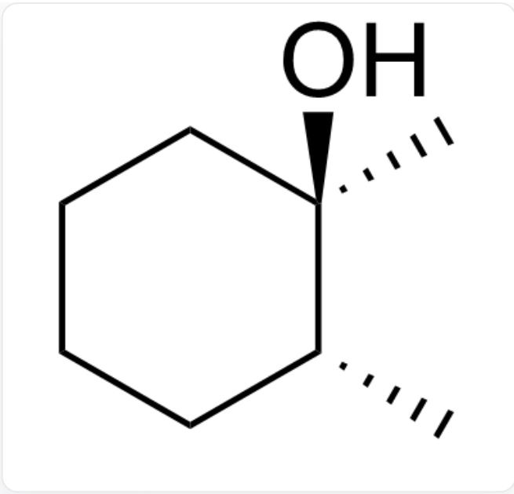  
C[C@]1(O)[C@H](C)CCCC1

Product A

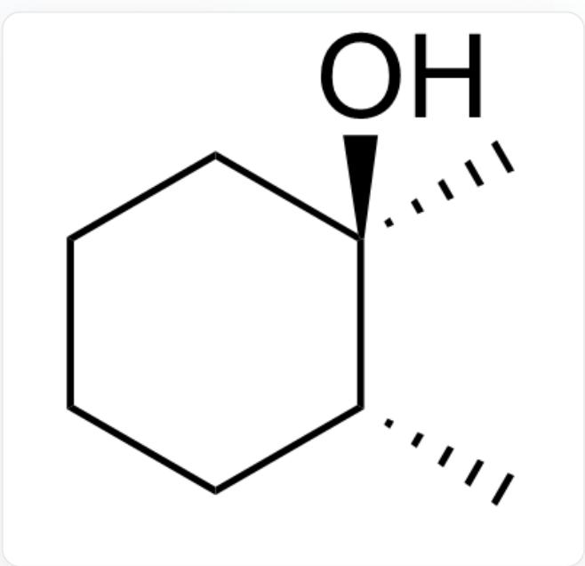  
C[C@]1(O)[C@H](C)CCCC1

Product B

$$
k _ {1} <   k _ {2}
$$

G.

  
C[C@@]1(O)[C@H](C)CCCC1

Product A

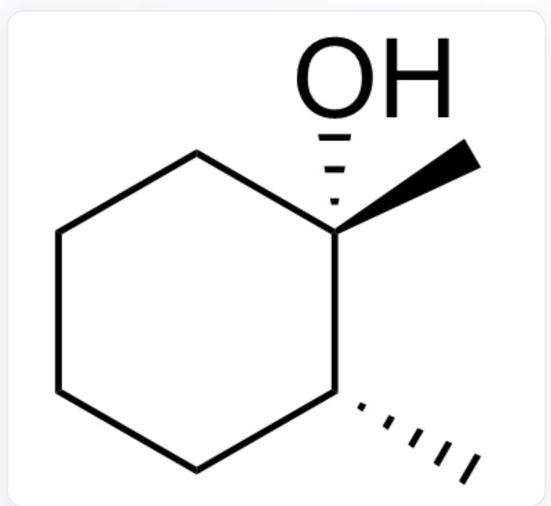  
C[C@@]1(O)[C@H](C)CCCC1

Product B

$$
k _ {1} > k _ {2}
$$

H.

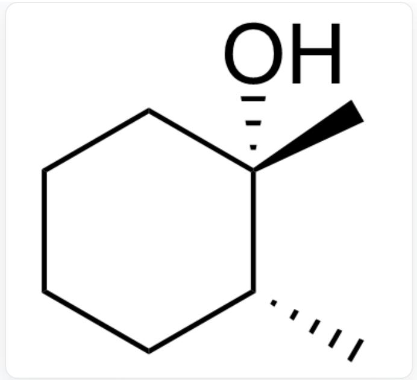  
C[C@@]1(O)[C@H](C)CCCC1

Product A

  
C[C@@]1(O)[C@H](C)CCCC1

Product B

$$
k _ {1} <   k _ {2}
$$

# Answer

Correct Answer: C

# Detailed Explanation

The stereoselectivity of this radical reaction is entirely kinetically controlled.

# CHECKPOINT

1 PTS

The stereoselectivity of this radical reaction is entirely kinetically controlled

The reaction first involves hydrogen abstraction by the peroxide, forming a tertiary carbon radical.

# CHECKPOINT

1 PTS

The reaction first involves hydrogen abstraction by the peroxide, forming a tertiary carbon radical

CC1[C](C)CCCC1

Due to the presence of tight radical pairs, the conformation remains unchanged before and after the reaction.

# CHECKPOINT

1 PTS

Due to the presence of tight radical pairs, the conformation remains unchanged before and after the reaction

For cis-1,2-dimethylcyclohexane, after hydrogen abstraction, the 1,3-diaxial strain between the axial methyl group and axial hydrogen is relieved, resulting in lower activation energy and faster reaction rate.

# CHECKPOINT

1 PTS

For cis-1,2-dimethylcyclohexane, after hydrogen abstraction, the 1,3-diaxial strain between the axial methyl group and axial hydrogen is relieved, resulting in lower activation energy and faster reaction rate

[H]C1CC([H])C[C@](C)([H])[C@H]1C