# 题目

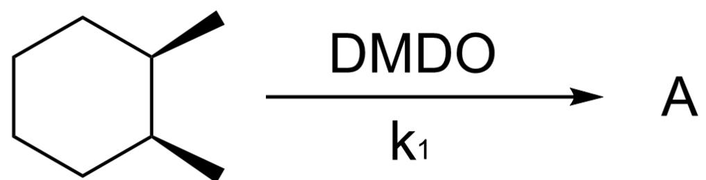

C[C@H]1[C@@H](C)CCCC1> [DMDO]> [A], A为反应产物，反应速率常数为  $k_{1}$

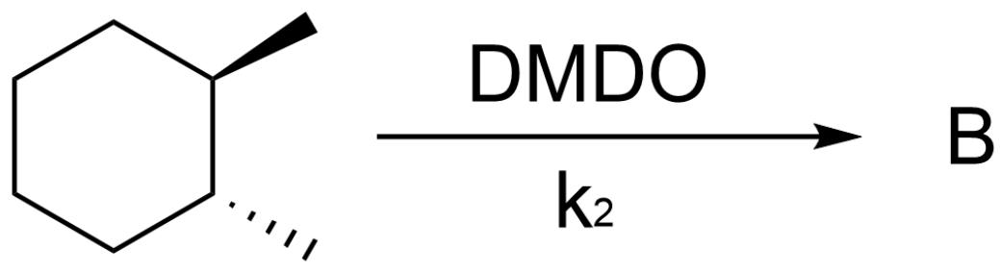

C[C@H]1[C@H](C)CCCC1>[DMDO]>[B],B为反应产物，反应速率常数为  $k_{2}$

不考虑对映异构的情况下，试分别给出产物A、B的结构式，并预测  $k_{1}$  和  $k_{2}$  的相对大小

A.

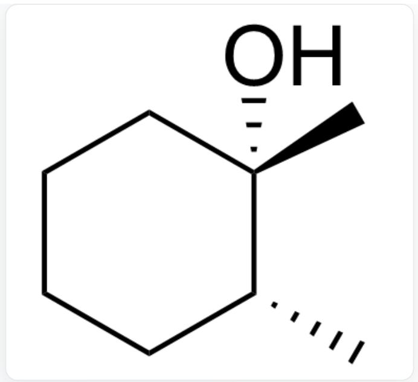  
C[C@@]1(O)[C@H](C)CCCC1

产物A

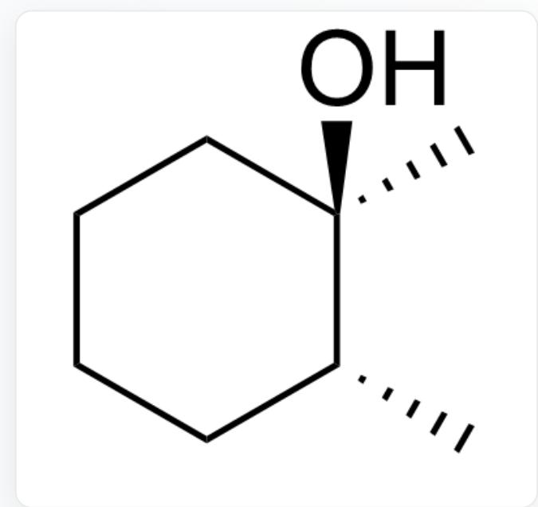  
C[C@]1(O)[C@H](C)CCCC1

产物B

$$
k _ {1} > k _ {2}
$$

B.

  
C[C@@]1(O)[C@H](C)CCCC1

产物A

  
C[C@]1(O)[C@H](C)CCCC1

产物B

$$
k _ {1} <   k _ {2}
$$

C.

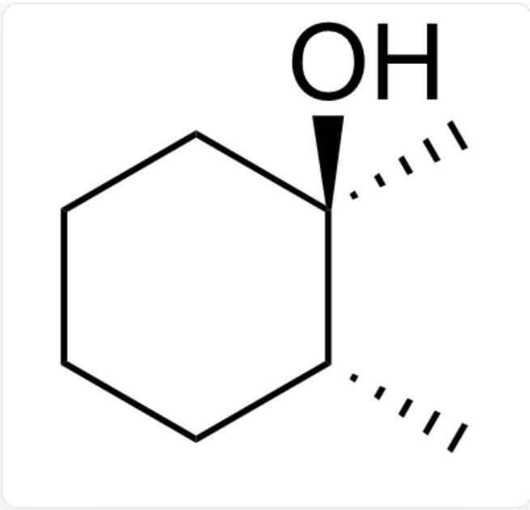  
C[C@]1(O)[C@H](C)CCCC1

产物A

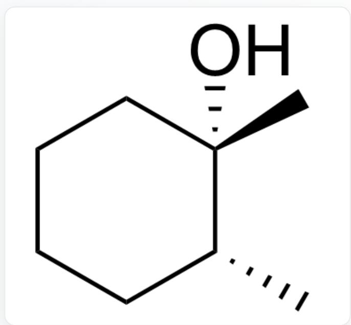  
C[C@@]1(O)[C@H](C)CCCC1

产物B

$$
k _ {1} > k _ {2}
$$

D.

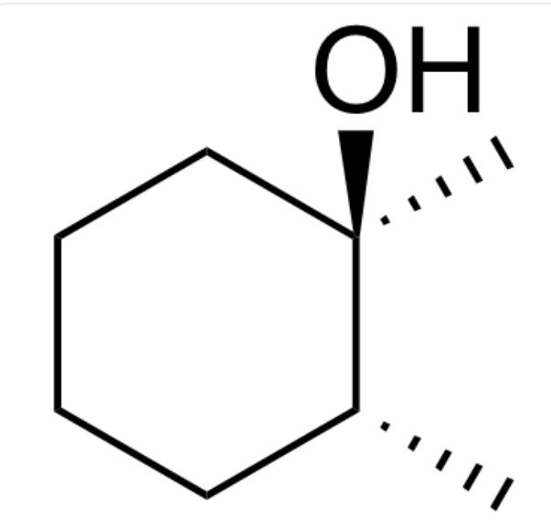  
C[C@]1(O)[C@H](C)CCCC1

产物A

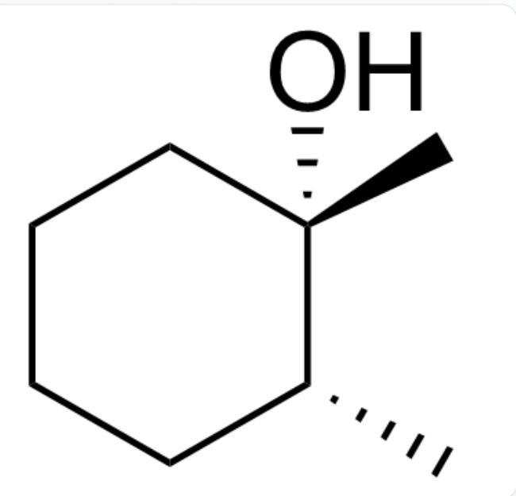  
C[C@@]1(O)[C@H](C)CCCC1

产物B

$$
k _ {1} <   k _ {2}
$$

E.

  
C[C@]1(O)[C@H](C)CCCC1

产物A

  
C[C@]1(O)[C@H](C)CCCC1

产物B

$$
k _ {1} > k _ {2}
$$

F.

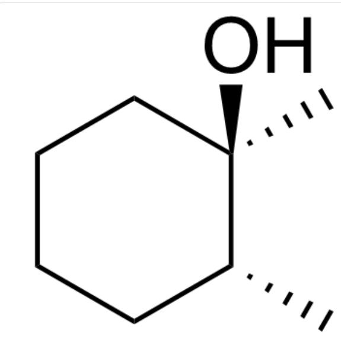  
C[C@]1(O)[C@H](C)CCCC1

产物A

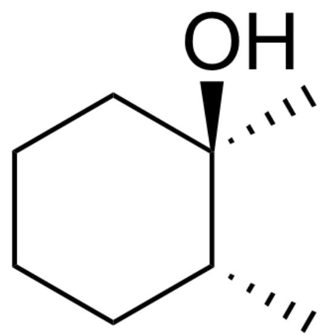  
C[C@]1(O)[C@H](C)CCCC1

产物B

$$
k _ {1} <   k _ {2}
$$

G.

  
C[C@@]1(O)[C@H](C)CCCC1

产物A

  
C[C@@]1(O)[C@H](C)CCCC1

产物B

$$
k _ {1} > k _ {2}
$$

H.

  
C[C@@]1(O)[C@H](C)CCCC1

产物A

  
C[C@@]1(O)[C@H](C)CCCC1

产物B

$$
k _ {1} <   k _ {2}
$$

# 答案

正确答案: C

# 详细解析

该自由基反应的立体选择性是完全动力学控制的

# CHECKPOINT

1 PTS

该自由基反应的立体选择性是完全动力学控制的

反应首先发生过氧化物对氢的攫取，形成三级碳自由基

# CHECKPOINT

1 PTS

反应首先发生过氧化物对氢的攫取，形成三级碳自由基

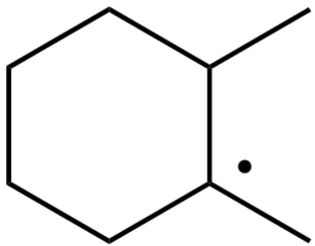

CC1[C](C)CCCC1

由于存在紧密自由基对，因此反应前后构象保持不变

# CHECKPOINT

1 PTS

由于存在紧密自由基对，因此反应前后构象保持不变

对顺式的1,2-二甲基环己烷，氢原子被攫取后释放了位于直立键的甲基与直立氢的

1,3直立张力，反应活化能更低，反应速率更快

# CHECKPOINT

1 PTS

对顺式的1,2-二甲基环己烷，氢原子被攫取后释放了位于直立键的甲基与直立氢的1,3直立张力，反应活化能更低，反应速率更快

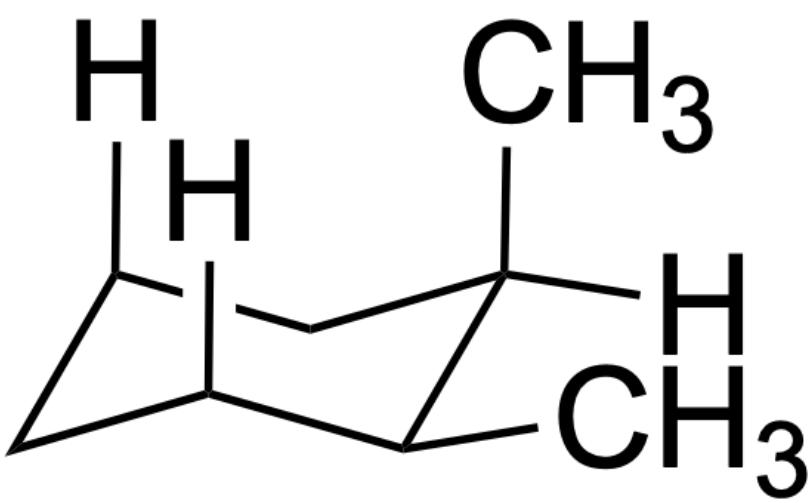

[H]C1CC([H])C[C@](C)([H])[C@H]1C