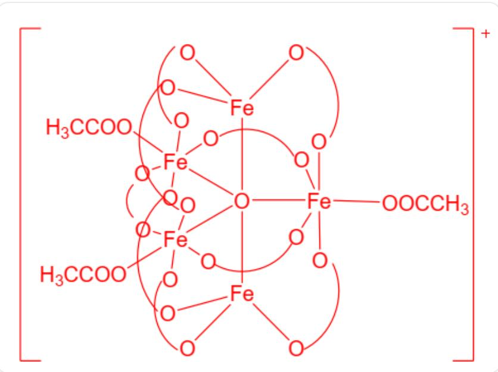

# 题目

在离子  $\left[\mathrm{Fe}_{5} \mathrm{O}\left(\mathrm{CH}_{3} \mathrm{COO}\right)_{12}\right]^{+}$  中，铁有两种配位数和两种化学环境，其数目比是  $2: 3$  ，醋酸根为桥联或单齿配体。

对该化合物的结构的以下说法中，指出其中正确的一项。

A. 该配合物中, O单原子配体与4个Fe相连。  
B. 该配合物中, 存在5配位的  $\mathrm{Fe}$  。  
C. 该配合物中, 存在五元环结构。  
D. 该配合物中, 桥联的醋酸根配体只有1种化学环境。  
E. 该配合物离子的几何中心处没有原子。  
F. 该配合物中, 存在有  $\mathrm{Fe}$  原子参与构成的共平面或接近共平面的  $\mathrm{Y}$  形结构。  
G. 在该配合物中, 若将所有以单键相连的可自由转动部分视为球形, 并忽略微小偏离, 则配合物所属的点群阶数为 3 。  
H. 该配合物中, 单齿的醋酸根配体与单原子 O 配体可处于同一个 Fe 原子配位多面体的邻位。

1. 以上选项均不正确

# 答案

正确答案: F

# 详细解析

观察  $\left[\mathrm{Fe}_{5} \mathrm{O}\left(\mathrm{CH}_{3} \mathrm{COO}\right)_{12}\right]^{+}$ 的组成，有1个单原子的O配体，优先考虑将其放在中心。5个Fe按  $2:3$  的数目比分为两种化学环境，可能是在O周围形成了  $\mathrm{Fe}_{5} \mathrm{O}$  三角双锥结构，其中2个Fe位于轴向，3个Fe位于赤道面。

# CHECKPOINT

1 PTS

存在  $\mathrm{Fe}_5\mathrm{O}$  三角双锥

12个醋酸根配体中，存在单齿和桥联两种配位方式，由于核心Fe-O-Fe，醋酸根在桥联时可以形成稳定的六元环结构，故在安排醋酸根配体时，可以尽量桥联。

# CHECKPOINT

1 PTS

桥联醋酸根可参与形成六元环

三角双锥中的5个Fe之间，除了轴向的一对Fe原子外，可组合成9组邻位FeFe对，其中赤道面方向为3组，经线方向有6组。若每一组FeFe对上都有一个桥联的醋酸根，则用掉9个醋酸根，剩下3个醋酸根为端基，可放在赤道面的Fe原子上。

这样得到的  $\left[\mathrm{Fe}_{5} \mathrm{O}\left(\mathrm{CH}_{3} \mathrm{COO}\right)_{12}\right]^{+}$  离子结构如下：

O位于中心，5个Fe在O周围构成三角双锥结构，轴向的2个Fe为四面体4配位，赤道面上的3个Fe为八面体6配位，在赤道面上的3个Fe的配位多面体上，中心O的对位为端基OOCCH3，这样的端基有3个，有9个桥联的O $\backslash$ frown O，其两端均连接不同的Fe，3个位于赤道面上，将赤道面上的3个Fe两两连接，6个位于经线方向，连接轴向Fe和赤道面上的Fe。

图中， $\mathrm{O} \sim \mathrm{O}$  表示桥联的醋酸根，可以看出，5个Fe在中心O的周围形成三角双锥，由两种化学环境，有3个6配位Fe和2个4配位Fe，3个端基醋酸根和9个桥联醋酸根，满足题述条件。

# CHECKPOINT

1 PTS

有3个6配位Fe和2个4配位Fe，3个端基醋酸根和9个桥联醋酸根

该配合物结构中，存在  $\mathrm{Fe}_5\mathrm{O}$  三角双锥，氧原子为5配位，A 错误。

该配合物中有3个6配位Fe和2个4配位Fe，不存在5配位Fe，B错误。

该配合物中，最小的环是  $\mathrm{O}_{\mathrm{central}} - \mathrm{Fe} - \mathrm{O}_{\mathrm{acetic}} - \mathrm{C} - \mathrm{O}_{\mathrm{acetic}} - \mathrm{Fe}$ ，为六元环，C 错误。

# CHECKPOINT

1 PTS

最小的环是六元环

该配合物中，9个桥联醋酸根分为赤道面方向（3个）和经线方向（6个）两类，化学环境不同，D错误。

# CHECKPOINT

1 PTS

桥联醋酸根分为赤道面方向的3个和经线方向的6个

从配合物结构中可以看出，该配合物几何中心为5配位的O，E错误。

# CHECKPOINT

1 PTS

几何中心为5配位的O

从  $\mathrm{Fe}_5\mathrm{O}$  三角双锥中，截取赤道面方向的  $\mathrm{Fe}_3\mathrm{O}$ ，为近似共平面的Y形结构。F正确。

# CHECKPOINT

1 PTS

$\mathrm{Fe}_{5} \mathrm{O}$  三角双锥中，赤道面方向为近似共平面Y形的  $\mathrm{Fe}_{3} \mathrm{O}$

由配合物结构可以看出，该配合物的核心骨架为  $\mathrm{Fe}_{5} \mathrm{O}$  三角双锥，且所有醋酸根配体在忽略可转动部分取向和原子间微小偏移的情况下，分布对称，故整体点群为  $D_{3 \mathrm{~h}}$  ，阶数为12，G错误。

# CHECKPOINT

1 PTS

点群为  $D_{\mathrm{3h}}$

该配合物结构中，单齿醋酸根位于6配位八面体Fe上与单原子O配体的对位，H错误。

# CHECKPOINT

1 PTS

单齿醋酸根位于6配位八面体Fe上与单原子O配体的对位

综上，正确选项为  $\mathbf{F}$  。