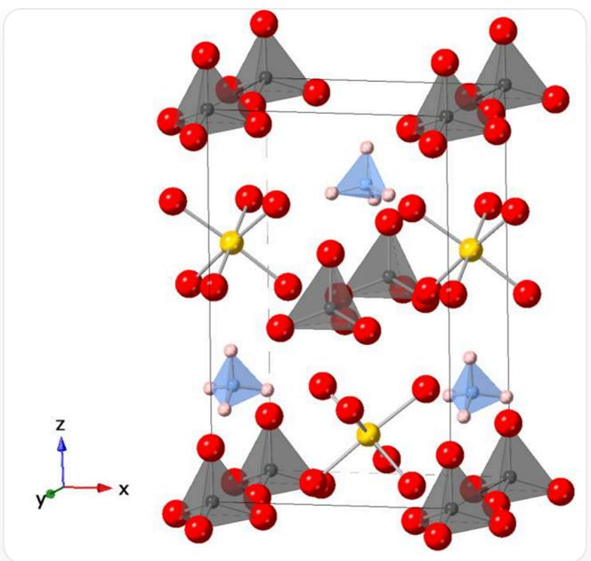

# Question

Ammonium dihydrogen phosphate reacts with a certain 1:1 type metal oxide MO under humid conditions to obtain salt A, whose crystal structure is shown in the figure below (hydrogen atoms on oxygen are omitted, each sphere represents an element, and the vertex is located on a certain atom). It is known that the crystal has  $n$  glide planes or mirror planes in the  $x / y$  direction and a twofold axis in the  $z$  direction, where the coordinates of one M are (0.5000, 0.3639, 0.1286) and the coordinates of one P are (0.5000, 0.9773, 0.5000):

This is a schematic diagram of the unit cell structure of a crystal. The orientations of xyz are: to the right in the plane of the paper, perpendicular to the plane of the paper and out of the plane, and upwards in the plane of the paper, forming a left-handed helical coordinate system. Among them, chemical bonds and coordinate bonds are represented by bonds, and the coordination polyhedra of specific ions are represented by polyhedra. There are five different spheres in the figure, each representing a chemical element, which are red spheres, yellow spheres, blue spheres, pink spheres, and black spheres. The size relationship of their radii in the figure is: red sphere  $>$  yellow sphere  $>$  black sphere  $>$  blue sphere  $>$  pink sphere. The figure shows that they form various polyhedral ions with each other. 4 red spheres coordinate with 1 black sphere to form a 1 black 4 red tetrahedral ion I, 4 pink spheres coordinate with 1 blue sphere to form a 1 blue 4 pink tetrahedral ion II, and 6 red spheres coordinate with 1 yellow sphere to form a 1 yellow 6 red octahedral ion III. There are 2 of each of these three ions in the unit cell, and the orientation of each pair of the same type of polyhedra is mirrored with respect to the xz plane. All polyhedra have mirror planes parallel to the yz direction inside, and all polyhedra have a bottom surface that is almost parallel to the xy direction. Among them, the center of the tetrahedral ion I is located at the vertex of the unit cell, and the center of the xz face is slightly offset towards the negative y-axis at two positions; the tetrahedral ion II is located approximately at the center of the yz face offset towards the negative z-axis and the center of the unit cell offset towards the positive z-axis; the octahedral ion III is located approximately at the center of the yz face offset towards the positive z-axis and the center of the unit cell offset towards the negative z-axis.

The a and b of the unit cell are close to or equal, and c is much larger than a/b

Please observe and based on the above schematic diagram of the crystal unit cell, the following propositions are now given:

1. There are 4 kinds of ions with different compositions in the crystal

2. The molar mass of one structural unit of the crystal is  $221.11 + M(\mathbf{M}) \, \mathrm{g} \cdot \mathrm{mol}^{-1}$  
3. When this substance is generated, for every  $2.85\mathrm{g}$ $(\mathrm{NH}_4)\mathrm{H}_2\mathrm{PO}_4$  consumed, the volume of water vapor absorbed under standard conditions is  $2.8\mathrm{L}$  
4. In the actual crystal, the polyhedral structure of at least one of the ions in the crystal is a regular polyhedron  
5. The space group to which the crystal belongs may be Pmm2  
6. There are two  $n$  glide planes or mirror planes in the crystal that are parallel to the  $xz$  plane, located at  $y = 0.0000 / 0.5000$  
7. There are two  $n$  glide planes or mirror planes in the crystal that are parallel to the  $yz$  plane, located at  $x = 0.0000 / 0.5000$  
8. One of the twofold axes of the crystal along the  $z$  direction is located at  $x = 0.2500$ ,  $y = 0.5000$  in the  $z$ -axis projection  
9. The coordinates of another  $\mathbf{M}$  of the crystal are (0.0000, 0.6134, 0.6286)

Determine the correctness of the above propositions and find the value of  $z$ :

$$
z = \frac {\mathrm {S u m o f s q u a r e s o f c o r r e c t p r o p o s i t i o n s}}{(\mathrm {S u m o f i n c o r r e c t p r o p o s i t i o n s} + 1) ^ {2}}
$$

Retain 3 significant figures for the final result, and select the correct option from the following options, requiring the deviation from your calculated result to be less than  $1\%$ , otherwise select option A: All other options are incorrect.

A. All other options are incorrect  
B. 0.00875

C. 0.0138  
D. 0.0208  
E. 0.00907  
F. 0.0149  
G. 0.0300  
H. 0.0416  
1. 0.0744  
J. 0.0255  
K. 0.154  
L. 0.191  
M. 0.354

# Answer

Correct Answer: L

# Detailed Explanation

Observe the structure of the crystal. There are five different spheres, each representing a chemical element, which are red, yellow, blue, pink, and black spheres. Their radius relationship in the figure is: red sphere  $>$  yellow sphere  $>$  black sphere  $>$  blue sphere  $>$  pink sphere. Combined with the statement in the question: "Ammonium dihydrogen phosphate reacts with MO under humid conditions to obtain salt A" and given the coordinates of some  $\mathbf{M} / \mathbf{P}$ , the crystal should contain the five elements O/M/P/N/H in descending order of sphere radius in the figure.

# CHECKPOINT

0.5 PTS

The unit cell diagram shows five elements  $\mathrm{O / M / P / N / H}$  in descending order of sphere radius

The figure shows three types of polyhedral ions formed between them, each with two. 4 red spheres coordinate with 1 black sphere to form a 1 black 4 red tetrahedral ion  $\left[\mathrm{PO}_4\right]^{3-}$ , 4 pink spheres coordinate with 1 blue sphere to form a 1 blue 4 pink tetrahedral ion  $\left[\mathrm{NH}_4\right]^+$ , and 6 red spheres coordinate with 1 yellow sphere to form a 1 yellow 6 red octahedral ion  $\left[\mathbf{M}(\mathrm{H}_2\mathrm{O})_6\right]^{2+}$ . Therefore, Proposition 1 is incorrect.

# CHECKPOINT

0.5 PTS

The unit cell diagram has three types of ions:  $\left[\mathrm{PO}_4\right]^{3-}$  、  $\left[\mathrm{NH}_4\right]^+$  、  $\left[\mathbf{M}(\mathrm{H}_2\mathrm{O})_6\right]^{2+}$ , and there are two of each

Therefore, the chemical formula of the crystal is  $(\mathrm{NH}_4)\mathbf{M}(\mathrm{PO}_4) \cdot 6\mathrm{H}_2\mathrm{O}$ .

# CHECKPOINT

1 PTS

The chemical formula of the crystal is  $(\mathrm{NH}_4)\mathbf{M}(\mathrm{PO}_4)\cdot 6\mathrm{H}_2\mathrm{O}$

Observation reveals that each pair of the same polyhedron is mirrored with respect to the  $xz$  direction. All polyhedra have a mirror plane parallel to the  $yz$  direction inside. Therefore, each pair of identical polyhedra is not equivalent. One unit cell is one structural unit, and the composition of one unit cell is  $2[(\mathrm{NH}_4)\mathbf{M}(\mathrm{PO}_4) \cdot 6\mathrm{H}_2\mathrm{O}]$ , and its molar mass is  $2M_{\mathbf{A}} = 2 \times (221.11 + M(\mathbf{M})) = 442.22 + 2M(\mathbf{M})\mathrm{g} \cdot \mathrm{mol}^{-1}$ . Therefore, Proposition 2 is incorrect.

# CHECKPOINT

1 PTS

The molar mass of one structural unit of the crystal is  $442.22 + 2M(\mathbf{M})\mathrm{g}\cdot \mathrm{mol}^{-1}$

The chemical reaction equation for the formation of this crystal is:

$$
\mathbf {M} \mathrm {O} + (\mathrm {N H} _ {4}) \mathrm {H} _ {2} \mathrm {P O} _ {4} + 5 \mathrm {H} _ {2} \mathrm {O} \rightarrow (\mathrm {N H} _ {4}) \mathbf {M} (\mathrm {P O} _ {4}) \cdot 6 \mathrm {H} _ {2} \mathrm {O}
$$

The stoichiometric ratio of  $(\mathrm{NH}_4)\mathrm{H}_2\mathrm{PO}_4$  to  $\mathrm{H}_2\mathrm{O}$  is 1:5.

# CHECKPOINT

0.5 PTS

The stoichiometric ratio of  $(\mathrm{NH}_4)\mathrm{H}_2\mathrm{PO}_4$  to  $\mathrm{H}_2\mathrm{O}$  is 1:5

According to the ideal gas state equation, for every  $2.85\mathrm{g}$ $(\mathrm{NH}_4)\mathrm{H}_2\mathrm{PO}_4$  consumed, the volume of water vapor absorbed under standard conditions is:

$$
V _ {\mathrm {H _ {2} O}} = \frac {n _ {\mathrm {H _ {2} O}} R T}{p} = \frac {5 n _ {(\mathrm {N H _ {4}) H _ {2} P O _ {4}}} R T}{p} = \frac {5 m _ {(\mathrm {N H _ {4}) H _ {2} P O _ {4}}} R T}{M _ {(\mathrm {N H _ {4}) H _ {2} P O _ {4}}} p} = \frac {5 \times 2 . 8 5 \times 8 . 3 1 4 \times 2 7 3}{1 1 5 . 0 3 \times 1 0 1} = 2. 8 1 \approx 2. 8 \mathrm {L}
$$

Therefore, Proposition 3 is correct.

# CHECKPOINT

0.5 PTS

For every  $2.85\mathrm{g}$ $(\mathrm{NH}_4)\mathrm{H}_2\mathrm{PO}_4$  consumed, the volume of water vapor absorbed under standard conditions is  $2.8\mathrm{L}$

According to the information in the question, "the crystal has  $n$  glide planes or mirror planes in the  $x / y$  directions and a twofold axis in the  $z$  direction", and according to the orientation of the ions in the figure, and all polyhedra in the figure have a base almost parallel to the  $xy$  direction. Therefore, the crystal should belong to the orthorhombic crystal system.

# CHECKPOINT

0.5 PTS

The crystal belongs to the orthorhombic crystal system

The symmetry of the crystal is lower than the symmetry of the coordination polyhedra (regular tetrahedron, regular octahedron). Therefore, due to the breaking of symmetry, there are no regular polyhedra in the actual crystal. Therefore, Proposition 4 is incorrect.

# CHECKPOINT

1 PTS

In the actual crystal, none of the polyhedral structures of the ions in the crystal are regular polyhedra

According to the question, the "vertices of the unit cell are located on some atom". Combined with the previous reasoning, we know that the vertices are located on the P atom. At the same time, the coordinates of one M are (0.5000, 0.3639, 0.1286), and the coordinates of one P are (0.5000, 0.9773, 0.5000). Further combined with the shape of the coordination polyhedra in the figure, it is obvious that: there are two mirror planes parallel to the  $yz$  plane in the crystal, located at  $x = 0.0000 / 0.5000$ . Therefore, Proposition 7 is correct.

# CHECKPOINT

1 PTS

There are two mirror planes parallel to the  $yz$  plane in the crystal, located at  $x = 0.0000 / 0.5000$

Further combined with the information that the base of the polyhedron is almost parallel to the  $xy$  plane and that there are mirror planes parallel to the  $yz$  plane, it can be ruled out that there are two mirror planes parallel to the  $xz$  plane in the crystal, which does not meet the requirements of the tetrahedral and octahedral shapes. Therefore, the crystal space group cannot be Pmm2. Therefore, Proposition 5 is incorrect.

# CHECKPOINT

1 PTS

The crystal space group cannot be Pmm2

Combined with the meaning of the question, there are two  $n$  glide planes parallel to the  $xz$  plane in the crystal. Combined with the coordinates of the two P (0.0000, 0.0000, 0.0000) and (0.5000, 0.9773, 0.5000), it is not difficult to find that the  $n$  glide planes are not located at  $y = 0.0000 / 0.5000$ , but should be located at  $y = 0.4886 / 0.9886$ . Therefore, Proposition 6 is incorrect.

# CHECKPOINT

1 PTS

There are two  $n$  glide planes parallel to the  $xz$  plane in the crystal, located at  $y = 0.4886 / 0.9886$

Therefore, the space group to which the crystal belongs should be  $Pmn$ . At the same time, it is required to be an orthorhombic crystal system and  $\square$  is a twofold axis. Therefore, among the 230 space groups, only  $Pmn2_{1}$  meets the requirements. Therefore, there is a  $2_{1}$  axis along the  $z$  direction in the unit cell. Further verification of Proposition 5 is incorrect.

# CHECKPOINT

1 PTS

The crystal space group is  $Pmn2_{1}$

Furthermore, examine the position of the  $2_{1}$  axis, which should be located within the glide plane. Combined with the coordinates of the two P (0.0000, 0.0000, 0.0000) and (0.5000, 0.9773, 0.5000), its position in the  $z$  axis projection is located at  $x = 0.2500, y = 0.4886$ . Similarly, it is deduced that other  $2_{1}$  axes are located at  $x = 0.2500, y = 0.9886$ ,  $x = 0.7500, y = 0.4886$ ,  $x = 0.7500, y = 0.9886$ . There is no  $2_{1}$  axis located at  $x = 0.2500, y = 0.5000$ . Therefore, Proposition 8 is incorrect.

# CHECKPOINT

1 PTS

21 axes in  $z$  axis projection are located at  $x = 0.2500, y = 0.4886$ ,  $x = 0.2500, y = 0.9886$ ,  $x = 0.7500, y = 0.4886$ ,  $x = 0.7500, y = 0.9886$

Finally, combined with the symmetry of the crystal, the coordinates of the other  $\mathbf{M}$  are indeed (0.0000, 0.6134, 0.6286). Therefore, Proposition 9 is correct.

# CHECKPOINT

1 PTS

The coordinates of the other  $\mathbf{M}$  in the crystal are (0.0000, 0.6134, 0.6286)

Finally, calculate

$$
z = \frac {\left[ \mathrm {T h e s u m o f s q u a r e s o f c o r r e c t p r o p o s i t i o n s} \right]}{\left(\left[ \mathrm {T h e s u m o f i n c o r r e c t p r o p o s i t i o n s} \right] + 1\right) ^ {2}} = \frac {3 ^ {2} + 7 ^ {2} + 9 ^ {2}}{(1 + 2 + 4 + 5 + 6 + 8 + 1) ^ {2}} \approx 0. 1 9 1
$$