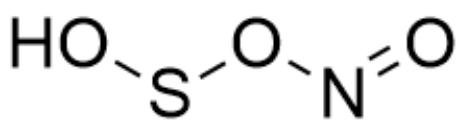
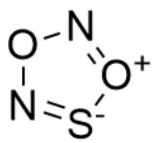
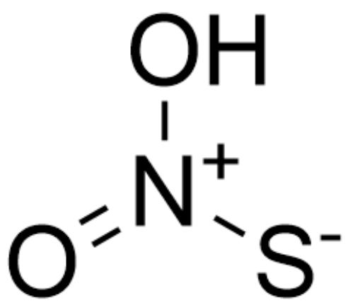
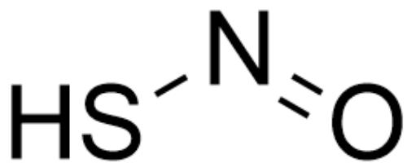
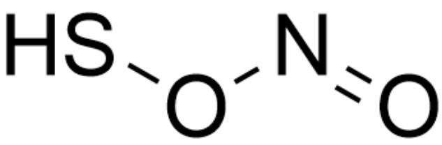
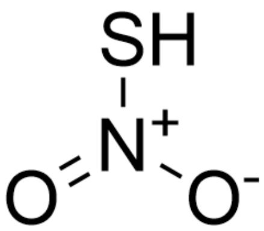
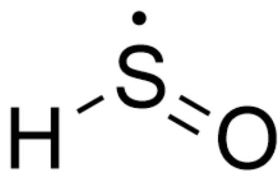
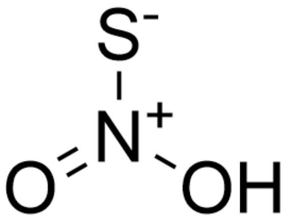
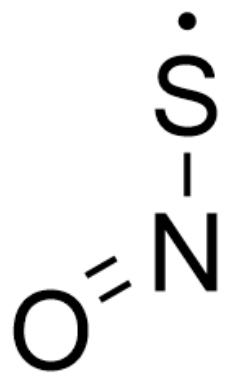

# Question

A reactive metastable diatomic particle  $\mathbf{X}$  detected in interstellar gas can react with a reddish-brown gas  $\mathbf{A}$  in a 1:1 ratio to yield various substances. Computational chemistry indicates that the reaction first involves the combination of  $\mathbf{X}$  and  $\mathbf{A}$  to produce two isomeric molecules  $\mathbf{B}_1$  and  $\mathbf{B}_2$ .  $\mathbf{B}_1$  can directly decompose into  $\mathbf{C}$  and  $\mathbf{D}$ , and  $\mathbf{D}$  can be oxidized to  $\mathbf{A}$  in air; while  $\mathbf{B}_2$  cannot decompose directly, but first undergoes isomerization to obtain  $\mathbf{B}_3$ , and  $\mathbf{B}_3$  then decomposes into  $\mathbf{E}$  and hydroxyl radicals.  $\mathbf{X}$  is oxidized in oxygenated water to yield equal amounts of sulfur dioxide and  $\mathbf{F}$ .  $\mathbf{F}$  does not contain sulfur and is a highly reactive monoprotic acid.  $\mathbf{X}$  can ionize in deoxygenated water to produce a negative ion  $\mathbf{G}$ , and  $\mathbf{G}$  can catalyze the cis-trans isomerization of double bonds in lipid compounds.

Please provide the chemical formula or structural formula of each substance and select the matching options.

A. All other options are incorrect  
B. The chemical formula of  $\mathbf{X}$  is SO.  
C. The chemical formula of  $\mathbf{A}$  is  $\mathrm{N}_2\mathrm{O}_4$  
D. The structural formula of  $\mathbf{B}_{1}$  is

OSON=0

E. The structural formula of  $\mathbf{B}_2$  is

O1N=[S-][O+]=N1

F. The structural formula of  $\mathbf{B}_3$  is

$O = [N + ](O)[S - ]$

G. C's chemical formula is SO

H. The chemical formula of  $\mathbf{D}$  is NOH.  
1. The structural formula of  $\mathbf{E}$  is

SN=0

J. The chemical formula of  $\mathbf{F}$  is  $\mathrm{H}_2\mathrm{O}_2$  
K. G catalyzed cis-trans isomerization of double bonds proceeds via cycloaddition reactions.

# Answer

Correct Answer: F

# Detailed Explanation

(The structural representation uses SMILES coding, and chemical formulas use ordinary representation methods.)

From the fact that  $\mathbf{X}$  can be ionized as an acid in water under anaerobic conditions, it can be known that it contains hydrogen, and that it reacts to produce sulfur dioxide under oxygen-containing conditions, it can be known that another atom in it is a sulfur atom, and then it can be known that the chemical formula of  $\mathbf{X}$  is HS $\cdot$ .

# CHECKPOINT

1.5 PTS

The chemical formula of  $\mathbf{X}$  is HS

Next, since  $\mathbf{X}$  reacts with  $\mathbf{A}$  to produce two isomers, it should have two binding sites. Combined with the reddish-brown color information, it can be known that the chemical formula of  $\mathbf{A}$  is  $\mathrm{NO}_2$

# CHECKPOINT

1 PTS

The chemical formula of  $\mathbf{A}$  is  $\mathrm{NO}_2$

Next, since  $\mathbf{D}$  can be oxidized to  $\mathbf{A}$  in the air and is obtained by the decomposition of  $\mathbf{B}_1$ , it should be NO

# CHECKPOINT

1 PTS

The chemical formula of  $\mathbf{D}$  is NO

Since  $\mathbf{B}_1$  can be directly decomposed to obtain  $\mathbf{D}$  and another molecule, it indicates that the fragment corresponding to NO should be relatively independent. When  $\mathbf{B}_1$  is generated, the oxygen in  $\mathrm{NO}_2$  should be connected to the sulfur atom, so its structure should be

O=NOS

# CHECKPOINT

1.5 PTS

The structure of  $\mathbf{B}_1$  is  $\mathrm{O} = \mathrm{NOS}$

Correspondingly, the structure of the isomer  $\mathbf{B}_2$  is

$O = [N + ](S)[O - ]$

# CHECKPOINT

1.5 PTS

The structure of  $\mathbf{B}_2$  is  $\mathrm{O} = [\mathrm{N} + ](\mathrm{S})[\mathrm{O} - ]$

Next,  $\mathbf{C}$  is the remaining part of  $\mathbf{B}_1$  after removing NO, so it can be known that it is

[H][S]=O

# CHECKPOINT

1 PTS

The structure of  $\mathbf{C}$  is  $[\mathrm{H}][\mathrm{S}] = 0$

Since  $\mathbf{B}_3$  converted from  $\mathbf{B}_2$  decomposes to generate hydroxyl radicals, it indicates that the oxygen atom is connected to the hydrogen atom, and it can be known that its structure is

$$
O = [ N + ] ([ S - ]) O
$$

# CHECKPOINT

1.5 PTS

The structure of  $\mathbf{B}_3$  is  $\mathrm{O} = [\mathrm{N} + ]([\mathrm{S} - ])\mathrm{O}$

$\mathbf{E}$  is the part of  $\mathbf{B}_3$  after removing the hydroxyl radical, so its structure is

$O = N[S]$

# CHECKPOINT

1 PTS

The structure of  $\mathbf{E}$  is  $\mathrm{O} = \mathrm{N}[\mathrm{S}]$

Next, sulfur dioxide is also generated during the generation of  $\mathbf{F}$ . The system contains water and oxygen. At this time, it is found that considering the reaction involving water, it is impossible to produce an equivalent amount of highly active monoprotic acid. Therefore, considering the reaction that only occurs with oxygen, it can be known that the generated product should be  $\mathbf{HO}_2$

# CHECKPOINT

1 PTS

The chemical formula of  $\mathbf{F}$  is  $\mathbf{HO}_2$

Finally,  $\mathbf{G}$  is the product of simple ionization of  $\mathbf{X}$ , so it can be known that it is  $\cdot \mathrm{S}^{-}$

# CHECKPOINT

0.5 PTS

The chemical formula of  $\mathbf{G}$  is  $\cdot \mathrm{S}^{-}$

The cis-trans isomerization of double bonds catalyzed by  $\mathbf{G}$  should proceed through a radical addition-elimination process. After addition and before elimination, the double bond becomes a single bond and can rotate freely.

# CHECKPOINT

0.5 PTS

G catalyzes cis-trans isomerization of double bonds through an addition-elimination process

To sum up, option F is correct.