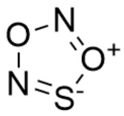
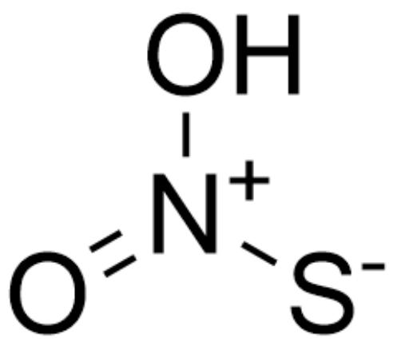
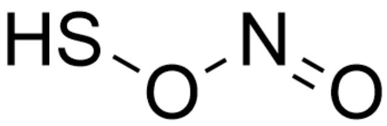
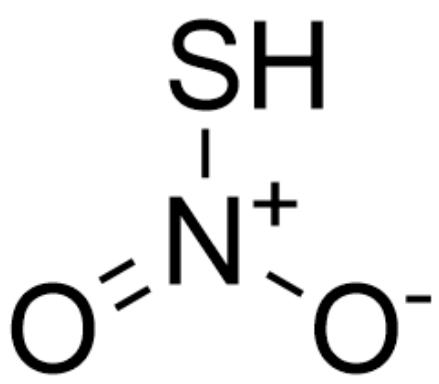
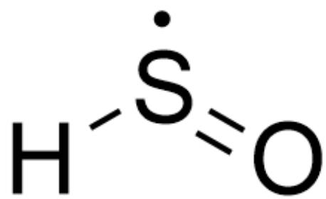
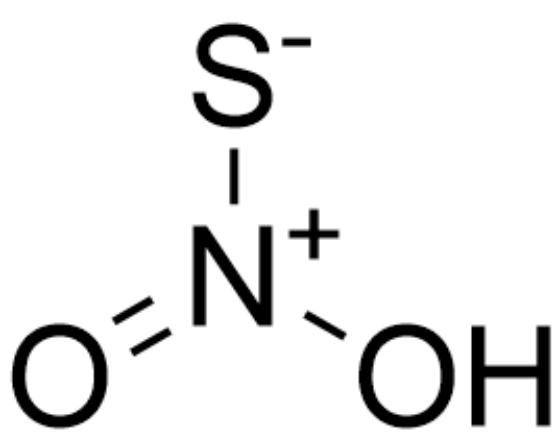
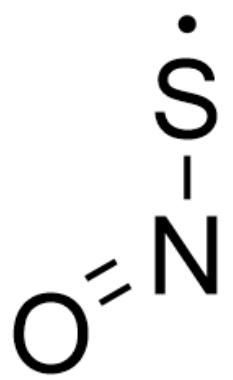

# 题目

在星际气体中探测到了一种具有反应活性的亚稳态双原子粒子  $\mathbf{X}$  能与红棕色气体A按1:1的比例反应可以得到多种物质。计算化学表明，该反应首先由  $\mathbf{X}$  与A结合，得到两种互为同分异构体的分子  $\mathbf{B}_1$  和  $\mathbf{B}_2$  ，  $\mathbf{B}_1$  可以直接分解为C和D，D在空气中可被氧化为A；而  $\mathbf{B}_2$  不能直接分解，而是先经异构化得到  $\mathbf{B}_3$  ，  $\mathbf{B}_3$  再分解成E和羟基自由基。X在含氧的水中被氧化，得到等量的二氧化硫和F，F不含硫，是一种活性很高的一元酸。X在不含氧的水中可电离出负离子G，G能催化脂类化合物中双键的顺反异构化。

请给出各个物质的化学式或者结构式，并且选择匹配的选项。

A. 其他选项均不正确  
B. X 的化学式为 SO  
C. A 的化学式为  $\mathrm{N}_{2} \mathrm{O}_{4}$  
D.  $\mathbf{B}_{1}$  的结构式为

$$
\mathrm {H O} _ {\mathrm {S}} \mathrm {O} _ {\mathrm {N}} = 0
$$

OSON=0

E.  $\mathbf{B}_{2}$  的结构式为

$$
O 1 N = [ S - ] [ O + ] = N 1
$$

F.  $\mathrm{B}_{3}$  的结构式为

$$
\mathrm {O} = [ \mathrm {N} + ] (\mathrm {O}) [ \mathrm {S} - ]
$$

G. C 的化学式为 SO  
H. D的化学式为NOH  
I. E的结构式为

# HS\*-N=O

SN=0

J. F 的化学式为  $\mathrm{H}_{2} \mathrm{O}_{2}$  
K. G 催化双键顺反异构是通过环加成反应进行的

# 答案

正确答案: F

# 详细解析

(结构表述采用SMILES编码，化学式采用平常表述方法)

由  $\mathbf{X}$  可在无氧的条件下作为酸在水中电离可知其中含有氢，且含氧条件下反应生成二氧化硫，可以得知其中另一个原子为硫原子，进而可知  $\mathbf{X}$  的化学式为HS·。

# CHECKPOINT

1.5 PTS

X的化学式为HS·

接下来，由于  $\mathbf{X}$  与  $\mathbf{A}$  反应生成两种同分异构体，故而其应有两种结合位点，结合红棕色的颜色信息，可知  $\mathbf{A}$  的化学式为  $\mathrm{NO}_2$

# CHECKPOINT

1 PTS

A 的化学式为  $\mathrm{NO}_{2}$

接下来，由于  $\mathbf{D}$  在空气中可以氧化为  $\mathbf{A}$ ，且其通过  $\mathbf{B}_1$  分解得到，可知其应为NO

# CHECKPOINT

1 PTS

D 的化学式为 NO

由于  $\mathbf{B}_{1}$  可以直接分解得到  $\mathbf{D}$  和另一分子，说明其中 NO 对应的片段应相对独立，生成  $\mathbf{B}_{1}$  时应为  $\mathrm{NO}_{2}$  中的氧与硫原子相连，故而其结构应为

O=NOS

# CHECKPOINT

1.5 PTS

$\mathbf{B}_{1}$  的结构为O=NOS

对应的，同分异构体  $\mathbf{B}_{2}$  的结构为

$O = [N + ](S)[O - ]$

# CHECKPOINT

1.5 PTS

$\mathbf{B}_2$  的结构为  $O = [N + ](S)[O - ]$

接着， $\mathbf{C}$  为  $\mathbf{B}_1$  去掉NO后余下的部分，故而可知其为

[H][S]=O

# CHECKPOINT

1 PTS

C的结构为[H][S]=O

由于  $\mathbf{B}_{2}$  转化生成的  $\mathbf{B}_{3}$  分解生成羟基自由基，故而说明其中氧原子与氢原子相连，可知其结构为

$$
O = [ N + ] ([ S - ]) O
$$

# CHECKPOINT

1.5 PTS

$\mathbf{B}_3$  的结构为  $\mathrm{O = [N + ]([S - ])O}$

E为B 3 去掉羟基自由基的部分，故而其结构为

$O = N[S]$

# CHECKPOINT

1 PTS

$\mathbf{E}$  的结构为  $O = N[S]$

接着，生成  $\mathbf{F}$  的过程中还生成了二氧化硫，体系中含有水和氧气，此时发现考虑水参与的反应，无法产生等当量的高活性一元酸，故而考虑仅和氧气发生的反应，可知其生成的应为  $\mathrm{HO}_2$

# CHECKPOINT

1 PTS

$\mathbf{F}$  的化学式为  $\mathrm{HO}_{2}$

最后， $\mathbf{G}$  为  $\mathbf{X}$  简单电离后的产物，所以可知其为  $\cdot \mathrm{S}^{-}$

# CHECKPOINT

0.5 PTS

$\mathbf{G}$  的化学式为  $\cdot \mathrm{S}^{-}$

而  $\mathbf{G}$  催化双键顺反异构应通过自由基加成-消除过程。在加成后，消除前，双键变为单键，可以自由旋转。

# CHECKPOINT

0.5 PTS

G 催化双键顺反异构通过加成消除过程

综上，选项F正确。