# Question

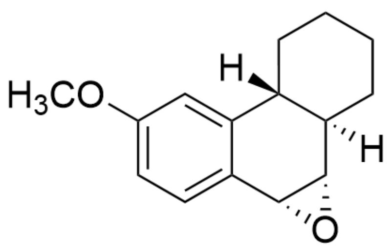

[H][C@@]12[C@](CCCC2)([H])[C@H]3[C@H](O3)C4=CC=C(OC)C=C41, Substrate A

This substrate A can undergo hydrolysis under acidic conditions, generating a compound containing three six-membered rings. Please consider the stereochemistry of the cyclic transition state and select the structure of the major product.

A. All other options are incorrect

B.

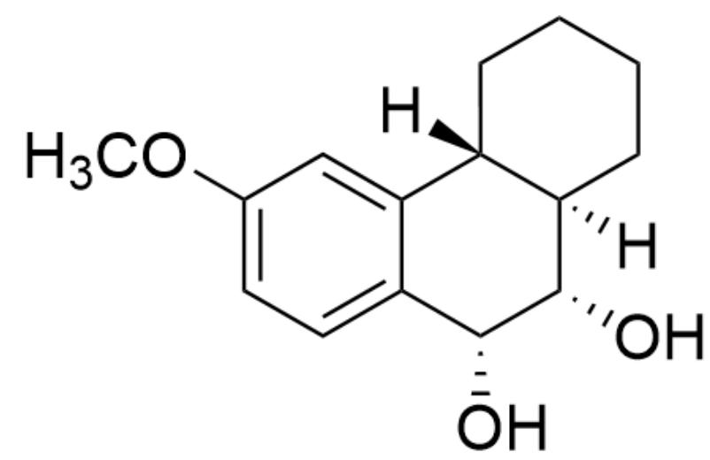  
C.

[H][C@@]12[C@@](CCCC2)([H])[C@H](O)[C@H](O)C3=CC=C(OC)C=C31

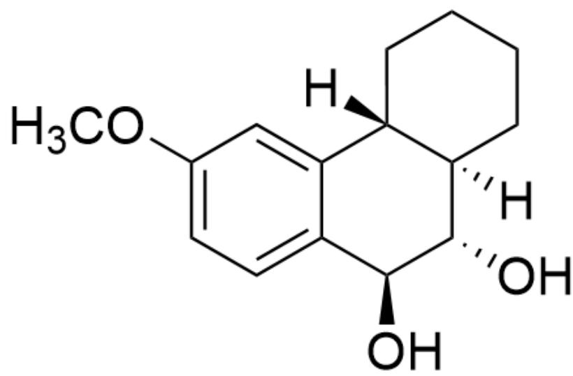  
D.

[H][C@@]12[C@@](CCCC2)([H])[C@H](O)[C@@H](O)C3=CC=C(OC)C=C31

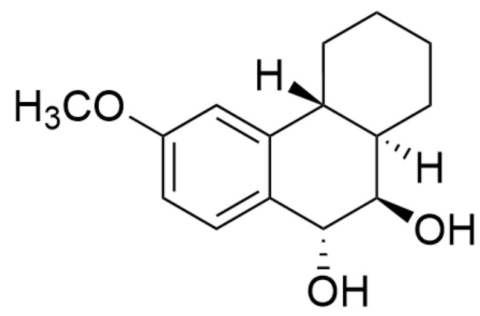

[H][C@@]12[C@@](CCCC2)([H])[C@@H](O)[C@H](O)C3=CC=C(OC)C=C31

E.

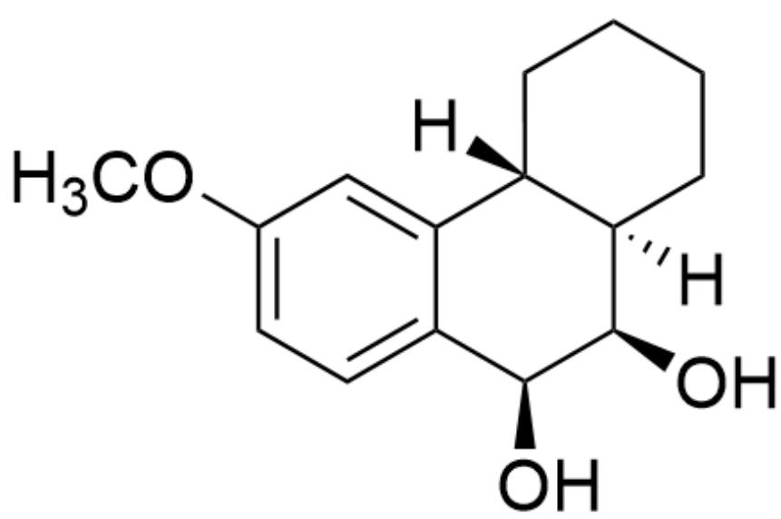

[H][C@@]12[C@@](CCCC2)([H])[C@@H](O)[C@@H](O)C3=CC=C(OC)C=C31

F.

G.  
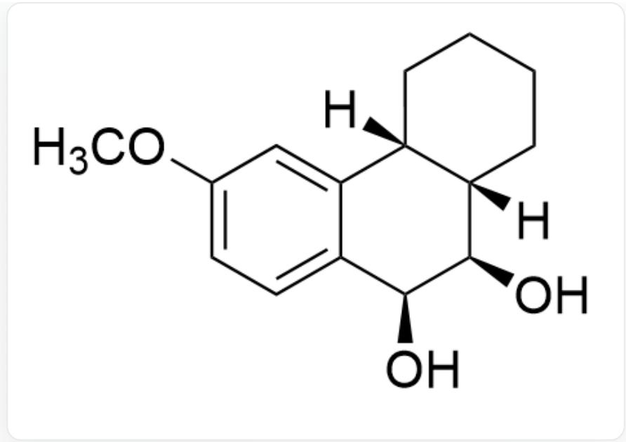  
[H][C@@]12[C@@](CCCC2)([H])[C@@H](O)[C@@H](O)C3=CC=C(OC)C=C31

H.  
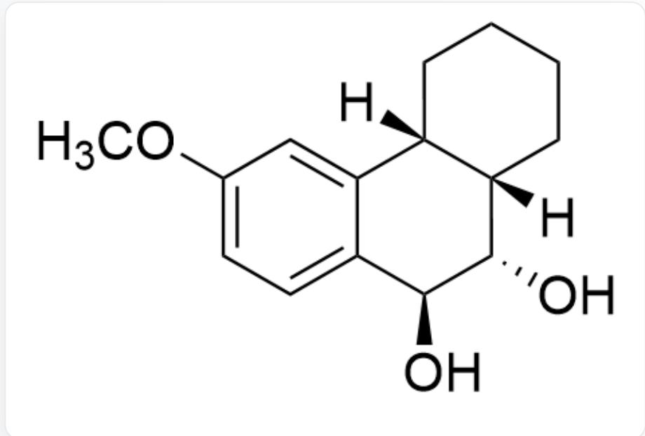  
[H][C@@]12[C@@](CCCC2)([H])[C@H](O)[C@@H](O)C3=CC=C(OC)C=C31

1.  
  
[H][C@@]12[C@@](CCCC2)([H])[C@@H](O)[C@H](O)C3=CC=C(OC)C=C31

  
[H][C@@]12[C@@](CCCC2)([H])[C@H](O)[C@H](O)C3=CC=C(OC)C=C31

# Answer

Correct Answer: B

# Detailed Explanation

Methoxy has a certain conjugation electron-donating effect, which can stabilize benzylic carbocations.

# CHECKPOINT

1 PTS

Methoxy has a certain conjugation electron-donating effect, which can stabilize benzylic carbocations.

Therefore, the three-membered ring first undergoes ring-opening under acidic conditions to form carbocation intermediate 1.

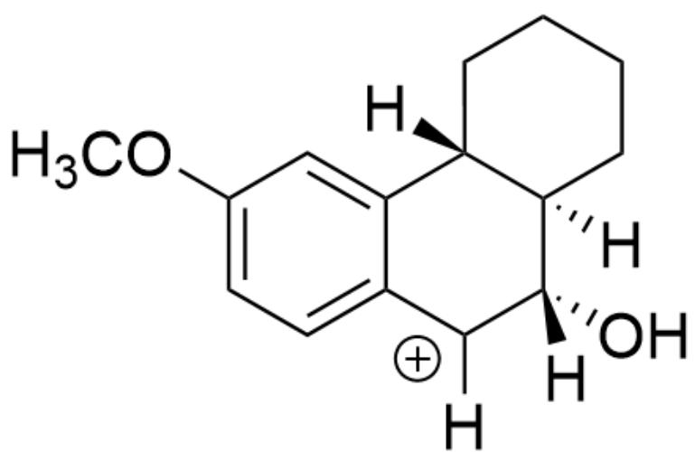

[H][C@@]12[C@@](CCCC2)([H])[C@@](O)([H])[C+]([H])C3=CC=C(OC)C=C31

# CHECKPOINT

1 PTS

[H][C@@]12[C@](CCCC2)([H])[C@@](O)([H])[C+]([H])C3=CC=C(OC)C=C31

The conformation of the intermediate is

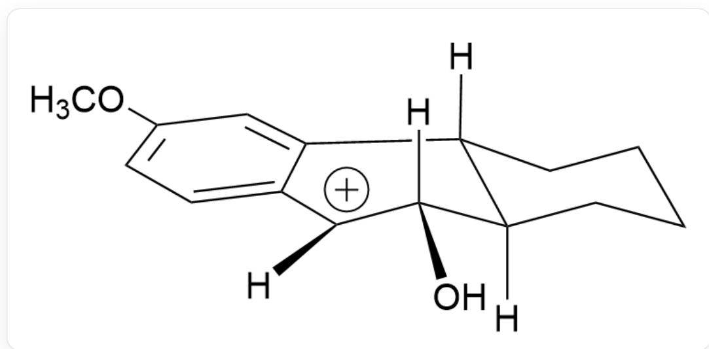  
[H][C@@]12[C@](CCCCC2)([H])[C@@](O)([H])[C+]([H])C3=CC=C(OC)C=C31

The Newman projection formula when  $\mathrm{H}_2\mathrm{O}$  undergoes nucleophilic attack can be drawn

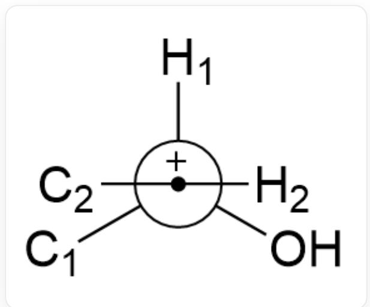  
[H][C@@]12[C@@](CCCC2)([H])[C@@](O)([H])[C+]([H])C3=CC=C(OC)C=C31

When the water molecule attacks from below, the degree of conformational change of the system is minimal, and the reaction energy barrier is low.

# CHECKPOINT

1 PTS

When the water molecule attacks from below, the degree of conformational change of the system is minimal, and the reaction energy barrier is low.

Therefore, the main reaction product finally obtained by hydrolysis of  $\mathbf{A}$  is

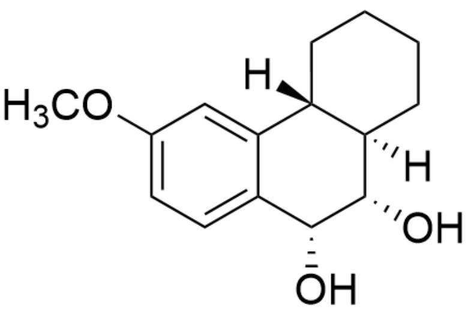

[H][C@@]12[C@@](CCCC2)([H])[C@H](O)[C@H](O)C3=CC=C(OC)C=C31

# CHECKPOINT

1 PTS

Final hydrolysis product: [H][C@@]12[C@](CCCC2)([H])[C@H](O)[C@H](O)C3=CC=C(OC)C=C31