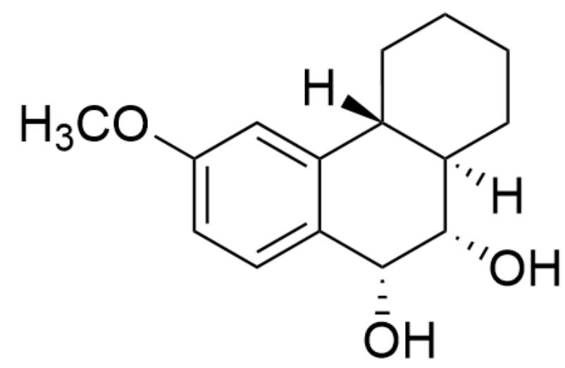
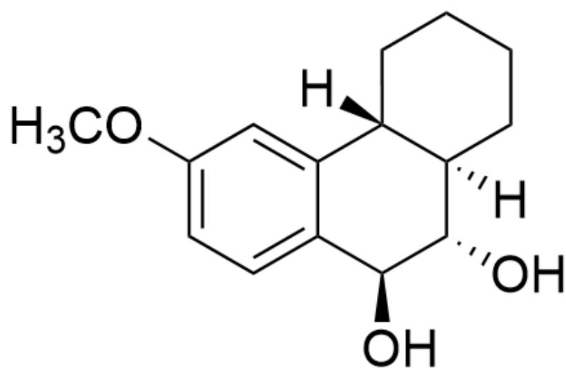
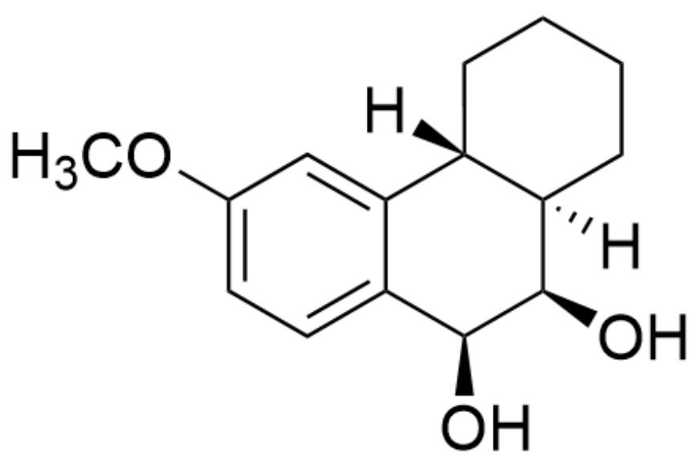
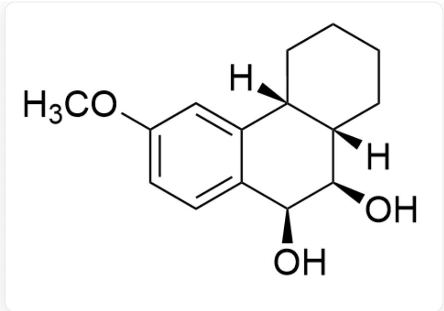
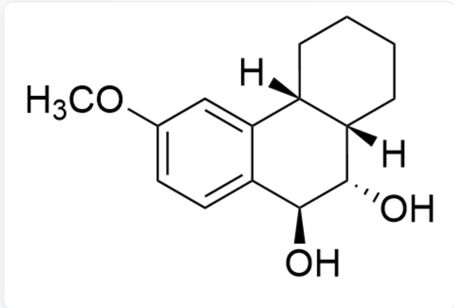
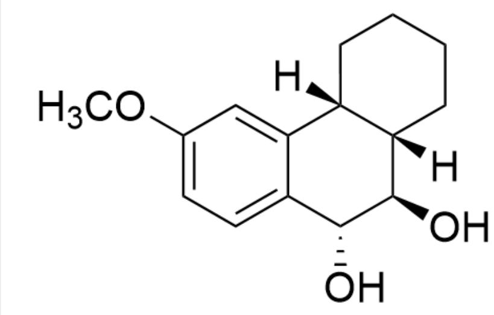
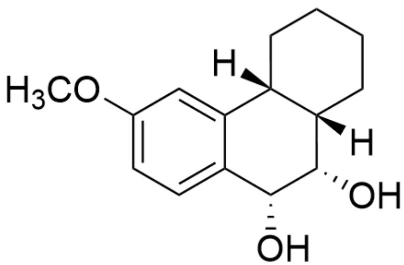
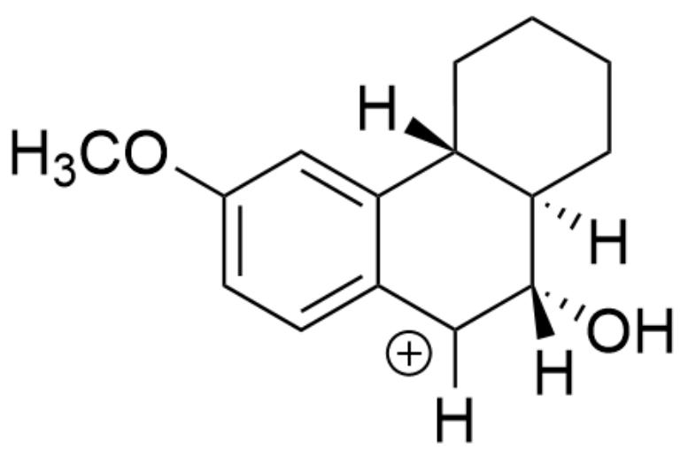
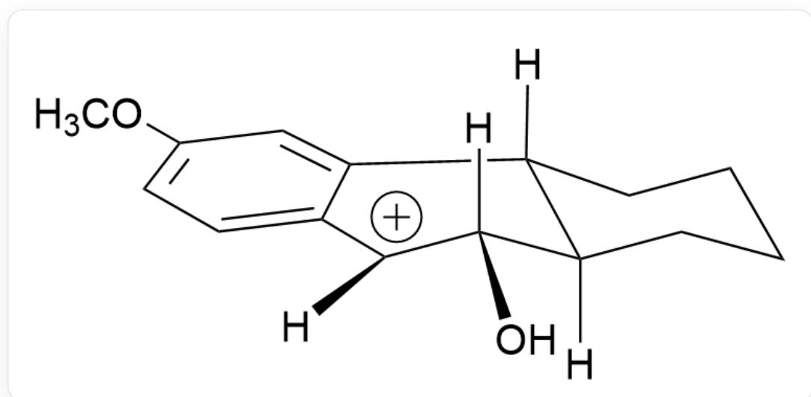
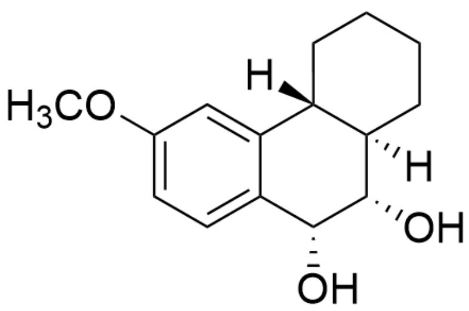

# 题目

[H][C@@]12[C@](CCCC2)([H])[C@H]3[C@H](O3)C4=CC=C(OC)C=C41,底物A

该底物 A 可以在酸性条件下发生水解，生成某含有三个六元环的化合物。请考虑环状过渡态的立体化学，选出主要产物的结构。

A. 其他选项均不正确  
B.

  
C.

[H][C@@]12[C@@](CCCC2)([H])[C@H](O)[C@H](O)C3=CC=C(OC)C=C31

  
D.

[H][C@@]12[C@@](CCCC2)([H])[C@H](O)[C@@H](O)C3=CC=C(OC)C=C31

  
E.

[H][C@@]12[C@@](CCCC2)([H])[C@@H](O)[C@H](O)C3=CC=C(OC)C=C31

  
F.

[H][C@@]12[C@@](CCCC2)([H])[C@@H](O)[C@@H](O)C3=CC=C(OC)C=C31

G.  
  
[H][C@@]12[C@@](CCCC2)([H])[C@@H](O)[C@@H](O)C3=CC=C(OC)C=C31

H.  
  
[H][C@@]12[C@@](CCCC2)([H])[C@H](O)[C@@H](O)C3=CC=C(OC)C=C31

1.  
  
[H][C@@]12[C@@](CCCC2)([H])[C@@H](O)[C@H](O)C3=CC=C(OC)C=C31

  
[H][C@@]12[C@@](CCCC2)([H])[C@H](O)[C@H](O)C3=CC=C(OC)C=C31

# 答案

正确答案: B

# 详细解析

甲氧基具有一定的的共轭给电子效应，可以稳定苄位的碳正离子

# CHECKPOINT

1 PTS

甲氧基具有一定的的共轭给电子效应，可以稳定苄位的碳正离子

因此首先三元环在酸性条件下发生开环形成碳正离子中间体1

[H][C@@]12[C@@](CCCC2)([H])[C@@](O)([H])[C+]([H])C3=CC=C(OC)C=C31

# CHECKPOINT

1 PTS

[H][C@@]12[C@](CCCC2)([H])[C@@](O)([H])[C+]([H])C3=CC=C(OC)C=C31

该中间体的构象为

  
[H][C@@]12[C@](CCCCC2)([H])[C@@](O)([H])[C+]([H])C3=CC=C(OC)C=C31

可以画出其发生  $\mathrm{H}_2\mathrm{O}$  亲核进攻时的纽曼投影式

  
[H][C@@]12[C@@](CCCC2)([H])[C@@](O)([H])[C+]([H])C3=CC=C(OC)C=C31

当水分子从下方进攻时，体系构象改变程度最小，反应能垒较低

# CHECKPOINT

1 PTS

当水分子从下方进攻时，体系构象改变程度最小，反应能垒较低

因此A水解最终得到的主要反应产物为

[H][C@@]12[C@@](CCCC2)([H])[C@H](O)[C@H](O)C3=CC=C(OC)C=C31

# CHECKPOINT

1 PTS

最终水解产物：[H][C@@]12[C@](CCCC2)([H])[C@H](O)[C@H](O)C3=CC=C(OC)C=C31