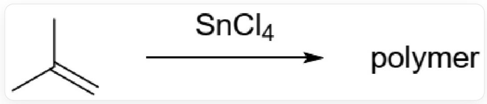
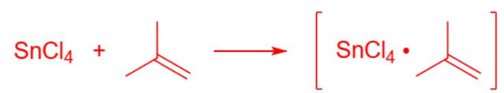
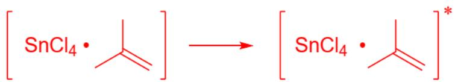
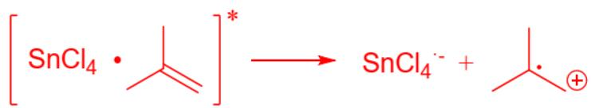
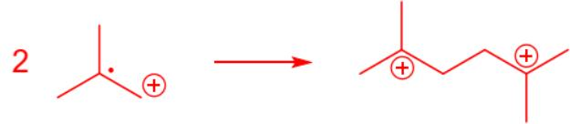

# Question

Bicentric polymerization can occur in the form of cationic polymerization. In 2000, Czech chemists reported the following polymerization reaction initiated by  $SnCl_4$ .

  
CC(C) = C produces a polymer under the action of  $SnCl_4$

When exploring the reaction conditions, the researchers discovered the following phenomena:

(1) The reaction can occur well at  $20^{\circ}C$  under an Ar atmosphere; the reaction cannot occur at the same temperature under an oxygen atmosphere.  
(2) If there is a small amount of water in the system, the reaction yield decreases.

There are the following statements:

1. Free radicals are involved in the chain initiation process.  
2. In the polymer produced by this reaction, there are no secondary carbons directly bonded to secondary carbons.  
3. The reaction produces a linear polymer.  
4. Polymerization is carried out at  $-20^{\circ}C$  and  $20^{\circ}C$  respectively for the same reaction time, the yield is higher and the number average molecular weight is lower at  $20^{\circ}C$ .  
5. The water present in the system does not affect the chain initiation process.

Select the option where all the following statements are correct.

A. No option with all statements correct  
B. 1,2,4  
C. 2,5,4  
D. 3,4,5  
E. 2,3,4  
F. 1,4,5  
G. 1,2,4,5  
H. 2,3,5  
1,2,3  
J. 4,5  
K. 1,3,4  
L. 1,3,4,5

# Answer

Correct Answer: K

# Detailed Explanation

The reaction proceeds well under an argon atmosphere, but not under an oxygen atmosphere. Oxygen is a radical scavenger. Since the polymerization chain growth process is a cationic mechanism, free radicals are involved in the reaction during initiation.

# CHECKPOINT

1 PTS

Oxygen is a radical scavenger. The reaction cannot proceed under an oxygen atmosphere, indicating that free radicals are involved. Statement 1 is correct.

The presence of a small amount of water reduces the yield, indicating the involvement of positive ions. Combining the above information, the following chain initiation mechanism can be obtained:

$SnCl_4$  approaches isobutylene  $\mathrm{CC}(\mathrm{C}) = \mathrm{C}$ , forming a complex, followed by single electron transfer between the two. An electron is transferred from the isobutylene double bond to  $SnCl_4$ , generating an isobutylene radical cation. Subsequently, two molecules of the radical cation react to generate  $\mathrm{C}[\mathrm{C}+](\mathrm{CC}[\mathrm{C}]+](\mathrm{C})\mathrm{C})\mathrm{C}$ , which has two carbocation reaction active centers, initiating subsequent dicentric polymerization

The key intermediate in this mechanism is the isobutylene radical cation  $\mathrm{C}[\mathrm{C} + ](\mathrm{C})[\mathrm{C}]$

The species initiating polymerization is  $\mathrm{C}[\mathrm{C}+](\mathrm{CC}[\mathrm{C}]+](\mathrm{C})\mathrm{C})\mathrm{C}$ . The species initiating polymerization itself has a secondary carbon bonded to a secondary carbon, so it is also present in the resulting polymer.

# CHECKPOINT

1 PTS

The species initiating polymerization is  $\mathrm{C}[\mathrm{C} + ](\mathrm{CC}[\mathrm{C} + ](\mathrm{C})\mathrm{C})\mathrm{C}$

# CHECKPOINT

1 PTS

The species initiating polymerization itself has a secondary carbon bonded to a secondary carbon, so it is also present in the resulting polymer. Statement 2 is incorrect.

The functionality of isobutylene is 2, which can only produce linear polymers.

# CHECKPOINT

1 PTS

Since the functionality of isobutylene is 2, the resulting polymer is linear. Statement 3 is correct.

Increasing the temperature increases the reaction rate and also allows the initiation reaction to overcome the reaction energy barrier, increasing the yield. At the same time, increasing the temperature will increase the chain termination rate, leading to a decrease in the number-average molecular weight.

# CHECKPOINT

1 PTS

Increasing the temperature increases the reaction rate and also allows the initiation reaction to overcome the reaction energy barrier, increasing the yield.

# CHECKPOINT

1 PTS

Increasing the temperature will increase the chain termination rate, leading to a decrease in the number-average molecular weight. Statement 3 is correct.

Water in the system will react with  $SnCl_4$  and also quench the carbocations produced by the initiation reaction, which will affect the initiation reaction.

# CHECKPOINT

1 PTS

Water reacts with  $SnCl_4$  while quenching carbocations, which affects the initiation reaction. Statement 4 is incorrect.

Statements 1, 3, and 4 are correct, so option K is correct.