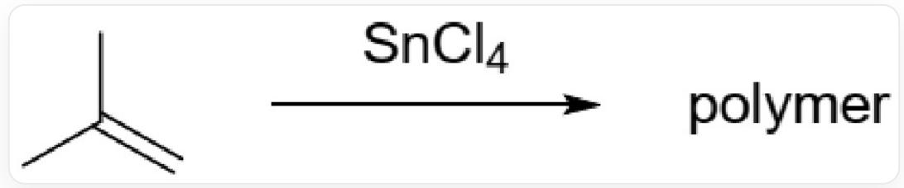

# 题目

双中心聚合反应可以以阳离子聚合的形式出现。2000年，捷克化学家报道了以下  $SnCl_4$  引发的聚合反应。

  
CC(C)=C在  $SnCl_{4}$  作用下产生聚合物

探究反应条件时，研究人员发现了如下现象：

(1)  $20^{\circ} \mathrm{C}$  下在  $A r$  气氛下进行反应, 反应可以较好地发生; 同样温度下在氧气氛下进行反应反应无法发生。  
(2) 如果体系中存在少量水，则反应产率下降。

有以下说法：

1.链引发的过程中有自由基参与  
2. 该反应产生的聚合物中，不存在直接与二级碳成键的二级碳  
3.该反应产生的是线性聚合物  
4.分别在  $-20^{\circ}C$  和  $20^{\circ}C$  下进行聚合，反应相同时间，  $20^{\circ}C$  下的产率更高但数均分子量更低  
5.体系中存在的水不会对链引发过程产生影响

选择以下说法全部正确的一项

A. 无说法全部正确的选项  
B. 1,2,4  
C. 2,5,4  
D. 3,4,5  
E. 2,3,4  
F.  $1,4,5$  
G. 1,2,4,5  
H. 2,3,5  
1,2,3  
J. 4,5  
K. 1,3,4  
L. 1,3,4,5

# 答案

正确答案: K

# 详细解析

该反应在氩气气氛下反应良好，但在氧气气氛下无法反应，氧气是自由基清除剂，由于聚合链增长过程是阳离子机理，则在引发时有自由基参与反应。

# CHECKPOINT

1 PTS

氧气是自由基清除剂，氧气气氛下无法反应，说明有自由基参与，说法1正确

存在少量水时会降低产率，说明有正离子参与，结合以上信息，可以得到以下链引发的机理：

$$
\begin{array}{l} \mathrm {S n C l} _ {4} + \bigtriangleup \longrightarrow \left[ \mathrm {S n C l} _ {4} \cdot \bigtriangleup \right] \\ \left[ \mathrm {S n C l} _ {4} \cdot \right] \longrightarrow \left[ \mathrm {S n C l} _ {4} \cdot \right] ^ {*} \\ \left[ \mathrm {S n C l} _ {4} \cdot \right] ^ {*} \longrightarrow \mathrm {S n C l} _ {4} ^ {-} + \mathrm {人} _ {\cdot} \\ 2 \mathrm {C H} _ {\mathrm {+}} ^ {\cdot} \longrightarrow \mathrm {C H} _ {\mathrm {+}} ^ {\cdot} \mathrm {C H} _ {\mathrm {+}} ^ {\cdot} \\ \end{array}
$$

$S n C l_{4}$  与异丁烯CC(C)=C接近，形成络合物，随后在二者之间发生单电子的转移，异丁烯双键向  $S n C l_{4}$  转移一个电子，产生异丁烯自由基正离子，随后两分子自由基正离子发生反应，生成C[C+](CC[C+](C)C)C，具有两个碳正离子反应活性中心，引发后续的双中心聚合

该机理中存在异丁烯自由基正离子C[C+](C)[C]关键中间体。

引发聚合的物种为C[C+]（CC[C+]（C)C）C，引发聚合的物种自身具有与二级碳成键的二级碳，因此反应产生的聚合物中也存在。

# CHECKPOINT

1 PTS

引发聚合的物种为C[C+](CC[C+](C)C)C

# CHECKPOINT

1 PTS

引发聚合的物种自身具有与二级碳成键的二级碳，因此反应产生的聚合物中也存在，说法2错误

异丁烯官能度为2，只能产生线性聚合物。

# CHECKPOINT

1 PTS

由于异丁烯官能度为2，因此产生的聚合物为线性，说法3正确

温度升高，反应速率增加，同时使得引发反应可以越过反应能垒，产率提高。同时升高温度会使得链终止速率增加导致数均分子量降低。

# CHECKPOINT

1 PTS

温度升高，反应速率增加，同时使得引发反应可以越过反应能垒，产率提高。

# CHECKPOINT

1 PTS

升高温度会使得链终止速率增加导致数均分子量降低，说法3正确

体系中的水会与  $SnCl_4$  反应，同时也会淬灭引发反应产生的碳正离子，会对引发反应产生影响。

# CHECKPOINT

1 PTS

水会与  $SnCl_{4}$  反应的同时淬灭碳正离子，会对引发反应产生影响，说法4错误

说法1，3，4正确，故选项K正确。