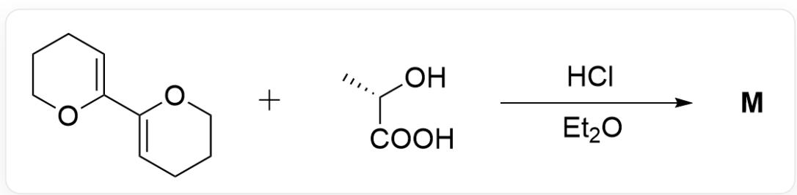
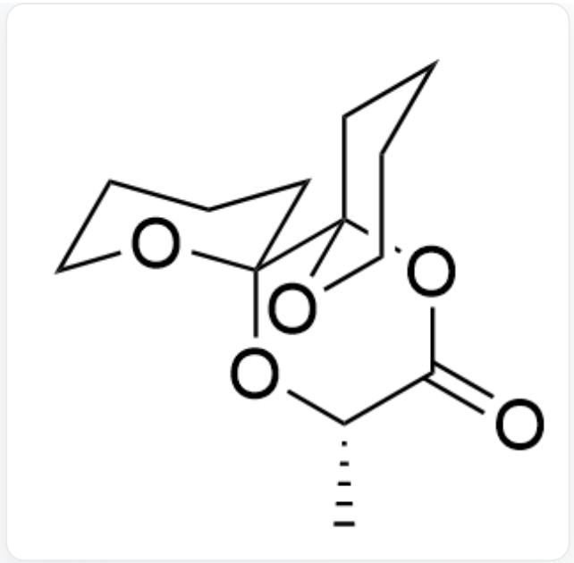
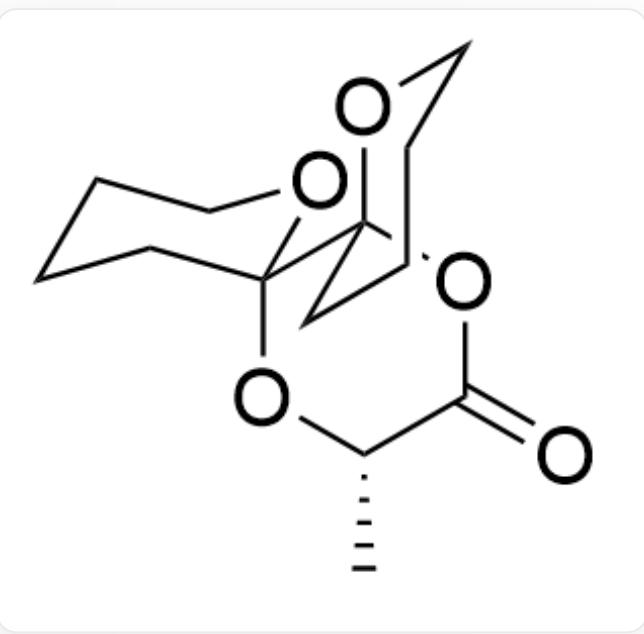
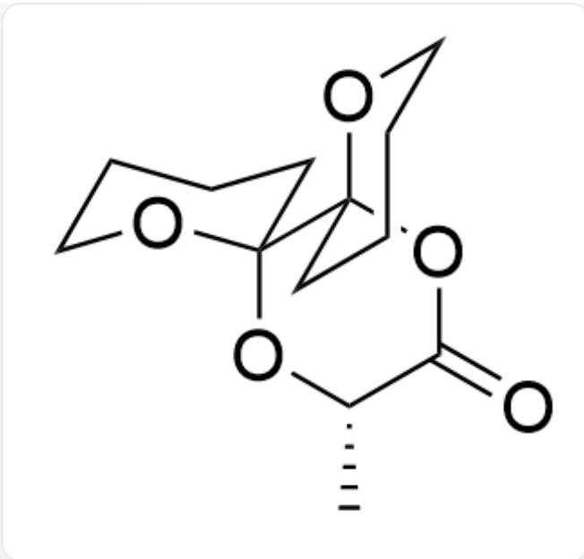
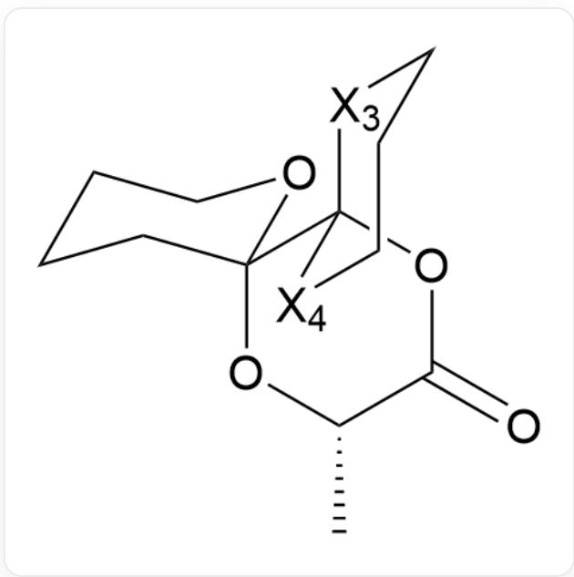
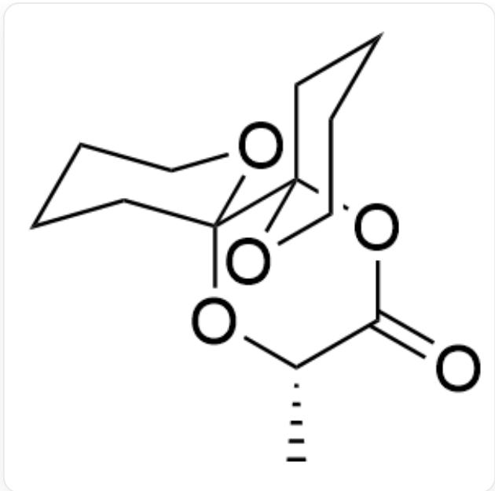

# Question

O[C@@H](C)C(O)=O.C1(C2=CCCCO2)=CCCCO1>CCOCC.Cl>[M], M is the reaction product

When the two substrates shown in the figure are placed in an ether solution of HCl, the reaction mainly yields the tricyclic product  $\mathbf{M}$ . Without considering enantiomers, give the structural formula of  $\mathbf{M}$ .

A. All other options are incorrect  
B.

O=C(O[C@]12OCCCCC2)[C@H](C)O[C@]31CCCCCO3

C.

$\mathrm{O = C(O[C@]12OCCCC2)[C@H](C)O[C@]31OCCCC3}$

D.

$\mathrm{O = C(O[C@]12CCCCO2)[C@H](C)O[C@]31CCCCO3}$

E.

$\mathrm{O = C(O[C@]12CCCCO2)[C@H](C)O[C@]31OCCCC}$

# Answer

Correct Answer: B

# Detailed Explanation

Acid-catalyzed, this condensation reaction is reversible, so it is speculated that  $\mathbf{M}$  exists in its most stable form.

# CHECKPOINT

1 PTS

Acid-catalyzed, this condensation reaction is reversible, so it is speculated that  $\mathbf{M}$  exists in its most stable form.

First, according to the hint of the tricyclic product, it is easy for us to think that this ketal structure can be formed through a simple two-step addition reaction.

# CHECKPOINT

1 PTS

First, according to the hint of the tricyclic product, it is easy for us to think that this ketal structure can be formed through a simple two-step addition reaction.

C[C@@H]1OC2(OCCCC2)C3(OC1=O)OCCCC3

CHECKPOINT

1 PTS

C[C@@H]1OC2(OCCCC2)C3(OC1=O)OCCCC3

Then analyze the stereoconformation. There are three chiral centers in this structure, so there should be 4 stereoisomers without considering enantiomers.

$\mathrm{O = C(O[C@]12OCCCC2)[C@H](C)O[C@]31[X2]CCC[X1]3}$

When  $O$  is located at the  $X_{1}$  or  $X_{2}$  position, its endocyclic anomeric effect is equivalent.

# CHECKPOINT

1 PTS

When  $\mathrm{O}$  is located at the  $\mathbf{X}_1$  or  $\mathbf{X}_2$  position, its endocyclic anomeric effect is equivalent.

But the difference is that when O is located at the  $\mathrm{X}_1$  position, the lone pair electrons of the upright bond O can fill into the antibonding orbital of the  $\mathrm{C} - \mathrm{X}_1$  bond, reducing the system energy through the exocyclic anomeric effect.

# CHECKPOINT

1 PTS

But the difference is that when O is located at the  $\mathrm{X}_1$  position, the lone pair electrons of the upright bond O can fill into the antibonding orbital of the  $\mathrm{C} - \mathrm{X}_1$  bond, reducing the system energy through the exocyclic anomeric effect.

  
$\mathrm{O = C(O[C@]12[X4]CCC[X3]2)[C@H](C)O[C@]31CCCCO3}$

Similarly,  $\mathrm{O}$  at the  $\mathrm{X}_4$  position has a set of exocyclic anomeric effects more than at the  $\mathrm{X}_3$  position.

# CHECKPOINT

1 PTS

Similarly,  $\mathrm{O}$  at the  $\mathrm{X}_4$  position has a set of exocyclic anomeric effects more than at the  $\mathrm{X}_3$  position

$\mathrm{O = C(O[C@]12OCCCC2)[C@H](C)O[C@]31CCCCO3}$

# CHECKPOINT

1 PTS

Final product: O=C(O[C@]12OCCCCC2)[C@H](C)O[C@]31CCCCCO3