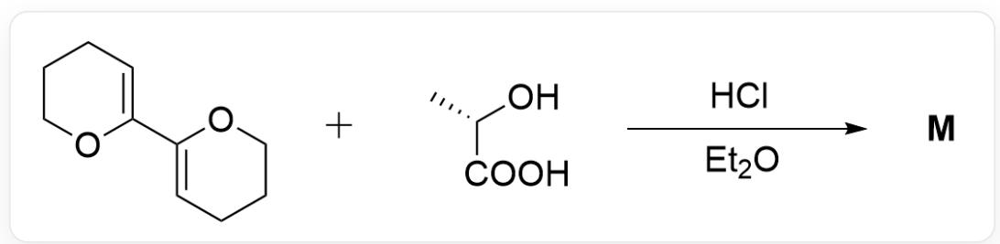
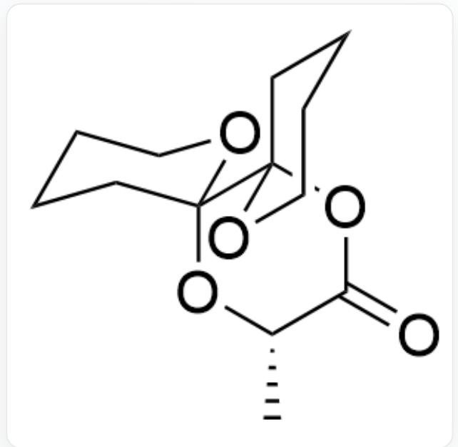
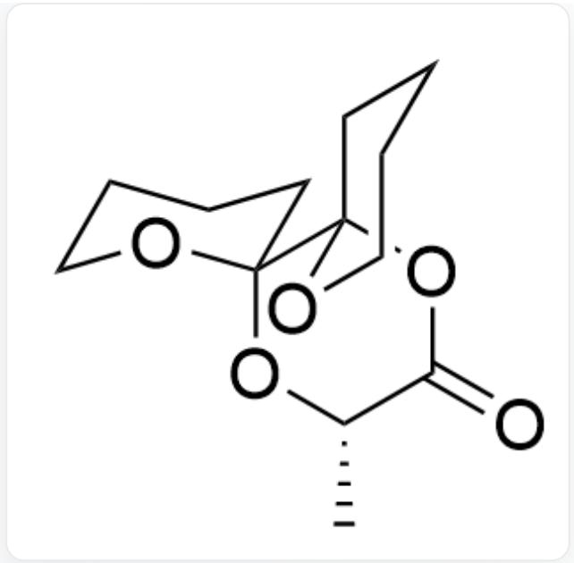
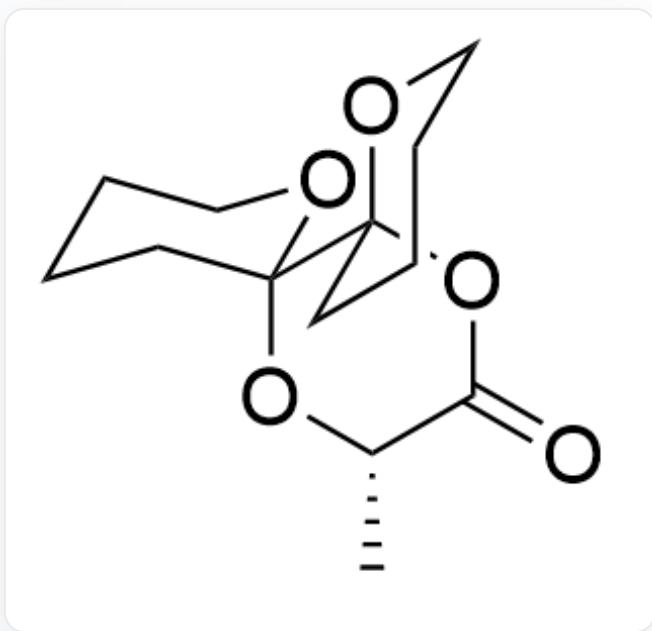
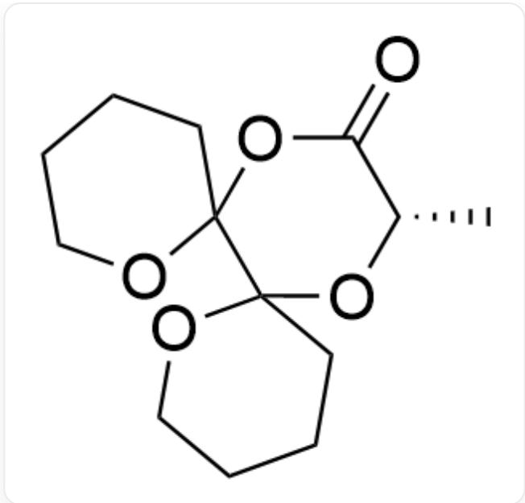
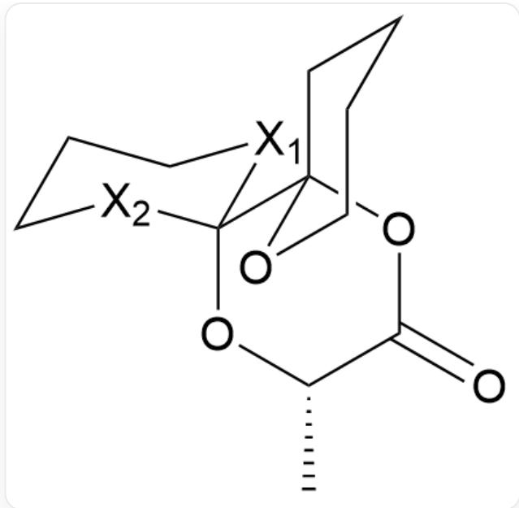
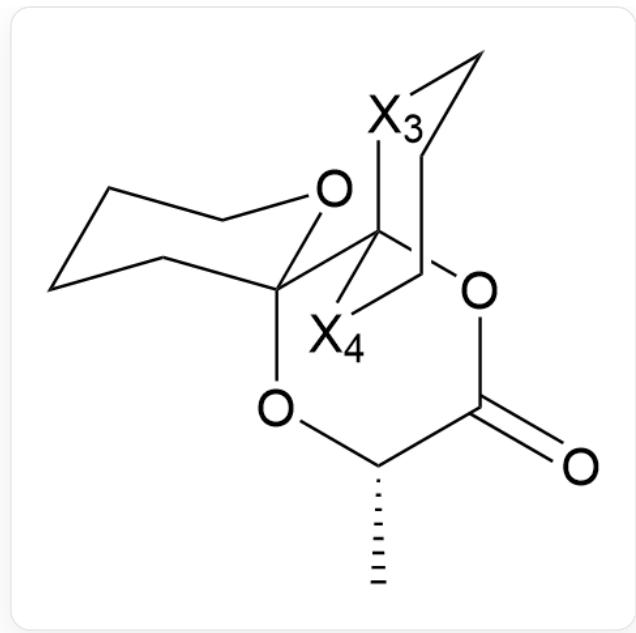

# 题目

  
O[C@@H](C)C(O)=O.C1(C2=CCCCO2)=CCCCCC01>CCOCC.Cl>[M],M是反应产物

将如图所示的两种底物置于  $\mathrm{HCl}$  的乙醚溶液中时, 反应主要得到三环产物  $\mathbf{M}$  。不考虑对映异构的条件下, 试给出  $\mathbf{M}$  的结构简式。

A. 其他选项均不正确  
B.

  
O=C(O[C@]12OCCCCC2)[C@H](C)O[C@]31CCCCCO3

C.

  
D.

$\mathrm{O = C(O[C@]12OCCCC2)[C@H](C)O[C@]31OCCCC3}$

  
E.

$\mathrm{O = C(O[C@]12CCCCO2)[C@H](C)O[C@]31CCCCO3}$

$\mathrm{O = C(O[C@]12CCCCO2)[C@H](C)O[C@]31OCCCC}$

# 答案

正确答案: B

# 详细解析

酸催化下, 该缩合反应是可逆的, 因此推测  $\mathrm{M}$  以其最稳定的形式存在

# CHECKPOINT

1 PTS

酸催化下，该缩合反应是可逆的，因此推测M以其最稳定的形式存在

首先根据三环产物的提示，我们很容易想到通过简单的两步加成反应可以形成该缩酮结构

# CHECKPOINT

1 PTS

首先根据三环产物的提示，我们很容易想到通过简单的两步加成反应可以形成该缩酮结构

C[C@@H]1OC2(OCCCC2)C3(OC1=O)OCCCC3

CHECKPOINT

1 PTS

C[C@@H]1OC2(OCCCC2)C3(OC1=O)OCCCC3

接着分析立体构象。该结构中有三个手性中心，因此在不考虑对映异构的情况下应当有4种立体异构体。

$\mathrm{O = C(O[C@]12OCCCC2)[C@H](C)O[C@]31[X2]CCC[X1]3}$

O位于  $\mathrm{X}_{1}$  或  $\mathrm{X}_{2}$  位置时，其环内异头碳效应相当。

# CHECKPOINT

1 PTS

O位于  $\mathrm{X}_{1}$  或  $\mathrm{X}_{2}$  位置时，其环内异头碳效应相当。

但不同的是当O位于  $\mathrm{X}_{1}$  位置时，直立键O的孤对电子能填入C－  $\mathrm{X}_{1}$  键的反键轨道，通过环外异头碳效应降低了体系能量。

# CHECKPOINT

1 PTS

但不同的是当O位于  $\mathrm{X}_{1}$  位置时，直立键O的孤对电子能填入C－  $\mathrm{X}_{1}$  键的反键轨道，通过环外异头碳效应降低了体系能量。

$\mathrm{O = C(O[C@]12[X4]CCC[X3]2)[C@H](C)O[C@]31CCCCO3}$

同理，O位于  $\mathrm{X}_4$  位置比  $\mathrm{X}_3$  位置多一组环外异头碳效应

# CHECKPOINT

1 PTS

同理，O位于  $\mathrm{X}_4$  位置比  $\mathrm{X}_3$  位置多一组环外异头碳效应

$\mathrm{O = C(O[C@]12OCCCC2)[C@H](C)O[C@]31CCCCO3}$

# CHECKPOINT

1 PTS

最终产物：O=C(O[C@]12OCCCCC2)[C@H](C)O[C@]31CCCCCO3