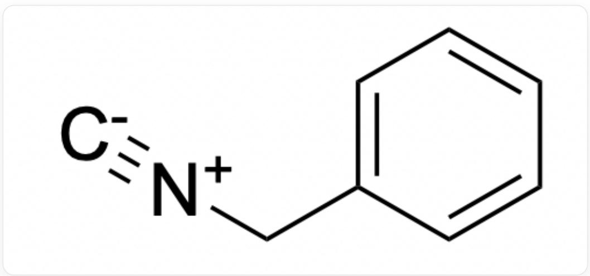
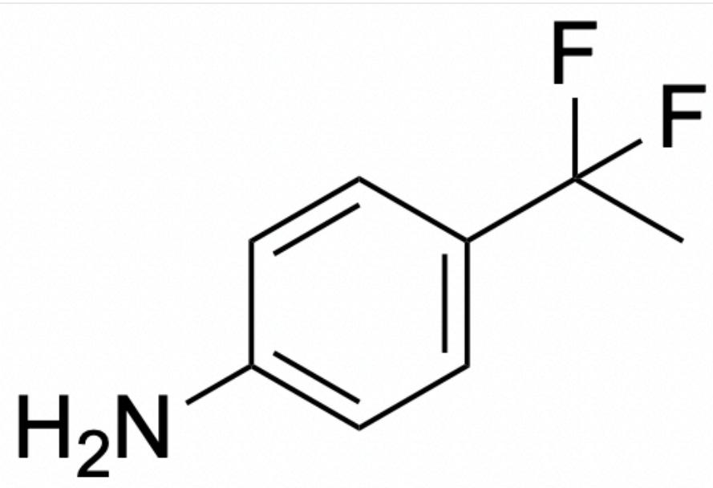
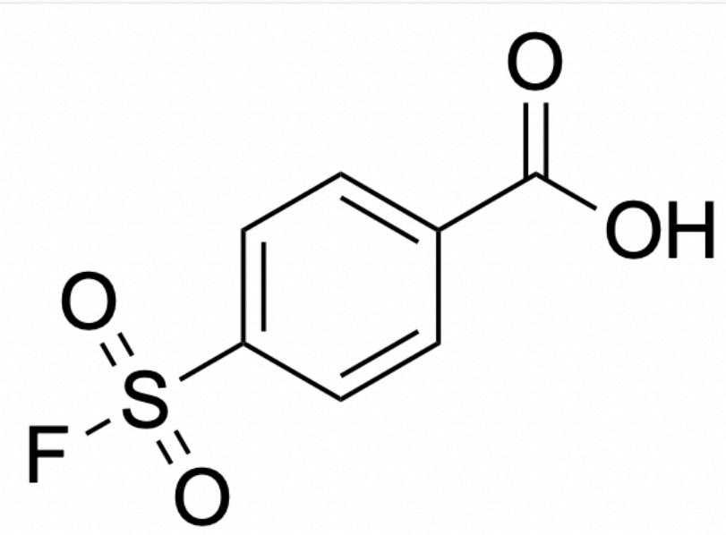
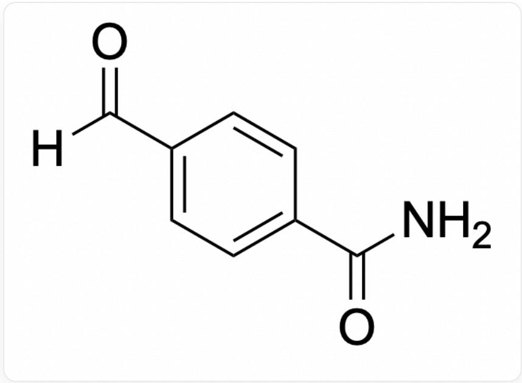
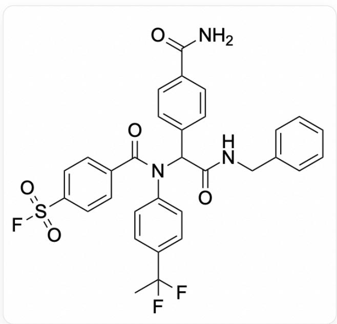

# Question

Students in a medicinal chemistry laboratory plan to use multicomponent reaction-based combinatorial chemistry to synthesize covalent compound libraries. The synthesis involves manual labeling and placement of reaction materials, followed by automated dispensing for batch addition. All reactants are grouped according to the functional groups involved in the multicomponent reaction and added to the reaction system in batches. Each parallel addition contains dozens of compounds with one type of functional group involved in the multicomponent reaction, and the covalent warhead is fixed on one of the compound components. Ultimately, a single experiment will yield a set of compounds with similar scaffolds but containing various different substituents and multiple different covalent warheads.

In one synthesis, the reactants in the reaction plan for one of the compounds are as follows:

1.

  
[ \text{[C-]#[N+]CC1} = \text{CC} = \text{CC} = \text{C1} ]

2.

  
FC(C)(F)C1=CC=C(N)C=C1

3.

  
$\mathrm{O = S(C1 = CC = C(C(O) = O)C = C1)(F) = O}$

4.

$$
O = C (N) C 1 = C C = C (C ([ H ]) = O) C = C 1
$$

The H-NMR characterization results of the product are:

`1H NMR (400 MHz, DMSO) δ 8.78 (t, J = 5.9 Hz, 1H), 7.87 (s, 1H), 7.63 (d, J = 8.1 Hz, 2H), 7.36 - 7.17 (m, 9H), 7.13 (d, J = 8.1 Hz, 2H), 6.23 (d, J = 17.9 Hz, 2H), 5.86 (dd, J = 16.8, 10.3 Hz, 1H), 5.60 (dd, J = 10.3, 2.4 Hz, 1H), 4.35 (d, J = 5.8 Hz, 2H), 1.77 (s, 1H), 1.72 (s, 2H), 1.67 (s, 1H).

After LCMS characterization, the molecular weight of the product was found to be 477.

The product molecule contains only one type of covalent warhead.

Hint: Acrylamide is also a common covalent warhead, and errors in feeding materials sometimes occur in experiments.

Please select the correct statement from the following:

A. None of the other options are correct  
B. The product molecule is

$$
O = S (C 1 = C C = C (C (N (C (C 2 = C C = C (C (N) = O) C = C 2) C (N C C 3 = C C = C C = C 3) = O) C 4 = C C = C (C (F
$$

$$
(F) C) C = C 4) = O) C = C 1) (F) = O
$$

C. The protein residue covalently bound to the product molecule may be Cys, and the labeling process involves the formation of S-S bonds.  
D. The protein residue covalently bound to the product molecule may be Lys  
E. The product molecule has 28 carbon atoms.  
F. The actual product molecule involves only three components participating in the reaction.

# Answer

Correct Answer: A

# Detailed Explanation

If the Ugi reaction is carried out with the reactants specified in the problem, the product molecule corresponding to option B can be obtained:

$$
\begin{array}{l} O = S (C 1 = C C = C (C (N (C (C 2 = C C = C (C (N) = O) C = C 2) C (N C C 3 = C C = C C = C 3) = O) C 4 = C C = C (C (F) \\ (F) C) C = C 4) = O) C = C 1) (F) = O \\ \end{array}
$$

# CHECKPOINT

1 PTS

The theoretical product molecule is

$$
O = S (C 1 = C C = C (C (N (C (C 2 = C C = C (C (N) = O) C = C 2) C (N C C 3 = C C = C C = C 3) = O) C 4 = C C = C (C (F)
$$

$$
(F) C) C = C 4) = O) C = C 1) (F) = O
$$

# Key H-NMR Signal Analysis

- The signals at  $\delta 5.86$  (dd,  $J = 16.8$ ,  $10.3\mathrm{Hz}$ , 1H) and  $\delta 5.60$  (dd,  $J = 10.3$ ,  $2.4\mathrm{Hz}$ , 1H) are characteristic of a terminal alkene  $(-\mathrm{CH} = \mathrm{CH}_2)$ .  
- The signal at  $\delta 6.23$  (d, J = 17.9 Hz, 2H) likely corresponds to the amide  $-\mathrm{NH}_2$  of the aldehyde component.  
- The signal at  $\delta 4.35$  (d, J = 5.8 Hz, 2H) matches the  $\mathrm{CH}_2$  of the benzyl group, corresponding to the benzyl isocyanide.  
- The aromatic region shows a total of 13 protons, which is inconsistent with the theoretical product, possibly due to a missing phenyl ring.  
- The signal near  $\delta 1.7$  corresponds to methyl hydrogens from the amine component.

# CHECKPOINT

1 PTS

The product's H-NMR shows characteristic peaks of a terminal alkene  $(-\mathrm{CH} = \mathrm{CH}_2)$ , which is inconsistent with the theoretical product

The theoretical product has a calculated molecular weight of 609, which does not match the mass spectrometry results.

# CHECKPOINT

1 PTS

The theoretical product has a molecular weight of 609, which does not match the mass spectrometry data

Neither the H-NMR nor the mass spectrometry results align with the proposed product. Additionally, none of the reactants inherently possess a structure that could reasonably form a terminal alkene. Therefore, we must consider whether an experimental error occurred. Given the combinatorial chemistry workflow, multiple compounds with the same functional group are typically pooled and added simultaneously (often prepared as a molecular library in solution, e.g., in microplates). A common mistake in this process is the accidental addition of the wrong reagent during library preparation, leading to an incorrect product.

Based on the prominent terminal alkene signals in the H-NMR and the frequent use of covalent warheads such as acrylic acid/acrylamide, it is plausible that the fluorosulfonyl reagent was mistakenly replaced with acrylic acid.

# CHECKPOINT

1 PTS

Considering the H-NMR results and the combinatorial chemistry workflow, the fluorosulfonyl reagent may have been mistakenly replaced with acrylic acid or an alkenyl sulfone

If the carboxylic acid reactant is replaced with acrylic acid, the resulting product molecule is

  
NC(C(C=C1)=CC=C1C(C(NCC2=CC=CC=C2)=O)N(C3=CC=C(C=C3)C(F)(C)F)C(C=C)=O)=O

, which matches the mass spectrometry result of 477, confirming the hypothesis. In contrast, an alkenyl sulfone would have an excessively high molecular weight.

# CHECKPOINT

1 PTS

When the carboxylic acid reactant is replaced with acrylic acid, the product's molecular weight (477) matches the mass spectrometry data, supporting the hypothesis. An alkenyl sulfone would have an excessively high molecular weight and is unlikely

# CHECKPOINT

1 PTS

The final product molecule contains no sulfur atoms, ruling out option C

Based on this, we can conclude that four compounds participated in the reaction, making option F incorrect.

# CHECKPOINT

1 PTS

Four compounds participated in the reaction

The product molecule contains an acrylamide group as the covalent warhead, which primarily targets Cys residues.

# CHECKPOINT

1 PTS

Acrylamide-based covalent warheads primarily target Cys residues and generally do not react with Lys, making option D incorrect

The product contains a total of 27 carbon atoms, so option E is incorrect.

# CHECKPOINT

1 PTS

The product contains 27 carbon atoms, ruling out option E

Thus, none of the options are correct.