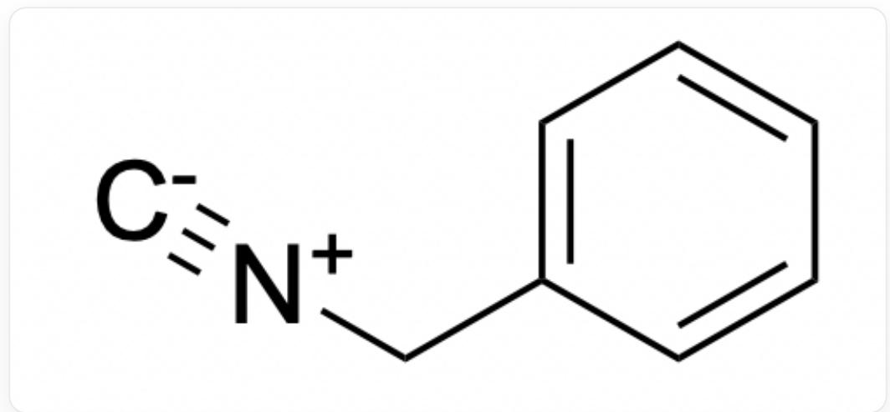
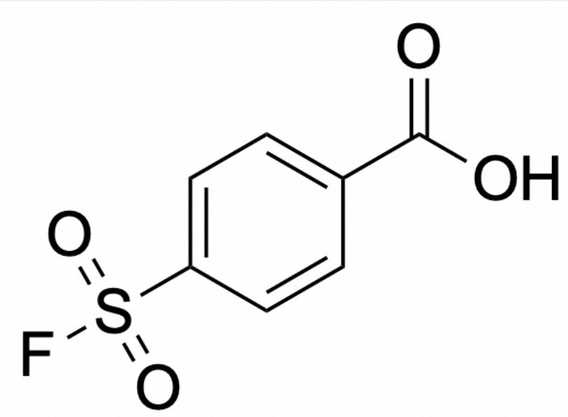
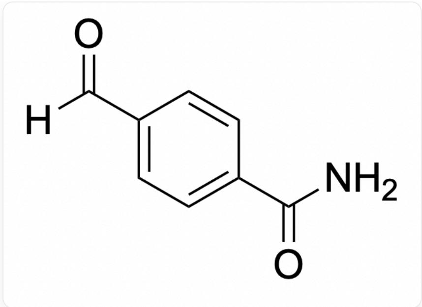
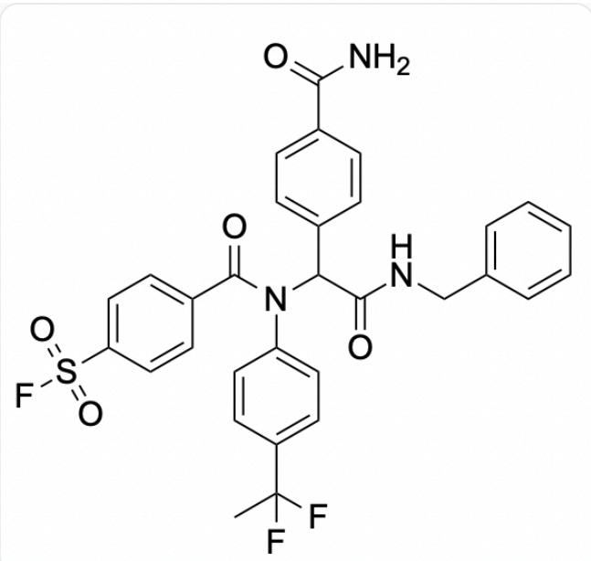
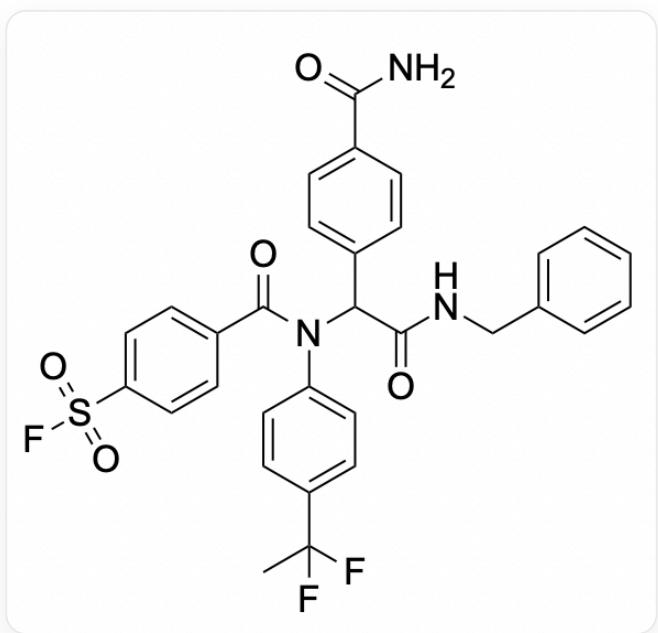
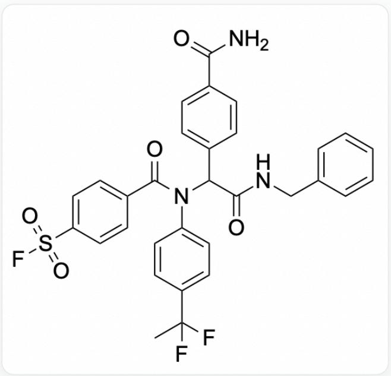
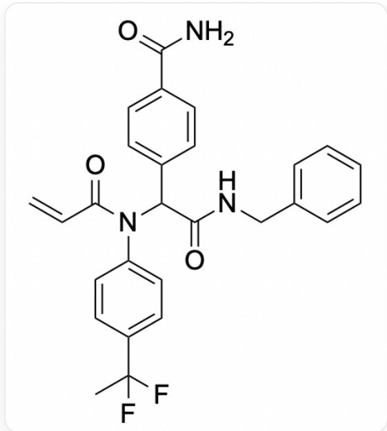

# 题目

某药物化学实验室同学计划用基于多组分反应的组合化学进行共价化合物库的合成，合成由人工标注并放置反应原料，然后在自动化设备辅助下批量加样进行。所有的反应物是按照参与多组分反应的官能团分组并分批加入反应体系的，每次平行加入含有参与多组分反应的一种官能团的数十种化合物，并且共价弹头固定位于其中的某一种化合物组分上。最终一次实验中会得到骨架相似而含有多种不同取代基、多种不同共价头的一组化合物。

在一次合成中，其中一个化合物的合成反应计划中的反应物分别为：

1.

  
[ \text{[C-]#[N+]CC1} = \text{CC} = \text{CC} = \text{C1} ]

2.

  
FC(C)(F)C1=CC=C(N)C=C1

3.

  
$\mathrm{O = S(C1 = CC = C(C(O) = O)C = C1)(F) = O}$

4.

$$
\mathrm {O} = \mathrm {C} (\mathrm {N}) \mathrm {C} 1 = \mathrm {C C} = \mathrm {C} (\mathrm {C} ([ \mathrm {H} ]) = \mathrm {O}) \mathrm {C} = \mathrm {C} 1
$$

产物的H-NMR表征结果为：

`1H NMR (400 MHz, DMSO) δ 8.78 (t, J = 5.9 Hz, 1H), 7.87 (s, 1H), 7.63 (d, J = 8.1 Hz, 2H), 7.36 - 7.17 (m, 9H), 7.13 (d, J = 8.1 Hz, 2H), 6.23 (d, J = 17.9 Hz, 2H), 5.86 (dd, J = 16.8, 10.3 Hz, 1H), 5.60 (dd, J = 10.3, 2.4 Hz, 1H), 4.35 (d, J = 5.8 Hz, 2H), 1.77 (s, 1H), 1.72 (s, 2H), 1.67 (s, 1H)`。

产物经过LCMS表征后，发现分子量是477。

产物分子中仅包含了一种共价弹头。

提示：丙烯酰胺也是一种常见的共价弹头，实验中有时会出现加料错误的问题。

请选出下列说法中正确的选项:

A. 其他选项均不正确  
B. 产物分子为

$$
O = S (C 1 = C C = C (C (N (C (C 2 = C C = C (C (N) = O) C = C 2) C (N C C 3 = C C = C C = C 3) = O) C 4 = C C = C (C (F
$$

$$
(F) C) C = C 4) = O) C = C 1) (F) = O
$$

C. 产物分子共价结合的蛋白残基可能是Cys, 且标记过程涉及S-S键的形成  
D. 产物分子共价结合的蛋白残基可能是Lys  
E. 产物分子有28个碳原子  
F. 产物分子实际只有三个组分参与反应

# 答案

正确答案: A

# 详细解析

如果按照题目中的反应物进行Ugi反应，可以得到选项B的产物分子

$$
\begin{array}{l} O = S (C 1 = C C = C (C (N (C (C 2 = C C = C (C (N) = O) C = C 2) C (N C C 3 = C C = C C = C 3) = O) C 4 = C C = C (C (F \\ (F) C) C = C 4) = O) C = C 1) (F) = O \\ \end{array}
$$

# CHECKPOINT

1 PTS

理论上的产物分子为

$$
O = S (C 1 = C C = C (C (N (C (C 2 = C C = C (C (N) = O) C = C 2) C (N C C 3 = C C = C C = C 3) = O) C 4 = C C = C (C (F)
$$

$$
(F) C) C = C 4) = O) C = C 1) (F) = O
$$

# H-NMR关键核磁信号分析

-  $\delta 5.86$  (dd, J = 16.8, 10.3 Hz, 1H) 和  $\delta 5.60$  (dd, J = 10.3, 2.4 Hz, 1H) 的信号模式典型的是末端烯烃(  $-\mathrm{CH} = \mathrm{CH}_2$  )。  
-  $\delta 6.23$  (d, J = 17.9 Hz, 2H)可能是酰胺的  $-\mathrm{NH}_2$  ，对应醛组分。  
-  $\delta 4.35$  (d, J = 5.8 Hz, 2H)对应于苄基的  $\mathrm{CH}_2$  ，对应苄异腈。  
- 芳香区累计有13个H，与理论产物不符，可能少了苯环。  
-  $\delta$  1.7附近为甲基氢，对应胺组分。

# CHECKPOINT

1 PTS

产物H-NMR有典型的末端烯烃（-CH=CH2）的特征峰，与理论上的产物不一致

理论上的产物分子可以计算分子量为609，与质谱结果不一致。

# CHECKPOINT

1 PTS

理论上的产物分子量为609，与质谱结果无法对应

H-NMR与质谱结果都无法与上述产物对应，且注意到这几种反应物本身并不存在能产生末端烯烃的合理结构。因此我们需要推理是否在实验过程本身存在失误。考虑到组合化学的实验模式，含有同一官能团的多个不同化合物被一批加入，这一过程需要先将不同化合物准备成分子库的形式（常见的是在孔板中配成溶液）。此过程中一种常见的失误是做组合库时，操作失误导致加错原料，自然目标产物会被张冠李戴。

结合H-NMR中明显的末端烯烃，以及常用共价反应弹头丙烯酸/丙烯酰胺，猜测可能是氟磺酰原料加错成了丙烯酸。

# CHECKPOINT

1 PTS

从H-NMR的结果和组合化学的实验流程推测，可能是氟磺酰原料加错成了丙烯酸或者烯基砜等

如果将原料酸分子替换成丙烯酸，产物分子为

  
NC(C(C=C1)=CC=C1C(C(NCC2=CC=CC=C2)=O)N(C3=CC=C(C=C3)C(F)(C)F)C(C=C)=O)=O

，与质谱结果477对应上，猜测正确；而烯基砜分子量过大，难以满足

# CHECKPOINT

1 PTS

原料酸分子替换成丙烯酸时，产物分子量与质谱结果477对应，猜测正确；而烯基砜分子量过大，难以满足

# CHECKPOINT

1 PTS

最终产物分子中没有硫原子，C错误

据此我们可以判断仍然有四个化合物参与了反应，F选项错误。

# CHECKPOINT

1 PTS

有4个化合物参与了反应

此时产物分子的共价反应官能团是丙烯酰胺，此类官能团主要靶向Cys残基。

# CHECKPOINT

1 PTS

丙烯酰胺这类共价弹头主要靶向Cys残基，一般不与Lys反应，D错误

产物一共有27个碳原子，E错误。

# CHECKPOINT

1 PTS

产物一共有27个碳原子，E错误

故所有选项均不正确。