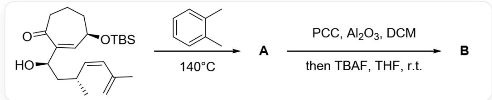
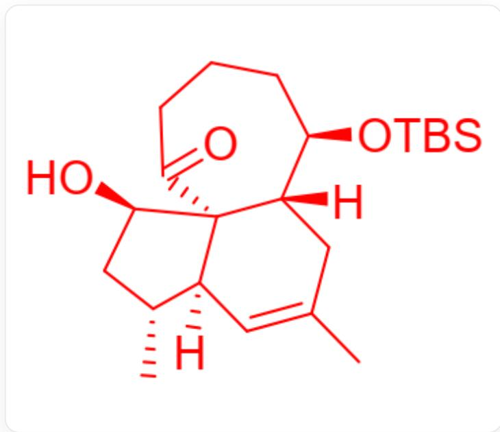
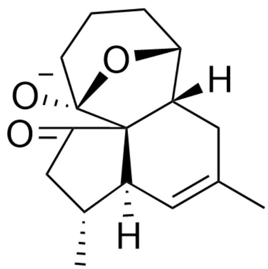
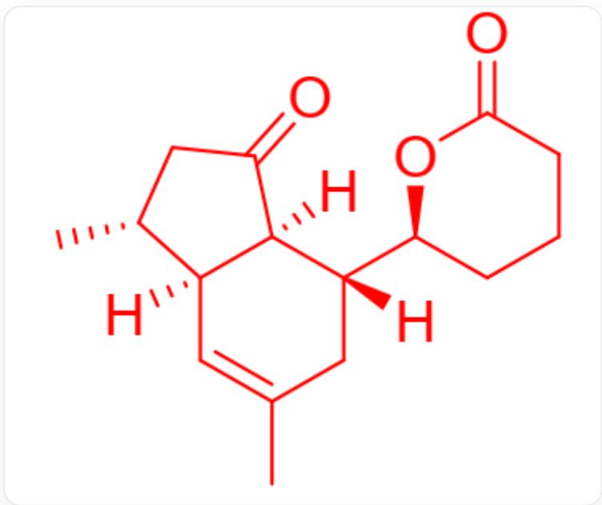

# Question

This question does not require stereochemistry. Figure 1 shows a two-step reaction.

Fig. 1, the figure shows a two-step sequential reaction. The first step, described by SMILES, is:  
  
C=C(C)/C=C\[C@H](C)C[C@H](C1=C[C@@H](CCCC1=O)O[Si](C)(C)C(C)(C)C)O> [A], reaction  
conditions: o-xylene,  $140^{\circ}\mathrm{C}$ . The second step, described by SMILES, is: [A]>>>[B], reaction conditions: PCC  
(pyridinium chlorochromate),  $\mathrm{Al}_{2}\mathrm{O}_{3}$  (aluminum oxide), DCM (dichloromethane), then TBAF (tetrabutylammonium fluoride), THF (tetrahydrofuran), room temperature.

Deduce the structural formula of  $\mathbf{A}$ .

In the subsequent transformation of  $\mathbf{A}$ , an unexpected reaction occurred, yielding compound  $\mathbf{B}$ . It is known that  $\mathbf{B}$  contains only 3 rings, and  $\mathbf{B}$  does not contain a hydroxyl group. Deduce the structural formula of  $\mathbf{B}$  and the structural formula of the key intermediate in the process from  $\mathbf{A}$  to  $\mathbf{B}$ .

There are the following statements:

1. A does not contain a five-membered ring.  
2. A contains four rings of seven members or less.  
3. A carbon-carbon single bond is formed in the process of generating  $\mathbf{B}$ .  
4. B is an  $\alpha, \beta$ -unsaturated ketone.

Among the following options, the one with all correct statements and the most correct statements is:

A. All other options are incorrect

B. 1  
C. 2  
D. 3  
E. 4  
F. 1,2  
G. 1,3  
H. 1,4  
1. 2,3  
J. 2,4  
K. 3,4  
L. 1,2,3  
M. 1,2,4  
N. 2,3,4  
O. 1,2,3,4

# Answer

Correct Answer: A

# Detailed Explanation

The first step, high temperature, is the classical D-A reaction condition. The molecule contains exactly one dienophile and one diene, and the two undergo a D-A reaction to form compound A, as shown in Figure 2. Statement 1 is incorrect, and statement 2 is incorrect.

  
Fig. 2, The molecule in the figure is described by SMILES as: CC1=C[C@@]2(C)[C@H](C)C[C@H] ([C@]32C(=O)CCC[C@H][[C@]3(C)C1)O[Si](C)(C)C(C)(C)O

CHECKPOINT

1 PTS

Intramolecular D-A reaction occurs at high temperature to generate the tricyclic product A

# CHECKPOINT

1 PTS

A is described by SMILES as:CC1=C[C@@]2(C)[C@H](C)C[C@H]([C@]32C(=O)CCC[C@H] ([C@]3(C)C1)O[Si](C)(C)C(C)(C)C)O

In the second step, PCC is a classical hydroxyl oxidizing agent, oxidizing the unprotected hydroxyl group in A to a carbonyl group. TBAF deprotects the silicon-containing protecting group, forming a hydroxyl anion. Generally, the product can be obtained after workup. However, the question mentions that an unexpected reaction occurred, and the product B does not contain a hydroxyl group, indicating that the hydroxyl group underwent further reaction. Consider possible reactions: The carbanion generated by the retro-aldol condensation/Michael addition reaction is unstable, which is excluded. It is found that the hydroxyl anion can attack the carbonyl group on the seven-membered ring, forming a stable five-membered and six-membered bridged ring structure. The structure of this intermediate is shown in Figure 3.

  
Fig. 3, The molecule in the figure is represented by SMILES as:CC(C[C@]1([H])
[ \text{C}@\text{@}]23[\text{C}@\text{@}]4([O-])\text{CCC}[\text{C}@\text{H}]104)=\text{C}[\text{C}@\text{@}]3([\text{H}])[\text{C}@\text{H}](\text{C})\text{CC}2=\text{O} ]

# CHECKPOINT

1 PTS

After removing the protecting group, the hydroxyl group attacks the carbonyl group on the seven-membered ring to form a bridged ring intermediate.

# CHECKPOINT

1 PTS

The structure of the intermediate is described by SMILES as:CC(C[C@]1[H])

[C@@]23[C@@]4([O-])CCC[C@H]1O4)=C[C@@]3([H])[C@H](C)CC2=O

At the same time, considering that there are only three rings in  $\mathbf{B}$ , it indicates that carbon-carbon bond cleavage further occurred, reducing the number of rings. The hydroxyl anion formed by the attacked carbonyl group can further undergo an elimination reaction to generate a stable enolate anion, and product  $\mathbf{B}$  is obtained after workup, the structure of which is shown in Figure 4.

  
Fig. 4, CC1=C[C@]2([C@@H](CC([C@]2([C@](C1)([C@@H]3CCCC(C03)=O)[H])(H)=O)C)[H]

# CHECKPOINT

1 PTS

A retro-aldol condensation reaction occurs to generate a stable enolate anion, and product  $\mathbf{B}$  is obtained after workup

# CHECKPOINT

1 PTS

Product

B,

described

by

SMILES

as:CC1=C[C@]2([C@@H](CC([C@]2([C@](C1)

([C@@H]3CCCC(C03)=O)[H])[H])=O)C)[H]

In the process of generating  $\mathbf{B}$ , a carbon-oxygen double bond and a carbon-oxygen single bond are formed, and a carbon-carbon single bond is broken, but no carbon-carbon single bond is formed, so statement 3 is incorrect.  $\mathbf{B}$  does not contain conjugated double bonds, so statement 4 is incorrect. Therefore, all the above statements are incorrect, and the answer is  $A$