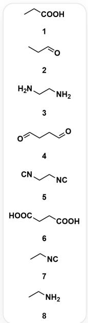
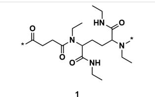
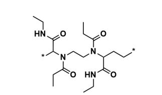
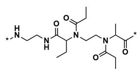
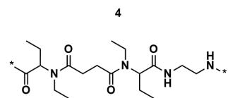
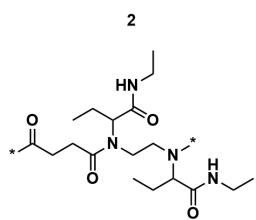
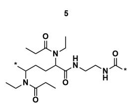

# 题目

以下一系列单体分子  $A_{i}$ ，其彼此之间可以发生聚合反应：

单体分子有以下几种：1. CCC(O)=O 2. CCC=O 3. NCCN 4. O=CCCC=O 5. [C-]#[N+]CC[N+]#[C-] 6.

$\mathrm{O = C(CCC(O) = O)O7}$  CC[N++#[C-]8.NCC

以下一系列高分子聚合物的重复单元  $P_{j}$ ，是由以上单体分子反应得到的（图中  $\divideontimes$  表示重复单元片段在聚合物中的连接位点）：

  
3

  
6

聚合物的重复单元有以下几种：1.  $O = C([^{*}])$  CCC(N(CC)C(CCC(N(CC)[*])C(NCC)=O)C(NCC)=O)=O 2.

$$
[ ^ {*} ] N C C N C (C (C C) N (C (C C) = O) C C N (C (C ([ ^ {*} ]) = O) C) C (C C) = O) = O 3. O = C ([ ^ {*} ]) C C C (N (C C N (C (C C) C (N C C) = O)
$$

$$
[ ^ {*} ]) C (C (N C C) = O) C C) = O 4. O = C (N C C) C ([ ^ {*} ]) N (C (C C) = O) C C N (C (C (N C C) = O) C C [ ^ {*} ]) C (C C) = O 5.
$$

$$
O = C ([ ^ {*} ]) C (C C) N (C (C C C (N (C C) C (C (N C C N [ ^ {*} ]) = O)) C C) = O) C C 6.
$$

CCN(C(CC)=O)C(CCC(N(CC)C(CC)=O)C(NCCNC([*])=O)=O)[*]，其中[*]表示重复单元在聚合物中的连接位点

对于每种聚合物，计算  $z_{j}$  的值：

$$
z _ {j} = \prod_ {i \in p _ {j}} A _ {i} \times \prod_ {i \not \in p _ {j}} \frac {1}{A _ {i}}
$$

其中：

-  $p_{j}$  : 在重复单元  $P_{j}$  中存在的单体集合  
-  $A_{i}$  ：单体  $A_{i}$  的序号

最终，计算  $z_{j}$  的总和：

$$
S = \sum_ {j} z _ {j}
$$

选择正确的选项，要求最终结果保留3位有效数字，选择与结果的误差在  $1\%$  以内的选项，否则选择选项A:其他选项均不正确。

A. 其他选项均不正确  
B. 52.9  
C. 44.7  
D. 10.1  
E. 5.31  
F. 2.18  
G. 0.454  
H. 55.8  
1. 70.5  
J. 91.5  
K. 150

# 答案

正确答案: B

# 详细解析

观察聚合物的结构我们发现，每个复杂的聚合物重复单元是通过其对应的四种不同单体，经由Ugi多组分聚合反应生成的。

# CHECKPOINT

2 PTS

每种聚合物是由四个单体分子经过Ugi多组分聚合生成的

<table><tr><td>聚合物重复单元</td><td>对应的单体集合 (pj)</td><td>单体序号</td></tr><tr><td>P1</td><td>A4,A6,A7,A8</td><td>{4,6,7,8}</td></tr><tr><td>P2</td><td>A1,A2,A3,A5</td><td>{1,2,3,5}</td></tr><tr><td>P3</td><td>A2,A3,A6,A7</td><td>{2,3,6,7}</td></tr><tr><td>P4</td><td>A1,A3,A4,A7</td><td>{1,3,4,7}</td></tr><tr><td>P5</td><td>A2,A5,A6,A8</td><td>{2,5,6,8}</td></tr><tr><td>P6</td><td>A1,A4,A5,A8</td><td>{1,4,5,8}</td></tr></table>

# CHECKPOINT

1 PTS

$P_{1}$  的对应单体序号为4,6,7,8

# CHECKPOINT

1 PTS

$P_{2}$  的对应单体序号为1,2,3,5

# CHECKPOINT

1 PTS

$P_{3}$  的对应单体序号为2,3,6,7

# CHECKPOINT

1 PTS

$P_{4}$  的对应单体序号为1,3,4,7

# CHECKPOINT

1 PTS

$P_{5}$  的对应单体序号为2,5,6,8

# CHECKPOINT

1 PTS

$P_{6}$  的对应单体序号为1,4,5,8

我们将使用以下公式计算每个  $z_{j}$  的值。公式中， $A_{i}$  代表单体的序号， $p_{j}$  是构成聚合物  $P_{j}$  的单体序号集合，我们假设每个单体在反应中只出现一次（即  $n_{i,j} = 1$ ）。

$$
z _ {j} = \frac {\prod_ {i \in p _ {j}} A _ {i}}{\prod_ {i \notin p _ {j}} A _ {i}}
$$

$$
z _ {1} = \frac {4 \times 6 \times 7 \times 8}{1 \times 2 \times 3 \times 5} = \frac {1 3 4 4}{3 0} \approx 4 4. 8 0 0 0
$$

# CHECKPOINT

0.5 PTS

$$
z _ {1} = 4 4. 8 0 0 0
$$

$$
z _ {2} = \frac {1 \times 2 \times 3 \times 5}{4 \times 6 \times 7 \times 8} = \frac {3 0}{1 3 4 4} \approx 0. 0 2 2 3
$$

# CHECKPOINT

0.5 PTS

$$
z _ {2} = 0. 0 2 2 3
$$

$$
z _ {3} = \frac {2 \times 3 \times 6 \times 7}{1 \times 4 \times 5 \times 8} = \frac {2 5 2}{1 6 0} = 1. 5 7 5 0
$$

# CHECKPOINT

0.5 PTS

$$
z _ {3} = 1. 5 7 5 0
$$

$$
z _ {4} = \frac {1 \times 3 \times 4 \times 7}{2 \times 5 \times 6 \times 8} = \frac {8 4}{4 8 0} = 0. 1 7 5 0
$$

# CHECKPOINT

0.5 PTS

$$
z _ {4} = 0. 1 7 5 0
$$

$$
z _ {5} = \frac {2 \times 5 \times 6 \times 8}{1 \times 3 \times 4 \times 7} = \frac {4 8 0}{8 4} \approx 5. 7 1 4 3
$$

# CHECKPOINT

0.5 PTS

$$
z _ {5} = 5. 7 1 4 3
$$

$$
z _ {6} = \frac {1 \times 4 \times 5 \times 8}{2 \times 3 \times 6 \times 7} = \frac {1 6 0}{2 5 2} \approx 0. 6 3 4 9
$$

# CHECKPOINT

0.5 PTS

$$
z _ {6} = 0. 6 3 4 9
$$

最终，计算：

$$
S = \sum_ {j = 1} ^ {6} z _ {j} = z _ {1} + z _ {2} + z _ {3} + z _ {4} + z _ {5} + z _ {6}
$$

$$
S \approx 4 4. 8 0 0 0 + 0. 0 2 2 3 + 1. 5 7 5 0 + 0. 1 7 5 0 + 5. 7 1 4 3 + 0. 6 3 4 9
$$

$$
S \approx 5 2. 9
$$

# CHECKPOINT

0.5 PTS

$$
S \approx 5 2. 9
$$