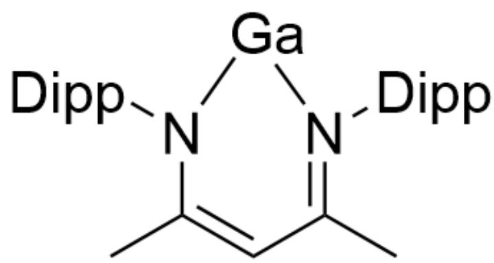
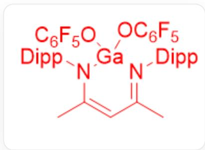
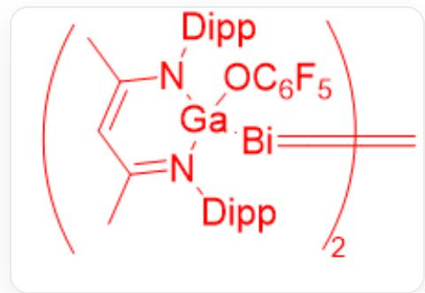

# Question

There is a compound Bi called  $\mathbf{Y}$ :

The cation of  $\mathbf{Y}$  is  $\mathrm{Bi}^{3+}$ , and  $\mathbf{Y}$  contains only four elements and one anion. The mass fraction of Bi in  $\mathbf{Y}$  is  $27.57\%$ , and the mass fraction of C in  $\mathbf{Y}$  is  $28.49\%$ .

$\mathbf{Y}$  can react with the Ga compound  $\mathbf{X}$  shown in the figure to obtain a compound containing a  $-Bi = Bi-$  bonded structure, and another product containing the anion of  $\mathbf{Y}$ .

Hint:

1. Generally, the ligands in compounds containing  $Bi = Bi$  double bonds are not electrically neutral.  
2. The 2,6-diisopropylphenyl (i.e., Dipp) group connected to the nitrogen atom in  $\mathbf{X}$  has a very large steric volume.

$$
C C 1 = [ N ] (C 2 = C (C (C) C) C = C C = C 2 C (C) C) [ G a ] N (C 3 = C (C (C) C) C = C C = C 3 C (C) C) C (C) = C 1
$$

Which of the following statements are correct:

1.  $\mathbf{Y}$  contains 9 chlorine atoms  
2. All  $Ga$  in the products are 4-coordinated  
3. The compound containing  $Bi = Bi$  double bonds contains  $Ga - O$  bonds

4. The byproduct without  $Bi$  contains 40 carbon atoms  
5. The stoichiometric ratio of  $\mathbf{Y}$  to  $\mathbf{X}$  is  $1:1$

A. All other options are incorrect  
B. 1.2.3.  
C. 1.3.  
D. 2.3.  
E. 1.3.4.  
F. 3.4.  
G. 3.5.  
H. 1.5.  
1. 2.5.  
J. 1.2.4.

# Answer

Correct Answer: D

# Detailed Explanation

According to the question, assuming  $\mathbf{Y}$  contains one Bi, the number of carbons it contains is:

$$
M _ {Y} = \frac {2 0 9}{0 . 2 7 5 7} \approx 7 5 8 \mathrm {g / m o l}
$$

$$
m _ {C} = 7 5 8 \times 0. 2 8 4 9 \approx 2 1 6 \mathrm {g / m o l}
$$

$$
n _ {C} = \frac {2 1 6}{1 2} = 1 8
$$

# CHECKPOINT

1 PTS

Assuming  $\mathbf{Y}$  contains one Bi, it contains 18 carbons

The remaining molecular weight is:  $758 - 18 \times 12 - 209 = 333$

Consider the element to be  $Bi$ , which may have three identical ligands, each ligand having 6  $C$ s, and a remaining molecular weight of 111, which may be 5  $F$ s and one  $O$ .

# CHECKPOINT

1 PTS

The remaining each ligand has 5  $F$ s and one  $O$

Therefore,  $\mathbf{Y}$  is  $Bi(OC_{6}F_{5})_{3}$

# CHECKPOINT

2 PTS

$\mathbf{Y}$  is  $Bi(OC_6F_5)_3$

Therefore, 1 is wrong.

Consider the change in valence: According to the bond structure,  $Bi$  is in the +1 valence state and is reduced; in the substrate  $\mathbf{X}$ ,  $Ga$  is in the +1 valence state, so it should act as a reducing agent and is generally oxidized to the stable oxidation state  $Ga(III)$ . To balance the compound's charge, considering that the product contains the anion of  $\mathbf{Y}$ , the oxidation product should be  $GaL(OC_{6}F_{5})_{2}$ , containing 41 carbon atoms, so statement 4 is wrong.

# CHECKPOINT

1 PTS

$Bi$  is in the  $+1$  valence state and is reduced

# CHECKPOINT

1 PTS

$Ga$  is in the  $+1$  valence state, so it should act as a reducing agent and is generally oxidized to the stable oxidation state  $Ga(III)$

# CHECKPOINT

1 PTS

The oxidation product should be  $GaL(OC_{6}F_{5})_{2}$

Note that the premise "Dipp" is a structure with large steric hindrance. If the organic ligand  $L$  of  $Ga$  in  $\mathbf{X}$  is directly coordinated with the  $Bi = Bi$  double bond to form  $L - Bi = Bi - L$ , then the spatial distance between the two ligands  $L$  is too short, so it cannot be formed due to spatial hindrance. Therefore, the ligand  $L$  can only continue to coordinate with  $Ga$ ; therefore, the  $Bi = Bi$  double bond is likely to be connected to  $Ga$ . Therefore, the structure of the reduction product is  $L(OC_{6}F_{5})Ga - Bi = Bi - Ga(OC_{6}F_{5})L$ . This structure contains an  $O - Ga$  bond, so statement 3 is correct.

# CHECKPOINT

1 PTS

The spatial distance between the two ligands  $L$  of  $L - Bi = Bi - L$  is too short, so it cannot be formed due to spatial hindrance

# CHECKPOINT

1 PTS

The ligand  $L$  can only continue to coordinate with  $Ga$ ; the  $Bi = Bi$  double bond is likely to be connected to  $Ga$

# CHECKPOINT

1 PTS

The structure of the reduction product is  $L(OC_6F_5)Ga - Bi = Bi - Ga(OC_6F_5)L$

Therefore, the two product structures that can be obtained are:

$$
\begin{array}{l} \mathrm {C C 1} = [ \mathrm {N} ] (\mathrm {C 2} = \mathrm {C} (\mathrm {C} (\mathrm {C}) \mathrm {C}) \mathrm {C} = \mathrm {C C} = \mathrm {C 2 C} (\mathrm {C}) \mathrm {C}) [ \mathrm {G a} ] (\mathrm {O} [ \mathrm {C 6 F 5} ]) (\mathrm {O C} \# \mathrm {C C} \# \mathrm {C C} \# \mathrm {C} (\mathrm {F}) (\mathrm {F}) (\mathrm {F}) \\ (\mathrm {F}) \mathrm {F}) \mathrm {N} (\mathrm {C 3} = \mathrm {C} (\mathrm {C} (\mathrm {C}) \mathrm {C}) \mathrm {C} = \mathrm {C C} = \mathrm {C 3 C} (\mathrm {C}) \mathrm {C}) \mathrm {C} (\mathrm {C}) = \mathrm {C 1} \\ \end{array}
$$

# CHECKPOINT

1 PTS

$$
\begin{array}{l} C C 1 = [ N ] (C 2 = C (C (C) C) C = C C = C 2 C (C) C) [ G a ] (O [ C 6 F 5 ]) (O C \# C C \# C C \# C (F) (F) (F) \\ (\mathrm {F}) \mathrm {F}) \mathrm {N} (\mathrm {C} 3 = \mathrm {C} (\mathrm {C} (\mathrm {C}) \mathrm {C}) \mathrm {C} = \mathrm {C C} = \mathrm {C} 3 \mathrm {C} (\mathrm {C}) \mathrm {C}) \mathrm {C} (\mathrm {C}) = \mathrm {C} 1 \\ \end{array}
$$

$$
\begin{array}{l} \mathrm {C C 1} = [ \mathrm {N} ] (\mathrm {C 2} = \mathrm {C} (\mathrm {C} (\mathrm {C}) \mathrm {C}) \mathrm {C} = \mathrm {C C} = \mathrm {C 2} \mathrm {C} (\mathrm {C}) \mathrm {C}) [ \mathrm {G a} ] (\mathrm {O} [ \mathrm {C 6 F 5} ]) ([ \mathrm {B i} ] = [ \mathrm {B i} ] \\ [ \mathrm {G a} ] 3 (\mathrm {O} [ \mathrm {C} 6 \mathrm {F} 5 ]) \mathrm {N} (\mathrm {C} 4 = \mathrm {C} (\mathrm {C} (\mathrm {C}) \mathrm {C}) \mathrm {C} = \mathrm {C C} = \mathrm {C} 4 \mathrm {C} (\mathrm {C}) \mathrm {C}) \mathrm {C} (\mathrm {C}) = \mathrm {C C} (\mathrm {C}) = \\ [ N ] 3 C 5 = C (C (C) C) C = C C = C 5 C (C) C) N (C 6 = C (C (C) C) C = C C = C 6 C (C) C) C (C) = C 1 \\ \end{array}
$$

# CHECKPOINT

1 PTS

$$
\begin{array}{l} C C 1 = [ N ] (C 2 = C (C (C) C) C = C C = C 2 C (C) C) [ G a ] (O [ C 6 F 5 ]) ([ B i ] = [ B i ] \\ [ \mathrm {G a} ] 3 (\mathrm {O} [ \mathrm {C} 6 \mathrm {F} 5 ]) \mathrm {N} (\mathrm {C} 4 = \mathrm {C} (\mathrm {C} (\mathrm {C}) \mathrm {C}) \mathrm {C} = \mathrm {C C} = \mathrm {C} 4 \mathrm {C} (\mathrm {C}) \mathrm {C}) \mathrm {C} (\mathrm {C}) = \mathrm {C C} (\mathrm {C}) = \\ [ N ] 3 C 5 = C (C (C) C) C = C C = C 5 C (C) C) N (C 6 = C (C (C) C) C = C C = C 6 C (C) C) C (C) = C 1 \\ \end{array}
$$

$$
\begin{array}{l} C C 1 = [ N ] (C 2 = C (C (C) C) C = C C = C 2 C (C) C) [ G a ] (O [ C 6 F 5 ]) (O C \# C C \# C C \# C (F) (F) (F) \\ (F) F) N (C 3 = C (C (C) C) C = C C = C 3 C (C) C) C (C) = C 1 \\ \end{array}
$$

$$
\begin{array}{l} C C 1 = [ N ] (C 2 = C (C (C) C) C = C C = C 2 C (C) C) [ G a ] (O [ C 6 F 5 ]) ([ B i ] = [ B i ] \\ [ \mathrm {G a} ] 3 (\mathrm {O} [ \mathrm {C} 6 \mathrm {F} 5 ]) \mathrm {N} (\mathrm {C} 4 = \mathrm {C} (\mathrm {C} (\mathrm {C}) \mathrm {C}) \mathrm {C} = \mathrm {C C} = \mathrm {C} 4 \mathrm {C} (\mathrm {C}) \mathrm {C}) \mathrm {C} (\mathrm {C}) = \mathrm {C C} (\mathrm {C}) = \\ [ N ] 3 C 5 = C (C (C) C) C = C C = C 5 C (C) C) N (C 6 = C (C (C) C) C = C C = C 6 C (C) C) C (C) = C 1 \\ \end{array}
$$

All products are 4-coordinate  $Ga$ , so statement 2 is correct; both products contain  $Ga$ , so the reaction stoichiometric ratio should be 2:3, so statement 5 is wrong.

# CHECKPOINT

1 PTS

The stoichiometric ratio of  $\mathbf{Y}$  to  $\mathbf{X}$  is  $2:3$

Therefore, 2 and 3 are correct, choose D.