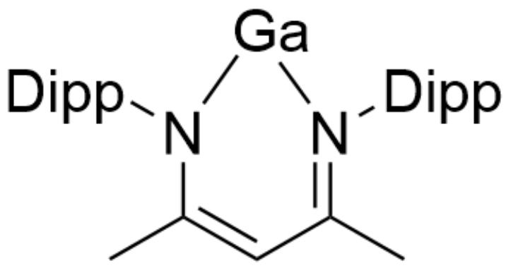
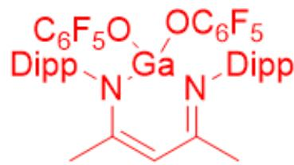
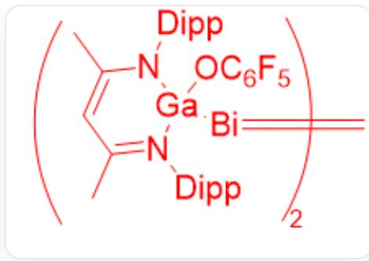
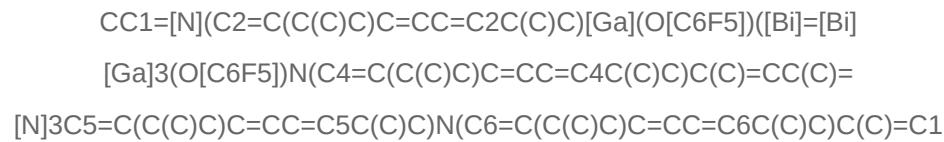

# 题目

有一种Bi的化合物Y：

Y阳离子为  $\mathrm{Bi}^{3+}$ ，Y仅含有四种元素和一种阴离子。Y含Bi质量分数为  $27.57\%$ ，含C质量分数为  $28.49\%$ 。

Y 可以与如图所示的 Ga 化合物 X 反应，得到一种含有  $-Bi = Bi-$  键联结构的化合物，以及另一种含有 Y 的阴离子的产物。

提示：

1. 一般含有  $Bi = Bi$  双键的化合物中配体不是电中性的。  
2. X中连接在氮原子上的2,6-二异丙基苯基(即Dipp)基团空间体积十分巨大。

$$
C C 1 = [ N ] (C 2 = C (C (C) C) C = C C = C 2 C (C) C) [ G a ] N (C 3 = C (C (C) C) C = C C = C 3 C (C) C) C (C) = C 1
$$

下面说法中哪些是正确的：

1. Y中含有9个氯原子  
2. 所有产物中的  $G a$  均为4配位  
3. 含有  $B i = B i$  双键的化合物中含有  $G a - O$  键  
4. 不含  $Bi$  的副产物中含有 40 个碳原子

# 5.  $\mathbf{Y}$  与  $\mathbf{X}$  的计量比为  $1:1$

A. 其他选项均不正确  
B. 1.2.3.  
C. 1.3.  
D. 2.3.  
E. 1.3.4.  
F. 3.4.  
G. 3.5.  
H. 1.5.  
1. 2.5.  
J. 1.2.4.

# 答案

正确答案: D

# 详细解析

由题意可知，假设  $\mathbf{Y}$  中含有一个Bi，则含有碳的个数为：

$$
M _ {Y} = \frac {2 0 9}{0 . 2 7 5 7} \approx 7 5 8 \mathrm {g / m o l}
$$

$$
m _ {C} = 7 5 8 \times 0. 2 8 4 9 \approx 2 1 6 \mathrm {g / m o l}
$$

$$
n _ {C} = \frac {2 1 6}{1 2} = 1 8
$$

# CHECKPOINT

1 PTS

假设Y中含有一个Bi,则含有碳18个$

余下的分子量为：  $758 - 18\times 12 - 209 = 333$

考虑该元素为  $Bi$  ，可能具有三个相同的配体，每个配体上有6个  $C$  ，余下111的分子量，可能为5个  $F$  和一个  $O$

# CHECKPOINT

1 PTS

余下每个配体有5个  $F$  和一个  $O$

因此，  $\mathbf{Y}$  为  $Bi(OC_{6}F_{5})_{3}$

# CHECKPOINT

2 PTS

$\mathbf{Y}$  为  $Bi(OC_{6}F_{5})_{3}$

因此，1错误。

考虑化合价的变化：根据键联结构可知  $Bi$  为  $+1$  价态，被还原；底物  $\mathbf{X}$  中  $Ga$  为  $+1$  价态，从而应当作为还原剂，一般氧化到稳定氧化态  $Ga(III)$ ，为配平化合物电荷，考虑到产物含有  $\mathbf{Y}$  的阴离子，氧化产物应当为  $GaL(OC_{6}F_{5})_{2}$ ，含有41个碳原子，说法4错误。

# CHECKPOINT

1 PTS

Bi为+1价态，被还原

# CHECKPOINT

1 PTS

$G a$  为  $+1$  价态，从而应当作为还原剂，一般氧化到稳定氧化态  $G a(III)$

# CHECKPOINT

1 PTS

氧化产物应当为  $G a L\left(O C_{6} F_{5}\right)_{2}$

注意到题设“Dipp”是空间位阻很大的结构，如果将  $\mathbf{X}$  中  $Ga$  的有机配体  $L$  直接与  $Bi = Bi$  双键配合形成 $L - Bi = Bi - L$  ，此时两个配体  $L$  之间的空间距离太短，因为空间阻碍无法形成。因此，配体  $L$  只能与 $Ga$  继续配位；从而  $Bi = Bi$  双键大概率与  $Ga$  相连。因此还原产物结构为 $L(OC_{6}F_{5})Ga - Bi = Bi - Ga(OC_{6}F_{5})L$  。该结构存在  $O - Ga$  键，说法3正确。

# CHECKPOINT

1 PTS

$L - Bi = Bi - L$  的两个配体  $L$  之间的空间距离太短，因为空间阻碍无法形成

# CHECKPOINT

1 PTS

配体  $L$  只能与  $G a$  继续配位；  $B i = B i$  双键大概率与  $G a$  相连

# CHECKPOINT

1 PTS

还原产物结构为  $L(OC_{6}F_{5})Ga - Bi = Bi - Ga(OC_{6}F_{5})L$

因此，可得到的两个产物结构分别为：

$$
\begin{array}{l} C C 1 = [ N ] (C 2 = C (C (C) C) C = C C = C 2 C (C) C) [ G a ] (O [ C 6 F 5 ]) (O C \# C C \# C C \# C (F) (F) (F) \\ (\mathrm {F}) \mathrm {F}) \mathrm {N} (\mathrm {C 3} = \mathrm {C} (\mathrm {C} (\mathrm {C}) \mathrm {C}) \mathrm {C} = \mathrm {C C} = \mathrm {C 3 C} (\mathrm {C}) \mathrm {C}) \mathrm {C} (\mathrm {C}) = \mathrm {C 1} \\ \end{array}
$$

# CHECKPOINT

1 PTS

$$
C C 1 = [ N ] (C 2 = C (C (C) C) C = C C = C 2 C (C) C) [ G a ] (O [ C 6 F 5 ]) (O C \# C C \# C C \# C (F) (F) (F)
$$

$$
(\mathrm {F}) \mathrm {F}) \mathrm {N} (\mathrm {C} 3 = \mathrm {C} (\mathrm {C} (\mathrm {C}) \mathrm {C}) \mathrm {C} = \mathrm {C C} = \mathrm {C} 3 \mathrm {C} (\mathrm {C}) \mathrm {C}) \mathrm {C} (\mathrm {C}) = \mathrm {C} 1
$$

$$
\mathrm {C C 1} = [ \mathrm {N} ] (\mathrm {C 2} = \mathrm {C} (\mathrm {C} (\mathrm {C}) \mathrm {C}) \mathrm {C} = \mathrm {C C} = \mathrm {C 2} \mathrm {C} (\mathrm {C}) \mathrm {C}) [ \mathrm {G a} ] (\mathrm {O} [ \mathrm {C 6 F 5} ]) ([ \mathrm {B i} ] = [ \mathrm {B i} ]
$$

$$
[ \mathrm {G a} ] 3 (\mathrm {O} [ \mathrm {C} 6 \mathrm {F} 5 ]) \mathrm {N} (\mathrm {C} 4 = \mathrm {C} (\mathrm {C} (\mathrm {C}) \mathrm {C}) \mathrm {C} = \mathrm {C C} = \mathrm {C} 4 \mathrm {C} (\mathrm {C}) \mathrm {C}) \mathrm {C} (\mathrm {C}) = \mathrm {C C} (\mathrm {C}) =
$$

$$
[ N ] 3 C 5 = C (C (C) C) C = C C = C 5 C (C) C) N (C 6 = C (C (C) C) C = C C = C 6 C (C) C) C (C) = C 1
$$

# CHECKPOINT

1 PTS

$$
C C 1 = [ N ] (C 2 = C (C (C) C) C = C C = C 2 C (C) C) [ G a ] (O [ C 6 F 5 ]) ([ B i ] = [ B i ]
$$

$$
[ \mathrm {G a} ] 3 (\mathrm {O} [ \mathrm {C} 6 \mathrm {F} 5 ]) \mathrm {N} (\mathrm {C} 4 = \mathrm {C} (\mathrm {C} (\mathrm {C}) \mathrm {C}) \mathrm {C} = \mathrm {C C} = \mathrm {C} 4 \mathrm {C} (\mathrm {C}) \mathrm {C}) \mathrm {C} (\mathrm {C}) = \mathrm {C C} (\mathrm {C}) =
$$

$$
[ N ] 3 C 5 = C (C (C) C) C = C C = C 5 C (C) C) N (C 6 = C (C (C) C) C = C C = C 6 C (C) C) C (C) = C 1
$$

$$
C C 1 = [ N ] (C 2 = C (C (C) C) C = C C = C 2 C (C) C) [ G a ] (O [ C 6 F 5 ]) (O C \# C C \# C C \# C (F) (F) (F)
$$

$$
(F) F) N (C 3 = C (C (C) C) C = C C = C 3 C (C) C) C (C) = C 1
$$

所有产物均为4配位的  $G a$ , 说法2正确; 两种产物均含有  $G a$ , 反应计量比应为  $2: 3$ , 说法5错误。

# CHECKPOINT

1 PTS

$\mathbf{Y}$  与  $\mathbf{X}$  的计量比为  $2:3$

因此，2.3正确，选择D。