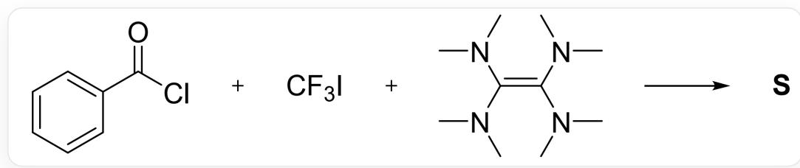
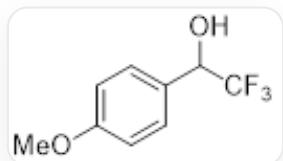
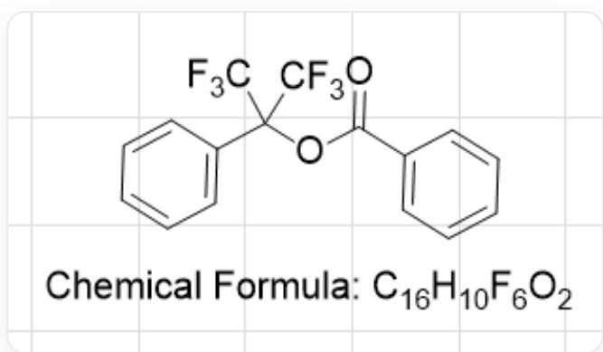

# Question

Hexafluoroacetone can undergo significant hydration. In a concentrated solution of  $\mathrm{NaOH}$ , it reacts with p-methoxybenzaldehyde at  $100^{\circ}\mathrm{C}$  to obtain alcohol  $\mathbf{O}$  and salt  $\mathbf{P}$ .

Similarly, benzoyl chloride reacts with trifluoromethyl iodide and TDAE in a theoretical 1:1:1 ratio to obtain ester S. It is believed that a benzene ring-containing intermediate  $\mathbf{T}$  is first generated, and  $\mathbf{T}$  then reacts with benzoyl chloride to obtain S. At the same time, salt  $\mathbf{U}$  is also produced. It is known that TDAE is tetra(dimethylamino)ethylene.

  
C1C=CC=C(C(Cl)=O)C=1.C(F)(I)(F)F.C(N(C)C)(N(C)C)=C(N(C)C)N(C)C>>[S]

Which of the following statements are correct:

1. The chemical formula of  $\mathbf{O}$  is  $\mathrm{C_3F_6OH_2}$  
2.  $\mathbf{P}$  does not contain hydrogen element  
3. In the reaction, TDAE is oxidized to the cation of  $\mathbf{U}$  
4. The mass fraction of oxygen in  $\mathbf{S}$  is  $9.19\%$  
5. S has 3 kinds of chemically different hydrogens

A. All other options are incorrect  
B. 2.3.4.  
C. 1.2.4.

D. 1.2.3.4.5  
E. 2.3.4.5.  
F. 1.3.5.  
G. 2.3.

# Answer

Correct Answer: B

# Detailed Explanation

The problem states that hexafluoroacetone can undergo significant hydration, and in a concentrated solution of NaOH, it can undergo trifluoromethyl anion transfer reaction to obtain the compound O and sodium trifluoroacetate (salt P) as shown in the figure.

  
OC(C(F)(F)F)C1=CC=C(OC)C=C1

# CHECKPOINT

1 PTS

O is  $\mathrm{OC}(\mathrm{C}(\mathrm{F})(\mathrm{F})\mathrm{F})\mathrm{C}1 = \mathrm{CC} = \mathrm{C}(\mathrm{OC})\mathrm{C} = \mathrm{C}1$

# CHECKPOINT

1 PTS

P is  $\mathrm{CF}_3\mathrm{COONa}$

Therefore, 1 is incorrect, and 2 is correct.

In the second reaction, TDAE can reduce  $\mathrm{CF}_3\mathrm{I}$  to obtain  $\mathrm{CF}_3^-$  equivalent to attack acyl chloride twice to obtain the tertiary alcohol intermediate  $\mathbf{T}$ : OC(C(F)(F)F)(C(F)(F)F)C1=CC=CC=C1. At the same time, the cation  $\mathrm{TADF}^{2+}$  of  $\mathbf{U}$  is obtained. Afterwards, the tertiary alcohol undergoes acylation again to obtain the product  $\mathbf{S}$ : O=C(C1=CC=CC=C1)OC(C(F)(F)F)(C(F)(F)F)C2=CC=CC=C2.

The structure of  $\mathbf{S}$  is shown in the figure:

$$
O = C (C 1 = C C = C C = C 1) O C (C (F) (F) F) (C (F) (F) F) C 2 = C C = C C = C 2
$$

# CHECKPOINT

1 PTS

T is OC(C(F)(F)F)(C(F)(F)F)C1=CC=CC=C1

# CHECKPOINT

1 PTS

S is  $\mathrm{O} = \mathrm{C}(\mathrm{C}1 = \mathrm{CC} = \mathrm{CC} = \mathrm{C}1)\mathrm{OC}(\mathrm{C}(\mathrm{F})(\mathrm{F})\mathrm{F})(\mathrm{C}(\mathrm{F})(\mathrm{F})\mathrm{F})\mathrm{C}2 = \mathrm{CC} = \mathrm{CC} = \mathrm{C}2$

Therefore, 3 and 4 are correct (based on the correct mass fraction of oxygen in the chemical formula), 5 should be 6 types, which is incorrect. Option B is correct.