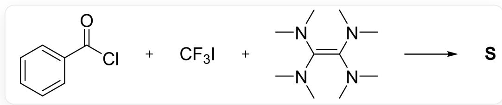
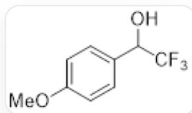
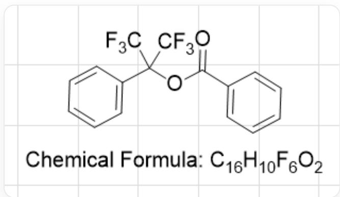

# 题目

六氟丙酮可以发生明显的水化。在  $\mathrm{NaOH}$  的浓溶液中, 其与对甲氧基苯甲醛于  $100^{\circ} \mathrm{C}$  下反应得到醇  $\mathrm{O}$ 以及盐  $\mathrm{P}$  。

类似地，苯甲酰氯与三氟甲基碘以及TDAE理论上1：1：1反应得到酯S。该过程可认为先生成了含苯环的中间体T，T再与苯甲酰氯反应得到S。同时反应还产生了盐U。已知TDAE是四（二甲氨基）乙烯。

  
C1C=CC=C(C(Cl)=O)C=1.C(F)(I)(F)F.C(N(C)C)(N(C)C)=C(N(C)C)N(C)C>>[S]

下面的说法中正确的有：

1. O的化学式为  $\mathrm{C}_{3} \mathrm{~F}_{6} \mathrm{OH}_{2}$  
2. P中不包含氢元素  
3. 在反应中TDAE被氧化为U的阳离子  
4. S 中含氧的质量分数为  $9.19\%$  
5. S有3种化学环境不同的氢

A. 其他选项均不正确  
B. 2.3.4.  
C. 1.2.4.

D. 1.2.3.4.5  
E. 2.3.4.5.  
F. 1.3.5.  
G. 2.3.

# 答案

正确答案: B

# 详细解析

题目中说六氟丙酮可以发生明显的水化，在  $\mathrm{NaOH}$  的浓溶液中可以发生三氟甲基负离子转移反应，得到如图所示的化合物O和三氟乙酸钠(盐P)。

  
OC(C(F)(F)F)C1=CC=C(OC)C=C1

# CHECKPOINT

1 PTS

$\mathbf{O}$  为  $\mathrm{OC}(\mathrm{C}(\mathrm{F})(\mathrm{F})\mathrm{F})\mathrm{C}1 = \mathrm{CC} = \mathrm{C}(\mathrm{OC})\mathrm{C} = \mathrm{C}1$

# CHECKPOINT

1 PTS

$\mathbf{P}$  为  $\mathrm{CF}_3\mathrm{COONa}$

因此1错误，2正确。

第二个反应中，TDAE可以还原  $\mathrm{CF}_3\mathrm{I}$  得到  $\mathrm{CF}_3^-$  等价物进攻两次酰氯，得到三级醇中间体  $\mathbf{T}$ ：OC(C(F)(F)F)(C(F)(F)F)C1=CC=CC=C1。与此同时得到  $\mathbf{U}$  的阳离子  $\mathrm{TADF}^{2+}$  。此后三级醇再次发生酰基化得到产

物  $\mathbf{S}:0 = C(C1 = CC = CC = C1)OC(C(F)(F)F)(C(F)(F)F)C2 = CC = CC = C2$

S的结构如图所示：

$$
O = C (C 1 = C C = C C = C 1) O C (C (F) (F) F) (C (F) (F) F) C 2 = C C = C C = C 2
$$

# CHECKPOINT

1 PTS

T是OC(C(F)(F)F)(C(F)(F)F)C1=CC=CC=C1

# CHECKPOINT

1 PTS

S是  $O = C(C1 = CC = CC = C1)OC(C(F)(F)F)(C(F)(F)F)C2 = CC = CC = C2$

因此3.4.正确（根据化学式含氧质量分数正确），5应为6种，错误。选项B正确。