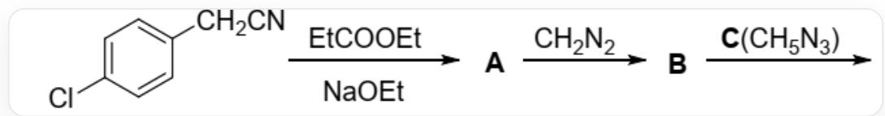
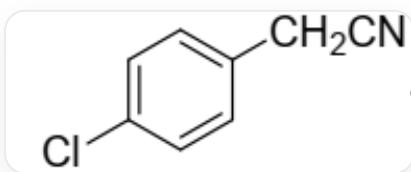
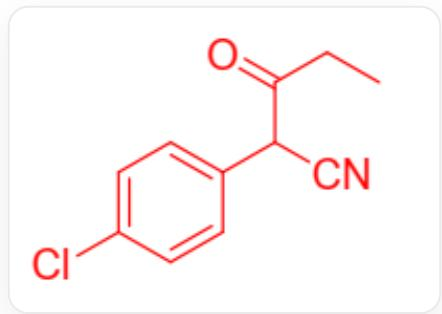
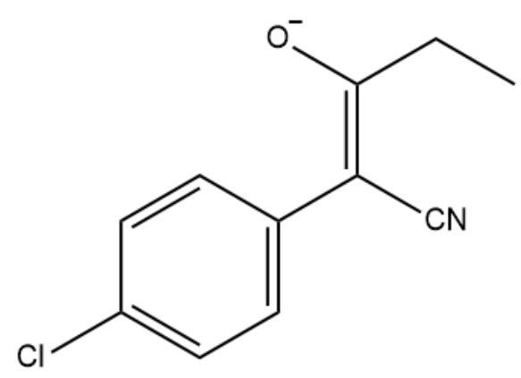
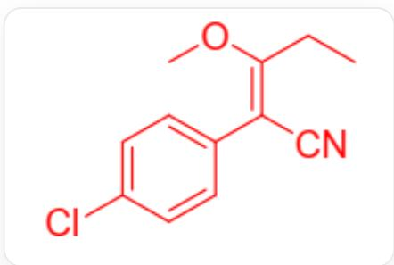
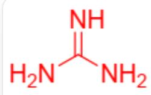
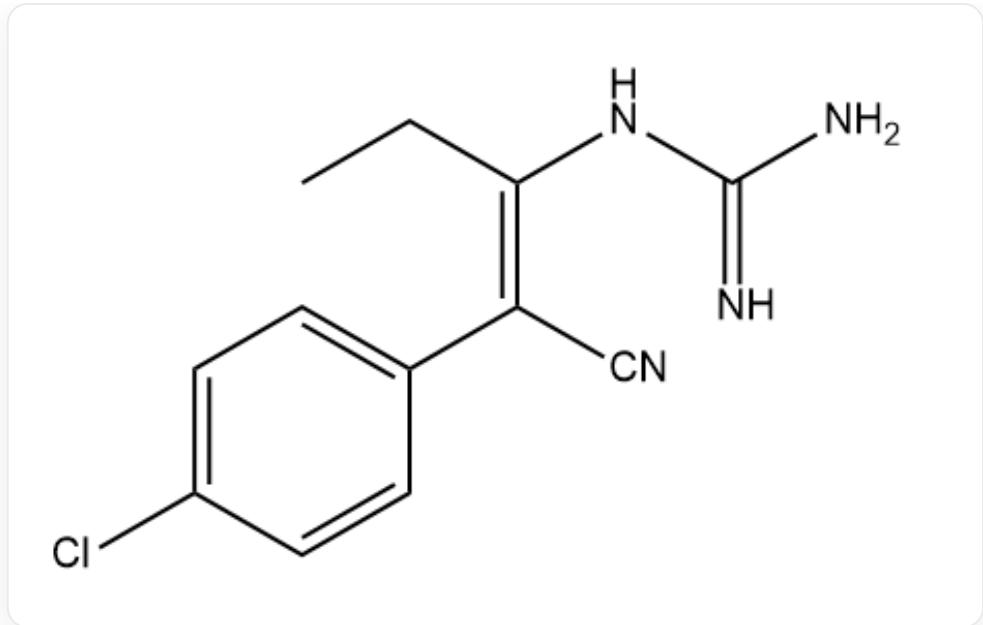
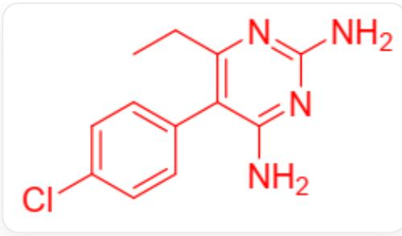

# Question

The figure describes an organic synthesis route, with the molecular formula of the final product being  $\mathrm{C_{12}H_{13}ClN_4}$ . Regarding the following statements about this organic synthesis route, identify the correct one.

The figure shows a multi-step reaction: C1=CC(Cl)=CC=C2CC#N>CCC(=O)OCC.[Na].[O]CC>[A], [A]>C=N=N>B[B], [B]>[C]>[D], where [A], [B], [C] are codes, the molecular formula of [C] is  $\mathrm{CH}_5\mathrm{N}_3$ , and no additional information about [D] is provided in the figure

A. The reaction from the first reactant to  $\mathbf{A}$  involves an  $S_{N}1$  mechanism.  
B. A has 5 more carbon atoms than the first reactant.  
C. The B molecule contains two rings.  
D. During the process from  $\mathbf{A}$  to  $\mathbf{B}$ , no gas is generated.  
E. In this synthetic route, the basicity of  $\mathbf{C}$  is utilized.  
F. The stabilizing mechanisms of reagent C and carbonate ions differ in origin.  
G. After the reaction of  $\mathbf{B}$  with  $\mathbf{C}$ , the number of rings increases.  
H. In the reaction between B and C, the electrons in the B molecule attack C.

1. From  $\mathbf{B}$  to the final product, one molecule of formaldehyde is eliminated.

J. Initially, the cyano nitrogen atom in the reactants becomes incorporated into the heterocycle in the final product.  
K. The final product contains two sets of  $\pi$ -conjugated systems, and there is a strong interaction between them.  
L. In the structural formula of  $\mathbf{B}$ , there are no exocyclic double bonds.  
M. The structure after protonation of  $\mathbf{C}$  belongs to the  $C_3$  point group.  
N. In the final product molecule, up to 22 atoms are coplanar in specific conformations.

# Answer

Correct Answer: G

# Detailed Explanation

The initial reactant is

  
c1cc(Cl)ccc1CC#N

Under sodium ethoxide conditions, the proton at the  $\alpha$ -position of the cyano group (also the benzylic position) is deprotonated, forming a carbanion that attacks the carbonyl carbon of ethyl propionate. Through an addition-elimination mechanism, the ethoxide ion is displaced, yielding product A.

# CHECKPOINT

1 PTS

Formation of carbanion at the  $\alpha$ -position of the cyano group

# CHECKPOINT

1 PTS

Addition-elimination mechanism occurs

Option A is incorrect.

The structure of  $\mathbf{A}$  is

CCC(=O)C(C#N)c1ccc(cc1)Cl

Comparison reveals that it has three more carbons than the initial substrate, so option B is incorrect.

# CHECKPOINT

1 PTS

Structure of A is CCC(=O)C(C#N)c1ccc(cc1)Cl

# CHECKPOINT

1 PTS

A has three more carbons than the substrate

In the structure of  $\mathbf{A}$ , one hydrogen atom is simultaneously located at the  $\alpha$ -position of the cyano group, the  $\alpha$ -position of the ketone carbonyl, and the benzylic position. This hydrogen can be further deprotonated by ethoxide to yield an enolate stabilized by the conjugated system:

CCC(=C(C#N)c1ccc(cc1)Cl)[O-]

This intermediate is methylated at the oxygen terminus by diazomethane to give B.

# CHECKPOINT

1 PTS

Methylation of the enolate at the oxygen terminus

The structure of  $\mathbf{B}$  is

CC/C(=C(\C#N)/c1ccc(cc1)Cl)/OC

# CHECKPOINT

1 PTS

B is CC/C(=C(\C#N)/c1ccc(cc1)Cl)/OC

B contains only one ring, so option C is incorrect. The conversion from A to B releases nitrogen gas, so option D is incorrect.

Examining the structure of  $\mathbf{B}$ , the exocyclic benzylic carbon and the carbon directly bonded to oxygen are part of a carbon-carbon double bond in the structural formula, so option L is incorrect.

# CHECKPOINT

1 PTS

The benzylic carbon and the carbon directly bonded to oxygen in B form a carbon-carbon double bond

$\mathbf{C}$  is guanidine, with the structure:

C(=N)(N)N

# CHECKPOINT

1 PTS

C is  $\mathrm{C}(\mathrm{=N})(\mathrm{N})\mathrm{N}$

C is basic and exhibits Y-aromaticity. Its stability source is the same as that of the carbonate ion, so option F is incorrect.

# CHECKPOINT

1 PTS

C exhibits Y-aromaticity

The most stable conformation of the protonated cation of  $\mathbf{C}$  is planar, with the carbon and all nitrogen atoms adopting  $\mathrm{sp}^2$  hybridization, and the entire ion belongs to the  $D_{3\mathrm{h}}$  point group. Option M is incorrect.

# CHECKPOINT

1 PTS

The cation of  $\mathbf{C}$  has a planar conformation with  $D_{3\mathrm{h}}$  symmetry

Intermediate B reacts with added C, where a nitrogen atom of C attacks the carbon atom bonded to oxygen in B (the  $\beta$ -position of the cyano group). Through an addition-elimination mechanism, the methoxide ion is displaced. Option H is incorrect.

C1CC(=C(C#N)C2=C1C=C(C=C2)Cl)NC(=N)N

# CHECKPOINT

1 PTS

Displacement of the methoxide ion

Subsequently, another nitrogen atom originally from C attacks the cyano carbon, forming a new six-membered ring. Proton transfer converts the original cyano nitrogen into an amino group. Option G is correct.

# CHECKPOINT

1 PTS

Reaction of B with C forms a six-membered ring

CCc1c(c2ccc(cc2)Cl)c(nc(n1)N)N

# CHECKPOINT

1 PTS

Final product is CCc1c(c2ccc(cc2)Cl)c(nc(n1)N)N

The synthetic route does not involve the basicity of guanidine, so option E is incorrect.

# CHECKPOINT

1 PTS

The synthetic route does not involve the basicity of guanidine

In the formation of the final product, the methoxide ion is displaced, not formaldehyde. Option I is incorrect.

From the structure of the final product, the nitrogen atom of the initial substrate's cyano group ends up as an amino group outside the ring. Option J is incorrect.

# CHECKPOINT

1 PTS

The nitrogen atom of the initial substrate's cyano group forms an amino group in the final product

The final product contains directly linked phenyl and pyrimidine rings, with both  $o$ -positions of the pyrimidine ring substituted. This creates significant steric hindrance for coplanar alignment between the phenyl and pyrimidine rings, resulting in weak  $\pi$ -conjugation. Thus, option K is incorrect.

# CHECKPOINT

1 PTS

Steric hindrance prevents coplanarity between phenyl and pyrimidine rings, leading to weak  $\pi$ -conjugation

In the final product, the phenyl ring has 11 coplanar atoms, while the pyrimidine ring and its attached amino groups have 12 coplanar atoms. The ethyl group linked to the pyrimidine ring can contribute 3 coplanar atoms in certain conformations. When the phenyl and pyrimidine rings achieve a coplanar conformation (though the question does not require this conformation to be stable), the molecule can have up to 26 coplanar atoms, exceeding 22. Thus, option N is incorrect.

# CHECKPOINT

1 PTS

Up to 26 atoms can be coplanar