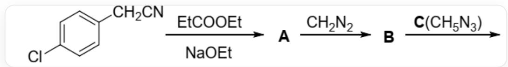
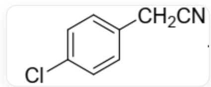
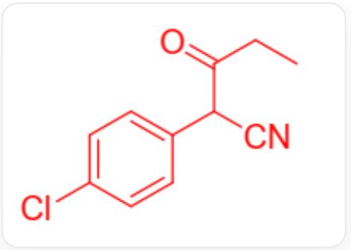
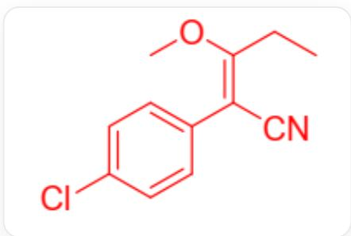
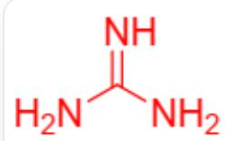
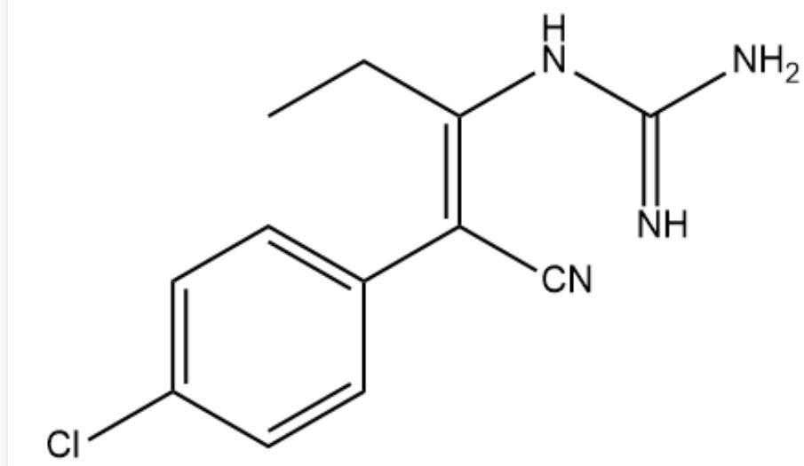
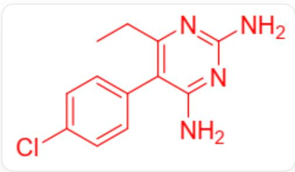

# 题目

下图描述了一个有机合成路线，最终产物的分子式为  $\mathrm{C_{12}H_{13}ClN_4}$  。关于如下有机合成路线的说法，指出正确的一项。

  
图中为多步反应：C1=CC(Cl)=CC=C2CC#N>CCC(=O)OCC.[Na].[O]CC>[A]，[A]>C=N=N>[B]，[B]>[C][D]，其中[A]，[B]，[C]是代号，[C]的分子式为  $\mathrm{CH}_5\mathrm{N}_3$  ，图上未给出[D]的其他任何信息

A. 从第一个反应物到  $\mathbf{A}$  的反应涉及  $S_{N}1$  机理。  
B. A 比第一个反应物多 5 个碳原子。  
C. B 分子中包含两个环。  
D. 从  $\mathbf{A}$  到  $\mathbf{B}$  过程中, 没有气体产生。  
E. 在该合成路线中, 使用到了  $\mathrm{C}$  的碱性。  
F. 试剂 C 与碳酸根的稳定性来源机制不同。  
G. B与C反应后, 环的数量增加。  
H. 在  $\mathbf{B}$  与  $\mathbf{C}$  的反应中,  $\mathbf{B}$  分子中的电子进攻  $\mathbf{C}$  。  
1. 从  $\mathrm{B}$  到最终产物, 离去一分子甲醛。

J. 一开始反应物中的氰基氮原子在最终产物中进入杂环。  
K. 最终产物含有两套  $\pi$  共轭体系, 且二者之间有较强的相互作用。  
L. B 的结构式中, 不存在环外双键。  
M. C质子化后的结构, 属于  $C_{3}$  点群。  
N. 最终产物的分子中，在特定构象下，最多有22个原子共平面。

# 答案

正确答案: G

# 详细解析

初始反应物为

  
c1cc(Cl)ccc1CC#N

在乙醇钠条件下，拔除氰基α位（同时也是苄位）的质子，形成的碳负离子进攻丙酸乙酯的酯羰基碳，经过加成- 消除机理，离去乙醇负离子，得到产物A。

# CHECKPOINT

1 PTS

氰基  $\alpha$  位形成碳负离子

# CHECKPOINT

1 PTS

发生加成-消除机理

A 选项错误。

A的结构为

CCC(=O)C(C#N)c1ccc(cc1)Cl

对比看出，其与初始底物相比，多了3个碳，B选项错误。

# CHECKPOINT

1 PTS

A结构为CCC(=O)C(C#N)c1ccc(cc1)Cl

# CHECKPOINT

1 PTS

A比底物多3个碳

A的结构中，有一个氢原子同时处于氰基α位、酮羰基α位和苄位，其可以被乙醇负离子进一步去质子化，得到被共轭体系稳定的烯醇负离子

CCC(=C(C#N)c1ccc(cc1)Cl)[O-]

该中间体氧端被重氮甲烷甲基化，得到B。

# CHECKPOINT

1 PTS

烯醇负离子在氧端甲基化

B的结构为

CC/C(=C(\C#N)/c1ccc(cc1)Cl)/OC

# CHECKPOINT

1 PTS

B 为CC/C(=C(\C#N)/c1ccc(cc1)Cl)/OC

B中只有1个环，C错误。A到B生成氮气，D错误。

观察B的结构，其环外的苄位碳和与氧原子直接相连的碳，在结构式上为碳碳双键，故L选项错误。

# CHECKPOINT

1 PTS

B的苄位碳和与氧原子直接相连的一个碳上有碳碳双键

C是胍，其结构为

$\mathrm{C(=N)(N)N}$

# CHECKPOINT

1 PTS

C为  $\mathrm{C(=N)(N)N}$

C具有碱性，具有Y芳香性，其稳定性来源与碳酸根一致，F错误。

# CHECKPOINT

1 PTS

C具有Y芳香性

C质子化后得到的阳离子的最稳定构象为平面构象，其中的碳原子和所有氮原子均为  $\mathfrak{sp}^2$  杂化，整个离子具有  $D_{3\mathrm{h}}$  点群。选项M错误。

# CHECKPOINT

1 PTS

C的阳离子为平面构象，  $D_{3\mathrm{h}}$  点群

中间体B与加入的C发生反应，C中的氮原子进攻B中与氧相连的碳原子（氰基的β位），经加成-消除机理，离去甲氧基负离子。H错误。

C1CC(=C(C#N)C2=C1C=C(C=C2)Cl)NC(=N)N

# CHECKPOINT

1 PTS

离去甲氧基负离子

随后，原属C中的另一个氮原子进攻氰基碳，生成新的六元环，并通过质子转移，将原本的氰基氮转化为氨基。选项G正确。

# CHECKPOINT

1 PTS

B与C反应生成六元环

  
CCc1c(c2ccc(cc2)Cl)c(nc(n1)N)N

# CHECKPOINT

1 PTS

最终产物为CCc1c(c2ccc(cc2)Cl)c(nc(n1)N)N

整个合成路线中，不涉及胍的碱性，选项E错误。

# CHECKPOINT

1 PTS

合成路线不涉及胍的碱性

在最终产物的生成中，离去甲氧基负离子，而非甲醛。选项I错误。

从最终产物的结构可以看到，初始底物的氰基氮原子，在最终产物中形成氨基，不在环内。J选项错误。

# CHECKPOINT

1 PTS

初始底物的氰基氮原子最终形成氨基

最终产物结构中含有直接相连的苯环和嘧啶环，且嘧啶环的两个o位均有取代基，这使得苯环与嘧啶环之间形成共面构象的位阻较大，因此两者之间的π共轭相互作用较弱。故K选项错误。

# CHECKPOINT

1 PTS

苯环和嘧啶环共面位阻大，π共轭作用弱

在最终产物中，苯环的部分有11个共面原子，嘧啶环以及其连带的两个氨基有12个共面原子，与嘧啶环相连的乙基在特定的构象下，可以有3个原子与嘧啶环共面，当苯环与嘧啶环达到共平面构象（选项中不要求该构象稳定）时，整个分子中至多有26个原子共平面，大于22个，选项N错误。

# CHECKPOINT

1 PTS

至多26个原子共面