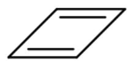
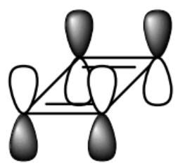
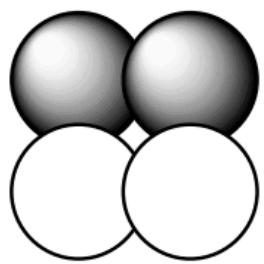
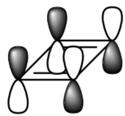
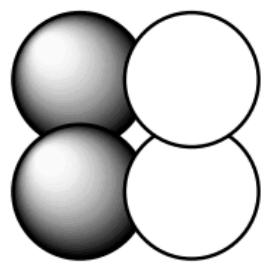
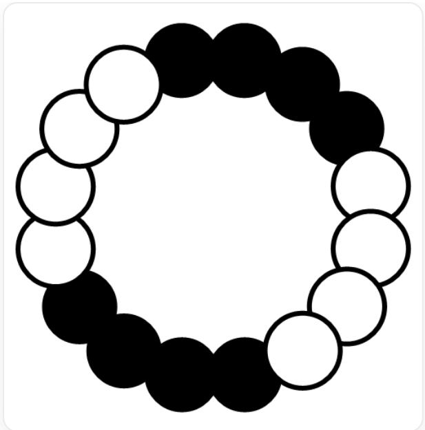
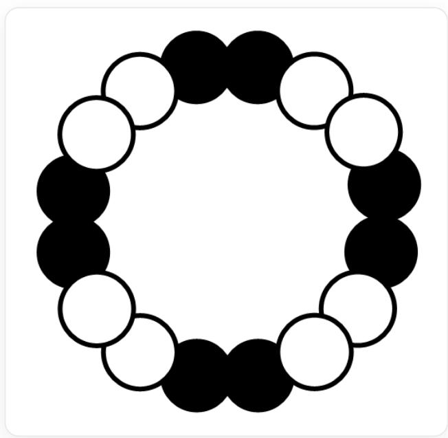

# Question

Recently, the synthesis and characterization of the anti-aromatic carbon allotrope - cyclo[16]carbon ( $C_{16}$ ) molecule has been achieved using tip-induced surface chemistry methods. The atomic bonding sequence of the cyclic  $C_{16}$  element is similar to a regular hexadecagon.

It has been proposed that the ground state electronic state of  $\mathrm{C_{16}}$  corresponding to the orbital pattern may be a state with two sets of aromatic conjugated systems, with all carbon-carbon bonds being completely equal in length (structure 1); however, studies using atomic force microscopy and scanning tunneling microscopy suggest that  $\mathrm{C_{16}}$  exhibits significant bond length alternation (structure 2).

The following statements are made:

Statement 1. Suppose the delocalized  $\Pi$  bond types of structure 1 are  $\Pi_{16}^{\mathrm{ab}}$  and  $\Pi_{16}^{\mathrm{cd}}$  (ab, cd represent two-digit numbers, a, c are tens digits, and b, d are ones digits), then  $0.34 < \frac{\mathrm{a}}{\mathrm{b}} + \frac{\mathrm{c}}{\mathrm{d}} < 0.38$ .

Statement 2. The sum of the number of rotational axes, mirror planes, and centers of symmetry of structure 1 is 34.

Statement 3. The sum of the number of rotational axes, mirror planes, and centers of symmetry of structure 2 is 18.

Butadiene molecules have a rectangular structure in the ground state, and their HOMO and LUMO orbitals are shown in the figure below:

  
HOMO

  
LUMO

The image is a scientific diagram mainly showing molecular orbital structures. The left side of the image is a simple two-dimensional molecular structure consisting of a side view of a rectangular skeleton with four vertices, with a parallel double bond on each of the upper and lower sides. The right side of the image is divided into two parts, labeled "HOMO" and "LUMO" respectively. In the "HOMO" part, the top is a three-dimensional molecular orbital model, which is a side view of a rectangular skeleton, and four dumbbell-shaped orbitals extend from the four vertices of the skeleton. Among these four orbitals, the two orbitals in the left rear and right rear are black on top and white on the bottom, and the two orbitals in the left front and right front are white on top and black on the bottom. Below the "HOMO" text is a two-dimensional simplified representation consisting of four adjacent circles forming a square, where the upper left and upper right circles are shaded, and the lower left and lower right are hollow. In the "LUMO" part, the top is also a three-dimensional molecular orbital model, the skeleton and orbital arrangement are similar to the "HOMO" part, but the shading pattern is different: the two orbitals in the left rear and left front are black on top and white on the bottom, and the right rear and right front are white on top and black on the bottom. Below the "LUMO" text is its corresponding two-dimensional simplified representation, also consisting of four adjacent circles forming a square, where the upper left and lower left circles are shaded, and the upper right and lower right are hollow.

Statement 4. The schematic diagram of the HOMO orbital of  $\mathrm{C_{16}}$  of structure 2 is as follows:

16 circles are connected to each other, starting from the top left clockwise, followed by 4 adjacent black circles, 4 adjacent white circles, 4 adjacent black circles, and 4 adjacent white circles. All circles are approximately the same size, shape, and arrangement distance.

Statement 5. If the  $C_{16}$  of structure 2 is reduced to  $C_{16}^{-}$ , the bond length of the original long carbon-carbon bond shortens, and the bond length of the original short carbon-carbon bond increases.

What is the sum of the numbers of the correct statements?

A. 1  
B. 3  
C. 4  
D. 6  
E. 7

F. 8  
G. 10  
H. 11  
1. 12  
J. 13  
K. All of the above options are incorrect.

# Answer

Correct Answer: D

# Detailed Explanation

In structure 1, each carbon provides  $2\mathrm{p}$  electrons. All carbon atoms are coplanar, assuming each carbon has a p orbital perpendicular to the molecular plane, the formed  $\Pi$  bond is 16 electrons, anti-aromatic, and the p orbital of each carbon within the molecular plane can also form a  $\Pi$  bond, which is also 16 electrons, anti-aromatic. To match the stated "two sets of aromatic conjugated systems", one conjugated system transfers 2 electrons to the other system, forming  $\Pi_{16}^{14}$  and  $\Pi_{16}^{18}$ , and the calculation shows that statement 1 is correct.

# CHECKPOINT

1 PTS

The types of delocalized  $\Pi$  bonds possessed by structure 1 are  $\Pi_{16}^{14}$  and  $\Pi_{16}^{18}$

Structure 1 is a planar regular hexadecagon, with 1 16-fold rotation axis, 16 2-fold rotation axes, 17 mirror planes, and 1 center of symmetry. The sum of the number of the above symmetry elements is 35, so statement 2 is incorrect.

# CHECKPOINT

1 PTS

The sum of the number of rotation axes, mirror planes, and centers of symmetry in structure 1 is 35

Structure 2 is a planar equiangular hexadecagon with alternating long and short sides, with 1 8-fold rotation axis, 8 2-fold rotation axes, 9 mirror planes, and 1 center of symmetry. The sum of the number of the above symmetry elements is 19, so statement 3 is incorrect.

# CHECKPOINT

1 PTS

The sum of the number of rotation axes, mirror planes, and centers of symmetry in structure 2 is 19

Analyzing the frontier molecular orbital situation of cyclobutadiene, we can know that its HOMO and LUMO were originally non-bonding orbitals, and degeneracy occurred because the molecular structure changed from a regular polygon to a polygon with alternating long and short sides. In the HOMO, the orbital lobes on both sides of the short bond are the same, and the orbital lobes on both sides of the long bond are opposite; the LUMO is the opposite, with the orbital lobes on both sides of the short bond being opposite, and the orbital lobes on both sides of the long bond being the same. Analogous to cyclobutadiene, it is inferred that the HOMO of  $\mathrm{C}_{16}$  should be two groups of two identical lobes appearing alternately, as shown in the figure below, so statement 4 is incorrect.

16 circles are connected to each other, starting from the top left clockwise, followed by 2 adjacent black circles, 2 adjacent white circles, 2 adjacent black circles, 2 adjacent white circles, and so on. All circles are approximately the same size, shape, and arrangement distance.

# CHECKPOINT

2 PTS

In the HOMO, the orbital lobes on both sides of the short bond are the same, and the orbital lobes on both sides of the long bond are opposite; the LUMO is the opposite, with the orbital lobes on both sides of the short bond being opposite, and the orbital lobes on both sides of the long bond being the same

$C_{16}$  is reduced to  $C_{16}^{-}$ , that is, one electron is filled in the LUMO. In the LUMO, the orbital lobes on both sides of the short bond are opposite, and the orbital lobes on both sides of the long bond are the same, so the bond length of the original long carbon-carbon bond is shortened, and the bond length of the original short carbon-carbon bond is increased, so statement 5 is correct.

# CHECKPOINT

1 PTS

The LUMO is bonding at the long bond and antibonding at the short bond

In summary, the correct statements are 1 and 5, so the answer is option D.