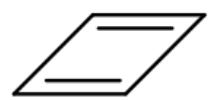
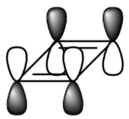
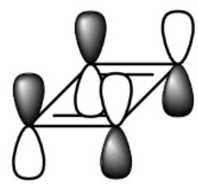
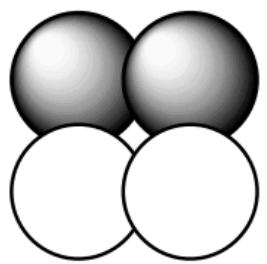
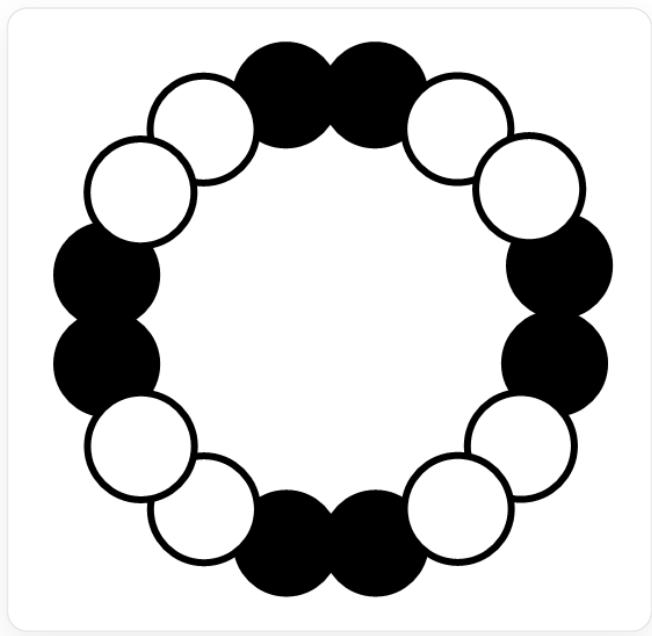

# 题目

近日，人们利用针尖诱导的表面化学方法实现了反芳香性碳同素异形体——环十六碳（cyclo[16]carbon,  $\mathrm{C}_{16}$ ）分子的合成和表征。环状的  $\mathrm{C}_{16}$  单质原子键连顺序类似正十六边形。

人们曾提出， $\mathrm{C}_{16}$  的轨道模式对应的基态电子态可能是具有两套芳香共轭体系的状态，所有碳碳键完全等长（结构1）；但是，原子力显微镜、扫描隧道显微镜的研究认为， $\mathrm{C}_{16}$  具有显著的键长交替现象（结构2）。

有如下说法：

说法1.设结构1具有的离域  $\Pi$  键类型为  $\Pi_{16}^{\mathrm{ab}}$  和  $\Pi_{16}^{\mathrm{cd}}$  （ab,cd表示两位数，a,c为十位，b,d为个位)，则  $0.34 < \frac{\mathrm{a}}{\mathrm{b}} +\frac{\mathrm{c}}{\mathrm{d}} < 0.38$  。

说法2.结构1的旋转轴、镜面、对称中心个数之和为34。

说法3.结构2的旋转轴、镜面、对称中心个数之和为18。

环丁二烯分子在基态为长方形结构，其HOMO轨道和LUMO轨道如下图所示：

  
HOMO

  
LUMO

该图像是一个科学示意图，主要展示了分子轨道结构。图像左侧是一个简单的二维分子结构，由一个包含四个顶点的侧视长方形骨架组成，其中上下两侧各有一条平行的双键。图像的右侧分成了两个部分，分别标记为“HOMO”和“LUMO”。在“HOMO”部分，上方是一个三维分子轨道模型，为侧视长方形骨架，骨架的四个顶点处分别伸出四个哑铃状的轨道。这四个轨道中，左后和右后的两个轨道是上黑下白，左前和右前的两个轨道是上白下黑的。在“HOMO”文字下方，是一个二维的简化表示，由四个相邻的圆圈组成一个正方形，其中左上和右上的圆圈是阴影填充的，左下和右下是空心的。在“LUMO”部分，上方同样是一个三维分子轨道模型，骨架和轨道排布与“HOMO”部分类似，但阴影填充的模式不同：左后和左前两个轨道是上黑下白，右后和右前是上白下黑。在“LUMO”文字下方，是其对应的二维简化表示，同样由四个相邻的圆圈组成一个正方形，其中左上和左下的圆圈是阴影填充的，右上和右下是空心的。

说法4.结构2的  $\mathrm{C}_{16}$  的HOMO轨道示意图如下：

  
16个圆相互连接，从顶部偏左顺时针出发，依次是4个相邻的黑色圆、4个相邻的白色圆、4个相邻的黑色圆、4个相邻的白色圆。所有圆的大小、形状和排列距离都大致相同。

说法5.若将结构2的  $\mathrm{C}_{16}$  还原为  $\mathrm{C}_{16}^{-}$ , 则原先长的碳碳键的键长缩短, 原先短的碳碳键的键长增长。

正确说法序号之和为多少？

该图像是一个科学示意图，主要展示了分子轨道结构。图像左侧是一个简单的二维分子结构，由一个包含四个顶点的侧视长方形骨架组成，其中上下两侧各有一条平行的双键。图像的右侧分成了两个部分，分别标记为“HOMO”和“LUMO”。在“HOMO”部分，上方是一个三维分子轨道模型，为侧视长方形骨架，骨架的四个顶点处分别伸出四个哑铃状的轨道。这四个轨道中，左后和右后的两个轨道是上黑下白，左前和右前的两个轨道是上白下黑的。在“HOMO”文字下方，是一个二维的简化表示，由四个相邻的圆圈组成一个正方形，其中左上和右上的圆圈是阴影填充的，左下和右下是空心的。在“LUMO”部分，上方同样是一个三维分子轨道模型，骨架和轨道排布与“HOMO”部分类似，但阴影填充的模式不同：左后和左前两个轨道是上黑下白，右后和右前是上白下黑。在“LUMO”文字下方，是其对应的二维简化表示，同样由四个相邻的圆圈组成一个正方形，其中左上和左下的圆圈是阴影填充的，右上和右下是空心的。

16个圆相互连接，从顶部偏左顺时针出发，依次是4个相邻的黑色圆、4个相邻的白色圆、4个相邻的黑色圆、4个相邻的白色圆。所有圆的大小、形状和排列距离都大致相同。

16个圆相互连接，从顶部偏左顺时针出发，依次是2个相邻的黑色圆、2个相邻的白色圆、2个相邻的黑色圆、2个相邻的白色圆，以此类推。所有圆的大小、形状和排列距离都大致相同。

A. 1  
B. 3  
C. 4  
D. 6  
E. 7  
F. 8  
G. 10  
H. 11  
12  
J. 13  
K. 以上选项均不对

# 答案

正确答案: D

# 详细解析

在结构1中，每个碳提供2个p电子。所有碳原子共面，假设每个碳都有垂直于分子平面的p轨道，形成的  $\Pi$  键为16电子，反芳香性，而每个碳在分子平面内的p轨道也能形成  $\Pi$  键，也是16电子反芳香性的。为了契合题述的“两套芳香共轭体系”，一套共轭体系对另一套体系转移2个电子，形成  $\Pi_{16}^{14}$  和  $\Pi_{16}^{18}$ ，计算可知说法1正确。

# CHECKPOINT

1 PTS

结构1具有的离域  $\Pi$  键类型为  $\Pi_{16}^{14}$  和  $\Pi_{16}^{18}$

结构1是平面的正十六边形，有1个16次旋转轴，16个2次旋转轴，17个镜面，1个对称中心，以上对称元素数目之和为35，说法2错误。

# CHECKPOINT

1 PTS

结构1的旋转轴、镜面、对称中心个数之和为35

结构2是平面的长短边交替的等角十六边形，有1个8次旋转轴，8个2次旋转轴，9个镜面，1个对称中心，以上对称元素数目之和为19，说法3错误。

# CHECKPOINT

1 PTS

结构2的旋转轴、镜面、对称中心个数之和为19

分析环丁二烯的前线分子轨道情况，可以知道其HOMO和LUMO原本为非键轨道，因分子结构从正多边形变为长短边交替的多边形而出现了去简并。HOMO中短键两侧轨道波瓣相同，长键两侧轨道波瓣相反；LUMO则是短键两侧轨道波瓣相反，长键两侧轨道波瓣相同。类比环丁二烯，推知  $\mathrm{C}_{16}$  的HOMO应该是两种波瓣相同的两个一组交替出现，如下图，说法4错误。

16个圆相互连接，从顶部偏左顺时针出发，依次是2个相邻的黑色圆、2个相邻的白色圆、2个相邻的黑色圆、2个相邻的白色圆，以此类推。所有圆的大小、形状和排列距离都大致相同。

# CHECKPOINT

2 PTS

HOMO中短键两侧轨道波瓣相同，长键两侧轨道波瓣相反；LUMO则是短键两侧轨道波瓣相反，长键两侧轨道波瓣相同

$\mathrm{C}_{16}$  被还原为  $\mathrm{C}_{16}^{-}$ ，即在LUMO填一个电子。LUMO中短键两侧轨道波瓣相反，长键两侧轨道波瓣相同，所以原先长的碳碳键的键长缩短，原先短的碳碳键的键长增长，说法5正确。

# CHECKPOINT

1 PTS

LUMO在长键处是成键的，在短键处是反键的

综上所述，正确的说法为1,5，答案选D选项。