# Question

Norbornene was first treated with borane and then hydrogen peroxide under basic conditions to obtain compound A. Compound A was further oxidized with chromium trioxide and reacted with p-toluenesulfonyl hydrazide to yield compound B. Compound B was then reacted with ethylene oxide and trimethylsilyl chloride under the action of n-butyllithium to obtain compound C. Compound C was reacted with m-chloroperbenzoic acid to yield compound D. Compound D was treated under acidic conditions to obtain compound E.

Please provide the structures of all compounds and select the matching option from the following choices.

A. Compound A is

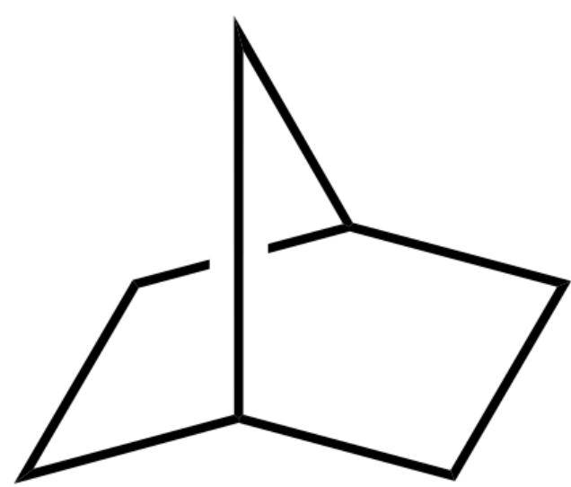

[C@H]12CC[C@@H](C2)CC1

B. Compound A is

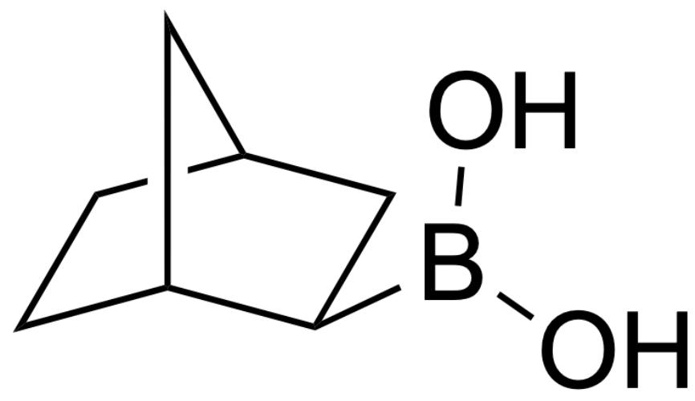

OB(O)[C@H]1[C@@H]2CC[C@@H](C2)C1

C. Compound B is

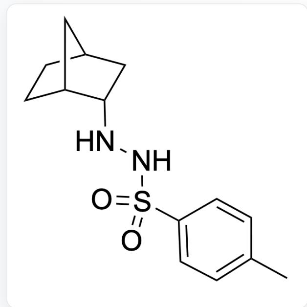

$\mathrm{O = S(NN[C@@H]1[C@@H]2CC[C@@H](C2)C1)(C3 = CC = C(C)C = C3) = O}$

D. Compound B is

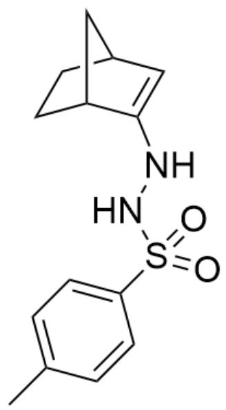

$\mathrm{O = S(NNC1 = C[C@H]2CC[C@@H]1C2)(C3 = CC = C(C)C = C3) = O}$

E. Compound C is

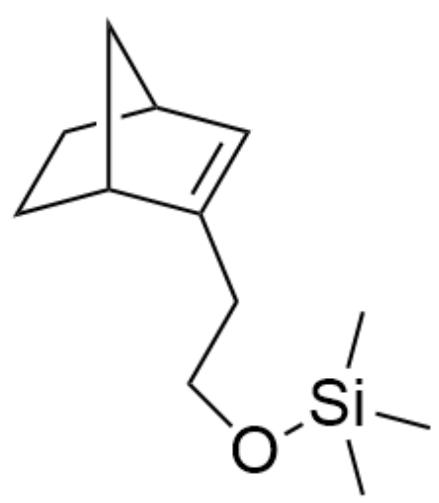

C[Si](C)(C)OCCC1=C[C@H]2CC[C@@H]1C2

F. Compound C is

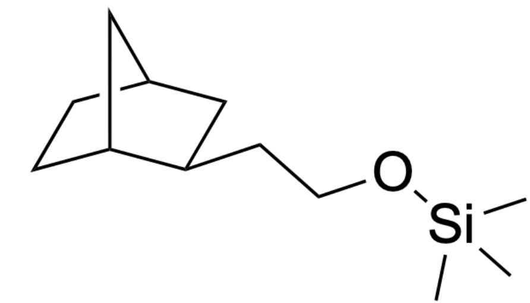

C[Si](C)(C)OCC[C@H]1[C@@H]2CC[C@@H](C2)C1

G. Compound D is

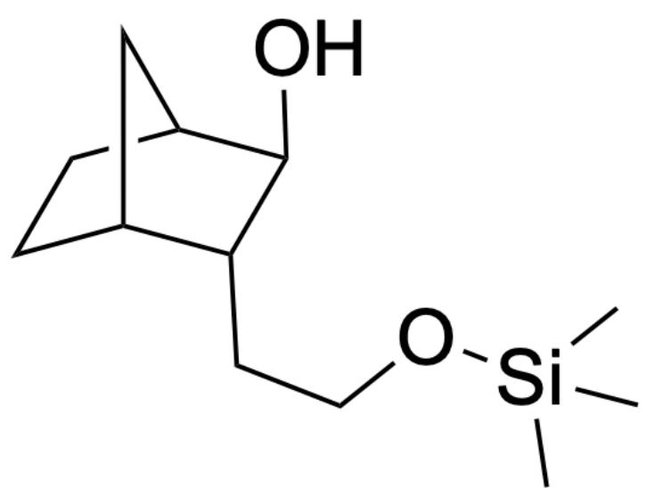

C[Si](C)(OCC[C@@H]1[C@@H]2CC[C@H]([C@H]10)C2)C

H. Compound D is

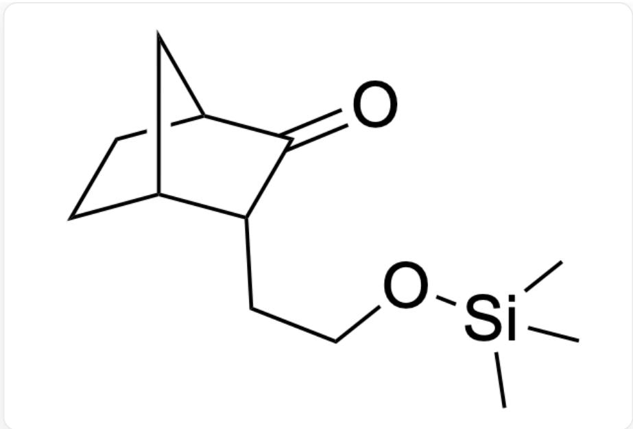  
C[Si](C)(C)OCC[C@@H]1[C@@H]2CC[C@@H](C2)C1=O

Compound E is

  
C[Si](C)(C)OCC[C@@H]1[C@@H]2CC[C@@H](C2)C1=O

J. Compound E is

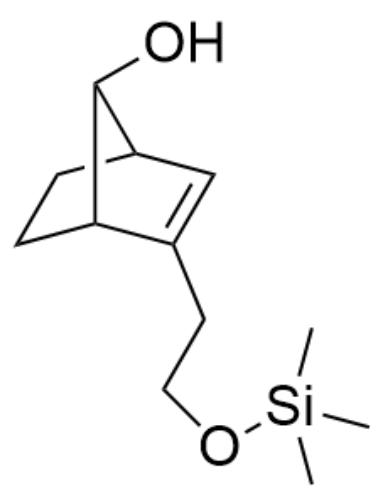

C[Si](C)(C)OCCC1=C[C@H]2CC[C@@H]1[C@H]2O

# Answer

Correct Answer: E

# Detailed Explanation

First, norbornene is

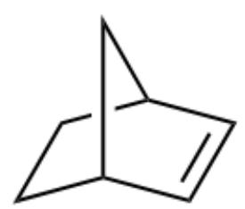

[C@H]12CC[C@@H](C2)C=C1

# CHECKPOINT

0.2 PTS

Norbornene is  $\mathrm{[C@H]12CC[C@@H](C2)C = C1}$

Borane can undergo an addition reaction with alkenes, and under hydrogen peroxide conditions, rearrangement occurs, ultimately yielding the product of apparent water addition to the alkene. Therefore, compound A is

O[C@H]1[C@@H]2CC[C@@H](C2)C1

CHECKPOINT

0.5 PTS

Compound A is O[C@H]1[C@@H]2CC[C@@H](C2)C1

Chromium trioxide can oxidize hydroxyl groups to aldehyde groups, and the aldehyde can condense with p-toluenesulfonylhydrazine to form an imine. Thus, compound B is

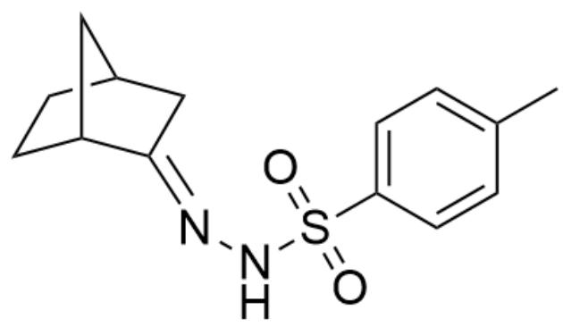

$\mathrm{O = S(N / N = C1[C@@H]2CC[C@@H](C2)C / 1)(C3 = CC = C(C = C3)C) = O}$

# CHECKPOINT

1 PTS

Compound B is  $\mathrm{O} = \mathrm{S}\left( {\mathrm{N}/\mathrm{N} = \mathrm{C}1\left\lbrack  {\mathrm{C}@@\mathrm{H}}\right\rbrack  2\mathrm{{CC}}\left\lbrack  {\mathrm{C}@@\mathrm{H}}\right\rbrack  \left( {\mathrm{C}2}\right) \mathrm{C}/1}\right) \left( {\mathrm{C}3 = \mathrm{{CC}} = \mathrm{C}\left( {\mathrm{C} = \mathrm{C}3}\right) \mathrm{C}}\right)  = \mathrm{O}$

The proton on nitrogen is acidic and can be removed by reaction with a base, resonating to carbon and undergoing nucleophilic addition with ethylene oxide. The resulting oxyanion reacts with trimethylchlorosilane due to the hard-soft acid-base principle. At this stage, the adjacent secondary C-H bond is acidic and can be deprotonated, eliminating the azo and p-toluenesulfonyl groups. Consequently, compound C is

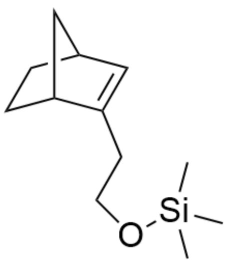

C[Si](C)(C)OCCC1=C[C@H]2CC[C@@H]1C2

# CHECKPOINT

1.5 PTS

Compound C is C[Si](C)(C)OCCC1=C[C@H]2CC[C@@H]1C2

Next, meta-chloroperoxybenzoic acid can convert the alkene group into an epoxide, leading to compound D as

C[Si](C)(OCC[C@]12[C@@H]3CC[C@H]([C@H]1O2)C3)C

# CHECKPOINT

0.5 PTS

Compound D is C[Si](C)(OCC[C@]12[C@@H]3CC[C@H]([C@H]1O2)C3)C

Finally, under acidic conditions, the epoxide group protonates to form a carbocation, which undergoes rearrangement via the norbornene skeleton and elimination, resulting in compound E as

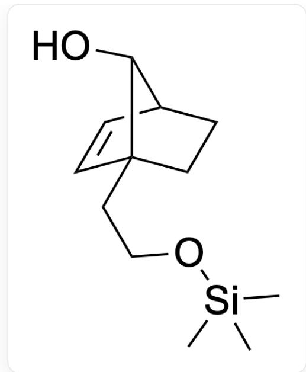

O[C@@H]1[C@@H]2C=C[C@]1(CCO[Si](C)(C)CC2

# CHECKPOINT

2 PTS

Compound E is O[C@@H]1[C@@H]2C=C[C@]1(CCO[Si](C)(C)CC2