# 题目

将降冰片烯先后通过硼烷、碱性条件下的过氧化氢处理后得到化合物A。化合物A进一步通过三氧化铬氧化并与对甲基苯磺酰肼反应后得到化合物B。化合物B进一步通过在正丁基锂作用条件下，与环氧乙烷和三甲基氯硅烷反应，得到化合物C。化合物C与间氯过氧苯甲酸反应得到化合物D。化合物D在酸处理条件下得到化合物E。

请给出所有化合物的结构，并选出下列选项中匹配的选项。

A. 化合物A为

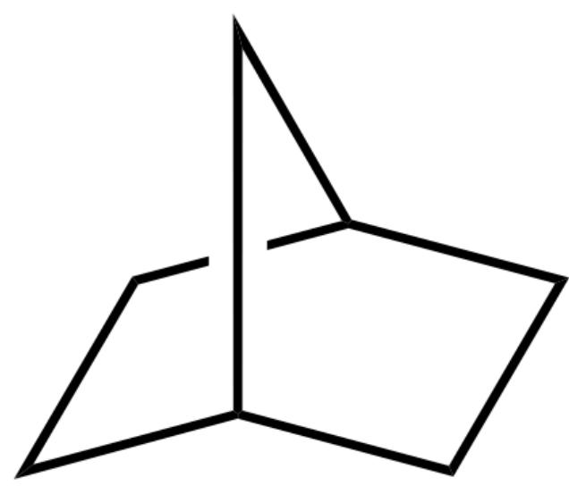

[C@H]12CC[C@@H](C2)CC1

B. 化合物A为

OB(O)[C@H]1[C@@H]2CC[C@@H](C2)C1

C. 化合物B为

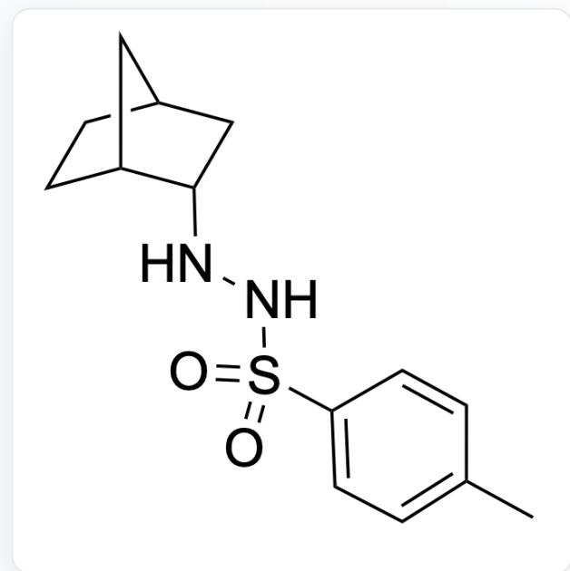

$\mathrm{O = S(NN[C@@H]1[C@@H]2CC[C@@H](C2)C1)(C3 = CC = C(C)C = C3) = O}$

D. 化合物B为

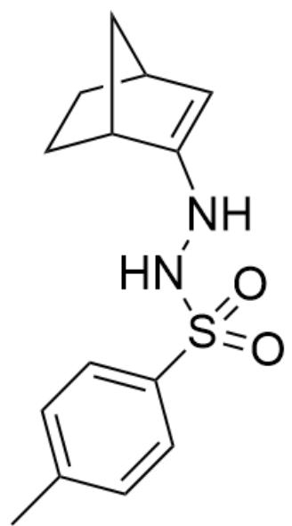

$\mathrm{O = S(NNC1 = C[C@H]2CC[C@@H]1C2)(C3 = CC = C(C)C = C3) = O}$

E. 化合物C为

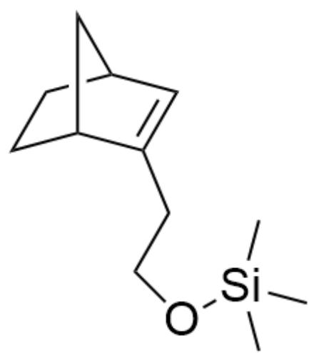

C[Si](C)(C)OCCC1=C[C@H]2CC[C@@H]1C2

F. 化合物C为

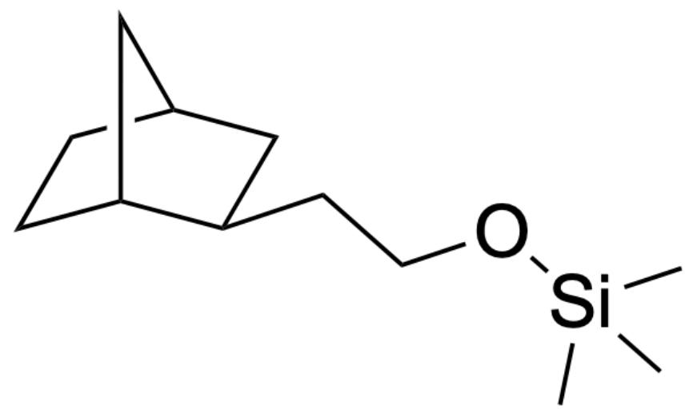

C[Si](C)(C)OCC[C@H]1[C@@H]2CC[C@@H](C2)C1

# G. 化合物D为

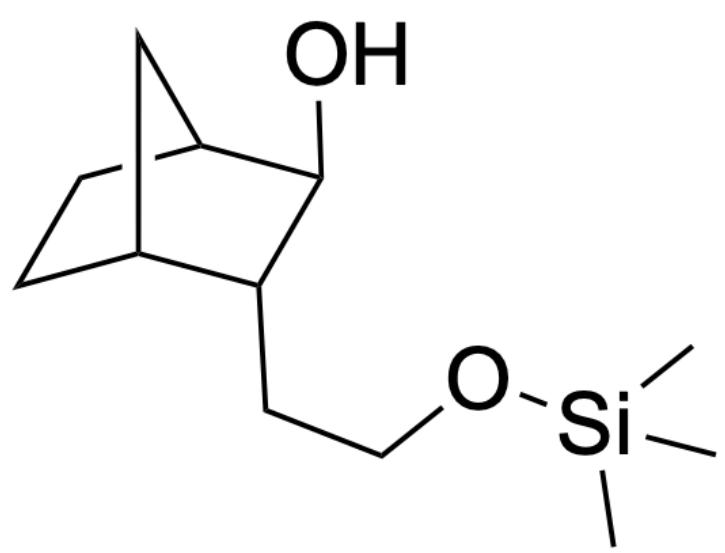

C[Si](C)(OCC[C@@H]1[C@@H]2CC[C@H]([C@H]10)C2)C

# H. 化合物D为

  
C[Si](C)(C)OCC[C@@H]1[C@@H]2CC[C@@H](C2)C1=O

I. 化合物E为

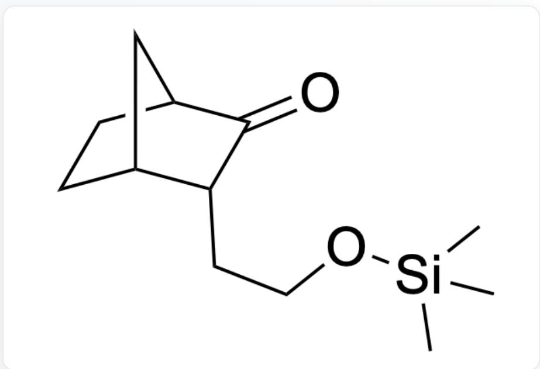  
C[Si](C)(C)OCC[C@@H]1[C@@H]2CC[C@@H](C2)C1=O

J. 化合物E为

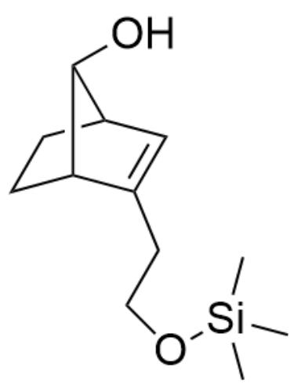

C[Si](C)(C)OCCC1=C[C@H]2CC[C@@H]1[C@H]2O

# 答案

正确答案: E

# 详细解析

首先，降冰片烯为

[C@H]12CC[C@@H](C2)C=C1

# CHECKPOINT

0.2 PTS

降冰片烯为[C@H]12CC[C@@H](C2)C=C1

硼烷和烯能发生加成反应，并且在过氧化氢条件下处理可发生重排，最终得到表观上水与烯烃加成的产物，故而化合物A为

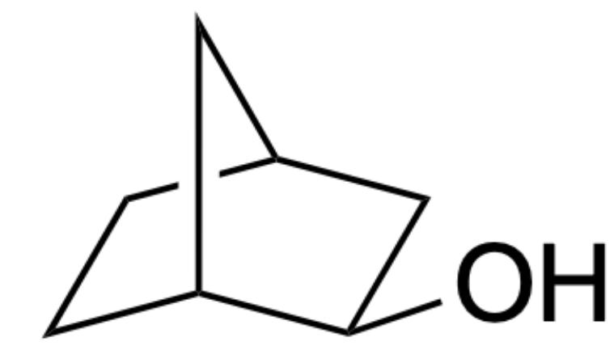

O[C@H]1[C@@H]2CC[C@@H](C2)C1

CHECKPOINT

0.5 PTS

化合物A为O[C@H]1[C@@H]2CC[C@@H](C2)C1

三氧化铬可以将羟基氧化为醛基，而醛基可以和对甲基苯磺酰肼发生缩合生成亚胺，进而化合物B为

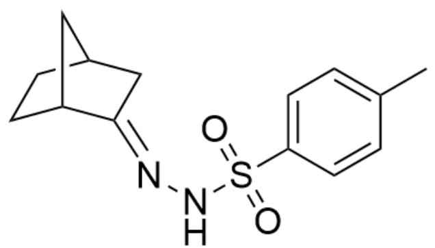

[ \mathrm{O} = \mathrm{S}(\mathrm{N} / \mathrm{N} = \mathrm{C}1[\mathrm{C}@\mathrm{H}]2\mathrm{CC}[\mathrm{C}@\mathrm{H}](\mathrm{C}2)\mathrm{C} / 1)(\mathrm{C}3 = \mathrm{CC} = \mathrm{C}(\mathrm{C} = \mathrm{C}3)\mathrm{C}) = \mathrm{O} ]

# CHECKPOINT

1 PTS

化合物B为O=S(N/N=C1[C@@H]2CC[C@@H](C2)C/1)(C3=CC=C(C=C3)C)=O

氮上的质子有酸性, 与碱反应去除后, 共振到碳上可与环氧乙烷亲核加成, 而得到的氧负离子因为软硬酸碱原理, 和三甲基氯甲烷反应, 且此时邻位二级碳氢有酸性, 可拔去并消除掉偶氮与对甲苯磺酸集团, 进而化合物C为

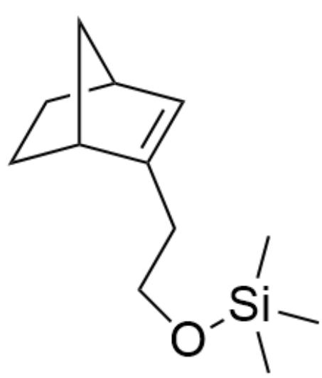

C[Si](C)(C)OCCC1=C[C@H]2CC[C@@H]1C2

# CHECKPOINT

1.5 PTS

化合物C为C[Si](C)(C)OCCC1=C[C@H]2CC[C@@H]1C2

接着，间氯过氧苯甲酸可以将烯基转化为环氧基团，进而化合物D为

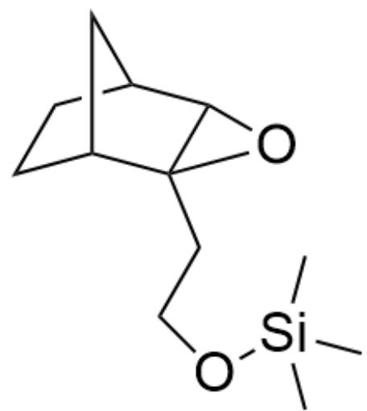

C[Si](C)(OCC[C@]12[C@@H]3CC[C@H]([C@H]1O2)C3)C

# CHECKPOINT

0.5 PTS

化合物D为C[Si](C)(OCC[C@]12[C@@H]3CC[C@H]([C@H]102)C3)C

最后，酸性条件下环氧基团会发生结合质子生成碳正离子，进而可由降冰片烯骨架重排并消除，进而化合物E为

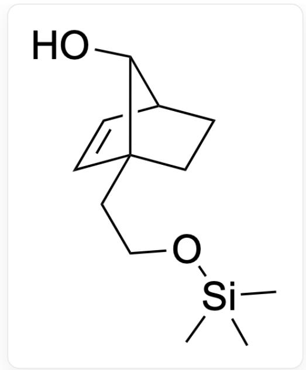

O[C@@H]1[C@@H]2C=C[C@]1(CCO[Si](C)(C)CC2

# CHECKPOINT

2 PTS

化合物E为O[C@@H]1[C@@H]2C=C[C@]1(CCO[Si](C)(C)CC2