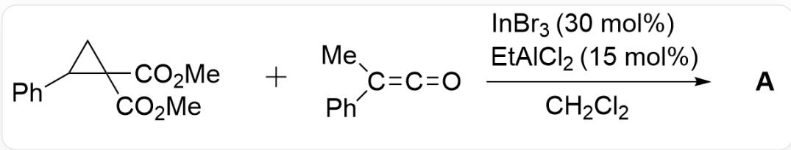
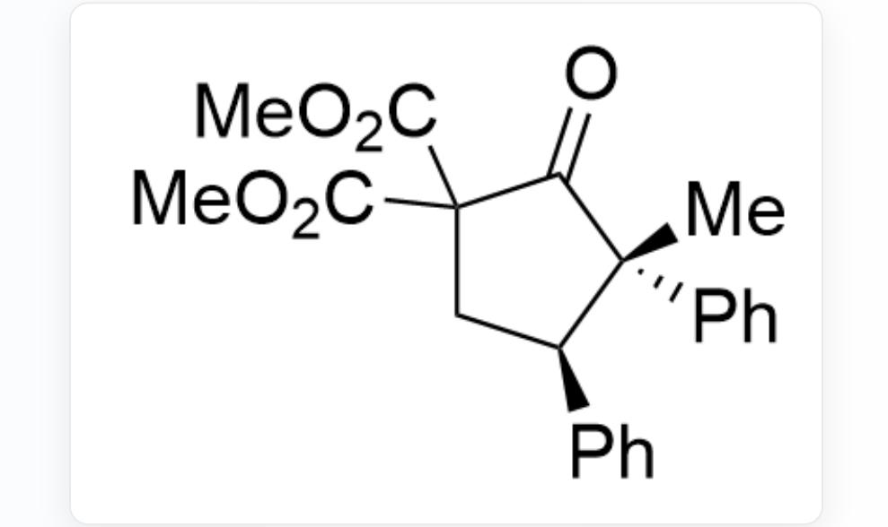
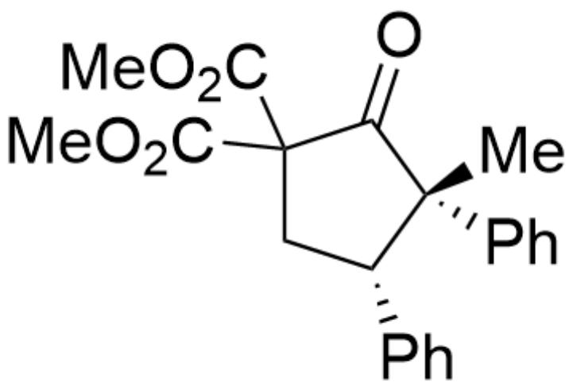
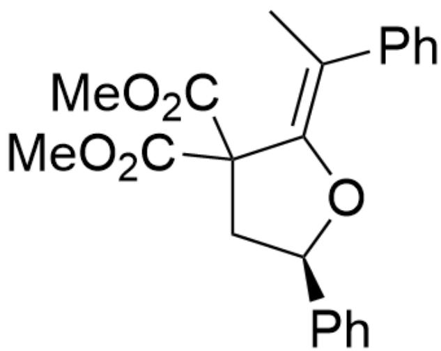
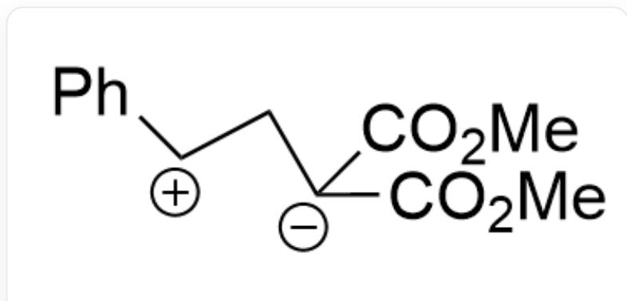

# Question

  
[ \mathrm{O} = \mathrm{C}(\mathrm{C}1(\mathrm{C}(\mathrm{OC}) = \mathrm{O})\mathrm{C}(\mathrm{C}2 = \mathrm{CC} = \mathrm{CC} = \mathrm{C}2)\mathrm{C}1)\mathrm{OC}. \mathrm{O} = \mathrm{C} = \mathrm{C}(\mathrm{C}3 = \mathrm{CC} = \mathrm{CC} = \mathrm{C}3) \mathrm{C} > \mathrm{ClCl}.[\mathrm{EtA}\mathrm{Cl}_2(15\mathrm{mol}\%)].[] InBr₃(30 mol%)][A], A is the thermodynamic product

Given that the thermodynamic product  $\mathbf{A}$  contains a five-membered ring, and the molecular formula of  $\mathbf{A}$  is  $\mathrm{C}_{22}\mathrm{H}_{22}\mathrm{O}_5$ , without considering enantiomers, provide the structural formula of  $\mathbf{A}$

A. All other options are incorrect  
B.

  
[ \mathrm{O} = \mathrm{C}1\mathrm{C}(\mathrm{C}(\mathrm{OC}) = \mathrm{O})(\mathrm{C}(\mathrm{OC}) = \mathrm{O})\mathrm{C}[\mathrm{C}@\mathrm{H}](\mathrm{C}2 = \mathrm{CC} = \mathrm{CC} = \mathrm{C}2)[\mathrm{C}@\mathrm{]}1(\mathrm{C}3 = \mathrm{CC} = \mathrm{CC} = \mathrm{C}3)\mathrm{C} ]

C.

$\mathrm{O = C1C(C(OC) = O)(C(OC) = O)C[C@@H](C2 = CC = CC = C2)[C@]1(C3 = CC = CC = C3)C}$

D.

C/C(C1=CC=CC=C1)=C2C(C(OC)=O)(C(OC)=O)C[C@H](C3=CC=CC=C3)O\2

E.

C/C(C1=CC=CC=C1)=C2C(C(OC)=O)(C(OC)=O)C[C@H](C3=CC=CC=C3)O/2

# Answer

Correct Answer: B

# Detailed Explanation

Based on the molecular formula of product A, it is not difficult to see that the reaction should be, in appearance, a combination reaction between two substrates, and it is speculated that a one-step cycloaddition reaction should have occurred.

# CHECKPOINT

1 PTS

A one-step cycloaddition reaction occurred

Under the induction of Lewis acid, the 1,3-dipole  $\mathbf{1}$  is first generated.

  
1,3-dipole 1:  $\mathrm{O} = \mathrm{C}([\mathrm{C} - ](\mathrm{C}(\mathrm{OC}) = \mathrm{O})\mathrm{C}[\mathrm{CH} + ]\mathrm{C}1 = \mathrm{CC} = \mathrm{CC} = \mathrm{C}1)\mathrm{OC}$

# CHECKPOINT

1 PTS

1,3-dipole 1: O=C([C-](C(OC)=O)C[CH+]C1=CC=CC=C1)OC

Subsequently, the 1,3-dipole undergoes a one-step  $[3 + 2]$  cycloaddition reaction with the ketene. According to the thermodynamic product hint given in the question, it is obvious that the ketone is more stable than the alkenyl ether. At the same time, in the reaction process, the Lewis acid  $\mathrm{In}^{3+}$  may combine with the oxygen on the ketene, thereby reducing the nucleophilicity of the oxygen. In summary, options D and E are excluded.

# CHECKPOINT

1 PTS

The ketone is more stable than the alkenyl ether

# CHECKPOINT

1 PTS

The Lewis acid  $\mathrm{In}^{3+}$  may combine with the oxygen on the ketene, thereby reducing the nucleophilicity of the oxygen

The repulsion is smaller when the aromatic rings are on opposite sides, so the thermodynamic product  $\mathbf{A}$  of the reaction is obtained.

Thermodynamic product A: O=C1C(C(OC)=O)(C(OC)=O)C[C@H](C2=CC=CC=C2)[C@]1(C3=CC=CC=C3)C

# CHECKPOINT

1 PTS

The repulsion is smaller when the aromatic rings are on opposite sides