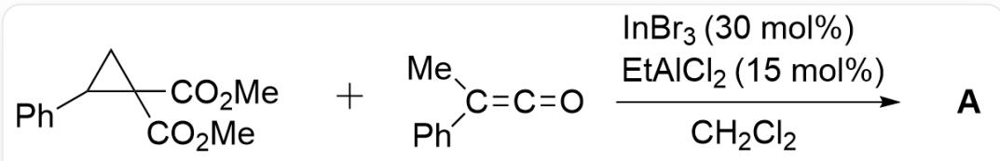
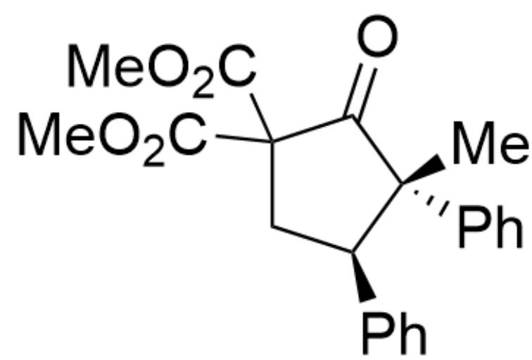
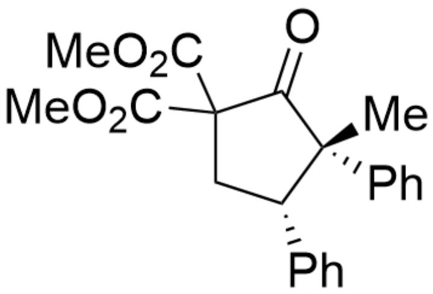
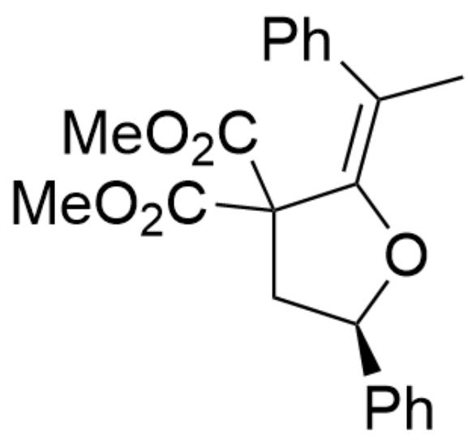
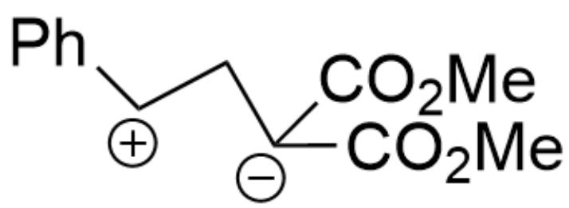
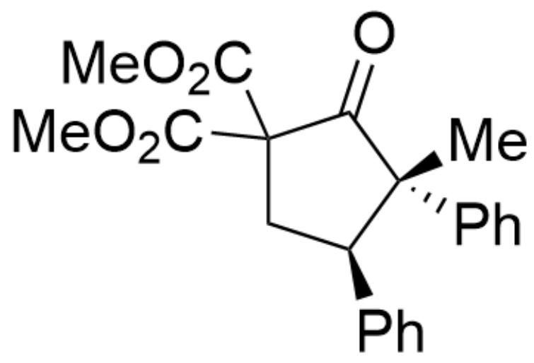

# 题目

  
[ \mathrm{O} = \mathrm{C}(\mathrm{C}1(\mathrm{C}(\mathrm{OC}) = \mathrm{O})\mathrm{C}(\mathrm{C}2 = \mathrm{CC} = \mathrm{CC} = \mathrm{C}2)\mathrm{C}1)\mathrm{OC}. \mathrm{O} = \mathrm{C} = \mathrm{C}(\mathrm{C}3 = \mathrm{CC} = \mathrm{CC} = \mathrm{C}3) \mathrm{C} > \mathrm{ClCl}.[\mathrm{EtA}\mathrm{lCl}_2(15 \mathrm{~mol}\%)].[] InBr₃(30 mol%)][A], A是热力学产物

已知该反应的热力学产物  $\mathbf{A}$  中含有一个五元环,  $\mathbf{A}$  的分子式为  $\mathrm{C}_{22} \mathrm{H}_{22} \mathrm{O}_{5}$ , 不考虑对映异构的条件下, 试给出  $\mathbf{A}$  的结构式

A. 其他选项均不正确  
B.

  
$\mathrm{O = C1C(C(OC) = O)(C(OC) = O)C[C@H](C2 = CC = CC = C2)[C@]1(C3 = CC = CC = C3)C}$

C.

$\mathrm{O = C1C(C(OC) = O)(C(OC) = O)C[C@@H](C2 = CC = CC = C2)[C@]1(C3 = CC = CC = C3)C}$

D.

C/C(C1=CC=CC=C1)=C2C(C(OC)=O)(C(OC)=O)C[C@H](C3=CC=CC=C3)O\2

E.

C/C(C1=CC=CC=C1)=C2C(C(OC)=O)(C(OC)=O)C[C@H](C3=CC=CC=C3)O/2

# 答案

正确答案: B

# 详细解析

根据产物A的分子式不难看出，该反应表观上应为两个底物之间的化合反应，推测应发生了一步环加成反应

CHECKPOINT

1 PTS

发生了一步环加成反应

在路易斯酸的诱导下，首先产生1,3-偶极子 1

1,3-偶极子 1:  $\mathrm{O} = \mathrm{C}([\mathrm{C} - ](\mathrm{C}(\mathrm{OC}) = \mathrm{O})\mathrm{C}[\mathrm{CH} + ]\mathrm{C}1 = \mathrm{CC} = \mathrm{CC} = \mathrm{C}1)\mathrm{OC}$

# CHECKPOINT

1 PTS

1,3-偶极子 1:  $\mathrm{O} = \mathrm{C}([\mathrm{C} - ](\mathrm{C}(\mathrm{OC}) = \mathrm{O})\mathrm{C}[\mathrm{CH} + ]\mathrm{C}1 = \mathrm{CC} = \mathrm{CC} = \mathrm{C}1)\mathrm{OC}$

随后该1,3-偶极子与烯酮发生一步  $[3 + 2]$  环加成反应。根据题干中给出的热力学产物提示，显然酮比烯基醚更加稳定。同时在反应过程中路易斯酸  $\mathrm{In}^{3 + }$  可能会与烯酮上的氧进行结合从而降低氧的亲核性。综上，排除选项D、E

# CHECKPOINT

1 PTS

酮比烯基醚更加稳定

# CHECKPOINT

1 PTS

路易斯酸  $\mathrm{In}^{3+}$  可能会与烯酮上的氧进行结合从而降低氧的亲核性

芳环处于异侧时排斥力更小，因此得到反应热力学产物A

热力学产物A：O=C1C(C(OC)=O)(C(OC)=O)C[C@H](C2=CC=CC=C2)[C@]1(C3=CC=CC=C3)C

# CHECKPOINT

1 PTS

芳环处于异侧时排斥力更小