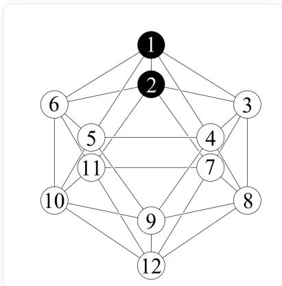
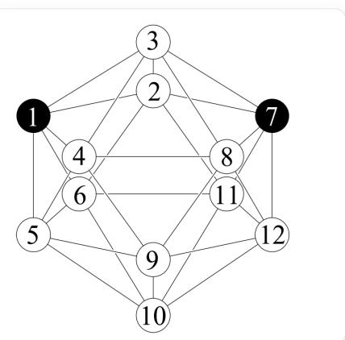

# 题目

“笼行走”策略("CageWalking"Strategy)是一种应用于碳硼烷的金属催化官能团化策略。“笼行走”现象最早由Hawthorne于1971年在nido-  $\mathrm{C}_2\mathrm{B}_9\mathrm{H}_{12}$  体系中观察到，其含义是碳硼烷笼上的金属单元发生1,2-迁移。碳硼烷笼上C原子或B原子上的电荷密度是控制金属原子迁移的重要因素之一。  $o - \mathrm{C}_2\mathrm{B}_{10}\mathrm{H}_{12}$  和 $m - \mathrm{C}_2\mathrm{B}_{10}\mathrm{H}_{12}$  的结构已展示于下图中：黑色代表  $\mathrm{CH_2}$  ，白色代表BH

$o - \mathrm{C}_2\mathrm{B}_{10}\mathrm{H}_{12}$  ..

[H]C1234B567([H])C189([H])B2%10%11([H])B3%12%13([H])B54%14([H])B6%15%16([H])B87%17([H])B9%10%18([H])B9%17%15%19([H])B9%14%12%16([H])B9%18%

$m - \mathrm{C}_2\mathrm{B}_{10}\mathrm{H}_{12}$  ..

[H]B1234C567([H])B189([H])C2%10%11([H])B3%12%13([H])B54%14([H])B6%15%16([H])B87%17([H])B9%10%18([H])B%17%15%19([H])B%14%12%16([H])B%18%

定义正二十面体框架上两个顶点的距离为连接两个顶点所需要边的数目的最小值。由此可以根据到两个碳原子的距离来确定硼原子的化学环境。用一个有序数对  $(a, b)$  来表示硼原子的化学环境，其中  $a$  为硼原子到两个碳原子距离中较小的那个，

$b$  为硼原子到两个碳原子距离中较大的那个，  $(a,b)$  称为该硼原子的距离数对。

分别将两个碳硼烷中所有B原子的电荷密度从高到低排序（具有相同距离数对的硼原子只记录一次），分别将两组排序好的距离数对对应到平面直角坐标系的点，按顺序连接点，得到两组折线，  $o - \mathrm{C}_2\mathrm{B}_{10}\mathrm{H}_{12}$  所得到的折线总长度记作  $x$  ，  $m - \mathrm{C}_2\mathrm{B}_{10}\mathrm{H}_{12}$  所得到的折线总长度记作  $y$  ，则  $\frac{x + y}{x - y}$  的值为：

A. 其他选项均不正确

B. 0

C. 5.4  
D. 10.8  
E. 15.5  
F. 20.9  
G. -5.4  
H. -10.8  
I. -15.5  
J. -20.9

# 答案

正确答案：I

# 详细解析

C的电负性比B大，主要考虑C的诱导吸电子作用

# CHECKPOINT

考虑C的诱导吸电子作用

因此离C原子越远的B原子电荷密度越大；

# CHECKPOINT

离C原子越远的B原子电荷密度越大

据此可以得到  $o - \mathrm{C}_2\mathrm{B}_{10}\mathrm{H}_{12}$  中B原子的电荷密度从高到低排序：

$$
(2, 3) > (2, 2) > (1, 2) > (1, 1)
$$

因此可判断  $x = 3$

# CHECKPOINT

$$
x = 3
$$

由于诱导吸电子作用的衰减较为严重，因此与C原子直接相连的(1.3)电荷密度小于与C原子不直接相连的  $(2,2)$  。

# CHECKPOINT

诱导吸电子作用的衰减较为严重

# CHECKPOINT

与C原子直接相连的(1.3)电荷密度小于与C原子不直接相连的(2,2)

1 PTS

1 PTS

2 PTS

1 PTS

1 PTS

因此可以得到  $m - \mathrm{C}_2\mathrm{B}_{10}\mathrm{H}_{12}$  中B原子的电荷密度从高到低排序：

$$
(2, 2) > (1, 3) > (1, 2) > (1, 1)
$$

因此可判断  $y = 2 + \sqrt{2}$

# CHECKPOINT

$$
y = 2 + \sqrt {2}
$$

$$
\frac {x + y}{x - y} = \frac {\sqrt {2} + 5}{1 - \sqrt {2}} \approx - 1 5. 4 9
$$

# CHECKPOINT

$$
\frac {x + y}{x - y} \approx - 1 5. 4 9
$$

2 PTS

1 PTS