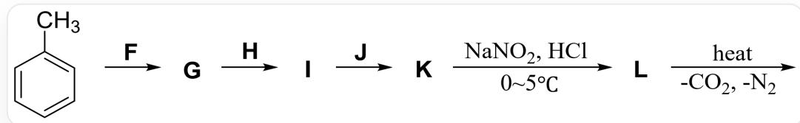
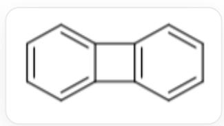
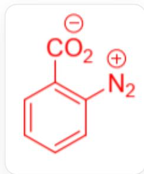
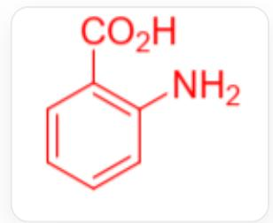
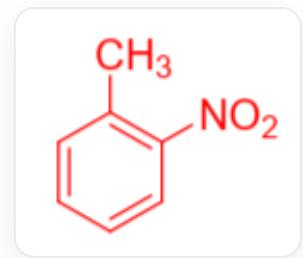
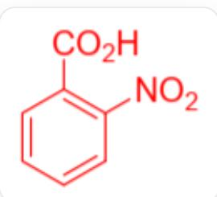

# Question

The final product of the illustrated synthetic route is a hydrocarbon with a relative molecular mass between 150 and 160, whose molecule contains hydrogen atoms in two chemical environments and belongs to the  $D_{2\mathrm{h}}$  point group. Identify the correct statement about it from the following.

The image shows a multi-step reaction: CC1=CC=CC=C1>F[G],[G]>H>[I],[I]>J[K],[K]>O=NO[Na].Cl>[L], [L]>>[Final Product], the reaction from K to L is carried out at  $0\sim 5^{\circ}C$ , and the last step reaction is carried out under heating and produces carbon dioxide and nitrogen

A. The condition  $\mathbf{F}$  may include only one substance (a certain acid).  
B. The condition  $\mathbf{H}$  contains a reducing agent.  
C. The condition  $\mathbf{J}$  contains an oxidant.  
D. The two substituents in  $\mathbf{G}$  are in the para position.  
E. The two substituents of I exhibit different types of electronic effects on the benzene ring.  
F. K can form an inner salt, but the conjugated system of its inner salt is smaller compared to the form without formal charges.  
G. The formal charge within the  $\mathbf{L}$  molecule can be eliminated through the formation of a quinoid structure.  
H. The final product of this synthetic route does not contain structures with ring strain.

# Answer

Correct Answer: F

# Detailed Explanation

The product is a hydrocarbon, and its relative molecular mass is between 150 and 160. Considering that the relative molecular mass of benzene is 78.108, and the last two steps are the formation and elimination of carboxy diazonium salt, it is considered that there may be coupling of two benzene rings in the product.

# CHECKPOINT

1 PTS

The product has two benzene rings

Since the hydrogen of the product has two kinds of chemical environments, it cannot be biphenyl, and a reasonable result is biphenylene.

C12=CC=CC=C1C3=C2C=C3

# CHECKPOINT

1 PTS

The final product is  $\mathrm{C12 = CC = CC = C1C3 = C2C = CC = C3}$

Since the product molecule contains a four-membered ring, option H is incorrect.

# CHECKPOINT

1 PTS

The product contains a four-membered ring

Retrosynthetic analysis starts from the product. From  $\mathbf{L}$  to the product, the condition is heating, removing  $\mathrm{N}_2$ ,  $\mathrm{CO}_2$ , so  $\mathbf{L}$  is carboxy diazonium salt, and inferred from the four-membered ring structure of the product, the carboxy and diazonium groups in  $\mathbf{L}$  are in the ortho position.

# CHECKPOINT

1 PTS

$\mathbf{L}$  is ortho-carboxy diazonium salt

Its structure is

$$
O = C (C 1 = C ([ N + ] \# N) C = C C = C 1) [ O - ]
$$

# CHECKPOINT

1 PTS

L is  $\mathrm{O} = \mathrm{C}(\mathrm{C}1 = \mathrm{C}([\mathrm{N} + ]\# \mathrm{N})\mathrm{C} = \mathrm{CC} = \mathrm{C}1)[\mathrm{O} - ]$

The formal charge of diazonium salt cannot be eliminated by the quinone structure, option G is incorrect.

# CHECKPOINT

1 PTS

The formal charge of diazonium salt cannot be eliminated by the quinone structure

From  $\mathbf{K}$  to  $\mathbf{L}$ , acidic nitrous acid conditions generate diazonium salt. A reasonable reaction is to convert the amino group to diazonium salt, so  $\mathbf{K}$  is amino acid.

$$
N C 1 = C (C (O) = O) C = C C = C 1
$$

# CHECKPOINT

1 PTS

K molecule contains an amino group

# CHECKPOINT

1 PTS

K is NC1=C(C(O)=O)C=CC=C1

After  $\mathbf{K}$  forms an inner salt, the lone pair electrons originally involved in conjugation on the nitrogen atom are used to form an  $\mathrm{N - H}$  bond, and the conjugated system has one less nitrogen atom than the form without a formal charge. Therefore, option F is correct.

# CHECKPOINT

1 PTS

The conjugated system of the inner salt of  $\mathbf{K}$  has one less nitrogen atom than the structure without a formal charge

From the initial substrate toluene to  $\mathbf{K}$ , after three steps of reaction, the carboxyl group in  $\mathbf{K}$  is oxidized from the methyl group, and the common method for introducing amino groups on the benzene ring is to first introduce a nitro group and then reduce it. On the other hand, since the methyl group is an electron-donating group and the carboxyl group is an electron-withdrawing group, in order to place the nitro group in the ortho position, the nitro group needs to be introduced first and then oxidized. Since the amino group has strong reducing properties, the step of oxidizing the methyl group to a carboxyl group needs to be before reducing the nitro group to an amino group. From this, the conditions of  $\mathbf{F}, \mathbf{H}, \mathbf{J}$  and the structures of intermediates  $\mathbf{G}, \mathbf{I}$  can be deduced.

# CHECKPOINT

1 PTS

Nitro group introduction step is before methyl oxidation

# CHECKPOINT

1 PTS

Nitro reduction step is after methyl oxidation

Therefore,  $\mathbf{F}$  is  $\mathrm{H}_2\mathrm{SO}_4$ ,  $\mathrm{HNO}_3$ .  $\mathbf{F}$  involves two acids, and A is incorrect.

# CHECKPOINT

1 PTS

F is  $\mathrm{H}_2\mathrm{SO}_4$  , HNO3

G is CC1=C([N+][[O-])=O)C=CC=C1

$$
C C 1 = C ([ N + ] ([ O - ]) = O) C = C C = C 1
$$

# CHECKPOINT

1 PTS

G is CC1 = C([N+][[O-]]) = O) C = CC = C1

Since  $\mathbf{L}$  is ortho, it is inferred that  $\mathbf{G}$  is also ortho, and  $\mathbf{D}$  is incorrect.

In order to protect the amino group from oxidation, it should be oxidized first and then reduced. Therefore,  $\mathbf{H}$  is an oxidizing agent and  $\mathbf{J}$  is a reducing agent, and both B and C are incorrect.

# CHECKPOINT

1 PTS

$\mathbf{H}$  is an oxidizing agent,  $\mathbf{J}$  is a reducing agent,

The structure of  $\mathbf{I}$  is  $O = C(C1 = C([N + ])([O - ]) = O)C = CC = C1)O$

$$
O = C (C 1 = C ([ N + ] ([ O - ]) = O) C = C C = C 1) O
$$

# CHECKPOINT

1 PTS

I is  $O = C(C1 = C([N + ])([O - ]) = O)C = CC = C1)O$

Among them, both carboxyl and nitro groups have strong electron-withdrawing effects, so option E is incorrect.

# CHECKPOINT

1 PTS

Carboxyl and nitro groups are both electron-withdrawing groups