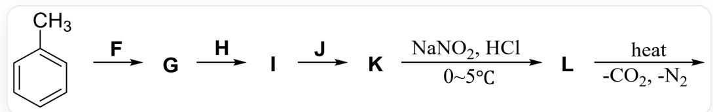
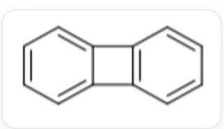
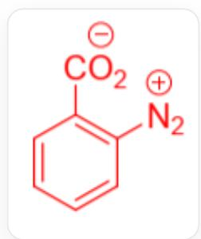
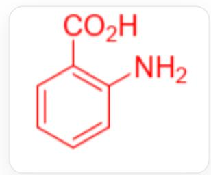
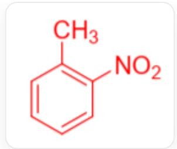
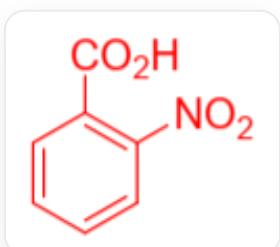

# 题目

图示合成路线的最终产物为某种相对分子质量介于150至160之间的烃，其分子中有两种化学环境的氢，属于  $D_{2\mathrm{h}}$  点群。关于其的以下说法中，找出正确的一项。

  
图片中为多步反应：CC1=CC=CC=C1>F[G],[G]>H>[I],[I]>J[K],[K]>O=NO[Na].Cl>[L],[L]>>[最终产物]，K到L的反应在0~5℃下进行，最后一步反应在加热下进行且产生了二氧化碳和氮气

A. 条件  $\mathbf{F}$  可以仅包含一种物质 (某种酸)。  
B. 条件  $\mathbf{H}$  中含有还原剂。  
C. 条件  $\mathrm{J}$  中含有氧化剂。  
D. G 中两个取代基处于对位。  
E. I的两个取代基对苯环的电子效应类型不同。  
F. K可形成内盐，但其内盐的共轭体系相较于不带形式电荷的形态更小。  
G. L 分子内的形式电荷可通过形成醌式结构消除。  
H. 该合成路线的最终产物不含具有环张力的结构。

# 答案

正确答案: F

# 详细解析

产物为烃，且其相对分子质量介于150至160之间。考虑到苯的相对分子质量是78.108，且最后两步分别是羧基重氮盐的形成和消除，故考虑产物中可能有两个苯环的偶联。

CHECKPOINT

1 PTS

产物有两个苯环

由于产物的氢有两种化学环境，故不能是联苯，合理的结果为双苯并环丁烯。

C12=CC=CC=C1C3=C2C=CC=C3

CHECKPOINT

1 PTS

最终产物为C12=CC=CC=C1C3=C2C=CC=C3

由于产物分子中含有四元环，选项H错误。

# CHECKPOINT

1 PTS

产物含有四元环

从产物开始进行逆合成分析，从  $\mathbf{L}$  到产物，条件为加热，脱去  $\mathrm{N}_2, \mathrm{CO}_2$  ，故  $\mathbf{L}$  为羧基重氮盐，且由产物的四元环结构推断， $\mathbf{L}$  中的羧基和重氮基团处于邻位。

# CHECKPOINT

1 PTS

L为邻位羧基重氮盐

其结构为

$$
O = C (C 1 = C ([ N + ] \# N) C = C C = C 1) [ O - ]
$$

# CHECKPOINT

1 PTS

$\mathbf{L}$  为  $\mathrm{O = C(C1 = C([N + ]\#N)C = CC = C1)[O - ]}$

重氮盐的形式电荷不可通过醌式结构消除，选项G错误。

# CHECKPOINT

1 PTS

重氮盐的形式电荷不可通过醌式结构消除

从  $\mathbf{K}$  到  $\mathbf{L}$ , 酸性亚硝酸条件生成重氮盐, 合理的反应是将氨基转化为重氮盐, 故  $\mathbf{K}$  为氨基酸

NC1=C(C(O)=O)C=CC=C1

# CHECKPOINT

1 PTS

K 分子中有氨基

# CHECKPOINT

1 PTS

K为NC1=C(C(O)=O)C=CC=C1

K 形成内盐后, 氮原子上原本参与共轭的孤对电子用于形成  $\mathrm{N}-\mathrm{H}$  键, 共轭体系比不带形式电荷的形式少一个氮原子。故选项 F 正确。

# CHECKPOINT

1 PTS

$\mathbf{K}$  的内盐的共轭体系比无形式电荷结构少一个氮原子

从最初的底物甲苯到K，经过三步反应，K中的羧基由甲基氧化而来，而苯环上氨基的常见引入方法为先引入硝基再还原。另一方面，由于甲基为给电子基团，而羧基为吸电子基团，为了将硝基上在邻位，需要先引入硝基后氧化。由于氨基具有较强还原型，将甲基氧化为羧基的步骤需位于将硝基还原为氨基之前。由此可推导出F,H,J的条件和中间体G,I的结构。

# CHECKPOINT

1 PTS

硝基引入步骤在甲基氧化前

# CHECKPOINT

1 PTS

硝基还原步骤在甲基氧化后

因此  $\mathbf{F}$  为  $\mathrm{H}_2\mathrm{SO}_4, \mathrm{HNO}_3$ ， $\mathbf{F}$  涉及两种酸，A 错误。

# CHECKPOINT

1 PTS

$\mathbf{F}$  为  $\mathrm{H}_2\mathrm{SO}_4, \mathrm{HNO}_3$

G为CC1=C([N+]([O-]=O)C=CC=C1

$$
C C 1 = C ([ N + ] ([ O - ]) = O) C = C C = C 1
$$

# CHECKPOINT

1 PTS

G为CC1=C([N+]([O-]=O)C=CC=C1

由于  $\mathbf{L}$  是邻位，反推出  $\mathbf{G}$  也是邻位，D错误。

为了保护氨基不受氧化，应当先氧化后还原，因此H为氧化剂，J为还原剂，B和C均错误。

# CHECKPOINT

1 PTS

H为氧化剂，J为还原剂，

I的结构为  $\mathrm{O = C(C1 = C([N + ])([O - ]) = O)C = CC = C1)O}$

$$
O = C (C 1 = C ([ N + ] ([ O - ]) = O) C = C C = C 1) O
$$

# CHECKPOINT

1 PTS

I为O=C(C1=C([N+]([O-]=O)C=CC=C1)O

其中，羧基和硝基都具有强的吸电子效应，故选项E错误。

# CHECKPOINT

1 PTS

羧基和硝基都是吸电子基团