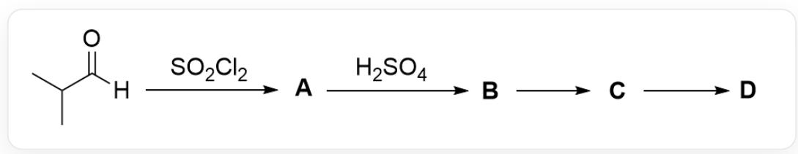

# Question

The image depicts an organic tandem reaction: CC(C)C([H]) = O > O = S(Cl)(Cl) = O > [*,[*] > O = S(O)(O) = O > [B], [B] > [C], [C] > [D].

Known information about the reaction in the image:

1. A contains a carbonyl group.  
2. Reaction conditions for B to C: (a) NaOH,  $185^{\circ}\mathrm{C}$ ; (b) t - BuOK,  $75^{\circ}\mathrm{C}$ .  
3. Reaction conditions for C to D: (c)  $\mathrm{O}_3$ , DCM, MeOH,  $-78^{\circ}\mathrm{C}$ ; (d)  $\mathrm{O}_3$ , DCM,  $-78^{\circ}\mathrm{C}$ ; then  $\mathrm{Me}_2\mathrm{S}$ .  
4. 1 mol of D decomposes above  $-40^{\circ}\mathrm{C}$  to yield a single gaseous product, with a volume of approximately  $74\mathrm{L}$  at room temperature and atmospheric pressure, and a density of about  $1.8\mathrm{kg} / \mathrm{m}^{3}$ .

Which of the following statements about the unknowns  $\mathbf{A} - \mathbf{D}$  is correct?

A. A is acidic  
B. C The average molecular weight of the completely hydrolyzed product does not exceed 85.  
C. There are two chemical environments for hydrogen atoms in D.  
D. To achieve a higher reaction yield for the conversion of B to C, reaction condition (a) should be selected.  
E. In order to achieve a higher reaction yield for the generation of D from C, reaction condition (d) should be selected.

F. None of the above statements are correct

# Answer

Correct Answer: F

# Detailed Explanation

The substrate is an aldehyde. Since A contains a carbonyl group, the aldehyde functional group should be retained. Thionyl chloride serves as the chlorinating reagent, leading to  $\alpha$ -halogenation of the aldehyde, and the product is CC(C)(Cl)C([H])=O. This compound lacks  $\alpha$ -hydrogens, and the aldehyde hydrogen is difficult to dissociate, rendering it essentially non-acidic. Option A is incorrect.

# CHECKPOINT

1 PTS

$\alpha$ -Halogenation of the aldehyde occurs

# CHECKPOINT

1 PTS

A is  $\mathrm{CC}(\mathrm{C})(\mathrm{Cl})\mathrm{C}([\mathrm{H}]) = 0$

The reaction from  $\mathbf{A}$  to  $\mathbf{B}$  is relatively difficult to deduce, so we start with the decomposition of  $\mathbf{D}$ . Based on the fact that  $\mathbf{D}$  decomposes to produce only one gas, and using the ideal gas law, the properties of the gas can be determined:

$$
\mathrm {n} = \mathrm {p V} / \mathrm {R T} = 3. 0 3 \mathrm {m o l}
$$

$$
\mathrm {M} = \rho \mathrm {V _ {m}} = 4 4. 0 1
$$

This indicates that the gas is carbon dioxide, and 3 mol is produced. Therefore, the chemical formula of  $\mathbf{D}$  is inferred to be  $\mathrm{C_3O_6}$ , and its structure can only be  $\mathrm{O = C(OC(O1) = O)OC1 = O}$ . This structure contains no hydrogen atoms, so option C is incorrect.

# CHECKPOINT

1 PTS

D decomposes to produce only carbon dioxide, generating 3 mol

# CHECKPOINT

1 PTS

The chemical formula of  $\mathbf{D}$  is  $\mathrm{C_3O_6}$ , and its structure can only be  $\mathrm{O = C(OC(O1) = O)OC1 = O}$

The conversion of  $\mathbf{C}$  to  $\mathbf{D}$  is clearly an ozonolysis reaction of a double bond, where the double bond cleaves to form carbonyl groups. Thus, the structure of  $\mathbf{C}$  can be deduced as  $\mathrm{C / C(C) = C(O / C(O / 1) = C(C)\backslash C) / OC1 = C(C) / C}$ . Complete hydrolysis of this structure yields only  $\mathrm{CC(C(O) = O)C}$ , with a molecular weight of 88, so option B is incorrect.

# CHECKPOINT

1 PTS

The structure of C is  $\mathrm{C / C(C) = C(O / C(O / 1) = C(C)\backslash C) / OC1 = C(C) / C}$

# CHECKPOINT

1 PTS

Hydrolysis of C yields only CC(C(O)=O)C

The conversion of  $\mathbf{B}$  to  $\mathbf{C}$  occurs under strong base conditions. Based on the double-bond structure of  $\mathbf{C}$ , this is likely an elimination reaction. Combining this with the structure of  $\mathbf{A}$ , it can be inferred that the conversion of  $\mathbf{A}$  to  $\mathbf{B}$  is a trimerization reaction. Under acidic conditions, the carbonyl group is protonated and then attacked by another carbonyl molecule, leading to trimerization. Thus,  $\mathbf{B}$  is CC(C)(Cl)C1OC(C(C)(Cl)C)OC(C(C)(Cl)C)O1.

# CHECKPOINT

1 PTS

B is CC(C)(Cl)C1OC(C(C)(Cl)C)OC(C(C)(Cl)C)O1

The conversion of  $\mathbf{B}$  to  $\mathbf{C}$  is an elimination reaction. However, under high-temperature, strongly basic conditions, hydroxide ions act as strong nucleophiles, making the six-membered ring prone to hydrolysis. Therefore, using a less nucleophilic base like potassium tert-butoxide results in higher yields, so option D is incorrect.

# CHECKPOINT

1 PTS

The conversion of  $\mathbf{B}$  to  $\mathbf{C}$  is an elimination reaction; using a less nucleophilic base like potassium tert-butoxide yields higher efficiency

The conversion of C to D involves ozonolysis of the double bond. If dimethyl sulfide is used to treat the resulting ozonide intermediate, the strong nucleophilicity of the sulfide may open the six-membered ring. Hence, reaction condition (c) is preferable, so option E is incorrect.

# CHECKPOINT

1 PTS

The conversion of  $\mathbf{C}$  to  $\mathbf{D}$  is an ozonolysis reaction; the strong nucleophilicity of the sulfide may open the six-membered ring

In conclusion, options A-E are all incorrect, and option F is correct.