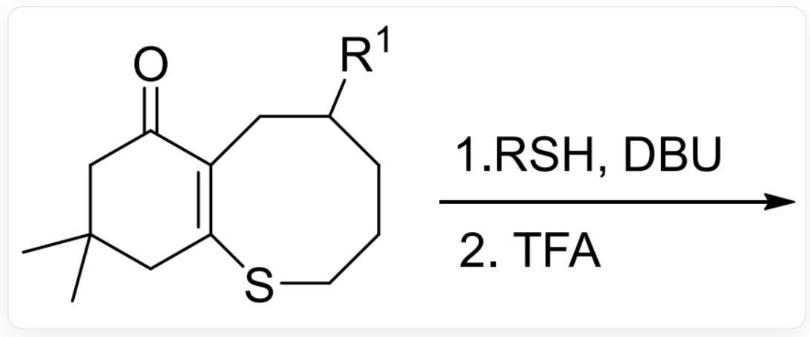
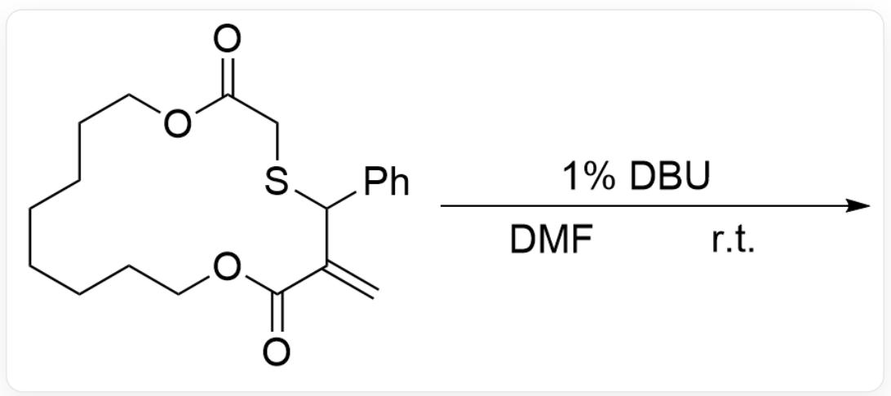
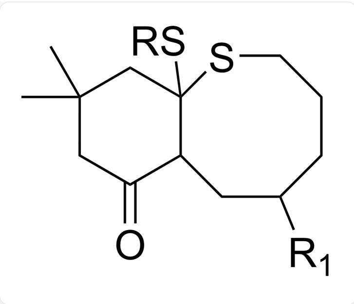
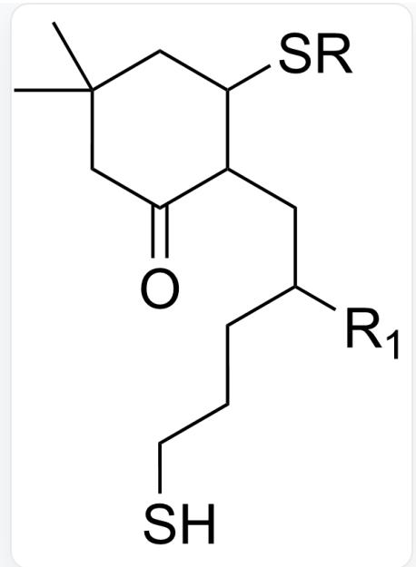
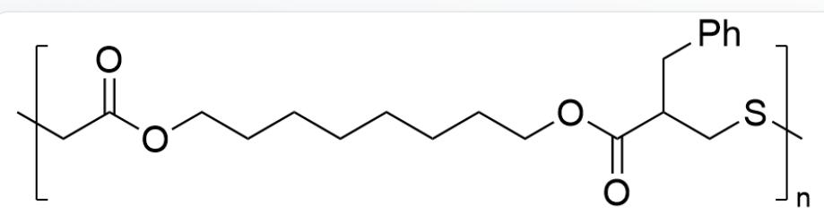
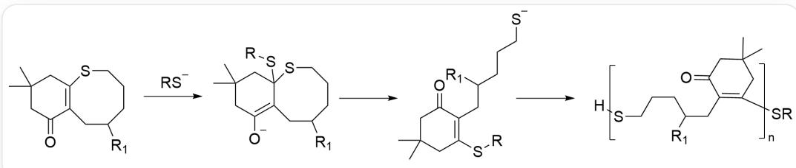

# Question

Here are two reactions:

Reaction 1:

  
CC1(CC(C2=C(SCCCC([R1])C2)C1)=O)C> [R]S.[DBU]>, followed by the addition of TFA to obtain the product

Reaction 2:

  
C=C1C(OCCCCCCCCOC(CSC1C2=CC=CC=C2)=O)=O>[1%DBU].[DMF].[r.t.]>

What are the products of the two reactions, respectively?

A. Reaction 1 involves a key intermediate:

  
CC1(CC(C2C(SCCCC([R1])C2)(S[R])C1)=O)C

B. Reaction 1 has a key intermediate:

  
CC1(CC(C(CC([R1])CCCS[R])C([S-])C1)=O)C

C. Possible by-products of reaction 1:

CC1(CC(C(CC([R1])CCCS)C(S[R])C1)=O)C

D. The product end group of reaction 1 is uncertain.  
E. The product of reaction 2 is:

$\mathrm{O = C(OCCCCCCCCOC(C[X2]) = O)C(CC1 = CC = CC = C1)CS[X1]}$  ，其中X1和X2是重复单元的连接位点

F. The product of reaction 2 is:

$\mathrm{O = C(OCCCCCOC(C[X2]) = O) / C(CS[X1]) = C / C1 = CC = CC = C1}$ , where X1 and X2 are the connection sites of the repeating unit

G. The end group of reaction 2 is defined.  
H. All other options are incorrect.

# Answer

Correct Answer: F

# Detailed Explanation

Reaction 1 is a ring-opening polymerization reaction. DBU, as a strong base, deprotonates RSH to generate a thiolate anion, which then undergoes 1,4-addition to the alpha-beta unsaturated ketone substrate, yielding an enolate intermediate 1. This intermediate undergoes ring-opening to form a thiolate anion intermediate 2. Subsequently, intermediate 2 repeats this process to complete the polymerization. TFA is used to quench the reaction, and the end groups of the product of reaction 1 are RS and H.

  
给人看的

# CHECKPOINT

1 PTS

DBU使RSH去质子化

# CHECKPOINT

1 PTS

硫醇负离子对底物alpha-beta不饱和酮进行1,4-加成

# CHECKPOINT

1 PTS

反应1的关键中间体1为CC1(CC([O-])=C2C(SCCCC([R1])C2)(S[R])C1)C

# CHECKPOINT

1 PTS

反应1的关键中间体2为CC1(CC(C(C([R1])CCC[S-]  $) = C(S[R])C1) = O)C$

Therefore, the structure of option A is not a key intermediate in reaction 1, the R group position in option B is incorrect, the six-membered ring in option C is missing a double bond, D is incorrect, and the end groups are determined.

# CHECKPOINT

0.5 PTS

A的结构不是反应1的关键中间体

# CHECKPOINT

1 PTS

B结构R基位置错误

# CHECKPOINT

1 PTS

C的结构六元环缺少双键

Reaction 2 is a ring-opening polymerization reaction. DBU undergoes 1,4-addition to the alpha-beta unsaturated ketone substrate, yielding an enolate intermediate 1. This intermediate undergoes ring-opening to form a thiolate anion intermediate 2. Subsequently, intermediate 2 repeats this process to complete the polymerization. The end groups of the product are uncertain.

# CHECKPOINT

1 PTS

DBU对对底物alpha-beta不饱和酮进行1,4-加成

# CHECKPOINT

1 PTS

反应2的产物为O=C(OCCCCCCCCCOC(C[X2])=O)/C(CS[X1])=C/C1=CC=CC=C1，其中X1和X2是重复单元的连接位点

The repeating unit structure in option E is incorrect, with an extra S and missing a C-C double bond. Option F is correct, and option G is incorrect. The end groups are uncertain.

# CHECKPOINT

1 PTS

E结构重复单元多了一个S原子，少了一个C-C双键