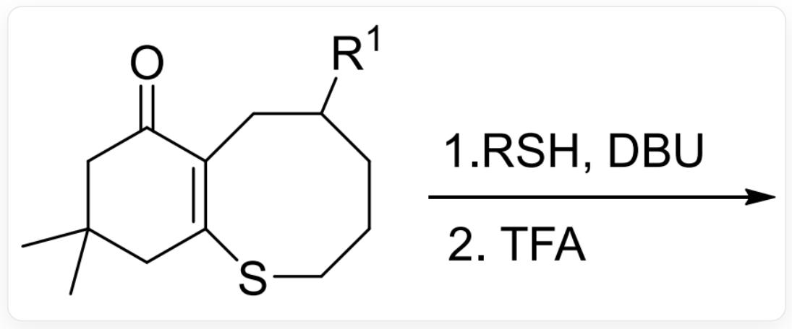
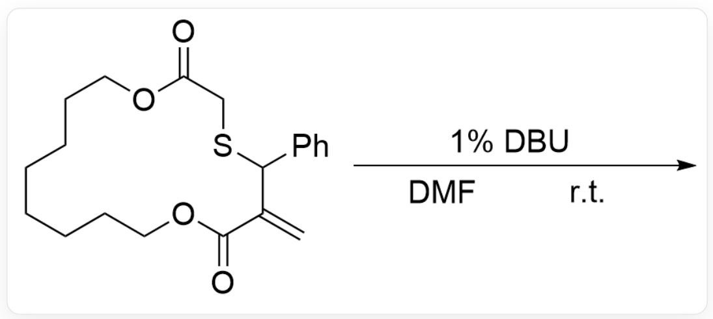
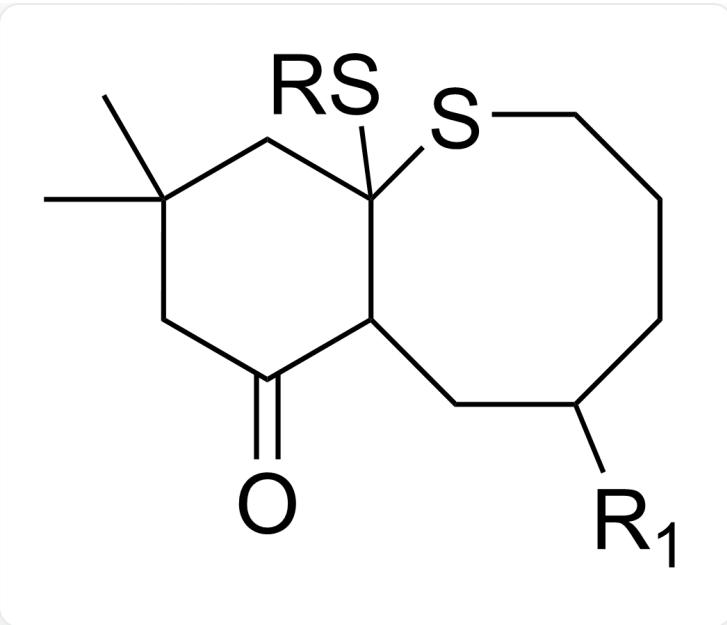
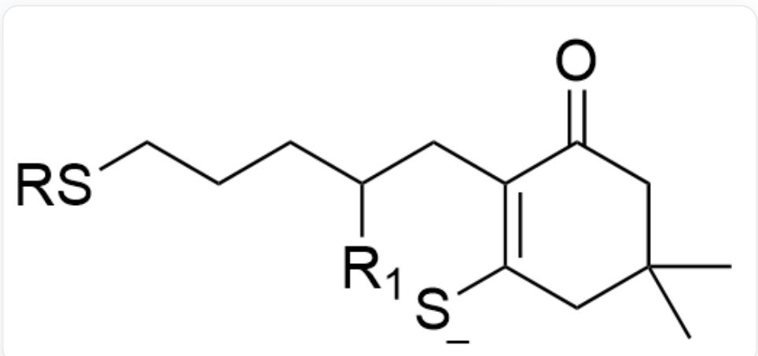
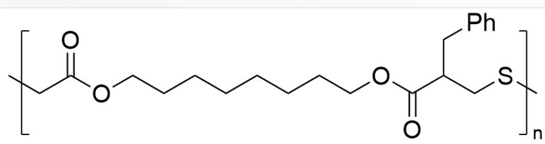
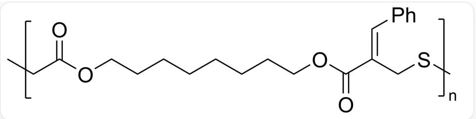
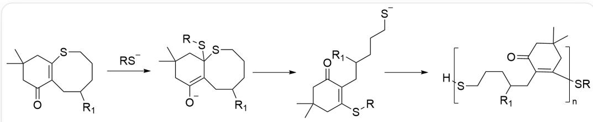

# 题目

下面有两个反应

反应1:

  
CC1(CC(C2=C(SCCCC([R1])C2)C1)=O)C> [R]S.[DBU]>，随后加入TFA得到产物

反应2:

  
C=C1C(OCCCCCCCCCCOC(CSC1C2=CC=CC=C2)=O)=O> [1%DBU].[DMF].[r.t.]>

下面说法正确的是？

A. 反应1存在关键中间体:

  
CC1(CC(C2C(SCCCC([R1])C2)(S[R])C1)=O)C

B. 反应1存在关键中间体:

  
CC1(CC(C(CC([R1])CCCS[R])C([S-])C1)=O)C

C. 反应1的可能存在副产物:

CC1(CC(C(CC([R1])CCCS)C(S[R])C1)=O)C

D. 反应1的产物端基不确定  
E. 反应2的产物为:

$\mathrm{O = C(OCCCCCOC(C[X2]) = O)C(CC1 = CC = CC = C1)CS[X1]}$  ，其中X1和X2是重复单元的连接位点

F. 反应2的产物为:

$\mathrm{O = C(OCCCCCOC(C[X2]) = O) / C(CS[X1]) = C / C1 = CC = CC = C1}$ , 其中X1和X2是重复单元的连接位点

G. 反应2的端基是确定的  
H. 其他选项均不正确

# 答案

正确答案: F

# 详细解析

反应1为开环聚合反应，DBU作为强碱使RSH去质子化生成硫醇负离子对底物alpha-beta不饱和酮进行1,4-加成得到烯醇负离子中间体1，该中间体开环得到硫醇负离子中间体2，随后中间体2重复该过程完成聚合，TFA用于淬灭反应，反应1产物的端基为RS和H。

  
给人看的

# CHECKPOINT

1 PTS

DBU使RSH去质子化

# CHECKPOINT

1 PTS

硫醇负离子对底物alpha-beta不饱和酮进行1,4-加成

# CHECKPOINT

1 PTS

反应1的关键中间体1为CC1(CC([O-])=C2C(SCCCC([R1])C2)(S[R])C1)C

# CHECKPOINT

1 PTS

反应1的关键中间体2为CC1(CC(C(CC([R1]))CCC[S-])=C(S[R])C1)=O)C

因此，选项A的结构不是反应1的关键中间体，选项B结构R基位置错误，选项C六元环缺少双键，D错误，端基确定

# CHECKPOINT

0.5 PTS

A的结构不是反应1的关键中间体

# CHECKPOINT

1 PTS

B结构R基位置错误

# CHECKPOINT

1 PTS

C的结构六元环缺少双键

反应2为开环聚合反应，DBU对对底物alpha-beta不饱和酮进行1,4-加成得到烯醇负离子中间体1，该中间体开环得到硫醇负离子中间体2，随后中间体2重复该过程完成聚合，产物的端基不确定。

# CHECKPOINT

1 PTS

DBU对对底物alpha-beta不饱和酮进行1,4-加成

# CHECKPOINT

1 PTS

反应2的产物为O=C(OCCCCCCCCCOC(C[X2])=O)/C(CS[X1])=C/C1=CC=CC=C1，其中X1和X2是重复单元的连接位点

选项E重复单元结构错误，少了一个C-C双键，选项F正确，选项G错误，端基不确定

# CHECKPOINT

1 PTS

E结构重复单元少了一个C-C双键