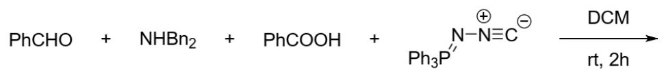
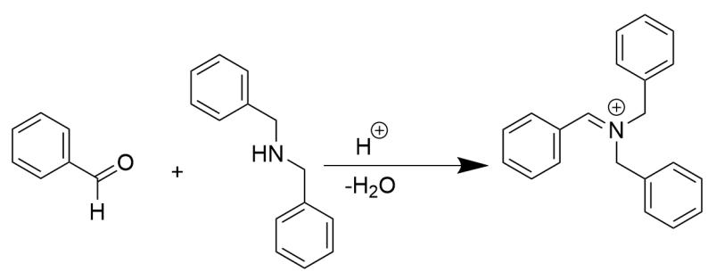
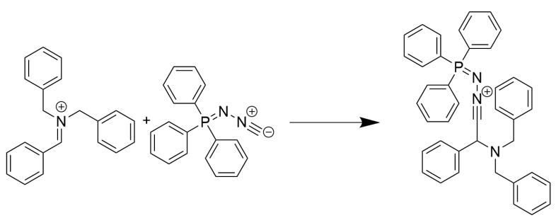
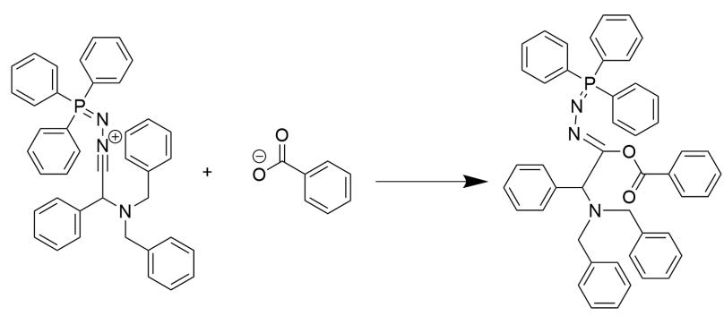
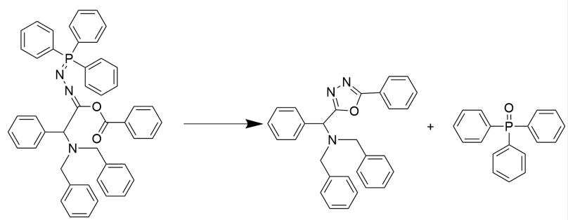

# 题目

如下一锅反应实现了Ugi和aza-Wittig反应的串联

以分子SMILES表示，反应物为O=CC1=CC=CC=C1，C1(CNCC2=CC=CC=C2)=CC=CC=C1，O=C(O)C1=CC=CC=C1，[C-]#[N+]N=P(C1=CC=CC=C1)(C2=CC=CC=C2)C3=CC=CC=C3，反应条件为室温在二氯甲烷中反应两小时，生成产物

关于此反应，有以下说法，判断哪些是正确的：

1.该反应是离子反应  
2.产物含有4个环  
3.产物含有3个氮原子，且氮原子最远相距4个原子  
4.反应主要副产物分子量大于250

A. 其他选项均不正确  
B. 1  
C. 2  
D. 3  
E. 4  
F. 1,2  
G. 1,3  
H. 1,4  
1. 2,3  
J. 2,4  
K. 3,4

# 答案

正确答案: H

# 详细解析

由题意，本题是  $Ugi$  反应和  $aza - Wittig$  的串联一锅煮反应。对反应物进行分析：

体系中反应性最高的是二级胺和醛基，部分电离的羧酸提供了氢离子，在此作用下，二者容易通过亲核加成-消除，失水缩合为亚胺离子。

  
反应用SMILES表示为：  $O = C([H])C1 = CC = CC = C1.C2(CNCC3 = CC = CC = C3) = CC = CC = C2 > [H + ].O > C4 / (C = [N + ])$ $(\mathrm{CC5} = \mathrm{CC} = \mathrm{CC} = \mathrm{C5}) / \mathrm{CC6} = \mathrm{CC} = \mathrm{CC} = \mathrm{C6}) = \mathrm{CC} = \mathrm{CC} = \mathrm{C4}$

# CHECKPOINT

1 PTS

生成亚胺离子中间体C4(/C=[N+](CC5=CC=CC=C5)/CC6=CC=CC=C6)=CC=CC=C4

此时亚胺离子放大了原有羰基位点的缺电性，而此时体系中异腈由于其碳原子处于端基且带一个负电荷，亲和性较强，二者随即发生亲核加成生成腈离子：

  
反应用SMILES表示为：[C-]#[N+]N=P(C1=CC=CC=C1)(C2=CC=CC=C2)C3=CC=CC=C3.C4(/C=[N+(CC5=CC=CC=C5)]CC6=CC=CC=C6)=CC=CC=C4>>C7(C(C# [N+]N=P(C8=CC=CC=C8)(C9=CC=CC=C9)C%10=CC=CC=C%10)N(CC%11=CC=CC=C%11)CC%12=CC=CC=C%12)=CC=CC=C7

# CHECKPOINT

1 PTS

生成 腈 錾 离 子 中 间 体 C7(C#[N+]N=P(C8=CC=CC=C8)

$(\mathrm{C9 = CC = CC = C9})\mathrm{C}\% 10 = \mathrm{CC} = \mathrm{CC} = \mathrm{C}\% 10)\mathrm{N}(\mathrm{CC}\% 11 = \mathrm{CC} = \mathrm{CC} = \mathrm{C}\% 11)\mathrm{CC}\% 12 = \mathrm{CC} = \mathrm{CC} = \mathrm{C}\% 12) = \mathrm{CC} = \mathrm{CC} = \mathrm{C7}$

此时由于电离的羧基负离子具有一定亲核性，并由于羧基氧与磷原子产生一定的配位作用，所以较为容易地对腈鎘离子进行亲核加成生成第二个亚胺中间体：

[ \text{[O-]C(C1=CC=CC=C1)=O.C2(C(C#[N+]N=P)(C3=CC=CC=C3)} ]

(C4=CC=CC=C4)C5=CC=CC=C5)N(CC6=CC=CC=C6)CC7=CC=CC=C7)=CC=CC=C2>>O=C(O/C(C(N(CC8=CC=CC=C8)CC9=CC=CC=C9)C%10=CC=CC=C%10)=NN=P

(C%12=CC=CC=C%12)C%13=CC=CC=C%13)C%14=CC=CC=C%14

# CHECKPOINT

1 PTS

生成第二个亚胺中间体  $\mathrm{O} = \mathrm{C}(\mathrm{O} / \mathrm{C}(\mathrm{C}(\mathrm{N}(\mathrm{CC8} = \mathrm{CC} = \mathrm{CC} = \mathrm{C8}))\mathrm{CC9} = \mathrm{CC} = \mathrm{CC} = \mathrm{C9})\mathrm{C}\% 10 = \mathrm{CC} = \mathrm{CC} = \mathrm{C}\% 10) = \mathrm{N}\backslash \mathrm{N} = \mathrm{P}(\mathrm{C}\% 11 = \mathrm{CC} = \mathrm{CC} = \mathrm{C}\% 11)$ $(\mathrm{C}\% 12 = \mathrm{CC} = \mathrm{CC} = \mathrm{C}\% 12)\mathrm{C}\% 13 = \mathrm{CC} = \mathrm{CC} = \mathrm{C}\% 13)\mathrm{C}\% 14 = \mathrm{CC} = \mathrm{CC} = \mathrm{C}\% 14$

最后，由题意会发生一步杂原子  $aza - Wittig$  反应，我们注意到该中间体含有氮磷双键和碳氧双键，由于磷原子亲氧的特性，且反应后生成五元环和三苯氧磷，热力学稳定，此步Wittig反应在动力学和热力学上均处于有利地位，故发生：

反应用SMILES表示为：O=C(OC(C(N(CC1=CC=CC=C1)CC2=CC=CC=C2)C3=CC=CC=C3)=NN=P(C4=CC=CC=C4)

$(C5 = CC = CC = C5)C6 = CC = CC = C6)C7 = CC = CC = C7 > > O = P(C8 = CC = CC = C8)$

$(C9 = CC = CC = C9)C\% 10 = CC = CC = C\% 10.C\% 11(C(C\% 12 = NN = C(C\% 13 = CC = CC = C\% 13)O\% 12)N(CC\% 14 = CC = CC = C\% 14)CC\% 15 = CC = CC = C\% 15) = CC = CC = C\% 11$

# CHECKPOINT

1 PTS

得到产物C%11(C(C%12=NN=C(C%13=CC=CC=C%13)O%12)N(CC%14=CC=CC=C%14)CC%15=CC=CC=C%15)=CC=CC=C%11

因此，此反应为离子机理反应。

产物含有四个苯环和一个新生成的杂环，共五个环，而非四个环。

观察产物结构，产物含有3个氮原子，且氮原子最远相距3个原子而非4个。

反应会产生副产物为三苯氧磷，分子量278大于250。

综上所述，1,4正确。