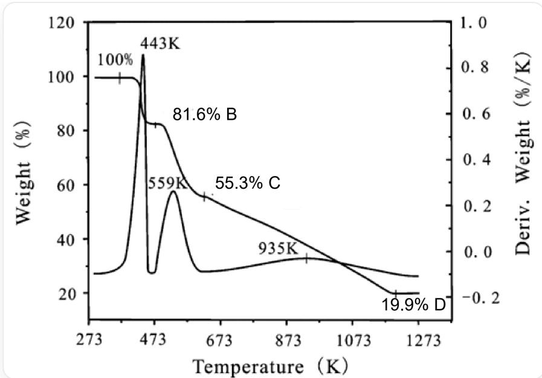
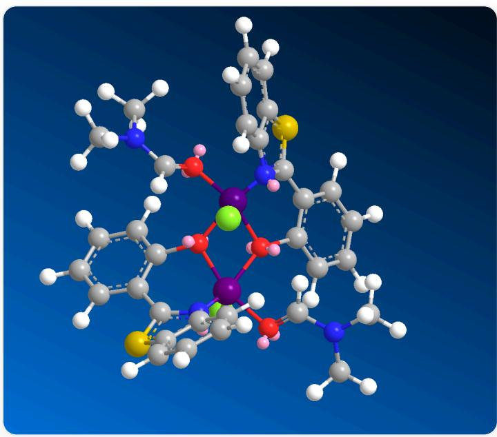

# Question

$\mathrm{CuCl}_2 \cdot 2\mathrm{H}_2\mathrm{O}$  (1 mmol,  $20\mathrm{mLCH}_3\mathrm{COCH}_3$  )

and

2-(2-hydroxyphenyl)benzothiazole

(1 mmol, 20 mL DMF) were stirred at room temperature for 1 h, then filtered, and the filtrate was slowly evaporated. After three weeks, some dark red rhombic single crystals were obtained from the mother liquor. The product was isolated, washed with deionized water and DMF, and dried in a vacuum desiccator containing  $\mathrm{P_4O_{10}}$  to yield compound A. Elemental analysis indicated that A contained C: 48.24% and N: 7.03%, with the copper ion being five-coordinate and the presence of a symmetric center in the molecule.

The thermal decomposition curve of compound A is shown below.

The figure shows the thermal decomposition diagram of compound A. The horizontal axis is labeled Temperature (K), with tick marks starting at 273 K and extending to the right at intervals of 200 K, labeled as 473, 673, 873, 1073, and 1273 K. The left vertical axis is labeled Weight (%), with values ranging from 0 (bottom) to 120 (top) at intervals of 20 (0, 20, 40, 60, 80, 100, 120). The right vertical axis is labeled Deriv. Weight (%/K), with values ranging from -0.3 (bottom) to 1.0 (top) at intervals of 0.2 (-0.2, 0.0, 0.2, 0.4, 0.6, 0.8, 1.0). There are two curves in the figure. The first curve starts from the far left at 273 K and extends to the far right at 1273 K. It exhibits four plateau regions corresponding to A (280K~450K, marked at 443K, 100%), B (450 K~500K, marked at 473K, 81.6%), C (580K~620K, marked around 600K, 55.3%), and D (1200K~1300K, marked around 1220K, 19.9%). Sharp downward transitions occur after points A and B, while the curve between C and D slopes gently downward. The second curve starts from the far left at 273 K (corresponding to left values between 20%-40% and right values between -0.2%/K and 0.0%/K) and extends to the far right at 1273 K (corresponding to left values between 20%-40% and right values between -0.2%/K and 0.0%/K). It exhibits three peaks: the first peak is at 443 K (corresponding to left values between 100%-120% and right values between 0.8%/K and 1.0%/K), the second peak is at 559 K (corresponding to left values between 40%-60% and right values between 0.2%/K and 0.4%/K), and the third peak is at 935 K (corresponding to left values between 20%-40% and right values between -0.2%/K and 0.0%/K). The first peak is very sharp, the height of the second peak is less than half that of the first peak, and the third peak is very gentle with minor fluctuations.

The following options are correct:

A. In compound A, only 2-(2-hydroxyphenyl)benzothiazole is coordinated.

B. The molecular point group of compound A is  $C_{2v}$  
C. The chemical formula of A is  $\mathrm{C_{16}H_{15}ClCuN_2O_2S}$ .  
D. From the thermal decomposition diagram, it can be concluded that during the transformation of compound A to compound B upon heating, one DMF molecule is lost (the molecular formula of compound A minus one DMF molecule).  
E. From the thermolysis diagram, it can be concluded that the temperature at which compound A completely transforms into compound B upon heating does not reach the boiling point of the lost solvent molecules.  
F. The compound D is a typical ionic crystal, which must belong to the tetragonal crystal system.  
G. The compound D may be a black semiconductor, soluble in dilute hydrochloric acid and dilute sulfuric acid.  
H. None of the above options are correct

# Answer

Correct Answer: G

# Detailed Explanation

The structure of 2-(2-hydroxyphenyl)benzothiazole is OC1=CC=CC=C1C2=NC3=CC=CC=C3S2, where O and N are expected to be the coordinating atoms.

# CHECKPOINT

1 PTS

In 2-(2-hydroxyphenyl)benzothiazole, O and N should be the coordinating atoms

Based on the mass fractions of C and N, the ratio of C to N is 8:1. For a single 2-(2-hydroxyphenyl)benzothiazole ligand, the C to N ratio is 13:1. Therefore, DMF is required to balance the atoms.

# CHECKPOINT

1 PTS

Solvent coordination is present

The C to N ratio in DMF is 3:1, so the calculated ratio of 2-(2-hydroxyphenyl)benzothiazole to DMF is 1:1.

Since the problem states that copper in compound A is five-coordinated, two additional coordination bonds are needed. Based on the nitrogen mass fraction of  $7.03\%$ , the total relative molecular mass is deduced to be 398. Subtracting one 2-(2-hydroxyphenyl)benzothiazole ligand and one DMF leaves approximately 36. If two water molecules were present, the molecule would lack a symmetric center. Considering that the ligands are not water but chloride ions and that compound A is a dimer, the two copper atoms are connected by an oxygen bridge.

# CHECKPOINT

1 PTS

Compound A is a dimer, with chloride ions coordinating

The final chemical formula of compound  $\mathbf{A}$  is  $\left[\mathrm{C}_{16} \mathrm{H}_{15} \mathrm{ClCuN}_{2} \mathrm{O}_{2} \mathrm{~S}\right]_{2}$ .

# CHECKPOINT

2 PTS

The chemical formula of compound A is  $\left[\mathrm{C}_{16} \mathrm{H}_{15} \mathrm{ClCuN}_{2} \mathrm{O}_{2} \mathrm{~S}\right]_{2}$

The structure is  $[H]/C(N(C)C)=O\backslash[Cu]12([N]3=C(C4=CC=CC=C4O1[Cu]5(Cl)(O2C6=CC=CC=C6C7=[N]5C8=CC=CC=C8S7)/O=C(N(C)C)\backslash[H])SC9=CC=CC=C39)Cl.$

Chem3D structure diagram of compound A, where gray spheres represent carbon atoms, white spheres represent hydrogen atoms, blue spheres represent nitrogen atoms, yellow spheres represent sulfur atoms, red spheres represent oxygen atoms, purple spheres represent copper atoms, and pink spheres represent LPs appearing after MM2 calculations

This compound has a symmetric center. The Chem3D diagram reveals the molecular structure, and the possibility of a  $C_2$  axis cannot be ruled out. However, there is definitely no mirror plane containing the rotation axis, so the point group of the molecule cannot be  $C_{2v}$ .

# CHECKPOINT

1 PTS

Compound A has a symmetric center, and the possibility of a  $C_2$  axis cannot be ruled out, but there is definitely no mirror plane containing the rotation axis

Options A, B, and C are incorrect.

From the thermal decomposition diagram, one curve is the thermogravimetric (TG) curve, and the other is the derivative thermogravimetric (DTG) curve, i.e., the derivative of the TG curve. The mass of compound B is  $81.6\%$  of that of compound A, corresponding to a mass loss of 146, which matches the mass of two DMF molecules. Compound A loses two DMF molecules to form compound B.

# CHECKPOINT

1 PTS

Compound A loses two DMF molecules to form compound B

The boiling point of DMF is  $153^{\circ}\mathrm{C}$  (426 K), while the TG curve shows compound B appears at 473 K, which is higher than the boiling point of DMF. Therefore, option D is incorrect.

Compound D accounts for  $19.9\%$  of compound A, corresponding to a mass of 158. Considering the temperature is around  $1200\mathrm{K}$ $(927^{\circ}\mathrm{C})$ , the remaining compound D is likely an inorganic copper compound, possibly CuO (since the dimer contains two Cu atoms, it should be two CuO molecules) or  $\mathrm{Cu}_{2}\mathrm{S}$ .

# CHECKPOINT

1 PTS

Compound D may be copper oxide or copper(I) sulfide

Both compounds are black solids.  $\mathrm{CuO}$  is a semiconductor, soluble in dilute hydrochloric and sulfuric acids, and is an ionic crystal belonging to the monoclinic system.  $\mathrm{Cu}_{2} \mathrm{~S}$  has good conductivity but is only soluble in hot concentrated sulfuric acid. It is an ionic crystal with two polymorphs:  $\alpha$  and  $\beta$ , where  $\alpha-\mathrm{Cu}_{2} \mathrm{~S}$  crystallizes in the orthorhombic system and  $\beta-\mathrm{Cu}_{2} \mathrm{~S}$  in the hexagonal system. Therefore, option F is incorrect, and option G is correct.