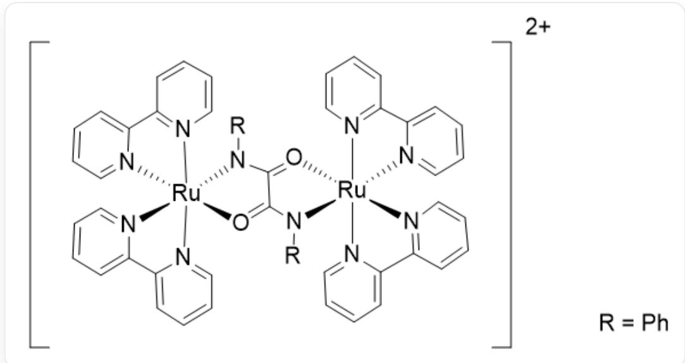
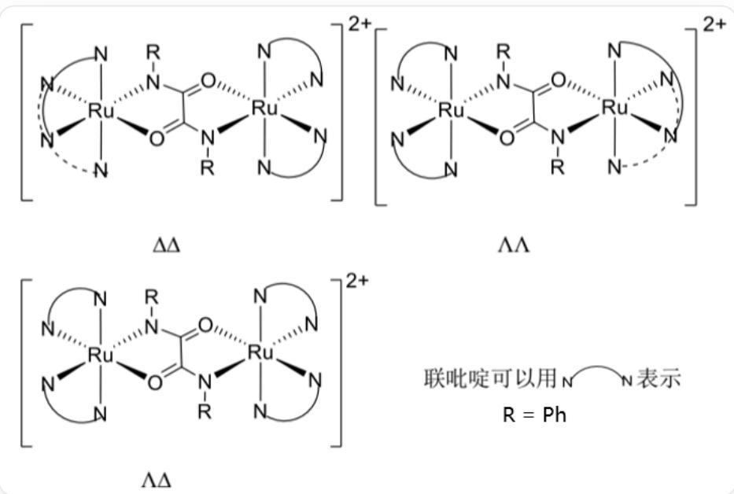
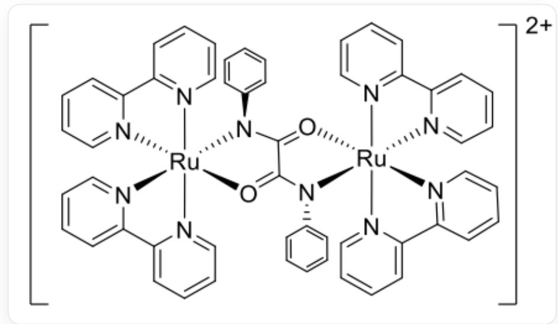

# Question

Oxalyl chloride reacts with aniline to obtain the ligand  $\mathbf{L}$ . The ligand  $\mathbf{L}$  reacts with cis -  $[\mathrm{Ru}(\mathrm{bipy})_2\mathrm{Cl}_2]$  under basic conditions to obtain the corresponding dicationic diruthenium complex.

The absolute configuration of chiral complexes is represented by the symbols  $\Delta$  and  $\Lambda$ . When viewed along the threefold axis of the octahedron, with the thumb parallel to the threefold axis of the complex and pointing out of the paper,  $\Delta$  is used for those that conform to a right-handed helix (lower coordinating atoms rotating to the upper coordinating atom position), and  $\Lambda$  is used for those that conform to a left-handed helix. The resulting complex has corresponding stereoisomers.

Given the following information, please select all the correct statements:

1. After balancing and simplifying the reaction equation for the formation of the complex, the sum of the coefficients on the left side is greater than the sum of the coefficients on the right side.  
2. The hybridization of the central Ru atom in the complex involves 3 types of orbitals (orbitals with the same angular momentum quantum number are considered the same type of orbital).  
3. According to the classification by the number of atoms in the ring, there is 1 type of ring in the diruthenium complex.  
4. According to the above configuration rules for chiral complexes, without considering the chirality of  $\mathbf{N}$ , the chemical environment of the Ru element is different in the  $\Delta \Delta$  isomer.  
5. Considering the chirality of  $\mathbf{N}$ , there exists the most stable isomer in the absolute configuration of  $\Lambda \Delta$ . The high stability is due to the structure being centrosymmetric.

A. 1  
B. 2  
C. 4

D. 1,2  
E. 2,4  
F. 1,2,5  
G. 3, 4  
H. 2,3,4  
1. 4,5  
J. 3,4,5  
K. None of the above options are correct.

# Answer

Correct Answer: E

# Detailed Explanation

The reaction equation for generating the complex is:

$$
2 \left[ \mathrm {R u} (\mathrm {b i p y}) _ {2} \mathrm {C l} _ {2} \right] + (\mathrm {C O N H P h}) _ {2} + 2 \mathrm {O H} ^ {-} = \left[ \mathrm {R u} _ {2} (\mathrm {b i p y}) _ {4} (\mathrm {C O N H P h}) _ {2} \right] ^ {2 +} + 4 \mathrm {C l} ^ {-} + \mathrm {H} _ {2} \mathrm {O}
$$

# CHECKPOINT

2 PTS

Reaction

equation:

$$
2 \left[ \mathrm {R u} (\mathrm {b i p y}) _ {2} \mathrm {C l} _ {2} \right] + \left(\mathrm {C O N H P h}\right) _ {2} + 2 \mathrm {O H} ^ {-} = \left[ \mathrm {R u} _ {2} (\mathrm {b i p y}) _ {4} (\mathrm {C O N H P h}) _ {2} \right] ^ {2 +} + 4 \mathrm {C l} ^ {-} + \mathrm {H} _ {2} \mathrm {O}
$$

Therefore, after balancing and simplifying the reaction equation for the formation of the complex, the sum of the coefficients on the left side is less than the sum of the coefficients on the right side, so statement 1 is incorrect.

The structure of the complex is:

The figure shows a diruthenium complex cation with two charges: C1(C=CC=C2)=[N]2[Ru+]34([N]5=C(C6=CC=CC=[N]63)C=CC=C5)

$$
(O = C 7 C (N 4 C 8 = C C = C C = C 8) = O [ R u + ] 9 \% 10 ([ N ] \% 11 = C C = C C = C \% 11 C \% 12 = C C = C C = [ N ] \% 12 \% 10)
$$

$$
(N7C\% 13 = C C = C C = C \% 13)[N]\% 14 = C (C \% 15 = C C = C C = [N]\% 159) C = C C = C \% 14)[N]\% 16 = C C = C C = C 1 \% 16. E a c h
$$

Ru is hexacoordinated, coordinated with  $4\mathrm{N}$  from two bipy, and simultaneously coordinated with  $1\mathrm{N}$  and  $1\mathrm{O}$  from  $(\mathrm{CONHPh})_2$ .  $\mathrm{R} = \mathrm{Ph}$

# CHECKPOINT

2 PTS

The structure of the complex is: C1(C=CC=C2)=[N]2[Ru+]34([N]5=C(C6=CC=CC=[N]63)C=CC=C5)

$$
(O = C7C(N4C8 = CC = CC = C8) = O[Ru + ]9\% 10([N]\% 11 = CC = CC = C\% 11C\% 12 = CC = CC = [N]\% 12\% 10)
$$

$$
\left(\mathrm {N} 7 \mathrm {C} \% 13 = \mathrm {C C} = \mathrm {C C} = \mathrm {C} \% 13\right) [ \mathrm {N} ] \% 14 = \mathrm {C} (\mathrm {C} \% 15 = \mathrm {C C} = \mathrm {C C} = [ \mathrm {N} ] \% 159) \mathrm {C} = \mathrm {C C} = \mathrm {C} \% 14) [ \mathrm {N} ] \% 16 = \mathrm {C C} = \mathrm {C C} = \mathrm {C} 1 \% 16
$$

Therefore, the hybridization mode of the central Ru atom is  $\mathrm{d}^2\mathrm{sp}^3$ , involving 3 kinds of orbitals, so statement 2 is correct.

There are five-membered and six-membered rings in the diruthenium complex, and the ring types are 2 kinds. Statement 3 is incorrect.

4. According to the configuration rules of the above chiral complex, without considering the chirality of  $\mathbf{N}$ , the stereoisomeric structures of the complex are:

In the  $\Delta \Delta$  isomer of absolute configuration, in the left half, the N - N in one bipy is 1, 3 coordinated with Ru, located on the plane; the N - N in the other bipy is 2, 4 coordinated with Ru, located below the plane; the N in  $(\mathrm{CONHPh})_2$  is coordinated below the plane with the left Ru; O is coordinated above the plane with the left Ru. In the right half, the N - N in one bipy is 1, 2 coordinated with Ru, located below the plane; the N - N in the other bipy is 3, 4 coordinated with Ru, located above the plane; the N in  $(\mathrm{CONHPh})_2$  is coordinated above the plane with the right Ru; O is coordinated below the plane with the right Ru. In the  $\Lambda \Lambda$  isomer of absolute configuration, in the left half, the N - N in one bipy is 1, 2 coordinated with Ru, located below the plane; the N - N in the other bipy is 3, 4 coordinated with Ru, located above the plane; the N in  $(\mathrm{CONHPh})_2$  is coordinated below the plane with the left Ru; O is coordinated above the plane with the left Ru. In the right half, the N - N in one bipy is 1, 3 coordinated with Ru, located on the plane; the N - N in the other bipy is 2, 4 coordinated with Ru, located below the plane; the N in  $(\mathrm{CONHPh})_2$  is coordinated above the plane with the right Ru; O is coordinated below the plane with the right Ru. In the  $\Lambda \Delta$  isomer of absolute configuration, in the left half, the N - N in one bipy is 1, 2 coordinated with Ru, located below the plane; the N - N in the other bipy is 3, 4 coordinated with Ru, located above the plane; the N in  $(\mathrm{CONHPh})_2$  is coordinated below the plane with the left Ru; O is coordinated above the plane with the left Ru. In the right half,. the N - N in one bipy is 1, 2 coordinated with Ru, located below the plane; the N - N in the other bipy is 3, 4 coordinated with Ru, located above the plane; the N in  $(\mathrm{CONHPh})_2$  is coordinated above the plane with the right Ru; O is coordinated below the plane with the right Ru. In the figure, the arc indicates the bipyridine ligand;  $\mathbf{R} = \mathbf{P}\mathbf{h}$

# CHECKPOINT

2 PTS

In the  $\Delta \Delta$  isomer of absolute configuration, in the left half, the  $\mathrm{N} - \mathrm{N}$  in one bipy is 1,3 coordinated with Ru, located on the plane; the  $\mathrm{N} - \mathrm{N}$  in the other bipy is 2,4 coordinated with Ru, located below the plane; the  $\mathrm{N}$  in  $(\mathrm{CONHPh})_2$  is coordinated below the plane with the left Ru; O is coordinated above the plane with the left Ru. In the right half, the  $\mathrm{N} - \mathrm{N}$  in one bipy is 1,2 coordinated with Ru, located below the plane; the  $\mathrm{N} - \mathrm{N}$  in the other bipy is 3,4 coordinated with Ru, located above the plane; the  $\mathrm{N}$  in  $(\mathrm{CONHPh})_2$  is coordinated above the plane with the right Ru; O is coordinated below the plane with the right Ru.

# CHECKPOINT

2 PTS

In the  $\Lambda \Lambda$  isomer of absolute configuration, in the left half, the  $\mathrm{N} - \mathrm{N}$  in one bipy is 1,2 coordinated with Ru, located below the plane; the  $\mathrm{N} - \mathrm{N}$  in the other bipy is 3,4 coordinated with Ru, located above the plane; the  $\mathrm{N}$  in  $(\mathrm{CONHPh})_2$  is coordinated below the plane with the left Ru; O is coordinated above the plane with the left Ru. In the right half, the  $\mathrm{N} - \mathrm{N}$  in one bipy is 1,3 coordinated with Ru, located on the plane; the  $\mathrm{N} - \mathrm{N}$  in the other bipy is 2,4 coordinated with Ru, located below the plane; the  $\mathrm{N}$  in  $(\mathrm{CONHPh})_2$  is coordinated above the plane with the right Ru; O is coordinated below the plane with the right Ru.

# CHECKPOINT

2 PTS

In the  $\Lambda \Delta$  isomer of absolute configuration, in the left half, the  $\mathrm{N} - \mathrm{N}$  in one bipy is 1,2 coordinated with Ru, located below the plane; the  $\mathrm{N} - \mathrm{N}$  in the other bipy is 3,4 coordinated with Ru, located above the plane; the  $\mathrm{N}$  in  $(\mathrm{CONHPh})_2$  is coordinated below the plane with the left Ru; O is coordinated above the plane with the left Ru. In the right half, the  $\mathrm{N} - \mathrm{N}$  in one bipy is 1,2 coordinated with Ru, located below the plane; the  $\mathrm{N} - \mathrm{N}$  in the other bipy is 3,4 coordinated with Ru, located above the plane; the  $\mathrm{N}$  in  $(\mathrm{CONHPh})_2$  is coordinated above the plane with the right Ru; O is coordinated below the plane with the right Ru.

Therefore, the chemical environment of the Ru element is different in the  $\Delta \Delta$  isomer, so statement 4 is correct.

The most stable isomeric structure exists in  $\Lambda \Delta$ :

The complex structure is: C1(C=CC=C2)=[N]2[Ru+]34([N]5=C(C6=CC=CC=[N]63)C=CC=C5)

$(\mathrm{O} = \mathrm{C7C}(\mathrm{N4C8} = \mathrm{CC} = \mathrm{CC} = \mathrm{C8}) = \mathrm{O}[\mathrm{Ru} + ]9\% 10([\mathrm{N}]\% 11 = \mathrm{CC} = \mathrm{CC} = \mathrm{C}\% 11\% 12 = \mathrm{CC} = \mathrm{CC} = [\mathrm{N}]\% 12\% 10)$

(N7C%13=CC=CC=C%13)[N]%14=C(C%15=CC=CC=[N]%159)C=CC=C%14)[N]%16=CC=CC=C1%16. Each Ru is hexacoordinated, coordinated with 4 N in two bipy at 1, 2 below the plane and 3, 4 above the plane, respectively. The left Ru is coordinated with 1 N in  $(\mathrm{CONHPh})_2$  below the plane, and with 1 O above the plane, where the benzene ring connected to N is located above the plane; the right Ru is coordinated with 1 N in  $(\mathrm{CONHPh})_2$  above the plane, and with 1 O below the plane, where the benzene ring connected to N is located below the plane.

# CHECKPOINT

2 PTS

The most stable isomeric structure exists in  $\Lambda \Delta$ : C1(C=CC=C2)=[N]2[Ru+]34([N]5=C(C6=CC=CC=[N]63)C=CC=C5)(O=C7C(N4C8=CC=CC=C8)=O[Ru+]9%10([N]%11=CC=CC=C%11C%12=CC=CC=[N]%12%10)(N7C%13=CC=CC=C%13)[N]%14=C(C%15=CC=CC=[N]%159)C=CC=C%14)[N]%16=CC=CC=C1%16。

The reason for the high stability is that the structure has  $\pi -\pi$  stacking, so statement 5 is incorrect.

# CHECKPOINT

2 PTS

The reason for the high stability is that the structure has  $\pi -\pi$  stacking

Therefore, statements 2 and 4 are correct, so choose option E.