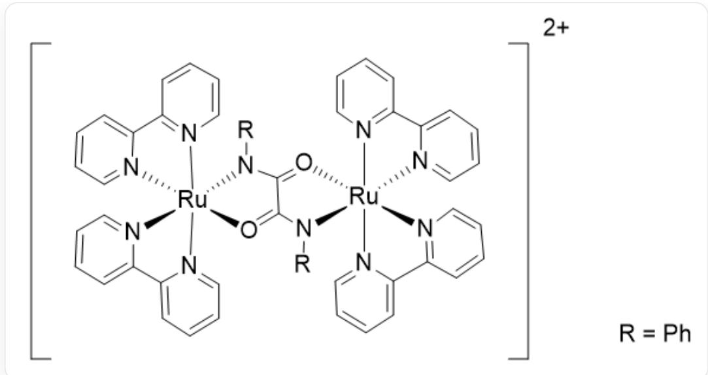
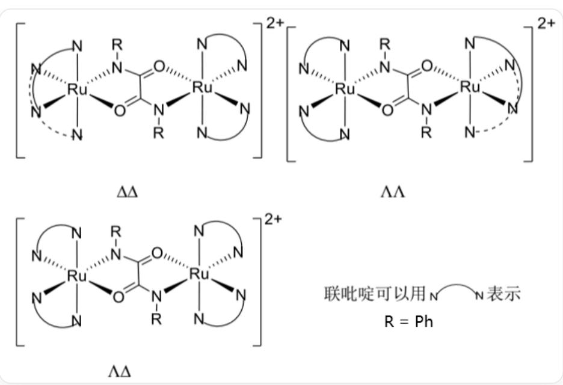
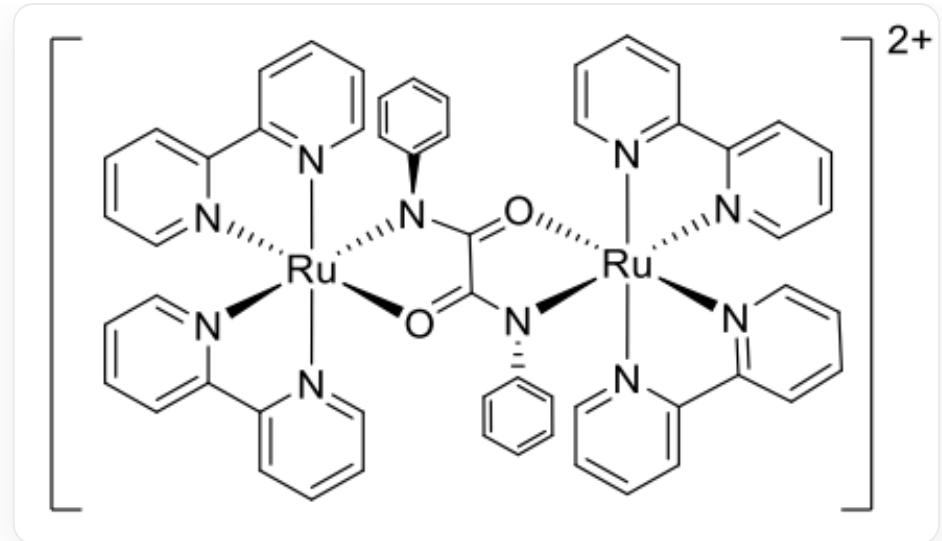

# 题目

草酰氯与苯胺反应得到配体  $\mathbf{L}$ ，配体  $\mathbf{L}$  在碱性条件下与 cis-  $[\mathrm{Ru}(\mathrm{bipy})_2\mathrm{Cl}_2]$  反应可以得到对应的带两个电荷双钌配合物阳离子。

手性配合物的绝对构型用符号  $\Delta$  和  $\Lambda$  表示，沿八面体的三重轴方向观察，大拇指方向平行于配合物的三重轴且朝向纸面外时，符合右手螺旋（下层配位原子转到上层配位原子位置）的用  $\Delta$  表示，符合左手螺旋用  $\Lambda$  表示。反应得到的配合物有对应的立体异构体。

现有以下信息，请选择所有正确的说法：

1. 生成配合物的反应方程式在配平化简后，左边系数和大于右边系数和。  
2. 该配合物中心 Ru 原子的杂化方式涉及 3 种轨道（以角量子数相同认定为同种轨道）。  
3. 根据环中原子个数分类，双钌配合物中环种类为1种。  
4. 根据上述手性配合物的构型规则，不考虑 N 的手性，绝对构型为  $\Delta \Delta$  的异构体中 Ru 元素的化学环境不同。  
5. 考虑 N 的手性，绝对构型为  $\Lambda \Delta$  中存在最稳定的异构体。稳定性高的原因是结构关于中心对称。

A. 1  
B. 2  
C. 4  
D. 1,2  
E. 2,4  
F. 1,2,5

G. 3, 4  
H. 2,3,4  
1. 4,5  
J. 3,4,5  
K. 以上选项都不正确

# 答案

正确答案: E

# 详细解析

生成配合物的反应方程式为:

$$
2 \left[ \mathrm {R u} (\mathrm {b i p y}) _ {2} \mathrm {C l} _ {2} \right] + \left(\mathrm {C O N H P h}\right) _ {2} + 2 \mathrm {O H} ^ {-} = \left[ \mathrm {R u} _ {2} (\mathrm {b i p y}) _ {4} (\mathrm {C O N P h}) _ {2} \right] ^ {2 +} + 4 \mathrm {C l} ^ {-} + 2 \mathrm {H} _ {2} \mathrm {O}
$$

# CHECKPOINT

2 PTS

反 应 方 程 式 为

$$
2 \left[ \mathrm {R u} (\mathrm {b i p y}) _ {2} \mathrm {C l} _ {2} \right] + \left(\mathrm {C O N H P h}\right) _ {2} + 2 \mathrm {O H} ^ {-} = \left[ \mathrm {R u} _ {2} (\mathrm {b i p y}) _ {4} (\mathrm {C O N P h}) _ {2} \right] ^ {2 +} + 4 \mathrm {C l} ^ {-} + 2 \mathrm {H} _ {2} \mathrm {O}
$$

因此，生成配合物的反应方程式在配平化简后，左边系数和小于右边系数和，说法1错误。

配合物的结构为：

图中为带两个电荷双钉配合物阳离子：C1(C=CC=C2)=[N]2[Ru+]34([N]5=C(C6=CC=CC=[N]63)C=CC=C5)  
  
$(O = C7C(N4C8 = CC = CC = C8) = O[Ru + ]9\% 10([N]\% 11 = CC = CC = C\% 11C\% 12 = CC = CC = [N]\% 12\% 10)$  
(N7C%13=CC=CC=C%13)[N]%14=C(C%15=CC=CC=[N]%159)C=CC=C%14)[N]%16=CC=CC=C1%16。每个Ru为六配位，与两个bipy中的4个N配位，同时与  $(\mathrm{CONHPh})_2$  中的1个N和1个O配位。  $\mathrm{R} = \mathrm{Ph}$

# CHECKPOINT

2 PTS

配合物的结构为：C1(C=CC=C2)=[N]2[Ru+]34([N]5=C(C6=CC=CC=[N]63)C=CC=C5)

$(\mathrm{O} = \mathrm{C7C}(\mathrm{N4C8} = \mathrm{CC} = \mathrm{CC} = \mathrm{C8}) = \mathrm{O}[\mathrm{Ru} + ]9\% 10([\mathrm{N}]\% 11 = \mathrm{CC} = \mathrm{CC} = \mathrm{C}\% 11\mathrm{C}\% 12 = \mathrm{CC} = \mathrm{CC} = [\mathrm{N}]\% 12\% 10)$

(N7C%13=CC=CC=C%13)[N]%14=C(C%15=CC=CC=[N]%159)C=CC=C%14)[N]%16=CC=CC=C1%16

因此，中心Ru原子的杂化方式为  $\mathrm{d}^2\mathrm{sp}^3$  ，涉及3种轨道，说法2正确。

双钌配合物中有五元环和六元环，环种类为2种。说法3错误。

根据上述手性配合物的构型规则，不考虑 N 的手性，配合物的立体异构体结构有：

绝对构型为  $\Delta \Delta$  的异构体中，左半边一个bipy中的N一N与Ru为1,3配位，位于面上；另一个bipy中的 $\mathrm{N - N}$  与Ru为2,4配位，位于面下；  $(\mathrm{CONHPh})_2$  中的N与左边Ru面下配位；O与左边Ru面上配位。右半边一个bipy中的N一N与Ru为1,2配位，位于面下；另一个bipy中的N一N与Ru为3,4配位，位于面上；  $(\mathrm{CONHPh})_2$  中的N与右边Ru面上配位；O与右边Ru面下配位。绝对构型为  $\Lambda \Lambda$  的异构体中，左半边一个bipy中的N一N与Ru为1,2配位，位于面下；另一个bipy中的N一N与Ru为3,4配位，位于面上；  $(\mathrm{CONHPh})_2$  中的N与左边Ru面下配位；O与左边Ru面上配位。右半边一个bipy中的

$\mathrm{N}-\mathrm{N}$  与  $\mathrm{Ru}$  为1,3配位，位于面上；另一个bipy中的  $\mathrm{N}-\mathrm{N}$  与  $\mathrm{Ru}$  为2,4配位，位于面下； $(\mathrm{CONHPh})_2$  中的  $\mathrm{N}$  与右边  $\mathrm{Ru}$  面上配位；O与右边  $\mathrm{Ru}$  面下配位。绝对构型为  $\Lambda \Delta$  的异构体中，左半边一个bipy中的  $\mathrm{N}-\mathrm{N}$  与  $\mathrm{Ru}$  为1,2配位，位于面下；另一个bipy中的  $\mathrm{N}-\mathrm{N}$  与  $\mathrm{Ru}$  为3,4配位，位于面上； $(\mathrm{CONHPh})_2$  中的  $\mathrm{N}$  与左边  $\mathrm{Ru}$  面下配位；O与左边  $\mathrm{Ru}$  面上配位。右半边一个bipy中的  $\mathrm{N}-\mathrm{N}$  与  $\mathrm{Ru}$  为1,2配位，位于面下；另一个bipy中的  $\mathrm{N}-\mathrm{N}$  与  $\mathrm{Ru}$  为3,4配位，位于面上； $(\mathrm{CONHPh})_2$  中的  $\mathrm{N}$  与右边  $\mathrm{Ru}$  面上配位；O与右边  $\mathrm{Ru}$  面下配位。图中用弧线示意联吡啶配体；  $\mathbf{R} = \mathbf{P}\mathbf{h}$  。

# CHECKPOINT

2 PTS

绝对构型为  $\Delta \Delta$  的异构体中，左半边一个bipy中的N-N与Ru为1,3配位，位于面上；另一个bipy中的N-N与Ru为2,4配位，位于面下；(CONHPh)中的N与左边Ru面下配位；O与左边Ru面上配位。右半边一个bipy中的N-N与Ru为1,2配位，位于面下；另一个bipy中的N-N与Ru为3,4配位，位于面上；(CONHPh)中的N与右边Ru面上配位；O与右边Ru面下配位。

# CHECKPOINT

2 PTS

绝对构型为  $\Lambda \Lambda$  的异构体中，左半边一个bipy中的N-N与Ru为1,2配位，位于面下；另一个bipy中的N-N与Ru为3,4配位，位于面上；(CONHPh)中的N与左边Ru面下配位；O与左边Ru面上配位。右半边一个bipy中的N-N与Ru为1,3配位，位于面上；另一个bipy中的N-N与Ru为2,4配位，位于面下；(CONHPh)中的N与右边Ru面上配位；O与右边Ru面下配位。

# CHECKPOINT

2 PTS

绝对构型为  $\Lambda \Delta$  的异构体中，左半边一个bipy中的N-N与Ru为1,2配位，位于面下；另一个bipy中的N-N与Ru为3,4配位，位于面上；(CONHPh)中的N与左边Ru面下配位；O与左边Ru面上配位。右半边一个bipy中的N-N与Ru为1,2配位，位于面下；另一个bipy中的N-N与Ru为3,4配位，位于面上；(CONHPh)中的N与右边Ru面上配位；O与右边Ru面下配位。

因此，绝对构型为  $\Delta \Delta$  的异构体中 Ru 元素的化学环境不同，说法 4 正确。

$\Lambda \Delta$  中存在最稳定的异构体结构为：

配合物结构为：C1(C=CC=C2)=[N]2[Ru+]34([N]5=C(C6=CC=CC=[N]63)C=CC=C5)

$$
(O = C7C(N4C8 = CC = CC = C8) = O[Ru + ]9\% 10([N]\% 11 = CC = CC = C\% 11C\% 12 = CC = CC = [N]\% 12\% 10)
$$

(N7C%13=CC=CC=C%13)[N]%14=C(C%15=CC=CC=[N]%159)C=CC=C%14)[N]%16=CC=CC=C1%16。其中每个Ru为六配位，分别与两个bipy中的4个N呈1,2面下和3,4面上配位。左边Ru与  $(\mathrm{CONHPh})_2$  中的1个N为面下配位，与1个O为面上配位，其中N相连的苯环位于面上；右边Ru与  $(\mathrm{CONHPh})_2$  中的1个N为面上配位，1个O为面下配位，其中N相连的苯环位于面下。

# CHECKPOINT

2 PTS

$\Lambda \Delta$  中存在最稳定的异构体结构为：C1(C=CC=C2)=[N]2[Ru+]34([N]5=C(C6=CC=CC=[N]63)C=CC=C5)(O=C7C(N4C8=CC=CC=C8)=O[Ru+]9%10([N]%11=CC=CC=C%11C%12=CC=CC=[N]%12%10)(N7C%13=CC=CC=C%13)[N]%14=C(C%15=CC=CC=[N]%159)C=CC=C%14)[N]%16=CC=CC=C1%16。

稳定性高的原因是结构具有  $\pi -\pi$  堆积，因此说法5错误。

# CHECKPOINT

2 PTS

稳定性高的原因是结构具有  $\pi -\pi$  堆积

因此，说法2,4正确，选择选项E。