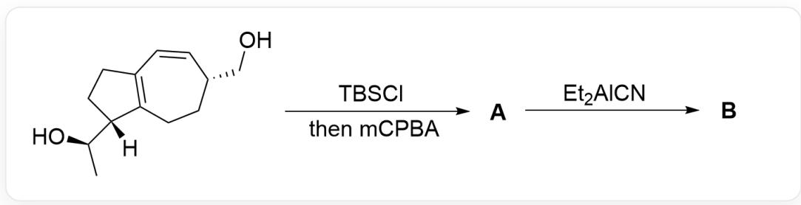
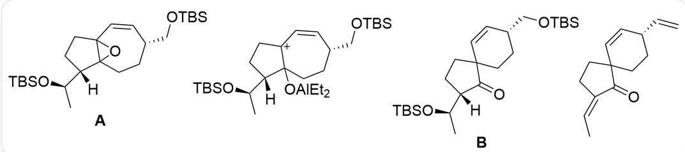

# Question

The image describes a two-step organic tandem reaction. The substrate is  $[H][C@@]1([C@H]$

(O)C)CCC2=C1CC[C@@H](CO)C=C2; it reacts with  $TBSCl$  followed by  $mCPBA$  to obtain A; A reacts with  $Et_2AlCN$  to obtain B.

Scientists attempted to synthesize a product with the same molecular skeleton but with a cyano substituent from the synthetic route shown above, but surprisingly, compound B without a cyano substituent was produced.

# Known:

1. B contains a six-membered ring.  
2. In the first step, 2.1 equivalents of TBSCl and 1.0 equivalents of mCPBA were added.

Which of the following statements about the structure of  $\mathbf{B}$  is correct:

A. All other options are incorrect  
B. B has 5 chiral carbons  
C. B contains 4 oxygen atoms  
D. B Contains fused ring systems  
E. B contains three unsaturated bonds

F. B first reacts with tetrabutylammonium fluoride, and then undergoes dehydration under acidic conditions. The unsaturation degree of the obtained product is 6.

# Answer

Correct Answer: F

# Detailed Explanation

The substrate contains two hydroxyl groups, which react with 2.1 equivalents of dimethyl tert-butylsilyl chloride, which is an alcohol protection reaction, generating Si - O bonds.

Then it reacts with one equivalent of mCPBA, which is an epoxidation reaction of the double bond; mCPBA preferentially oxidizes the electron-rich tetrasubstituted fused-ring double bond, so the structure of product A is  $\mathrm{[H][C@@]1([C@H](O[S i](C)(C)C(C)(C)C)C)CC2(O3)C13CC[C@@H](CO[S i](C)(C)C(C)(C)C)C = C2}$ .

# CHECKPOINT

1 PTS

mCPBA preferentially oxidizes the electron-rich tetrasubstituted fused-ring double bond

# CHECKPOINT

1 PTS

The structure of A is [H][C@@]1([C@H](O[Si](C)(C)C(C)(C)C)CCC2(O3)C13CC[C@@H](CO[Si](C) C)C(C)(C)C)C=C2

(This question does not require judging the stereochemistry of the epoxide, which is irrelevant to the problem-solving)

Then adding the Lewis acid  $\mathrm{Et}_2\mathrm{AlCN}$  can activate the epoxide; the researcher's original intention was to use cyanide to attack the epoxide to perform ring-opening, but the product does not contain cyanide. At this time, consider that the epoxide is easily ring-opened after being activated, forming a carbocation intermediate; since the

stability of the allylic tertiary carbocation is greater than that of the simple tertiary carbocation, the structure of the carbocation intermediate formed is  $\mathrm{[H][C@@]1([C@H](O[Si](C)(C)C(C)(C)C)CC[C+]2C1(O[Al]}$  (CC)CC)CC[C@@H](CO[Si](C)(C)C(C)(C)C=C2.

# CHECKPOINT

1 PTS

Lewis acid  $\mathrm{Et}_2\mathrm{AlCN}$  can activate the epoxide; the epoxide is easily ring-opened after being activated, forming a carbocation intermediate

# CHECKPOINT

1 PTS

The stability of the allylic tertiary carbocation is greater than that of the simple tertiary carbocation

# CHECKPOINT

1 PTS

The structure of the carbocation intermediate is [H][C@@]1([C@H](O[Si](C)(C)C(C) (C)C)CC[C+]2C1(O[Al](CC)CC)CC[C@@H](CO[Si](C)(C)C(C)(C)C=C2

At this time, the substrate is a  $\beta$ -carbocation of the hydroxyl group, which is a typical semi-pinacol rearrangement structure. The electron back donation of the hydroxyl group promotes the migration of the carbon atom; because the formation of a six-membered ring is more stable than the formation of a four-membered ring, the structure of the product B after migration is O=C1[C@@]([C@H](O[Si](C)(C)C(C)(C)C)([H])CCC12CC[C@@H](CO[Si](C)(C)C(C)(C)C=C2.

# CHECKPOINT

1 PTS

Semi-pinacol rearrangement occurs; the formation of a six-membered ring is more stable than the formation of a four-membered ring

# CHECKPOINT

2 PTS

B is  $O = C1[C@@]([C@H](O[S_i](C)(C)(C)(C)C)[H])CCC12CC[C@@H](CO[S_i](C)(C)C(C)$

(C)C=C2

Determine the options based on the structure of B: B contains four chiral carbons, two unsaturated bonds, three oxygen atoms, and a spiro system of a five-membered ring and a six-membered ring. Therefore, options B, C, D, and E are all incorrect.

# CHECKPOINT

1 PTS

B contains four chiral carbons, two unsaturated bonds, three oxygen atoms, and a spiro system of a five-membered ring and a six-membered ring

B reacts with tetrabutylammonium fluoride to remove all hydroxyl protecting groups, and the alcohol turns into an alkene after heating and dehydration, and the product is O=C1/C(CCC12CC[C@@H](C=C)C=C2)=C\C, which has 6 degrees of unsaturation, so option F is correct.

# CHECKPOINT

1 PTS

The reaction product of option F is O=C1/C(CCC12CC[C@@H](C=C)C=C2)=C\C, which has 6 degrees of unsaturation

This figure shows the organic structural formulas involved in this question. The structure of  $\mathbf{A}$  is [H]  
[C@@]1([C@H](O[Si](C)(C)(C)(C)C)CCC2(O3)C13CC[C@@H](CO[Si](C)(C)(C)(C)C=C; the structure of the carbocation intermediate is [H][C@@]1([C@H](O[Si](C)(C)(C)(C)C)CC[C+]2C1(O[Al]  
(CC)CC)CC[C@@H](CO[Si](C)(C)(C)C=C2; B is $O=C1[C@@]([C@H](O[Si](C)(C)(C)(C)C)  
([H])CCC12CC[C@@H](CO[Si](C)(C)(C)(C)C=C2; the reaction product of option F is O=C1/C(CCC12CC[C@@H](C=C)C=C2)=C\C.