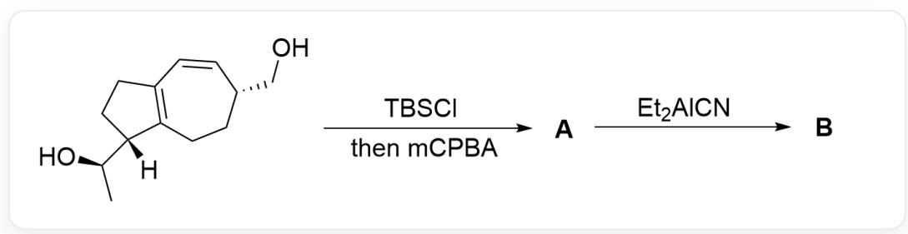
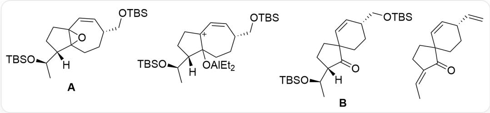

# 题目

该图片描述了两步有机串联反应。底物为[H][C@@]1([C@H](O)C)CCC2=C1CC[C@@H](CO)C=C2；其与TBSCl反应后加入mCPBA，得到A；A与  $Et_{2}AlCN$  反应得到B。

科学家们尝试从上图所示的合成路线合成分子骨架不变且带有氰基取代的产物，但令人意外的是生成了没有氰基取代的化合物B。

已知：

1. B 含有六元环,  
2. 第一步反应中加入TBSCl为2.1当量，加入的mCPBA为1.0当量。

下列关于  $\mathbf{B}$  的结构, 说法正确的是:

A. 其他选项均不正确  
B. B有5个手性碳  
C. B 含有 4 个氧原子  
D. B 含有并环体系  
E. B 含有三个不饱和键

F. B先与四正丁基氟化铵反应, 再在酸性条件下加热失水, 得到的产物不饱和度为  $6$  。

# 答案

正确答案: F

# 详细解析

底物中含有两个羟基，与2.1当量的二甲基叔丁基硅基氯反应，为醇的保护反应，生成Si-O键。

之后与一当量的mCPBA反应，为双键的环氧化反应；mCPBA优先氧化富电子的四取代并环双键，因此产物A的结构为[H][C@@]1([C@H](O[Si](C)(C)C(C)(C)C)CCC2(O3)C13CC[C@@H](CO[Si](C)(C)C(C)(C)C=C2。

# CHECKPOINT

1 PTS

mCPBA 优先氧化富电子的四取代并环双键

# CHECKPOINT

1 PTS

A 的结构为[H][C@@]1([C@H](O[Si](C)(C)C(C)(C)C)CCC2(O3)C13CC[C@@H](CO[Si](C)(C)C(C) C)C=C2

(本题不要求判断环氧的立体化学, 跟解题无关)

之后加入lewis酸  $\mathrm{Et}_2\mathrm{AlCN}$  ，可以活化环氧；研究人员本意是利用氰根对环氧进攻进行开环，但产物没有氰根，此时考虑环氧被活化后容易开环，形成碳正离子中间体；由于烯丙基三级碳正离子的稳定性大于单纯的三级碳正离子，故形成的碳正离子中间体结构为[H][C@@]1([C@H](O[Si](C)(C)C(C)(C)C)CC[C+]2C1(O[Al](CC)CC)CC[C@@H](CO[Si](C)(C)C(C)(C)C=C2。

# CHECKPOINT

1 PTS

Lewis酸  $\mathrm{Et}_2\mathrm{AlCN}$ ，可以活化环氧；环氧被活化后容易开环，形成碳正离子中间体

# CHECKPOINT

1 PTS

烯丙基三级碳正离子的稳定性大于单纯的三级碳正离子

# CHECKPOINT

1 PTS

碳正离子中间体结构为[H][C@@]1([C@H](O[Si](C)(C)C(C)(C)C)CC[C+]2C1(O[Al] (CC)CC)CC[C@@H](CO[Si](C)(C)C(C)(C)C)=C2

此时底物为羟基的  $\beta$ -碳正离子，为典型的 semi-pinacol重排结构，羟基电子回推促使碳原子进行迁移；因为产生六元环比产生四元环更加稳定，故迁移后产物结构为 B 为 O=C1[C@@]([C@H](O[Si](C)(C)(C)(C)(C))CCC12CC[C@@H](CO[Si](C)(C)(C)(C)(C)C=C2。

# CHECKPOINT

1 PTS

发生semi-pinacol重排；产生六元环比产生四元环更加稳定

# CHECKPOINT

2 PTS

B 为  $O = C_{1}[C@@]([C@H](O[S_{i}] (C) C(C) (C) C)([H]) C C C_{12} C C [C@@H](C O[S_{i}] (C) C(C)$

(C)C)C=C2

根据B的结构判断选项：B含有四个手性碳，两个不饱和键，三个氧原子和五元环螺六元环的体系。因此选项B,C,D,E均错误。

# CHECKPOINT

1 PTS

B 含有四个手性碳，两个不饱和键，三个氧原子和五元环螺六元环的体系

B 与四正丁基氟化铵反应脱除所有羟基保护基，加热失水后醇变为烯烃，产物为  $\mathrm{O = C1 / C(CCC12CC[C@@H](C = C)C = C2) = C\backslash C}$ ，具有6个不饱和度，选项F正确。

# CHECKPOINT

1 PTS

选项F的反应产物为O=C1/C(CCC12CC[C@@H](C=C)C=C2)=C\C，具有6个不饱和度

本图表示了本题涉及到的有机物结构式。A的结构为[H][C@@]1([C@H](O[Si](C)(C)C(C)

(C)C)C)CCC2(O3)C13CC[C@@H](CO[Si](C)(C)(C)(C)C=C；碳正离子中间体结构为[H][C@@]1([C@H]

(O[Si](C)(C)C(C)(C)C)CC[C+]2C1(O[Al](CC)CC)CC[C@@H](CO[Si](C)(C)C(C)(C)C)C=C2; B为

$O=C1[C@@]([C@H](O[Si](C)(C)C(C)(C)C)([H])CCC12CC[C@@H](CO[Si](C)(C)C(C)(C)C)C=C2; 选项F的

反应产物为O=C1/C(CCC12CC[C@@H](C=C)C=C2)=C\C。