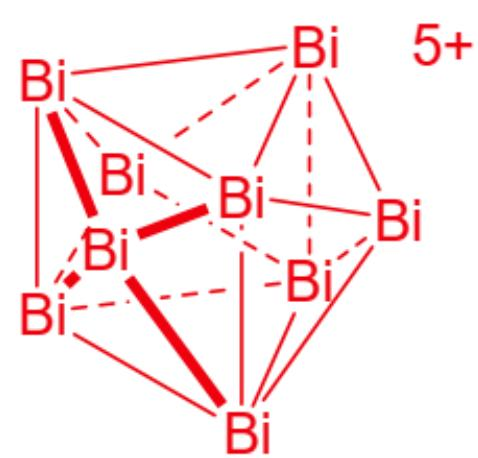
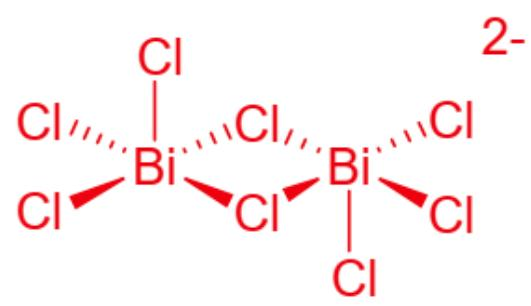
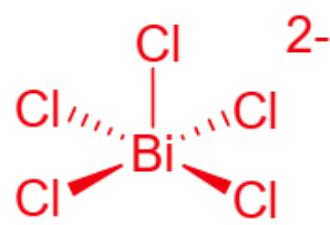

# Question

Reacting  $\mathrm{BiCl}_3$  and  $\mathrm{AlCl}_3$  with stoichiometric Bi in molten  $\mathrm{NaAlCl}_4$ , and changing the feeding ratio, ionic compounds A and B can be prepared separately. If the same amount of substance of A and B are to be generated, the ratio of Bi投入 [invested] during preparation is  $6:11$ . It is known that the mass fraction of Bi in A is  $67.4\%$ , and all atoms in A satisfy the octet rule. The cation in the ionic compound B has a valence of  $+2$ , and the anion is the same as in A.

In addition to the cations in A and B, Bi can also form a positive ion with the same symmetry as  $\mathrm{BF}_3$ , which was first discovered in the black subchloride C of Bi. It is known that there are two valence states (one of which is  $+3$  valence) of Bi in C in a ratio of  $3:1$ , and three kinds of Bi-containing ions in a ratio of  $2:4:1$ . In the anion, Bi is in a square pyramidal coordination, and the mass fraction of Bi in C is  $83.48\%$ .

Which of the following statements are correct:

1. The ratio of anions to cations in ionic compound A is  $1:2$ .  
2. The cation in ionic compound A has 3 fewer Bi atoms than the cation in B.  
3. There are 2 different chemical environments for Bi atoms in the cation cluster in C.  
4. All anions in  $\mathbf{C}$  contain  $C_2$  symmetry.

A. All other options are incorrect  
B. 1  
C. 2  
D. 3

E. 4  
F. 1, 2  
G. 1, 3  
H. 1, 4  
1. 2,3  
J. 2, 4  
K. 3, 4  
L. 1, 2, 3  
M. 1, 2, 4  
N. 1,3，4  
O. 2, 3, 4  
P. 1, 2, 3, 4

# Answer

Correct Answer: O

# Detailed Explanation

According to the question, let the chemical formula of  $\mathbf{A}$  be  $\mathrm{Bi}_{\mathrm{m}}(\mathrm{AlCl}_4)_\mathrm{n}$

Then, according to the mass fraction of Bi, we have

$$
m M (\mathrm {B i}) = 0. 6 7 4 \left[ m M (\mathrm {B i}) + n M \left(A l C l _ {4}\right) \right]
$$

# CHECKPOINT

1 PTS

$$
m M (\mathrm {B i}) = 0. 6 7 4 \left[ m M (B i) + n M \left(\mathrm {A l C l} _ {4}\right) \right]
$$

Solving the above Diophantine equation, we obtain the only solution that meets the conditions of the question

That is,  $m = 5,n = 3$  , then the chemical formula of  $\mathbf{A}$  is  $\mathrm{Bi}_5(\mathrm{AlCl}_4)_3$

# CHECKPOINT

1 PTS

A is  $\mathrm{Bi}_{5}(\mathrm{AlCl}_{4})_{3}$

Its cation is an ion cluster, so the ratio of cation to anion is  $1:3$ . 1 is incorrect.

According to the question, let the chemical formula of  $\mathbf{B}$  be  $\mathrm{Bi}_{\mathrm{m}}(\mathrm{AlCl}_4)_2$

Since the same amount of substance of  $\mathbf{A}$  and  $\mathbf{B}$  are generated, the ratio of  $\mathrm{Bi}$  that needs to be invested is  $6:11$ . And  $\mathrm{Bi}_{5}^{3+}$  can be regarded as  $\mathrm{Bi}^{3+} + 4\mathrm{Bi}$ , then  $\mathrm{Bi}_{\mathrm{m}}^{2+}$  can be regarded as  $\frac{2}{3}\mathrm{Bi}^{3+} + \frac{3m - 2}{3}\mathrm{Bi}$

# CHECKPOINT

1 PTS

$\mathrm{Bi}_{\mathrm{m}}^{2+}$  can be regarded as  $\frac{2}{3} \mathrm{Bi}^{3+} + \frac{3m - 2}{3} \mathrm{Bi}$

Therefore, we can know  $m = 4$ , then the chemical formula of  $\mathbf{B}$  is  $\mathrm{Bi}_{8}(\mathrm{AlCl}_{4})_{2}$

# CHECKPOINT

1 PTS

B is  $\mathrm{Bi}_{8}(\mathrm{AlCl}_{4})_{2}$

The cation in the ionic compound  $\mathbf{A}$  has 3 fewer Bi atoms than the cation in  $\mathbf{B}$ .

# CHECKPOINT

1 PTS

2 is correct.

According to the question,  $\mathbf{C}$  is only composed of Bi and Cl

Then  $n(\mathrm{Bi}):n(\mathrm{Cl}) = \omega (\mathrm{Bi})M(\mathrm{Cl}) / \omega (\mathrm{Cl})M(\mathrm{Bi}) = 6:7$  in C

From the valence state, we know that  $\mathbf{C}$  should be  $\mathrm{Bi}_{24}\mathrm{Cl}_{28}$ , and among them, 6 Bi have a valence of  $+3$ , and the other 18 Bi have a total valence of  $+10$

First of all, it can be inferred that these 18 Bi should be positive ions formed by Bi

Secondly, there are two possibilities: the " 1 " in  $2:4:1$  is the positive ion  $\mathrm{Bi}_18^{10+}$ , and the " 2 " is the positive ion  $\mathrm{Bi}_9^{5+}$

And since the Bi in the anion are all square pyramidal coordinated, it can be known that the one that meets the condition is  $\mathrm{Bi}_{9}^{5+}$

And the remaining "4" corresponds to  $\mathrm{BiCl}_5^{2-}$ , and "1" corresponds to  $\mathrm{Bi}_2\mathrm{Cl}_8^{2-}$

Then the chemical formula of  $\mathbf{C}$  is  $(\mathrm{Bi}_{9}^{5+})_{2}(\mathrm{BiCl}_{5}^{2-})_{4}(\mathrm{Bi}_{2}\mathrm{Cl}_{8}^{2-})$

# CHECKPOINT

1 PTS

C is  $(\mathrm{Bi}_{9}^{5+})_{2}(\mathrm{BiCl}_{5}^{2-})_{4}(\mathrm{Bi}_{2}\mathrm{Cl}_{8}^{2-})$

Its cation is a tricapped trigonal prism, which belongs to the  $D_{3h}$  point group, as shown in the figure:

The  $\mathrm{Bi}_{9}^{5+}$  cation is a tricapped trigonal prism structure. Each rectangular face of the trigonal prism extends a vertex to form a tricapped trigonal prism. Each Bi atom is located at the vertex of the structure, which belongs to the  $D_{3h}$  point group.

There are 2 different chemical environments for Bi atoms in the cation cluster in C.

# CHECKPOINT

1 PTS

3 is correct.

Since the anion given in the question is square pyramidal coordinated, combined with chloride ions, it can be bridged, and it is inferred that it is a mononuclear and binuclear anion, as shown in the figure:

$\mathrm{Bi}_{2}\mathrm{Cl}_{8}^{2-}$ : This structure is composed of two square pyramids sharing one side of the base square, and the vertices of the two square pyramids are on both sides of the formed common base. The vertex of the square pyramid is Cl, and the center of the base is Bi. Bi is five-coordinated, and two  $\mathrm{BiCl}_{5}$  are bridged by 2 Cl.

$\mathrm{BiCl}_5^{2-}$ : Square pyramid structure, Cl is at the vertex and four corners of the base, and Bi is five-coordinated at the center of the base square.

# CHECKPOINT

1 PTS

Both contain a  $C_2$  axis, 4 is correct.

Therefore, choose O.