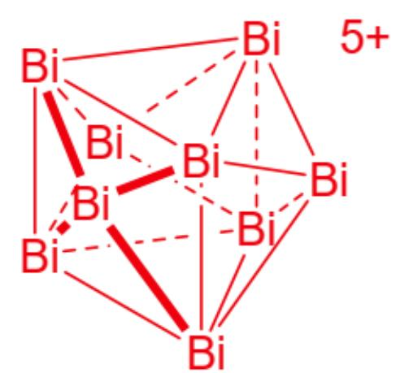
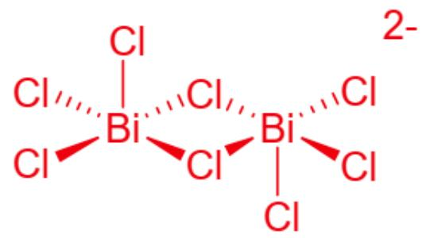

# 题目

将  $\mathrm{BiCl}_3$  及  $\mathrm{AlCl}_3$  与化学计量的 Bi 在熔融  $\mathrm{NaAlCl}_4$  中反应, 改变投料比, 可以分别制得离子化合物 A 和 B, 若要生成相同物质的量的 A 和 B, 则制备时分别投入的 Bi 的比例为

6:11。已知A中Bi的质量分数为  $67.4\%$  ，且A中所有原子均满足八隅律。离子化合物B中阳离子为  $+2$  价，阴离子与A相同。

除了A和B中的阳离子外，Bi还可以形成一种与  $\mathrm{BF}_3$  对称性相同的正离子，其最早

被发现于 Bi 的黑色次氯化物 C 中。已知 C 中存在着比例为  $3:1$  的两种价态(其中一种为 +3

价)的 Bi, 和三种比例为  $2:4:1$  的含 Bi 离子, 阴离子中 Bi 均为四方锥配位, C 中 Bi 的质量分数为  $83.48\%$  。

下列说法正确的有：

1. 离子化合物A中阴阳离子之比为  $1:2$  。  
2. 离子化合物A中阳离子比B中阳离子少3个Bi原子。  
3. C中阳离子簇中Bi原子有2种不同的化学环境。  
4. C中阴离子均含有  $C_2$  对称性。

A. 其他选项均不正确  
B. 1  
C. 2  
D. 3

E. 4  
F. 1, 2  
G. 1, 3  
H. 1,4  
1. 2,3  
J. 2, 4  
K. 3, 4  
L. 1, 2, 3  
M. 1, 2, 4  
N. 1,3，4  
O. 2, 3, 4  
P. 1, 2, 3, 4

# 答案

正确答案: O

# 详细解析

由题意可设  $\mathbf{A}$  的化学式为  $\mathrm{Bi}_{\mathrm{m}}(\mathrm{AlCl}_4)_\mathrm{n}$

则根据Bi的质量分数可知

$$
m M (\mathrm {B i}) = 0. 6 7 4 \left[ m M (\mathrm {B i}) + n M \left(A l C l _ {4}\right) \right]
$$

# CHECKPOINT

1 PTS

$$
m M (\mathrm {B i}) = 0. 6 7 4 \left[ m M (B i) + n M \left(\mathrm {A l C l} _ {4}\right) \right]
$$

解上述不定方程, 求得唯一符合题目条件的解

即  $m = 5, n = 3$ ，则  $\mathbf{A}$  的化学式为  $\mathrm{Bi}_5(\mathrm{AlCl}_4)_3$

# CHECKPOINT

1 PTS

A 为  $\mathrm{Bi}_{5}(\mathrm{AlCl}_{4})_{3}$

其阳离子为离子簇，故阴阳离子之比为  $1:3$  。1错误。

由题意可设  $\mathbf{B}$  的化学式为  $\mathrm{Bi}_{\mathrm{m}}(\mathrm{AlCl}_4)_2$

由于生成相同物质的量的 A 和 B, 需分别投入的 Bi 的比例为  $6:11$

而  $\mathrm{Bi}_{5}^{3+}$  可看做  $\mathrm{Bi}^{3+} + 4\mathrm{Bi}$ , 则  $\mathrm{Bi}_{\mathrm{m}}^{2+}$  则可看做  $\frac{2}{3}\mathrm{Bi}^{3+} + \frac{3m - 2}{3}\mathrm{Bi}$

# CHECKPOINT

1 PTS

$\mathrm{Bi}_{\mathrm{m}}^{2+}$  则可看做  $\frac{2}{3} \mathrm{Bi}^{3+} + \frac{3m - 2}{3} \mathrm{Bi}$

故可知  $m = 4$  ，则  $\mathbf{B}$  的化学式为  $\mathrm{Bi}_{8}(\mathrm{AlCl}_{4})_{2}$

# CHECKPOINT

1 PTS

B 为  $\mathrm{Bi}_{8}(\mathrm{AlCl}_{4})_{2}$

离子化合物A中阳离子比B中阳离子少3个Bi原子。

# CHECKPOINT

1 PTS

2正确。

由题意可知C只由Bi和Cl构成

则  $\mathbf{C}$  中  $n(\mathrm{Bi}):n(\mathrm{Cl}) = \omega (\mathrm{Bi})M(\mathrm{Cl}) / \omega (\mathrm{Cl})M(\mathrm{Bi}) = 6:7$

由价态可知  $\mathbf{C}$  应为  $\mathrm{Bi}_{24} \mathrm{Cl}_{28}$ , 且其中由 6 个 Bi 为 +3 价, 其他 18 个 Bi 一共呈现 +10

首先可以推断这18个Bi应是Bi形成的正离子

其次存在两种可能  $2:4:1$  中的“1”为该正离子  $\mathrm{Bi}_{1}8^{10+}$ , “2”为该正离子  $\mathrm{Bi}_{9}^{5+}$

而由阴离子中Bi均为四方锥配位可知符合条件的是  $\mathrm{Bi}_{9}^{5+}$

且剩下的“4”对应着  $\mathrm{BiCl}_5^{2-}$ , “1”对应着  $\mathrm{Bi}_2\mathrm{Cl}_8^{2-}$

则  $\mathbf{C}$  的化学式为  $(\mathrm{Bi}_{9}^{5+})_{2}(\mathrm{BiCl}_{5}^{2-})_{4}(\mathrm{Bi}_{2}\mathrm{Cl}_{8}^{2-})$

# CHECKPOINT

1 PTS

C 为  $(\mathrm{Bi}_{9}^{5+})_{2}(\mathrm{BiCl}_{5}^{2-})_{4}(\mathrm{Bi}_{2}\mathrm{Cl}_{8}^{2-})$

其阳离子为三加帽三棱柱，为  $D_{3h}$  点群，如图所示：

$\mathrm{Bi}_{9}^{5+}$  阳离子为三加帽三棱柱结构，三棱柱的每一个矩形面延伸出一个顶点形成三加帽三棱柱，每个Bi原子位于该结构的顶点处，为  $D_{3h}$  点群，

C中阳离子簇中Bi原子有2种不同的化学环境。

# CHECKPOINT

1 PTS

3正确。

由于题中所给阴离子为四方锥配位，结合氯离子可进行桥连，推知其为单核和双核阴离子，如图所示：

$\mathrm{Bi}_{2} \mathrm{Cl}_{8}^{2-}$  ：该结构为两个四方锥共用底面正方形的一条边组成，且两个四方锥的顶点处于形成的共同底面的两侧，四方锥的顶点为  $\mathrm{Cl}$ ，底面中心为  $\mathrm{Bi}$ ，Bi为五配位，两个  $\mathrm{BiCl}_{5}$  以2个  $\mathrm{Cl}$  桥连。 $\mathrm{BiCl}_{5}^{2-}$  ：四方锥结构，Cl处于顶点和底面四个角上，Bi为五配位处于底面正方形的中心。

# CHECKPOINT

1 PTS

二者均含有  $C_2$  轴，4正确。

故选择O。