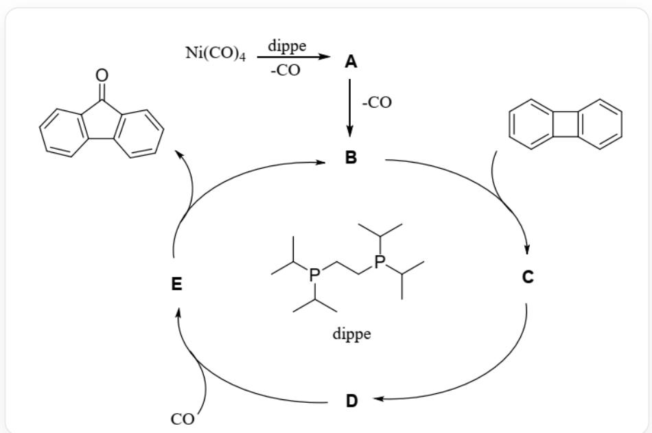
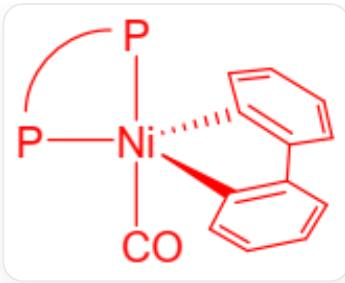
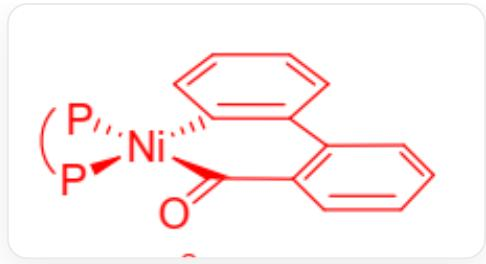
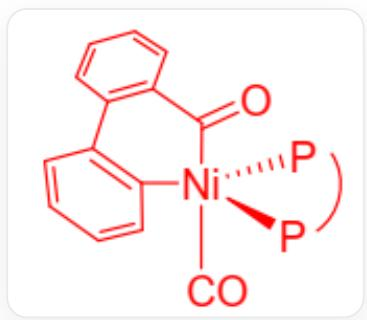

# Question

CO, as a common waste product in industrial production, has been a focal point of research for the preparation of carbonyl compounds. A laboratory achieved the reuse of CO using dippe and  $\mathrm{Ni(CO)}_4$  as catalysts.  $\mathrm{Ni(CO)}_4$  and dippe undergo a ligand substitution reaction to form the precursor A. Under a CO atmosphere, biphenylene is added, and the reaction catalyzed by  $\mathrm{Ni(CO)}_4$  and dippe yields dibenzocyclopentenone. The catalytic cycle is illustrated in the following diagram:

The diagram depicts a reaction system with a cyclic structure, involving 6 reactions. The first reaction is O# [C][Ni]([C]#O)([C]#O)[C]#O > dippe > [A], releasing one molecule of C#O; the second reaction is [A] >> [B], releasing another molecule of C#O. The subsequent four reactions form a cyclic structure in the diagram:

$$
[ \mathrm {B} ] > \mathrm {C} 1 = \mathrm {C C} = \mathrm {C} 2 \mathrm {C} (= \mathrm {C} 1) \mathrm {C} 3 = \mathrm {C} 2 \mathrm {C} = \mathrm {C C} = \mathrm {C} 3 > [ \mathrm {C} ], [ \mathrm {C} ] > > [ \mathrm {D} ], [ \mathrm {D} ] > \mathrm {C} \# \mathrm {O} > [ \mathrm {E} ], [ \mathrm {E} ] > >
$$

[B].C1=CC2=C(C=C1)C(=O)C3=C2C=CC=C3. Here, all instances of "[C]" represent the substance code C rather than methane. The structure of dippe is CC(C)P(CCP(C(C)C)C(C)C)C(C)C

Identify all steps involving the formation of new carbon-carbon bonds in this reaction cycle.

A. Only from  $\mathbf{B}$  to  $\mathbf{C}$ .  
B. Only from  $\mathbf{C}$  to  $\mathbf{D}$ .

C. Only from  $\mathbf{D}$  to  $\mathbf{E}$ .  
D. Only from  $\mathbf{E}$  to  $\mathbf{B}$ .  
E. From  $\mathbf{B}$  to  $\mathbf{C}$ , and from  $\mathbf{C}$  to  $\mathbf{D}$ .  
F. From  $\mathbf{B}$  to  $\mathbf{C}$ , and from  $\mathbf{D}$  to  $\mathbf{E}$ .  
G. From  $\mathbf{B}$  to  $\mathbf{C}$ , and from  $\mathbf{E}$  to  $\mathbf{B}$ .  
H. From  $\mathbf{C}$  to  $\mathbf{D}$ , and from  $\mathbf{D}$  to  $\mathbf{E}$ .  
1. From  $\mathbf{C}$  to  $\mathbf{D}$ , and from  $\mathbf{E}$  to  $\mathbf{B}$ .  
J. From  $\mathbf{D}$  to  $\mathbf{E}$ , and from  $\mathbf{E}$  to  $\mathbf{B}$ .  
K. From  $\mathbf{B}$  to  $\mathbf{C}$ , from  $\mathbf{C}$  to  $\mathbf{D}$ , and from  $\mathbf{D}$  to  $\mathbf{E}$ .  
L. From  $\mathbf{B}$  to  $\mathbf{C}$ , from  $\mathbf{C}$  to  $\mathbf{D}$ , and from  $\mathbf{E}$  to  $\mathbf{B}$ .  
M. From  $\mathbf{B}$  to  $\mathbf{C}$ , from  $\mathbf{D}$  to  $\mathbf{E}$ , and from  $\mathbf{E}$  to  $\mathbf{B}$ .  
N. From  $\mathbf{C}$  to  $\mathbf{D}$ , from  $\mathbf{D}$  to  $\mathbf{E}$ , and from  $\mathbf{E}$  to  $\mathbf{B}$ .  
O. From  $\mathbf{B}$  to  $\mathbf{C}$ , from  $\mathbf{C}$  to  $\mathbf{D}$ , from  $\mathbf{D}$  to  $\mathbf{E}$ , and from  $\mathbf{E}$  to  $\mathbf{B}$ .  
P. There are no steps involving the formation of new carbon-carbon bonds in this reaction cycle.

# Answer

Correct Answer: I

# Detailed Explanation

From  $\mathrm{Ni(CO)}_4$  to  $\mathbf{A}$ , a ligand substitution reaction occurs, where the bidentate ligand dippe replaces two CO ligands, resulting in the tetrahedral complex  $\mathbf{A}$  with the structure (dippe) $\mathrm{Ni(CO)}_2$ .

# CHECKPOINT

1 PTS

The transformation from  $\mathrm{Ni(CO)_4}$  to  $\mathbf{A}$  is a ligand substitution reaction

CC(C)[P]1(C(C)C)[Ni]([P](C(C)C)(C(C)C)CC1)([C]\#O)[C]\#O, i.e., the structure of (dippe)Ni(CO)_2, tetrahedral

In the A molecule, Ni is 4-coordinate.

# CHECKPOINT

1 PTS

A is (dippe)Ni(CO)2

From  $\mathbf{A}$  to  $\mathbf{B}$ , one carbonyl ligand dissociates, changing the geometry to trigonal planar, with  $\mathbf{B}$  being (dippe)Ni(CO).

# CHECKPOINT

1 PTS

The transformation from  $\mathbf{A}$  to  $\mathbf{B}$  is a ligand dissociation reaction

CC(C)[P]1(C(C)C)[Ni]([P](C(C)C)(C(C)C)CC1)[C]#O, i.e., the structure of (dippe)Ni(CO), trigonal planar

In the B molecule, Ni is 3-coordinate.

# CHECKPOINT

1 PTS

B is (dippe)Ni(CO)

B undergoes an oxidative addition reaction with the organic molecule C1=CC=C2C(=C1)C3=C2C=CC=C3 to yield C. In this process, one C - C bond is broken, and two new C - Ni bonds are formed, resulting in a five-membered ring. The structure of C is:

CC(C)[P]1(C(C)C)[Ni]2([P](C(C)C)(C(C)C)CC1)(C3=CC=CC=C3C4=CC=C42)[C]#O, where the complex center consists of one Ni atom, coordinated by one monodentate CO, one bidentate dippe, and one bidentate C1=CC=C[C]=C1C2=[C]C=CC=C2. The geometry is trigonal bipyramidal, with the carbon of C#O and one phosphorus atom of dippe in axial positions, while the remaining coordination atoms lie in the equatorial plane.

# CHECKPOINT

1 PTS

The transformation from  $\mathbf{B}$  to  $\mathbf{C}$  is an oxidative addition reaction

In the C molecule, Ni is 5-coordinate with a trigonal bipyramidal geometry.

From  $\mathbf{C}$  to  $\mathbf{D}$ , a migratory insertion reaction occurs intramolecularly, breaking one  $\mathrm{C} - \mathrm{Ni}$  bond and forming one  $\mathrm{C} - \mathrm{C}$  bond.

# CHECKPOINT

1 PTS

The transformation from  $\mathbf{C}$  to  $\mathbf{D}$  is a migratory insertion reaction

The structure of  $\mathbf{D}$  is:

CC(C)[P]1(C(C)C)[Ni]2(C3=CC=CC=C3C4=CC=C4C2=O)[P](C(C)C)(C(C)C)CC1, where the complex center consists of one Ni atom, coordinated by one bidentate dippe and one bidentate  $[C](=O)C1=C(C=CC=C1)C2=$  [C]C=CC=C2. The geometry is square planar.

In the D molecule, Ni is 4-coordinate.

From  $\mathbf{C}$  to  $\mathbf{D}$ , one new carbon-carbon bond is formed.

# CHECKPOINT

1 PTS

From  $\mathbf{C}$  to  $\mathbf{D}$ , one new C-C bond is formed

From  $\mathbf{D}$  to  $\mathbf{E}$ , one molecule of CO is added, forming one new C-Ni bond while the structures of the other ligands remain unchanged. The structure of  $\mathbf{E}$  is:

CC(C)[P]1(C(C)C)[Ni]2(C3=CC=CC=C3C4=CC=C4C2=O)([C]#O)[P](C(C)C)(C(C)C)CC1, where the complex center consists of one Ni atom, coordinated by one monodentate C#O, one bidentate dippe, and one bidentate [C](=O)C1=C(C=CC=C1)C2=[C]C=CC=C2. The geometry is trigonal bipyramidal, with the carbon of C#O and the acyl carbon of [C](=O)C1=C(C=CC=C1)C2=[C]C=CC=C2 in axial positions, while the remaining coordination atoms lie in the equatorial plane.

In the  $\mathbf{E}$  molecule, Ni is 5-coordinate.

# CHECKPOINT

1 PTS

The transformation from  $\mathbf{D}$  to  $\mathbf{E}$  is a ligand association reaction

From  $\mathbf{E}$  to  $\mathbf{B}$ , a reductive elimination reaction occurs, releasing one molecule of  $\mathrm{C}1 = \mathrm{CC}2 = \mathrm{C}(\mathrm{C} = \mathrm{C}1)\mathrm{C} (= \mathrm{O})\mathrm{C}3 = \mathrm{C}2\mathrm{C} = \mathrm{CC} = \mathrm{C}3$ , and Ni reverts from 5-coordinate to 3-coordinate.

# CHECKPOINT

1 PTS

The transformation from  $\mathbf{E}$  to  $\mathbf{B}$  is a reductive elimination reaction

In this process, a new carbon-carbon bond is formed in the released organic molecule  $C_1 = CC_2 = C(C = C_1)C(= O)C_3 = C_2C = CC = C_3$ .

# CHECKPOINT

1 PTS

From  $\mathbf{E}$  to  $\mathbf{B}$ , a new C-C bond is formed in the released organic molecule

In summary, during the catalytic cycle described above, new carbon-carbon bond formation occurs in the transformations from  $\mathbf{C}$  to  $\mathbf{D}$  and from  $\mathbf{E}$  to  $\mathbf{B}$ .